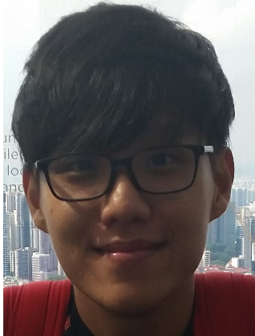

# About Us

We are a team based in the [School of Computing, National University of Singapore](http://www.comp.nus.edu.sg).

## Project Team

#### [Ang Kiang Siang](https://docs.google.com/document/u/1/d/1O3HF7qsh6KVeLesPmcQ0nPxSqhrkJxvS-OA_g-k-two/pub?embedded=true)  
 
Role: Project Mentor   

-----

#### [Chankyu Oh](github.com/chankyuoh)  
 
Role: Code Quality Manager    
Responsibilities: Look after code quality, ensures adherence to coding standards, etc.
Deliverables and deadlines: Ensure project deliverables are done on time and in the right format.

-----

#### [Leow Zheng Yu](http://github.com/zhengyu92)
 
Role: Integration Manager    
Responsibilities: In charge of versioning of the code, maintaining the code repository, integrating various parts of the software to create a whole.

-----

#### [Niveetha](http://github.com/niveetha)
 
Role: Team Lead   
Responsibilities: Responsible for overall project coordination.

-----

#### [Henderson](http://github.com/takukou)
 
Role: Testing Manager    
Responsibilities: Ensures the testing of the project is done properly and on time.

 
 -----

# Contributors

We welcome contributions. See [Contact Us](ContactUs.md) page for more info.

