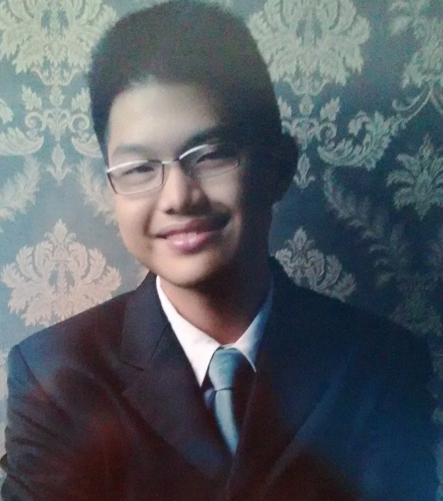
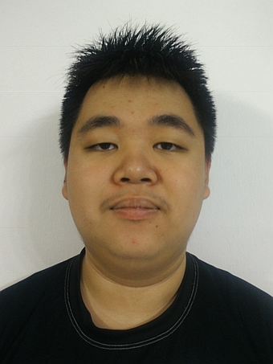
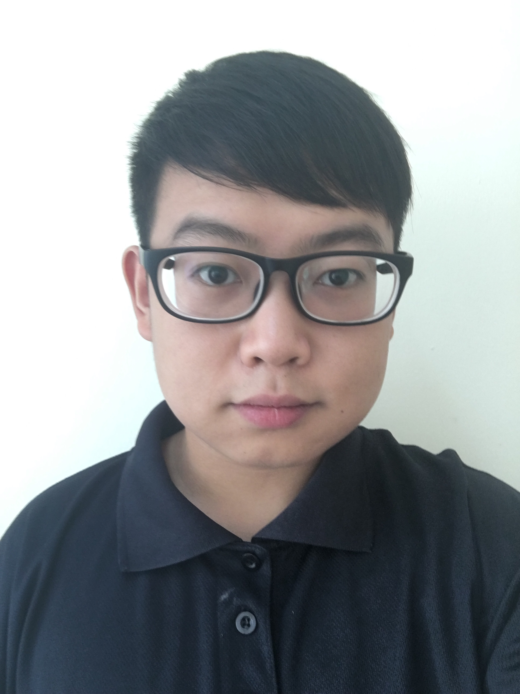

# About Us

We are a group of Computer Engineering students taking CS2103T Software Engineering at [School of Computing, National University of Singapore](http://www.comp.nus.edu.sg).

## Project Team

#### [Victor Loh](https://github.com/lohvht)
 
 Role: Project Mentor    
 Responsibilities: Mentoring
 
 -----

#### [Irwin Mah](https://github.com/chooxy)  
 
Role: Developer  
Responsibilities: Codes about storage.

-----

#### [Yip Bing You](https://github.com/leaffriend)
 
Role: Developer    
Responsibilities: Codes about features.

-----

#### [Xie Jihui](https://github.com/xjh666) 
 
Role: Developer    
Responsibilities: Codes about features.

-----

#### [Xu Tianyu](https://github.com/yeetee179)
 
Role: Developer    
Responsibilities: Codes about user interface.

-----

# Contributors

We welcome contributions. See [Contact Us](ContactUs.md) page for more info.

* [Akshay Narayan](https://github.com/se-edu/addressbook-level4/pulls?q=is%3Apr+author%3Aokkhoy)
* [Sam Yong](https://github.com/se-edu/addressbook-level4/pulls?q=is%3Apr+author%3Amauris)
