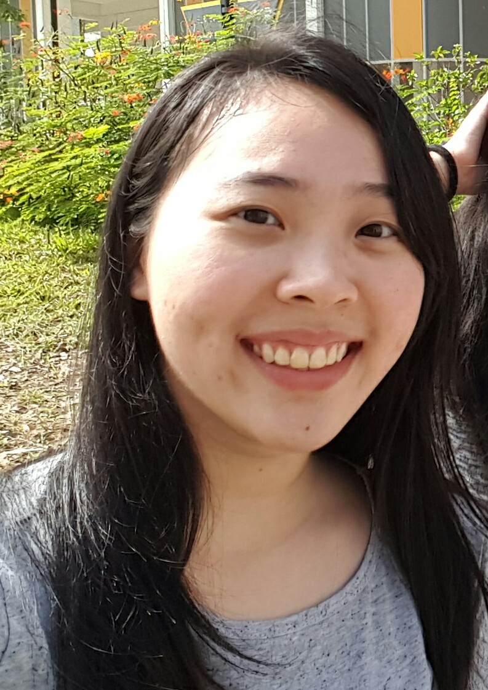

# About Us

We are a team based in the [School of Computing, National University of Singapore](http://www.comp.nus.edu.sg).

## Project Team

#### [Yong Zhi Yuan](https://github.com/Zhiyuan-Amos)  
 
Responsibilities: Team Leader  
Components in charge of: Logic  
Features implemented:  
Parser  
Add task  
Code written: [functional code][test code][docs] (pending)  

-----

#### [Edmund Mok](https://github.com/edmundmok)
 
Responsibilities: Jack of all trades  
In-Charge: DearJim

-----

#### [Yong Lin Han](https://github.com/ylhlh) 
 
Responsibilities: Integration  
In-Charge: Model

-----

#### [Hee Han Xiang](https://github.com/fisherhx)
 
Responsibilities: UI designer  
In-Charge: UI

-----

#### Project Mentor: [Michelle Tan](https://github.com/michelletan)
 

# Contributors

We welcome contributions. See [Contact Us](ContactUs.md) page for more info.
