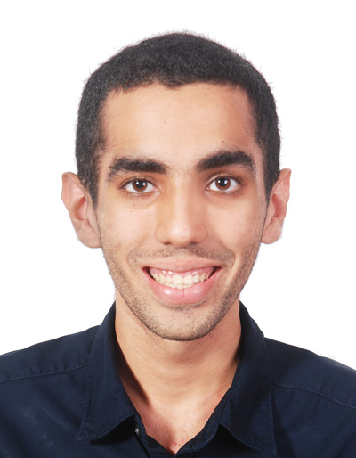

//@@author A0139817U
# About Us

We are a team based in the [School of Computing, National University of Singapore](http://www.comp.nus.edu.sg).

## Project Team

#### [Sriram Sami](http://github.com/frizensami)
 
**Role**: Leader
* Code written: [[functional code](../collated/main/A0138978E.md)][[test code](../collated/test/A0138978E.md)][[docs](../collated/docs/A0138978E.md)]

-----

#### [Nikhil Suresh](http://github.com/kneekill)
 
Role: Developer    
* Code written: [[functional code](../collated/main/A0139708W.md)][[test code](../collated/test/A0139708W.md)][[docs](../collated/docs/A0139708W.md)] 
Responsibilities: UI

-----

#### [Chew Zi Ling](http://github.com/ChewZL) 
 
Role: Developer   
* Code written: [[functional code](../collated/main/A0143107U.md)][[test code](../collated/test/A0143107U.md)][[docs](../collated/docs/A0143107U.md)] 
Responsibilities: Storage

 -----

#### [Tang Yew Siang](http://github.com/yewsiang) 
 
 Role: Developer  
 * Code written: [[functional code](../collated/main/A0139817U.md)][[test code](../collated/test/A0139817U.md)][[docs](../collated/docs/A0139817U.md)] 
 Responsibilities: Logic
 
 -----

## Project Mentor
#### [Alvian Prasetya](http://github.com/AlvianPrasetya) 
 

# Contributors

We welcome contributions. See [Contact Us](ContactUs.md) page for more info.

* [Akshay Narayan](https://github.com/se-edu/addressbook-level4/pulls?q=is%3Apr+author%3Aokkhoy)
* [Sam Yong](https://github.com/se-edu/addressbook-level4/pulls?q=is%3Apr+author%3Amauris)