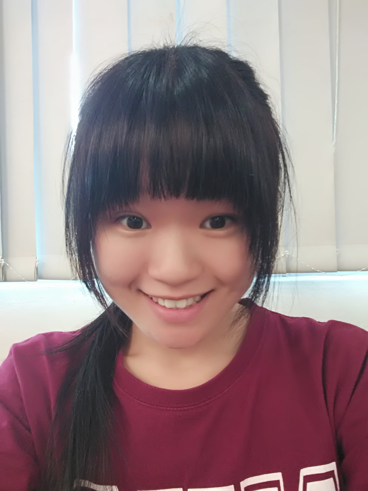

# About Us

We are a team based in the [School of Computing, National University of Singapore](http://www.comp.nus.edu.sg).

## Project Team

####Annabel Eng Jing Wen [@annabeleng](http://github.com/annabeleng)   
 
**Role**: Team Leader  
* Component in charge of: [Model](https://github.com/CS2103AUG2016-T13-C3/main/blob/master/docs/DeveloperGuide.md#model-component)  
* Aspects/tools in charge of: Documentation  
* Features implemented:  
   * [Edit Command](https://github.com/CS2103AUG2016-T13-C3/main/blob/master/docs/UserGuide.md#edit-a-task--edit)  
   * [Undo Command](https://github.com/CS2103AUG2016-T13-C3/main/blob/master/docs/UserGuide.md#undo-the-most-recent-action-undo)  
   * [Redo Command] (https://github.com/CS2103AUG2016-T13-C3/main/blob/master/docs/UserGuide.md#redo-the-most-recent-action-redo)  
* Code written: [[functional code]](https://github.com/CS2103AUG2016-T13-C3/main/blob/master/collated/main/A0129595N.md) [[test code]](https://github.com/CS2103AUG2016-T13-C3/main/blob/master/collated/docs/A0129595N.md) [[docs]](https://github.com/CS2103AUG2016-T13-C3/main/blob/master/collated/test/A0129595N.md)  
* Other major contributions:  
   * Did the initial refactoring from AddressBook to Malitio (code only/ testing done by Desmond) [[#3]](https://github.com/CS2103AUG2016-* * T13-C3/main/pull/3)  
   * Created the functional model/structure for Malitio [[#20]](https://github.com/CS2103AUG2016-T13-C3/main/pull/20)

-----

#### [Nathan Kwon](https://github.com/kwonn)
 
Role: Developer    
Responsibilities: Integration

-----

#### [Desmond Khoo](http://github.com/DesmondKhoo) 
 
Role: Developer    
Responsibilities: Code Testing

-----

#### [Ng Huan Ran](https://github.com/shusiner)
 
Role: Developer    
Responsibilities: Code Quality

 -----

# Contributors

We welcome contributions. See [Contact Us](ContactUs.md) page for more info.
