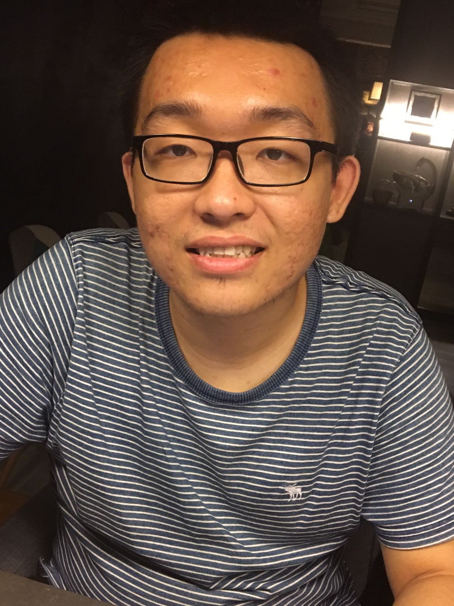

# About Us

We are a team based in the [School of Computing, National University of Singapore](http://www.comp.nus.edu.sg).

## Project Team

####[Bernard Koh](https://github.com/bernardified)
 

* Components in charge of: [Logic](https://github.com/CS2103AUG2016-W13-C2/main/blob/master/docs/DeveloperGuide.md#logic-component)
* Aspects/tools in charge of: Integration of PrettyTime NLP, Code Quality
* Features implemented:
   * Parse in flexible inputs
   * Overdue tasks
   * [`add` command](https://github.com/CS2103AUG2016-W13-C2/main/blob/master/docs/UserGuide.md#adding-a-task-add)
   * [`list` command](https://github.com/CS2103AUG2016-W13-C2/main/blob/master/docs/UserGuide.md#listing-all-tasks--list)
   * [`save` command](https://github.com/CS2103AUG2016-W13-C2/main/blob/master/docs/UserGuide.md#saving-the-data-to-a-specified-location--save)
   * [Priority feature](https://github.com/CS2103AUG2016-W13-C2/main/blob/master/docs/UserGuide.md#quick-start)
* Code written: [[functional code](https://github.com/CS2103AUG2016-W13-C2/main/blob/master/collated/main/A0138411N.md)][[test code](https://github.com/CS2103AUG2016-W13-C2/main/blob/master/collated/test/A0138411N.md)][[docs](https://github.com/CS2103AUG2016-W13-C2/main/blob/master/collated/docs/A0138411N.md)]
* Other major contributions:
  * Team Lead
  * Did the initial refactoring from AddressBook to GGist[[#1](https://github.com/CS2103AUG2016-W13-C2/main/pull/1)][[#3](https://github.com/CS2103AUG2016-W13-C2/main/pull/3)][[#6](https://github.com/CS2103AUG2016-W13-C2/main/pull/6)]
  * Contributed to UI developements [[#122](https://github.com/CS2103AUG2016-W13-C2/main/pull/122)] [[#126](https://github.com/CS2103AUG2016-W13-C2/main/pull/126)][[#145](https://github.com/CS2103AUG2016-W13-C2/main/pull/145)]
  * Contributed to Testing developments [[#89](https://github.com/CS2103AUG2016-W13-C2/main/pull/89)][[#90](https://github.com/CS2103AUG2016-W13-C2/main/pull/90)][[#121](https://github.com/CS2103AUG2016-W13-C2/main/pull/121)][[#141](https://github.com/CS2103AUG2016-W13-C2/main/pull/141)][[#158](https://github.com/CS2103AUG2016-W13-C2/main/pull/158)][[#169](https://github.com/CS2103AUG2016-W13-C2/main/pull/169)][[#171](https://github.com/CS2103AUG2016-W13-C2/main/pull/171)]
  * Set up Travis and Coveralls [[#88](https://github.com/CS2103AUG2016-W13-C2/main/pull/88)]
  * [Creation of Test Script for manual testing](https://github.com/CS2103AUG2016-W13-C2/main/commit/e7c040abe65c534b9043831c82cdf562dc68ed29)
  * Update developer's guide class diagrams[[#176](https://github.com/CS2103AUG2016-W13-C2/main/pull/176)]
  
  
-----

#### [Leah Lim](http://github.com/leahlim)
 

* Components in charge of: [UI](https://github.com/CS2103AUG2016-W13-C2/main/blob/master/docs/DeveloperGuide.md#ui-component)
* Aspects/tools in charge of: Code Quality, Command Developer, User and Developer Guide Developer
* Features implemented:
   * [`edit` command](https://github.com/CS2103AUG2016-W13-C2/main/blob/master/docs/UserGuide.md#editing-a-task--edit)
   * [`done` command](https://github.com/CS2103AUG2016-W13-C2/main/blob/master/docs/UserGuide.md#marking-a-task-as-complete--done) 
* Code written: [[functional code](https://github.com/CS2103AUG2016-W13-C2/main/blob/master/collated/main/A0144727B.md)][[test code](https://github.com/CS2103AUG2016-W13-C2/main/blob/master/collated/test/A0144727B.md)][[docs](https://github.com/CS2103AUG2016-W13-C2/main/blob/master/collated/docs/A0144727B.md)] 
* Other major contributions:
  * Aided in the initial refactoring from AddressBook test cases to GGist test cases
  * Developed and edited the user guide to make it user friendly
  * Developed the UI [[#111](https://github.com/CS2103AUG2016-W13-C2/main/pull/111)][[#120](https://github.com/CS2103AUG2016-W13-C2/main/pull/120)][[#123](https://github.com/CS2103AUG2016-W13-C2/main/pull/123)][[#126](https://github.com/CS2103AUG2016-W13-C2/main/pull/126/commits/843f0e06cede70303a75824d216846a1c4871be1)]
  * Contributed to Testing developments [[#159](https://github.com/CS2103AUG2016-W13-C2/main/pull/159)]

-----

#### [Liu Zhen Dong](http://github.com/dongxuandong) 
 

* Components in charge of: [Storage](https://github.com/CS2103AUG2016-W13-C2/main/blob/master/docs/DeveloperGuide.md#storage-component)
* Aspects/tools in charge of: Code Quality, Command Developer, User and Developer Guide Developer
* Features implemented:
   * [`undo` command](https://github.com/CS2103AUG2016-W13-C2/main/blob/master/docs/UserGuide.md#undo-undo)
   * [`redo` command](https://github.com/CS2103AUG2016-W13-C2/main/blob/master/docs/UserGuide.md#redo-redo) 
* Code written: [[functional code](https://github.com/CS2103AUG2016-W13-C2/main/blob/master/collated/main/A0138420N.md)][[test code]][[docs](https://github.com/CS2103AUG2016-W13-C2/main/blob/master/collated/docs/A0138420N.md)] 
* Other major contributions:
  * Aided in the initial refactoring from AddressBook test cases to GGist test cases
  * Developed and edited the user guide to make it user friendly
  * Edited and proofread the developer guide
  * Enhanced the functionality of delete command to delete multiple tasks[[#106](https://github.com/CS2103AUG2016-W13-C2/main/issues/106)]
  * Enhanced the functionality of done command to mark multiple tasks as done[[#109](https://github.com/CS2103AUG2016-W13-C2/main/issues/109)]
  * Improved the functionality of edit command to edit multiple fields[[#144](https://github.com/CS2103AUG2016-W13-C2/main/issues/144)]
  * Create test cases for both Redo and Undo Command

  
-----

#### [Li Wanghuan](http://github.com/liwanghuan)
 

* Components in charge of: [Testing] (https://github.com/CS2103AUG2016-W13-C2/main/blob/master/docs/DeveloperGuide.md#testing)
* Aspects/tools in charge of: Program Testing, Command Developer
* Features implemented:
   * [`continue` command](https://github.com/CS2103AUG2016-W13-C2/main/blob/master/docs/UserGuide.md#marking-a-completed-task-as-undone--continue)
   * [`edit` command](https://github.com/CS2103AUG2016-W13-C2/main/blob/master/docs/UserGuide.md#editing-a-task--edit) 
   * [TypicalTaskTesting](https://github.com/CS2103AUG2016-W13-C2/main/blob/master/docs/DeveloperGuide.md#troubleshooting-tests)
* Code written: [[functional code](https://github.com/CS2103AUG2016-W13-C2/main/blob/master/collated/main/A0147994J.md)][[test code](https://github.com/CS2103AUG2016-W13-C2/main/blob/master/collated/test/A0147994J.md)][[docs](https://github.com/CS2103AUG2016-W13-C2/main/blob/master/collated/docs/A0147994J.md)] 
* Other major contributions:
  * Aid in the initial refactoring from AddressBook test cases to GGist test cases
  * Add specific classes inside [[#9]https://github.com/CS2103AUG2016-W13-C2/main/pull/9]
  * Edit diagrams in user guide and developer guide [[#16](https://github.com/CS2103AUG2016-W13-C2/main/pull/16)] [[#16](https://github.com/CS2103AUG2016-W13-C2/main/pull/16)]
  * Enhance the functionaility of test cases [[#142](https://github.com/CS2103AUG2016-W13-C2/main/issues/142)]

-----

#### Project Mentor: [Akshay Narayan](https://github.com/okkhoy)
 

# Contributors

We welcome contributions. See [Contact Us](ContactUs.md) page for more info.

* [Akshay Narayan](https://github.com/se-edu/addressbook-level4/pulls?q=is%3Apr+author%3Aokkhoy)
* [Sam Yong](https://github.com/se-edu/addressbook-level4/pulls?q=is%3Apr+author%3Amauris)
