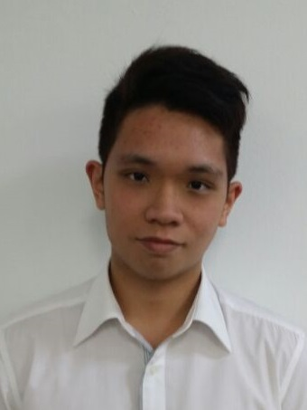

# About Us

We are team T13-C2 for the module CS2103 based in the [School of Computing, National University of Singapore]

## Project Mentor

#### [Akshay Narayan]
 

## Project Team

#### [Zhang Zongyi](http://github.com/zongyizzy)
 
Role: Developer    
Responsibilities: Code Quality/Deliverables/UI

-----

#### [Aloisius Stephen](https://github.com/aloisiusStephen)
  
Role: Developer    
Responsibilities: Integration, Parser

-----

#### [Kevin Ong](https://github.com/Kevin-Ong)
 
Role: Developer    
Responsibilities: Logic, Storage

-----

#### [Hong Bangwu](https://github.com/ndt93)
  
Role: Developer     
Responsibilities: Testing/Model/EventsCentre

-----