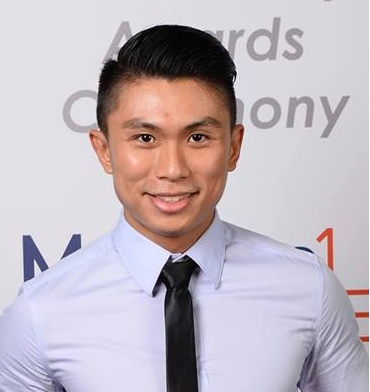

# About Us

We are a team based in the [School of Computing, National University of Singapore](http://www.comp.nus.edu.sg).

## Project Team

#### [Alvian Prasetya](https://github.com/jasperlee27)
 
Role: Project Mentor

-----

#### [Charlene Lee Kei Xin](https://github.com/chaejinkeyne)
 
Role: Developer  
Responsibilities: UI

-----

#### [Jasper Lee](https://github.com/jasperlee27)
 
Role: Developer    
Responsibilities: Logic

-----

#### [Song Kai](https://github.com/elijahsk)
 
Role: Developer    
Responsibilities: Model

# Contributors

We welcome contributions. See [Contact Us](ContactUs.md) page for more info.

* [Akshay Narayan](https://github.com/se-edu/addressbook-level4/pulls?q=is%3Apr+author%3Aokkhoy)
* [Sam Yong](https://github.com/se-edu/addressbook-level4/pulls?q=is%3Apr+author%3Amauris)
