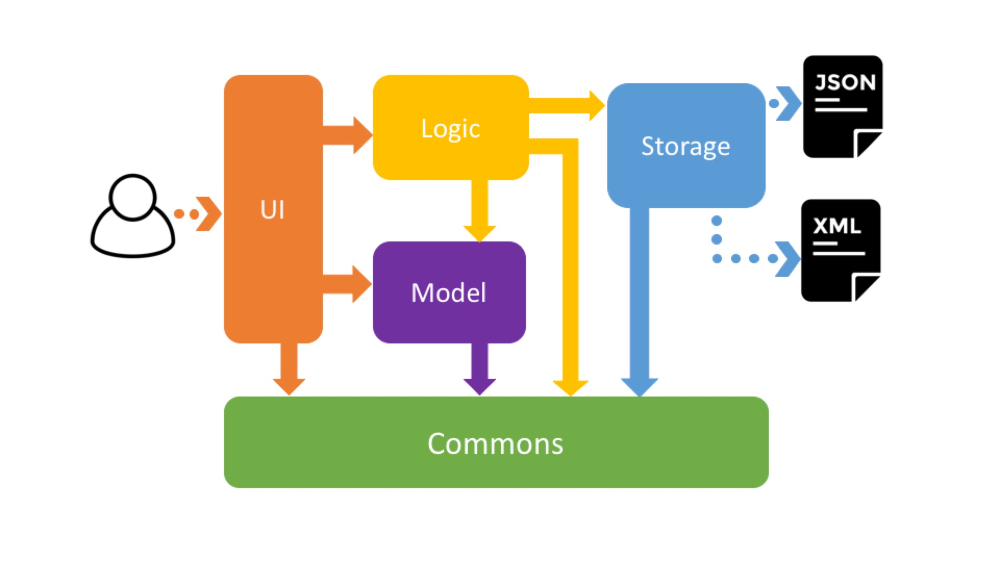

# Developer Guide

* [Introduction](#introduction)
* [Target Audience](#target-audience)
* [Setting Up](#setting-up)
* [Design](#design)
* [Implementation](#implementation)
* [Testing](#testing)
* [Continuous Integration](#continuous-integration)
* [Making a Release](#making-a-release)
* [Managing Dependencies](#managing-dependencies)
* [Appendix A: User Stories](#appendix-a--user-stories)
* [Appendix B: Use Cases](#appendix-b--use-cases)
* [Appendix C: Non Functional Requirements](#appendix-c--non-functional-requirements)
* [Appendix D: Glossary](#appendix-d--glossary)
* [Appendix E : Product Survey](#appendix-e-product-survey)

## Introduction
Welcome to Mastermind Developer Guide! <br>

Mastermind is a to-do task manager that helps the user to keep track of their tasks. We aim to provide our users with an effective and efficient solution to managing their tasks so they are able to better handle their time, as well as completing tasks required. 


## Target Audience
This developer guide is for both existing and new developers of the team who are interested in working on Mastermind in the future. <br>

This guide will be showing you the Product Architecture, APIs and the details regarding the different components. <br>

The next segment will show you how to set-up to make sure that you have the necessary tools before getting started, so do remember to read them! Feel free to approach our team for any clarifications that you may face during the process. Good luck and have fun coding! 


## Setting up

#### Prerequisites

1. **JDK `1.8.0_60`**  or later<br>

    > Having any Java 8 version is not enough. <br>
    This app will not work with earlier versions of Java 8.

2. **Eclipse** IDE
3. **e(fx)clipse** plugin for Eclipse (Do the steps 2 onwards given in
   [this page](http://www.eclipse.org/efxclipse/install.html#for-the-ambitious))
4. **Buildship Gradle Integration** plugin from the Eclipse Marketplace


#### Importing the project into Eclipse

0. Fork this repo, and clone the fork to your computer
1. Open Eclipse (Note: Ensure you have installed the **e(fx)clipse** and **buildship** plugins as given
   in the prerequisites above)
2. Click `File` > `Import`
3. Click `Gradle` > `Gradle Project` > `Next` > `Next`
4. Click `Browse`, then locate the project's directory
5. Click `Finish`

  > * If you are asked whether to 'keep' or 'overwrite' config files, choose to 'keep'.
  > * Depending on your connection speed and server load, it can even take up to 30 minutes for the set up to finish
      (This is because Gradle downloads library files from servers during the project set up process)
  > * If Eclipse auto-changed any settings files during the import process, you can discard those changes.

### Troubleshooting Project Setup
**Problem: Eclipse reports compile errors after new commits are pulled from Git**<br>

�	Reason: Eclipse fails to recognize new files that appeared due to the Git pull. <br>
�	Solution Refresh the project in Eclipse: Right click on the project (in Eclipse package explorer), choose Gradle -> Refresh Gradle Project
<br>

**Problem: Eclipse reports some required libraries missing**<br>

�	Reason: Required libraries may not have been downloaded during the project import.<br>
�	Solution: Run tests using Gradle once (to refresh the libraries).


## Design

### Software Architecture

To start off, let us introduce you to the overall structure of Mastermind. Do have a basic understanding of Mastermind's different components before focusing on them individually. <br>

Mastermind is split up into 5 main components, namely the `UI`, `Logic`, `Model`, `Storage` and `Commons`, as shown below, in Figure 1. 


<br>
The **_Architecture Diagram_** given above explains the high-level design of the App.
Given below is a quick overview of each component.

`Main` has only one class called [`MainApp`](../src/main/java/harmony/mastermind/MainApp.java). It is responsible for,
* At app launch: Initializes the components in the correct sequence, and connect them up with each other.
* At shut down: Shuts down the components and invoke clean up method where necessary.

[**`Commons`**](#common-classes) represents a collection of classes used by multiple other components.
Two of those classes play an important role at the architecture level.
* `EventsCentre` : This class (written using [Google's Event Bus library](https://github.com/google/guava/wiki/EventBusExplained))
  is used to by componnents to communicate with other components using events (i.e. a form of _Event Driven_ design)
* `LogsCenter` : Used by many classes to write log messages to the App's log files.

The rest of the App consists four components.
* [**`UI`**](#ui-component) : The UI of the App.
* [**`Logic`**](#logic-component) : The command executor.
* [**`Model`**](#model-component) : Holds the data of the App in-memory.
* [**`Storage`**](#storage-component) : Reads data from, and writes data to, the hard disk.

Each of the four components
* Defines its _API_ an interface with the same name as the Component. `Logic.java`
* Exposes its functionality using a `{Component Name}Manager` class e.g. `LogicManager.java`


The sections below give more details of each component.

#### UI component

UI is implemented by JavaFX 8 and consists of the main panel Main Window. This component primarily handles user input such as text input which will be entered via Command Line Input (CLI) as shown in Figure 2. On top of text input, users are also allowed to use keypress or mouse click and pass on to the Logic component. <br>

If you are intending to work on the UI, you will need to update the application's internal state, which also includes: <br>
1.	UiManager.java <br>
2.	UiPartLoader.java <br>
3.	UiPart.java <br>
4.	BrowserPanel.java


<br>

**API** : [`Ui.java`](../src/main/java/harmony/mastermind/ui/Ui.java)

The `UI` component uses JavaFx UI framework. The layout of these UI parts are defined in matching `.fxml` files
 that are in the `src/main/resources/view` folder.<br>
 For example, the layout of the [`MainWindow`](../src/main/java/harmony/mastermind/ui/MainWindow.java) is specified in
 [`MainWindow.fxml`](../src/main/resources/view/MainWindow.fxml)

The `UI` component,
* Executes user commands using the `Logic` component.
* Binds itself to some data in the `Model` so that the UI can auto-update when data in the `Model` change.
* Responds to events raises from various parts of the App and updates the UI accordingly.

#### Logic component
Logic is the brain of the application as it controls and manages the overall flow of the application. Upon receiving the user input from UI, it will process the input using the parser and return the result of executing the user input back to the UI. The inputs Logic take in are command words such as add, edit, delete, etc., and executes them accordingly based on their functionality. If you were to work on this execution of user input, you will need to access Storage through the EventsCenter to retrieve and update state of tasks. 

<br>

**API** : [`Logic.java`](../src/main/java/harmony/mastermind/logic/Logic.java)

1. `Logic` uses the `Parser` class to parse the user command.
2. This results in a `Command` object which is executed by the `LogicManager`.
3. The command execution can affect the `Model` (e.g. adding a person) and/or raise events.
4. The result of the command execution is encapsulated as a `CommandResult` object which is passed back to the `Ui`


##### Add 
The add class allows the user to add tasks, deadlines or events to Mastermind. Tasks, deadlines and events are different objects. They are being stored as object attributes such as name, description, end date, start date and type. <br>

You can refer to Figure 4 and Figure 5 below and the next page for the class diagram of Add.

<br>

> Note how the Model simply raises a TaskManagerChangedEvent when Mastermind's data is changed, instead of asking the Storage to save the updates to the hard disk.

The diagram below shows how the EventsCenter reacts to that event, which eventually results in the updates being saved to the hard disk and the status bar of the UI being updated to reflect the 'Last Updated' time.

<br>

> Note how the event is propagated through the EventsCenter to the Storage and UI without Model having to be coupled to either of them. This is how we reduce direct coupling between 2 components.

##### Delete
This delete allows the user to delete whatever they have input into the program beforehand. What the user have to do is to delete and choose the index that he or she wishes to delete.

Details are illustrated in the following diagrams.

<br>

> Again, note how that model simply raises an event instead of relying on Storage directly.

And EventsCeneter reacts to the event accordingly.

<br>


##### Clear 
Clear wipes all tasks currently registered in Mastermind. <br>

The user can delete the objects either at the homepage, deadlines, tasks or events tabs. The user is required to choose the correct index of the object. <br>
 
After inputing the command, the data is cleared from the Storage.<br> 


##### Edit 
This is also to allow the user to update attributes of items he has already added in Mastermind. <br>

The user can update the task by choosing the index of the task they want to change. They will then choose the specific field such as start date that they want to change. 
If there are multiple items, this is resolved by looking at the description of the task displayed to the user, allowing the user to choose the correct task instead. <br>

However, the user can only update one item at a time. To update, the item being updated must be found, and removed from the Storage. After updating the attribute, the item is re-added back into Storage. If the update is successful, the details of the item will be printed and it will be shown to the user the new updates. Otherwise, an error message is generated. 

The details are shown in the following diagrams.

<br>

2 events are raised during the execution of Edit.

<br>

##### Exit
This exit command runs when the user tries to exit the program, allowing the program to close.


##### Find
To find an item, the user will search through the Storage by calling "find <task>", "find <date>" or "find <tag>". It calls FindTagCommand to find the exact terms of the keywords entered by the user.


##### Mark
The Mark command allows users to mark their tasks/deadlines/events as completed. This removes the task from the tasks/deadlines/events field, and moves it into the Archive. The Mark command will not delete the task immediately. In the event that users want to unmark the task, users can do so due to using the Unmark Command. 


### Model component

<br>

**API** : [`Model.java`](../src/main/java/harmony/mastermind/model/Model.java)

The `Model`,
* Stores a `UserPref` object that represents the user's preferences
* Stores the Mastermind's data
* Exposes a `UnmodifiableObservableList<ReadOnlyPerson` that can be 'observed' e.g. the UI can be bound to this list so that the UI automatically updates when the data in the list change.
* Does not depend on any of the other three components.

### Storage component

<br>

**API** : [`Storage.java`](../src/main/java/harmony/mastermind/storage/Storage.java)

The `Storage` component,
* can save `UserPref` objects in json format and read it back.
* can save the Mastermind's data in xml format and read it back.

### Common classes

Classes used by multiple components are in the `harmony.mastermind.commons` package.
This component will be maintained by developers working on any of the other components because of its wide scope of application. You can find 4 packages, namely: core, events, exceptions and utils. 

## Implementation

### Logging

We are using `java.util.logging.Logger` as our logger, and `LogsCenter` is used to manage the logging levels
of loggers and handlers (for output of log messages)

- The logging level can be controlled using the `logLevel` setting in the configuration file
  (See [Configuration](#configuration))
- The `Logger` for a class can be obtained using `LogsCenter.getLogger(Class)` which will log messages according to
  the specified logging level

- Currently log messages are output through: `Console` and `.log`

**Logging Levels**

- SEVERE
  - Critical use case affected, which may possibly cause the termination of the application

- WARNING
  - Can continue, but with caution

- INFO
  - Information important for the application's purpose
    - e.g. update to local model/request sent to cloud
  - Information that the layman user can understand

- FINE
  - Used for superficial debugging purposes to pinpoint components that the fault/bug is likely to arise from
  - Should include more detailed information as compared to `INFO` i.e. log useful information!
    - e.g. print the actual list instead of just its size

### Configuration

Certain properties of the application can be controlled (e.g App name, logging level) through the configuration file
(default: `config.json`):


## Testing

**In Eclipse**:
> If you are not using a recent Eclipse version (i.e. _Neon_ or later), enable assertions in JUnit tests
  as described [here](http://stackoverflow.com/questions/2522897/eclipse-junit-ea-vm-option).

* To run all tests, right-click on the `src/test/java` folder and choose
  `Run as` > `JUnit Test`
* To run a subset of tests, you can right-click on a test package, test class, or a test and choose
  to run as a JUnit test.

**Using Gradle**:
* See [UsingGradle.md](UsingGradle.md) for how to run tests using Gradle.

Tests can be found in the `./src/test/java` folder.

1. **GUI Tests** - These are _System Tests_ that test the entire App by simulating user actions on the GUI.
   These are in the `guitests` package.

2. **Non-GUI Tests** - These are tests not involving the GUI. They include,
   1. _Unit tests_ targeting the lowest level methods/classes. <br>
      e.g. `harmony.mastermind`
   2. _Integration tests_ that are checking the integration of multiple code units
     (those code units are assumed to be working).<br>
      e.g. `harmony.mastermind.commons.core`
   3. Hybrids of unit and integration tests. These test are checking multiple code units as well as
      how the are connected together.<br>
      e.g. `harmony.mastermind.storage`

**Headless GUI Testing** :
Thanks to the ([TestFX](https://github.com/TestFX/TestFX)) library we use,
 our GUI tests can be run in the _headless_ mode.
 In the headless mode, GUI tests do not show up on the screen.
 That means the developer can do other things on the Computer while the tests are running.<br>
 See [UsingGradle.md](UsingGradle.md#running-tests) to learn how to run tests in headless mode.

## Dev Ops

### Build Automation
See [UsingGradle.md](UsingGradle.md) to learn how to use Gradle for build automation.

### Continuous Integration
We use [Travis CI](https://travis-ci.org/) to perform Continuous Integration on our projects to ensure that every time we merge a new feature into the main branch, automated testing is done to verify that the app is working.
See [UsingTravis.md](UsingTravis.md) for more details.

## Making a Release

Here are the steps to create a new release.

 1. Generate a JAR file [using Gradle](UsingGradle.md#creating-the-jar-file).
 2. Tag the repo with the version number. e.g. `v0.1`
 3. [Create a new release using GitHub](https://help.github.com/articles/creating-releases/)
    and upload the JAR file your created.

## Managing Dependencies

A project often depends on third party libraries. For example, Mastermind depends on the
[Jackson library](http://wiki.fasterxml.com/JacksonHome) for XML parsing. Managing these _dependencies_
can be automated using Gradle. For example, Gradle can download the dependencies automatically, which
is better than these alternatives.<br>
a. Include those libraries in the repo (this bloats the repo size)<br>
b. Require developers to download those libraries manually (this creates extra work for developers)<br>

## Appendix A : User Stories

Priorities: High (must have) - `* * *`, Medium (nice to have)  - `* *`,  Low (unlikely to have) - `*`


Priority | As a ... | I want to ... | So that I can...
-------- | :-------- | :--------- | :-----------
`* * *` | new user | see usage instructions | refer to instructions when I forget how to use the app
`* * *` | user | add a new task | so I can register my things to do
`* * *` | user | add a floating task | have a task without a deadline
`* * *` | user | add a recurring task | add repeating tasks only once
`* * *` | user | delete a task | remove entries that I no longer need
`* * *` | user | edit a task | update entries as needed
`* * *` | user | find a task by name | locate details of the task without having to go through the entire list
`* * *` | user | find a task by deadline | locate tasks that are due soon without having to go through the entire list
`* * *` | user | undo a task entered | undo a mistake easily
`* * *` | user | re-do a task entered | redo a mistake easily
`* * *` | user | sort list by alphabetical order and date | find my tasks easily
`* * *` | user | mark tasks as done | archive my completed tasks
`* * *` | user | specify the location of file storage | choose where to save the to do list
`* *` | user | see my tasks in user interface | have an easier time using the app
`*` | user | specify my own natural language | customise the app
`*` | user | set categories | organise my tasks
`*` | user | block out timings | reserve time slots for tasks
`*` | user | create subtasks | breakdown my tasks into smaller problems
`*` | user | set reminders for tasks | reduce chances of forgetting to do a task
`*` | user | import a list of to do tasks | add in tasks without registering them individually


## Appendix B : Use Cases

(For all use cases below, the **System** is the `Schema` and the **Actor** is the `User`, unless specified otherwise)

| # | Use Case | Descriptions  |
|---|---|---|
| [UC1](#uc1-display-help) | Display Help  | Display help when requested, or when user enter an invalid command. |
| [UC2](#uc2-adddo-a-task) | Add/Do a Task  | Adding a task. A task can be concrete (have defined date/time) or floating (without date/time). |
| [UC3](#uc3-lists-tasks) | Lists Tasks  | Display lists of tasks added into the System. |
| [UC4](#uc4-find-tasks) | Find Tasks  | Search for task by specifying parameters with keywords. |
| [UC5](#uc5-edit-a-task) | Edit a Task  | Edit the details of a single task. The command only update fields specified by the User. Unspecified field remains untouched. |
| [UC6](#uc6-delete-a-task) | Delete a task  | Remove a task entry by index. |
| [UC7](#uc7-undo-action) | Undo Action  | Undo last action performed. |
| [UC8](#uc8-redo-action) | Redo Action  | Redo an action performed in UC7. |
| [UC9](#uc9-mark-task-as-done) | Mark Task as done  | Mark a task as done by index. A marked task should be automatically archived and exclude from display and search. |
| [UC10](#uc10-exit-application) | Repeat command  | Load the previous command as input	 |
| [UC11](#uc11-clear-everything) | Clears everything | System performs bulk delete on the data (Deadlines, events, tasks). |
| [UC12](#uc12-relocate-storage-location) | Relocate storage location  | Change the current storage to other directory specified by the user. |
| [UC13](#uc13-exit-application) | Exit application  | Quit the application |

---

### UC1: Display help

Display help when requested, or when user enter an invalid command.

##### Main Success Scenario:

1. User requests to display help.

2. System display the help manual.

3. Use case ends.

##### Extensions

1a. User entered an invalid command.

* 1a1. System display unsuccessful message.

* 1a2. Use case ends.

---

### UC2: Add/Do a Task

Adding a task. A task can be concrete (have defined date/time), recurring(repeats with defined date/time) or floating (without date/time).

##### Main Success Scenario:

1. User requests to add a task.

2. System accepts the command & parameters, creates the task and displays successful message to User.

3. Use case ends.

##### Extensions

1a. User entered an invalid command.

* 1a1. System display unsuccessful message.

* 1a2. Use case ends.

1b. User enters task with date/time.

* 1b1. System accepts the command as concrete task.

* 1b2. Use case resume at 2.

1c. User enters task without date/time.

* 1c1. System accepts the command as floating task.

* 1c2. Use case resume at 2.

1d. User enters task with start date after end date.

* 1d1. System display error message.

* 1d2. Use case ends.

1e. User enters recurring task without date/time.

* 1e1. System display error message.

* 1e2. Use case ends.

1f. User enters recurring task with date/time.

* 1c1. System accepts the command as recurring task.

* 1c2. Use case resume at 2.


---

### UC3: Lists Tasks

Display lists of tasks added into the System.

##### Main Success Scenario:

1. User requests to lists tasks.

2. System display list of tasks.

3. Use case ends.

##### Extensions

1a. User entered an invalid command.

* 1a1. System display unsuccessful message.

* 1a2. Use case ends.

2a. System cannot find any task.

* 2a1. System display message, "No task found.".

---

### UC4: Find Tasks

Search for task by specifying parameters with keywords.

Note: The combination are filtered using **OR** operation. For example, the following command

```bash
find name/grocery tag/milk,egg
```

should return all tasks matches "grocery" in name OR having tag with "milk" or "egg"

##### Main Success Scenario:

1. User request to search for a tasks.

2. System Search for a task that matches the parameters.

3. System displays the matching results to the User.

4. Use case ends.

##### Extensions

1a. User entered an invalid command.

* 1a1. System display unsuccessful message.

* 1a2. Use case ends.

2a. System cannot find any task.

* 2a1. System display message, "No matching task found.".

---

### UC5: Edit a Task

Edit the details of a single task. The command only update fields specified by the User. Unspecified field remains untouched.

##### Main Success Scenario

1. User request to edit a task by index.

2. System find and update the task.

3. System display successful message.

4. Use case ends.

##### Extensions

1a. User entered an invalid command.

* 1a1. System display unsuccessful message.

* 1a2. Use case ends.

2a. Invalid index.

* 2a1. System cannot find the task associated with the index.

* 2a2. System display unsuccessful message.

* 2a3. Use case ends.

---

### UC6: Delete a task

Remove a task entry by index.

##### Main Success Scenario

1. User request to delete a task by index.

2. System find and remove the task.

3. System display successful message.

4. Use case ends.

##### Extensions

1a. User entered an invalid command.

* 1a1. System display unsuccessful message.

* 1a2. Use case ends.

2a. Invalid index.

* 2a1. System cannot find the task associated with the index.

* 2a2. System display unsuccessful message.

* 2a3. Use case ends.

---

### UC7: Undo Action

Undo last action performed.

##### Main Success Scenario

1. User requests to undo last action performed.

2. System pop from Undo stack and performs undo on the last action performed.

3. System put the action into Redo stack.

3. System display successful message and details of the undo operation.

4. Use case ends.

##### Extensions

1a. User entered an invalid command.

* 1a1. System display unsuccessful message.

* 1a2. Use case ends.

2a. System cannot find any previous action in Undo stack.

* 2a1. System display unsuccessful message.

* 2a2. Use case ends.

---

### UC8: Redo Action

Redo an action performed in UC7.

##### Main Success Scenario

1. User requests to redo an action performed in UC7.

2. System pop from Redo stack and performs redo on the last action performed in UC7.

3. System display successful message and details of the redo operation.

4. Use case ends.

##### Extensions

1a. User entered an invalid command.

* 1a1. System display unsuccessful message.

* 1a2. Use case ends.

2a. System cannot find any previous action in Redo stack.

* 2a1. System display unsuccessful message.

* 2a2. Use case ends.

---

### UC10: Repeat command

Loads the previous input command into the text field.

##### Main Success Scenario

1. User requests to load previous command.

2. System finds and load previous command.

3. System display successful message.

4. Use case ends.

##### Extensions

1a. User entered an invalid command.

* 1a1. System display unsuccessful message.

* 1a2. Use case ends.

---

### UC11: Clear everything

System performs bulk delete on the data (Deadlines, events, tasks).
##### Main Success Scenario

1. User requests to clear Mastermind

2. System proceed to perform bulk action described in UC6 for the specified category.

3. Use case ends.

##### Extensions

1a. User entered an invalid command.

* 1a1. System display unsuccessful message.

* 1a2. Use case ends.

---

### UC12: Relocate storage location

Change the current storage to other directory specified by the user.

##### Main Success Scenario

1. User requests to relocate the storage directory.

2. System change the storage directory according to user input.

3. System copy current storage to the new location.

4. System deletes old file at old storage location.

5. System displays successful message.

6. Use case ends.

##### Extensions

1a. User entered an invalid command.

* 1a1. System display unsuccessful message.

* 1a2. Use case ends.

2a. Invalid storage location.

* 2a1. System display unsuccessful message.

* 2a2. Use case ends.

2b. Storage location is not accessible/writable.

* 2a1. System display unsuccessful message.

* 2a2. Use case ends.

---

### UC13: Exit application

Quit the application.

##### Main Success Scenario

1. User requests to exit application.

2. System perform synchronization and save it to the storage.

3. System exit application.

4. Use case ends.

##### Extensions

1a. User entered an invalid command.

* 1a1. System display unsuccessful message.

* 1a2. Use case ends.

---

## Appendix C : Non Functional Requirements

1. Should backup tasks list.
2. Should work as a stand alone.
3. Should be able to store 1000 tasks.
4. Should be maintainable and scalable.
5. Should not use relational databases.
6. Should be user friendly for new users.
7. Should be able to be accessed offline.
8. Should come with automated unit testing.
9. Should follow the Object-oriented paradigm.
10. Should work without requiring an installer.
11. Should be able to startup and quit within 1 second.
12. Should display up to date tasks when command is given.
13. Should store data locally and should be in a .xml file.
14. Should work well without any third party framework/library.
15. Should have a Command Line Interface as the primary mode of input.
16. Should be able to display tasks within 1 second when command is given.
17. Should be able to run on all [mainstream OS](#mainstream-os) for desktop.
18. Should have a simple GUI that displays [relevant information](#relevant-information).


## Appendix D : Glossary

##### Mainstream OS

> Windows, Linux, Unix, OS-X

##### Relevant Information

> Tasks, due dates, priority


##### Floating Tasks

> Tasks with no specific deadline

## Appendix E : Product Survey

##### Google Calendar

> Pros:
> *  Able to sync calendars from other people
> *  Chrome extension for offline connectivity
> *  Multiple viewing options (Calendar/To do list view)
> *  Has a Command Line Interface (CLI)

> Cons:
> *  Unable to support floating task
> *  Unable to mark tasks as done
> *  Unable to block out and free up timings
> *  CLI commands only for addition of tasks
> *  Bad interface

##### Wunderlist

> Pros:
> *  Able to set categories
> *  Able to mark tasks as done
> *  Able to read tasks from e-mails
> *  Able to assign tasks to someone
> *  Able to search for tasks easily
> *  Able to migrate tasks from one category to another easily
> *  Web and offline desktop version available

> Cons:
> *  Unable to create subtask
> *  Unable to support recurring tasks
> *  Unable to block out time slots
> *  Unable to set start date for tasks
> *  Only has a list view

##### Todoist

> Pros:
> *  Able to set categories
> *  Able to collaborate with others
> *  Able to have sub-projects and sub-tasks
> *  Able to support recurring tasks
> *  Able to sort tasks by priority level
> *  Able to integrate from e-mail
> *  Able to backup automatically

> Cons:
> *  Unable to block out timings
> *  Unable to export out To-do list
> *  Minimal CLI
> *  Have to do a lot of clicking

##### Any.Do

> Pros:
> *  Able to set categories by type and day
> *  Able to show completed tasks
> *  Able to collaborate with others
> *  Able to support sub-tasks
> *  Able to add attachments
> *  Able to support recurring tasks
> *  Able to mark task as done
> *  Able to notify and remind user
> *  Able to have action shortcuts
> *  Able to have different types of views

> Cons:
> *  Unable to support floating tasks
> *  No CLI

##### Evernote

> Pros:
> *  Able to quick search
> *  Able to support handwriting, embedded images/audio and links
> *  Able to work with camera

> Cons:
> *  No CLI
> *  No Calendar view

##### Trello

> Pros:
> *  Able to mark tasks as "in-progress"
> *  Able to view as calendar

> Cons:
> *  Unable to import or export
> *  Relies on UI interaction
> *  No CLI
> *  Need to pay for premium use to access 3rd party features
> *  No desktop version
