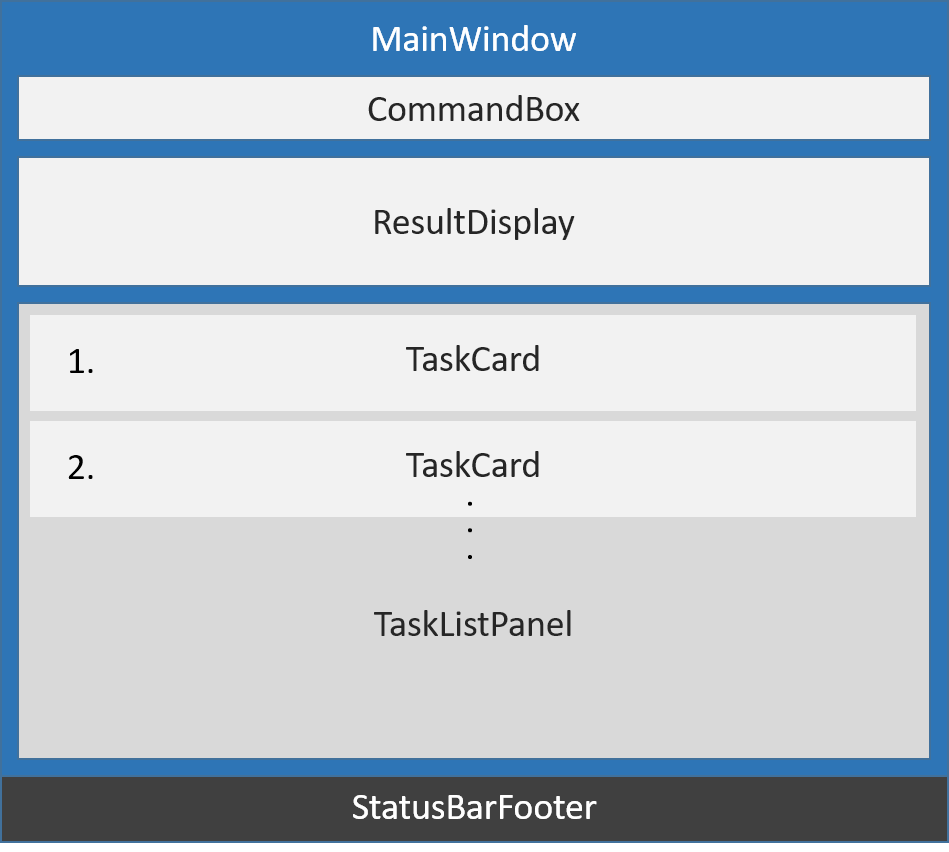

# Developer Guide

## Table of Contents

* [Introduction](#introduction)
* [Setting up](#setting-up)
    * [Prerequisites](#prerequisites)
    * [Importing the project into Eclipse](#importing-the-project-into-eclipse)
    * [Troubleshooting](#troubleshooting)
* [Design](#design)
    * [Architecture](#architecture)
    * [UI component](#ui-component)
    * [Logic component](#logic-component)
    * [Model component](#model-component)
    * [Storage component](#storage-component)
    * [Common classes](#common-classes)
* [Implementation](#implementation)
    * [Logging](#logging)
    * [Configuration](#configuration)
* [Testing](#testing)
* [Dev Ops](#dev-ops)
    * [Build Automation](#build-automation)
    * [Continuous Integration](#continuous-integration)
    * [Making a Release](#making-a-release)
    * [Managing Dependencies](#managing-dependencies)
* [Appendix A: User Stories](#appendix-a-user-stories)
* [Appendix B: Use Cases](#appendix-b-use-cases)
    * [Use case: Create new event](#use-case-create-new-event)
    * [Use case: List uncompleted tasks](#use-case-list-uncompleted-tasks)
    * [Use case: Update information of a task](#use-case-update-information-of-a-task)
    * [Use case: Delete a task](#use-case-delete-a-task)
    * [Use case: Mark a task as completed](#use-case-mark-a-task-as-completed)
    * [Use case: Show all tasks with given conditions](#use-case-show-all-tasks-with-given-conditions)
    * [Use case: Find tasks using keywords](#use-case-find-tasks-using-keywords)
    * [Use case: Delete all data](#use-case-delete-all-data)
    * [Use case: Change data storage file location](#use-case-change-data-storage-file-location)
* [Appendix C: Non Functional Requirements](#appendix-c-non-functional-requirements)
* [Appendix D: Glossary](#appendix-d-glossary)
* [Appendix E: Product Survey](#appendix-e-product-survey)
    * [Google Calendar](#google-calendar)
    * [Todoist](#todoist)
    * [Microsoft Outlook](#microsoft-outlook)
    * [iCalendar](#icalendar)

## Introduction
<!-- @@author A0148096W -->
TaSc is a task manager for users to manage their schedules using only keyboard commands. Users can add and manipulate tasks and events. Users can schedule their tasks with deadlines and periods, and use tags to categorize them. TaSc is a desktop application written in Java, and its GUI is built using JavaFx.

This guide contains all necessary information for both new and experienced contributors to continue the development of TaSc. Each section provides an overview on a topic, which will then be explained in greater detail in the subsections. Each subsection is mostly self contained for ease of reference. Throughout your development of TaSc you may freely revisit the topics as and when you need to.
  
<!-- @@author -->

## Setting up

#### Prerequisites

a. **JDK `1.8.0_60`**  or later 

> **Note:** 
> Having any Java 8 version is not enough.  
> This app will not work with earlier versions of Java 8.

b. **Eclipse** IDE 
c. **e(fx)clipse** plugin from the Eclipse Marketplace 
d. **Buildship Gradle Integration** plugin from the Eclipse Marketplace

 

#### Importing the project into Eclipse

0. Fork this repo, and clone the fork to your computer.
1. Open Eclipse (Note: Ensure you have installed the **e(fx)clipse** and **buildship** plugins as given
   in the prerequisites above).
2. Click `File` > `Import`.
3. Click `Gradle` > `Gradle Project` > `Next` > `Next`.
4. Click `Browse`, then locate the project's directory.
5. Click `Finish`.

> **Note:**
> * If you are asked whether to 'keep' or 'overwrite' config files, choose to 'keep'.
> * Depending on your connection speed and server load, it can take up to 30 minutes for the set up to finish (This is because Gradle downloads library files from servers during the project set up process)
> * If Eclipse auto-changed any settings files during the import process, you can discard those changes.

 

#### Troubleshooting

**Problem: Eclipse reports compile errors after new commits are pulled from Git**
* **Reason:** Eclipse fails to recognize new files that appeared due to the Git pull.
* **Solution:** Refresh the project in Eclipse: 
  Right click on the project (in Eclipse package explorer), choose `Gradle` -> `Refresh Gradle Project`.

**Problem: Eclipse reports some required libraries missing**
* **Reason:** Required libraries may have not been downloaded during the project import.
* **Solution:** [Run tests using Gardle](UsingGradle.md) once (to refresh the libraries).

 

## Design

<!-- @@author A0127014W -->
### Architecture

 
*Figure 1: Architecture Diagram*

The **_Architecture Diagram_** *(figure 1)* explains the high-level design of the App.
A quick overview of each component is given below:

`Main` has only one class called [`MainApp`](../src/main/java/teamfour/tasc/MainApp.java). It has two main responsibilities:
* At app launch: Initializes the components in the correct sequence, and connects them up with each other.
* At shut down: Shuts down the components and invokes cleanup method where necessary.

[**`Commons`**](#common-classes) represents a collection of classes used by multiple other components.
Two of those classes play important roles at the architecture level.
* `EventsCentre` : This class (written using [Google's Event Bus library](https://github.com/google/guava/wiki/EventBusExplained))
  is used by components to communicate with other components using events (i.e. a form of _Event Driven_ design).
* `LogsCenter` : This class is used by many classes to write log messages to the App's log file.
  

The rest of the App consists four components.
* [**`UI`**](#ui-component) : Allows users to interact with the program.
* [**`Logic`**](#logic-component) : Executes commands.
* [**`Model`**](#model-component) : Holds the data of the App in-memory.
* [**`Storage`**](#storage-component) : Reads data from and writes data to the hard disk.

Each of the four components
* defines its _API_ in an `interface` with the same name.
* exposes its functionality using a `{Component Name}Manager` class.
  

For example, the **`Logic`** component (see the class diagram in *figure 2* below) defines its API in the `Logic.java`
interface and exposes its functionality using the `LogicManager.java` class. 

 
*Figure 2: Class Diagram of Logic component*
  

The _Sequence Diagram_ below shows how the components interact when the user issues the
command `delete 1`.

 
*Figure 3: Sequence Diagram of user interaction*

>Notice how the **`Model`** simply raises a `TaskListChangedEvent` when the TaSc data are changed,
 instead of asking the **`Storage`** to save the updates to the hard disk.

  
The diagram below shows how the `EventsCenter` reacts to that event, which eventually results in the updates
being saved to the hard disk and the status bar of the UI being updated to reflect the 'Last Updated' time.  

 
*Figure 4: Sequence Diagram of EventsCenter*

> Note how the event is propagated through the `EventsCenter` to the **`Storage`** and **`UI`** without **`Model`** having
  to be coupled to either of them. This is an example of how this Event Driven approach helps us reduce direct
  coupling between components.

The next sections give more details of each component.

 

<!-- @@author A0148096W -->
### UI component

 
*Figure 5: Class Diagram of UI component*

**API** : [`Ui.java`](../src/main/java/teamfour/tasc/ui/Ui.java)

*Figure 5* above shows the overview of the UI component. It consists of a `MainWindow` that is made up of parts, which includes `CommandBox`, `TaskListPanel`,
`CalendarPanel`, etc. All these, including the `MainWindow`, inherit from the abstract `UiPart` class
which can be loaded using the `UiPartLoader`.

The **`UI`** component uses JavaFx UI framework. The layout of these UI parts are defined in matching `.fxml` files
 which are in the `src/main/resources/view` folder.
 For example, the layout of the [`MainWindow`](../src/main/java/teamfour/tasc/ui/MainWindow.java) is specified in
 [`MainWindow.fxml`](../src/main/resources/view/MainWindow.fxml)
  

The **`UI`** component
* executes user commands using the **`Logic`** component.
* binds itself to some data in the **`Model`** so that the UI can auto-update when data in the **`Model`** change.
* responds to events raised from various parts of the App and updates the UI accordingly.

 
*Figure 6. UI component in the application's interface*

*Figure 6* above shows where each `UiPart` is attached to the `MainWindow`.
  

**`TaskListPanel` Class:**

The `TaskListPanel` shows a list of `TaskCard` object, where each `TaskCard` contains the details of a task shown to the user. 
The `TaskCard` is also assigned a unique index in increasing order, which is used in other commands to identify a task, e.g. `delete 3` deletes the third item in the list.
  

**`CalendarPanel` Class:**

The `CalendarPanel` encapsulates the `Agenda` control from [`JFXtras`](http://jfxtras.org/doc/8.0/jfxtras-agenda/) library. 
The `CalendarPanel` handles the display and selection of tasks on the calendar, and also handles the switching between *Day* and *Week* view of the calendar.
  

**`HelpWindow` Class:**

The `HelpWindow` is a window separate from the `MainWindow`. It shows our product's User Guide using a WebBrowser which supports modern HTML and CSS.

 

<!-- @@author A0127014W -->
### Logic component

 
*Figure 7: Class Diagram of Logic component*

**API** : [`Logic.java`](../src/main/java/teamfour/tasc/logic/Logic.java)

 **`Logic`** uses the `Parser` class to parse the user command. This results in a `Command` object which is executed by the `LogicManager`. The command execution can affect the **`Model`** (e.g. adding a task) and/or raise events.
 The result of the command execution is encapsulated as a `CommandResult` object which is passed back to the `Ui`.
  

Given below *(figure 8)* is the Sequence Diagram for interactions within the **`Logic`** component for the `execute("delete 1")`
 API call. 

 
*Figure 8: Sequence Diagram for interactions in Logic*
  

**`Logic` Interface:**

The `Logic` interface allows you to request for any logic-related operation, such as parsing and executing commands, without having to know anything about the implementation of the `LogicManager` class.

**Notable APIs**

Return type | Method and Description
----------- | ----------------------
CommandResult() | `execute(String commandText)`: Identifies and executes the command found in the input string `commandText`.
ObservableList() | `getFilteredTaskList()`: Retrieves the filtered task list from the **`Model`** component.
 

**`Logic Manager` Class:**

The `Logic Manager` class implements the **`Logic`** interface, and provides all the services and functionality
specifed in the **`Logic`** interface. It executes the command in the input string passed from the **`UI`** component. First, it passes the command string to the `Parser` class to get a `Command` object. Then, it executes the `Command` to produce a `CommandResult`. This `CommandResult` is then passed back to the **`UI`** component.

Other components should reference this class indirectly by using the `Logic` interface. You should not directly use this class outside the **`Logic`** component.
  

**`Parser` Class:**

The `Parser` class parses the given input string and returns the corresponding `Command`. It uses predefined keywords to identify which `Command` to return, and to extract the arguments relevant to the `Command`. `Parser` then calls the constructor for the identified `Command`, and passes in the extracted arguments.
  

**`Command` Class:**

The `Command` class takes input arguments from the `Parser`class, and produces a `CommandResult` based on the input. There are multiple `Command` subclasses, which takes different input parameters and produces different `CommandResult`s. The **`Logic`** class executes `Command`s to change the data in **`Model`** according to the command type and input arguments.

 

<!-- @@author A0140011L -->
### Model component

 
*Figure 9: Class Diagram of Model component*

**API** : [`Model.java`](../src/main/java/teamfour/tasc/model/Model.java)

The **`Model`**
* stores a `UserPref` object that contains the user's preferences.
* stores task list's data.
* exposes a `UnmodifiableObservableList<ReadOnlyTask>` that can be 'observed' e.g. the UI can be bound to this list
  so that the UI automatically updates when the data in the list change.
* does not depend on any of the other three components.
    * However, other components are heavily dependent on this component.
  

**`Model` Interface:**

The **`Model`** interface allows you to request for any model-related operations, such as retrieving and modifying tasks
in the task list, without having to know anything about the implementation of the `ModelManager` class.

**Notable APIs**

Return type | Method and Description
----------- | ----------------------
void | `resetData(ReadOnlyTaskList newData)`: Replaces the entire task list with the one provided by `newData`.
ReadOnlyTaskList | `getTaskList()`: Retrieves the entire task list.
void | `addTask(Task task)`: Adds a task to the list.
void | `updateTask(ReadOnlyTask oldTask, Task newTask)`: Updates the details of the old task with the new task given.
void | `deleteTask(ReadOnlyTask target)`: Deletes the `target` task.
void | `resetTaskListFilter()`: Resets all filters that was used to view only a certain subset of the task list.
 

**`ModelManager` Class:**

The `ModelManager` class implements the **`Model`** interface, and provides all the services and functionality
specifed in the **`Model`** interface.

Other components should reference this class indirectly by using the **`Model`** interface. You should not
directly use this class outside the model component.
  

**`ReadOnlyTaskList`, `ReadOnlyTask` Interfaces:**

These interfaces allow you to retrieve tasks, but not modify them. You can retrieve the tasks
and tags used in the entire task list.
  

**`TaskList` Class:**

The `TaskList` class is responsible for maintaining the task list required by the program. You should not call
any method of this class directly. Instead, you should request for retrieval and modification via the
`ModelManager`. The `ModelManager` will return a `ReadOnlyTaskList` when requesting for tasks in the task list.
  

**`Task` Class:**

The `Task` class contains all the task details. (e.g. name, deadlines, tags, ...)

For each individual detail, the class will always store a reference to an object. Therefore, even
if the detail for such task is blank (e.g. there is no deadline for a task), the reference to the
details is **never `null`**. Instead, a `Deadline()` will be created to represent that there is no
deadline for the task (usually, you would use `Deadline(Date date)` if the task has a deadline).
  

**`HistoryStack` and `HistoryItem<T>` Classes:**

The `HistoryStack` class stores the most recent states of the implemented `HistoryItem<T>` objects.
You can specify a maximum size for the stack, and older history states are discarded whenever new states are 
pushed and the size has exceeded the maximum size. History states stored in the stack are returned as type `T` objects when popped.

> **Note:** The `undo` and `redo` command uses HistoryStack to store recent states of the TaskList. 
> This design eliminates the need to implement an undo/redo method for every command.
> This saves time and effort for implementing new commands, and also reduces complications and potential bugs.

 

**`UserPrefs` Class:**

The `UserPrefs` class stores the program settings.

> **Note:** The program settings and user configuration settings are different.

 

**`Name`, `Complete`, `Deadline`, `Period`, `Recurrence`, `Tag` Classes:**

The classes mentioned represents the details of the task. Do note that some
classes have multiple constructors (for details that are not filled in, use the default constructor)

**Notable APIs**

Methods | Description
------- | -----------
Name(String name) | Name of the task
Complete(boolean complete) | Completion status of the task
Deadline(Date date) | The deadline for the task is `date` *(Omit `date` for no deadline)*
Period(Date startTime, Date endTime) | The time slot for the task is `startTime` to `endTime` *(Omit `startTime` and `endTime` for no period)*
Recurrence(Pattern type, int frequency) | The task repeats for `frequency` times, in a daily, weekly or monthly fashion *(Omit `type` and `frequency` for no deadline)*
Tag(String name) | One of the tags for this task
 

**`UniqueTagList` Class:**

The `UniqueTagList` class stores the unique tag list for a task. It is guaranteed that there will
be no duplicate tags in the list.
  

**`UniqueTaskList` Class:**

The `UniqueTaskList` class provides a task list with no duplicate tasks.

 

<!-- @@author A0147971U -->
### Storage component

 
*Figure 10: Class Diagram of Storage component*

**API** : [`Storage.java`](../src/main/java/teamfour/tasc/storage/Storage.java)

The **`Storage`** component
* saves `UserPref` objects in json format and reads it back.
* saves `TaskList` in xml format and reads it back.
* depends on the **`Model`** component, but the **`Logic`** and **`UI`** components depend on it.
  

**`Storage` Interface:**

The **`Storage`** interface allows you to request for any storage-related operations, such as reading and saving the user's preferences and tasklist.

**Notable APIs**

Return type | Method and Description
----------- | ----------------------
Optional<`UserPrefs`> | `readUserPrefs()`: Reads User's Preferences.
void | `saveUserPrefs(UserPrefs userPrefs)`: Saves User's Preferences.
Optional<`ReadOnlyTaskList`> | `readTaskList()`: Reads the tasklist.
void | `saveTaskList(ReadOnlyTaskList taskList)`: Saves the tasklist.
 

**`StorageManager` Class:**

The `StorageManager` class implements the **`Storage`** interface, and provides all the services and functionality
specified in the **`Storage`** interface.

Other components should reference this class indirectly by using the **`Storage`** interface. You should not
directly use this class outside the **`Storage`** component.
  

**`TaskListStorage` , `UserPrefsStorage` Interfaces:**

Represent the storage for `TaskList` and `UserPrefs`.
  

**`JsonUserPrefsStorage` Class:**

The `JsonUserPrefsStorage` class is provided for accessing `UserPrefs` stored in the hard disk as a json file.
  

**`XmlAdaptedTag` , `XmlAdaptedTask`, `XmlFileStorage`, `XmlSerializableTaskList`, `XmlTaskListStorage` Class:**

JAXB-friendly adapted version of the `Tag` and `Task` and Task Lists.

 

<!-- @@author A0127014W -->
### Common classes

The `teamfour.tasc.commons` package contains classes used by multiple components.

**`ComponentManager` Class:**

The `ComponentManager` class serves as the base class for the various Manager classes, like `ModelManager` and `LogicManager`. It is responsible for registering the Managers' event handlers in `EventsCenter`.

**`Config` Class:**

The `Config` class stores various configuration values used by the app, such as the file path of the storage file and logging levels.

**`EventsCenter` Class:**

The `EventsCenter` class manages the event dispatching of the app. It is responsible for regitering event `Handler`s to the `EventBus`, and posting events to the `EventBus`.

**`GuiSettings` Class:**

The `GuiSettings` class contains various GUI settings, such as the size and location of the GUI window.

**`LogsCenter` Class**

The `LogsCenter` class configures and manages loggers and handlers. It contains settings such as the logging level and the size of the log file generated by the app.

 
<!-- @@author -->

## Implementation

### Logging

We are using the `java.util.logging` package for logging. The `LogsCenter` class is used to manage the logging levels
and logging destinations.

* The logging level can be controlled using the `logLevel` setting in the configuration file
  (See [Configuration](#configuration)).
* The `Logger` for a class can be obtained using `LogsCenter.getLogger(Class)` which will log messages according to
  the specified logging level.
* Currently log messages are output through: `Console` and to a `.log` file.

**Logging Levels**

* `SEVERE` : Critical problems which may cause the application to terminate
* `WARNING` : Advice of errors in the application that does not cause the application to terminate
* `INFO` : Information showing noteworthy actions by the application
* `FINE` : Details that is not usually noteworthy but may be useful in debugging
  e.g. print the actual list instead of just its size
  

### Configuration

You can control certain properties of the application (e.g Application name, logging level) through the configuration file
(default: `config.json`):

 

## Testing

You can find the tests in the `./src/test/java` folder.

**In Eclipse**:

* To run all tests, right-click on the `src/test/java` folder and choose
  `Run as` > `JUnit Test`
* To run a subset of tests, you can right-click on a test package, test class, or a test and choose
  to run as a JUnit test.
  

> **Note:** 
> If you are not using a recent Eclipse version (i.e. _Neon_ or later), enable assertions in JUnit tests
> as described [here](http://stackoverflow.com/questions/2522897/eclipse-junit-ea-vm-option).

**Using Gradle**:
* See [UsingGradle.md](UsingGradle.md) for how to run tests using Gradle.

We have two types of tests:

1. **GUI Tests** - These are _System Tests_ that test the entire App by simulating user actions on the GUI.
   These are in the `guitests` package.

2. **Non-GUI Tests** - These are tests not involving the GUI. They include,
   1. _Unit tests_ targeting the lowest level methods/classes.  
      e.g. `teamfour.tasc.commons.UrlUtilTest`
   2. _Integration tests_ checking the integration of multiple code units
     (those code units are assumed to be working). 
      e.g. `teamfour.tasc.storage.StorageManagerTest`
   3. Hybrids of unit and integration tests. These tests check multiple code units as well as
      how the are connected together. 
      e.g. `teamfour.tasc.logic.LogicManagerTest`
  

**Headless GUI Testing** :
Thanks to the [TestFX](https://github.com/TestFX/TestFX) library we use,
 our GUI tests can be run in the _headless_ mode.
 In headless mode, GUI tests do not show up on the screen.
 That means you can do other things on the computer while the tests are running. 
 See [UsingGradle.md](UsingGradle.md#running-tests) to learn how to run tests in headless mode.

 

## Dev Ops

### Build Automation

We use Gradle to perform *Build Automation*. See [UsingGradle.md](UsingGradle.md) for more details.

### Continuous Integration

We use [Travis CI](https://travis-ci.org/) to perform _Continuous Integration_ on our projects.
See [UsingTravis.md](UsingTravis.md) for more details.

### Making a Release

Here are the steps to create a new release.

 1. Generate a JAR file [using Gradle](UsingGradle.md#creating-the-jar-file).
 2. Tag the repo with the version number. e.g. `v0.1`.
 2. [Crete a new release using GitHub](https://help.github.com/articles/creating-releases/)
    and upload the JAR file your created.

### Managing Dependencies

A project often depends on third-party libraries. For example, TaSc depends on the
[Jackson library](http://wiki.fasterxml.com/JacksonHome) for XML parsing. Managing these _dependencies_
can be automated using Gradle. For example, Gradle can download the dependencies automatically, which
is better than including libraries in our project repository (which will bloat the repository size), or requiring developers to download the libraries manually.

 

## Appendix A: User Stories

Priorities: High (must have) - `* * *`, Medium (nice to have)  - `* *`,  Low (unlikely to have) - `*`

Priority | As a ... | I want to ... | So that I can...
-------- | :-------- | :--------- | :-----------
`* * *` | New user | See usage instructions | Refer to instructions when I forget how to use the program
`* * *` | New user | Create a new data file to store my tasks | Store my schedule for future reference
`* * *` | User | List all the tasks that are incomplete, in order of deadline | See the next task that needs to be completed
`* * *` | User | Create a new task with no associated date or time | Add floating tasks to be completed
`* * *` | User | Create a new task with a start time and end time | Create an event for my calendar
`* * *` | User | Create a new task with the deadline (with no time slot) | Create a task that needs to be completed on my calendar
`* * *` | User | Add tags to a task | Categorize the related tasks
`* * *` | User | Change details in a task | Keep the details of my tasks up to date
`* * *` | User | Delete a task | Remove outdated tasks
`* * *` | User | Mark a task as completed | Manage and view my tasks more effectively
`* * *` | User | Show all tasks | See a complete view of my past and current schedule
`* * *` | User | Search tasks using keywords | Locate a task easily
`* * *` | User | Load previously written data | Refer to previously created schedule
`* * *` | User | Save changes to my schedule | -
`* * *` | User | Clear the data storage file | Remove unwanted tasks to free up disk space, or to redo schedule from scratch
`* * *` | User | Store my schedule offline | Access schedule even without internet connection
`* *` | User | Choose which folder to save my schedule file | Store it in a different location for cloud syncing
`* *` | User | Create a task with recurring deadlines | Have recurring schedules without adding a task every time
`* *` | User | Show only tasks/events with specified tag(s) and date | See only the related tasks/events from the list
`* *` | User | Hide tasks/events with specified tag(s) and date | Hide tasks/events which I do not care about in the list
`* *` | User | Undo my changes | Reverse any wrong action that was taken
`* *` | User | View a calendar interface | Visualise all my tasks in a calendar format
`* *` | User | Change the calendar view from daily to weekly | View more tasks and events beyond the day
`*` | User | Convert an email to a task | Create a task based on email that I have received
`*` | User | Add a location to a task | Make my event happen on a location
`*` | User | See all free time within a time range | Easily schedule other tasks/events into a free time
`*` | User | See keyword and tag suggestions as I type | Save time by typing the correct command which yields the results I want

 

## Appendix B: Use Cases

(For all use cases below, the **System** is the `TaSc` and the **Actor** is the `user`, unless specified otherwise)

<!-- @@author A0140011L -->
#### Use case: Create new event

**MSS:**

1. User creates new task with start time and end time
2. Program creates the task with given start time and end time 
Use case ends

**Extensions:**

2a. The start time or end time given is invalid
> 2a1. Program shows an error message, prompts for re-type of task details 
> 2a2. User re-types the start time and end time 
  Use case resumes at step 2

2b. The start time is later than the end time
> 2b1. Program shows an error message, provides two options: Swap time around, or re-type task details 
>     * 2b1i. User requests to swap time around 
>           * Program swap time around 
>           * Use case resumes at step 3 
>     * 2b1ii. User requests to retype timing 
>           * Use case resumes at step 2a3

 

#### Use case: List uncompleted tasks

**MSS:**

1. User requests to list uncompleted tasks
2. Program lists uncompleted tasks, by order of tasks with earliest deadline 
Use case ends

**Extensions:**

1a. The list is empty
> 1a1. Program shows a notice message 
  Use case ends

 

<!-- @@author A0147971U -->
#### Use case: Update information of a task

**MSS:**

1. User requests to replace information of a specific task on the list of tasks with new information
2. Program replaces the current information of the task with the new information 
Use case ends

**Extensions:**

1a. The given index is invalid
> 1a1. Program shows an error message 
  Use case ends

 

#### Use case: Delete a task

**MSS:**

1. User requests to delete a specific task on the list of tasks
2. Program deletes the task 
Use case ends

**Extensions:**

1a. The given index is invalid
> 1a1. Program shows an error message 
  Use case ends

 

#### Use case: Mark a task as completed

**MSS:**

1. User requests to mark a specific task on the list of tasks as completed
2. Program changes the status of the task to 'completed' 
Use case ends

**Extensions:**

1a. The given index is invalid
> 1a1. Program shows an error message 
  Use case ends

1b. The status of the task is already 'completed'
> 1b1. Program returns error message 
  Use case ends.

 

<!-- @@author A0148096W -->
#### Use case: Show all tasks with given conditions

**MSS:**

1. User requests to show all tasks with given conditions
2. Program lists the tasks which match all the given conditions in the specified order 
Use case ends

**Extensions:**

1a. The list is empty
> 1a1. Program shows a notice message 
  Use case ends

 

#### Use case: Find tasks using keywords

**MSS:**

1. User requests to find tasks by providing some keywords
2. Program lists the tasks whose information matches some of the keywords 
Use case ends

**Extensions:**

1a. The list is empty
> 1a1. Program shows a notice message 
  Use case ends

 

#### Use case: Delete all data

**MSS:**

1. User requests to delete all data
2. Program ask for user's confirmation
3. User confirms the deletion
4. Program deletes all data 
Use case ends

**Extensions:**

3a. User declines the confirmation
> Use case ends

 

<!-- @@author A0127014W -->
#### Use case: Change data storage file location

**MSS:**

1. User requests to designate new data storage file location
2. Program changes the data storage file location 
Use case ends

**Extensions:**

1a. Location is not valid / No permission to access location

> 1a1. Program shows an error message 
  Use case ends

2a. Previous data storage file location has a data file

> 2a1. Program copies the data file to the current location and deletes the data file from the previous location 
  Use case ends

 

<!-- @@author -->
## Appendix C: Non Functional Requirements

1. The application should work on any [mainstream OS](#mainstream-os) as long as it has Java `1.8.0_60` or higher installed.
2. The application should come with automated unit tests and open source code.
3. The application should be able to handle at least 500 tasks.
    * Assume for each day in the calendar, you have 5 tasks per day, and you store tasks up to 3 months. 30*5*3 = 450 ~= 500.
4. The application should be able to display the result of the query in less than 5 seconds.
5. The application should run primarily on commandline-like interface.
6. The application should be able to work offline.
7. The application should ship with regression testing available.
8. The application should be able to handle floating tasks (tasks with no deadline at all), normal tasks and events as the same concept.
9. The source code should be well-documented and ready to be continued by someone else.
10. The application should allow users to undo up to at least 10 most recent commands.
11. The application should be usable straight away, without requiring any installation.
12. The application should still be usable even if the storage data is at a different location rather than at the default location.
13. Version control should be used during development of product.
14. The application should come with user-friendly documentation to teach users how to use.
15. The data storage file should be in a human-readable and editable format.

 

## Appendix D: Glossary

**Command:** A keyword that the program understands, to allow user to tell the program to execute a certain action.

**Data Storage File:** A database that contains all our tasks.

**Human Editable Format:** The task list is stored in a way such that you can literally open the file and edit in Notepad if you want (data can be preserved even if the program no longer exist in the future).

**Local Storage:** A database stored on the user’s computer system so that it does not require an Internet connection to function.

**Query:** An attempt by the user to ask something from the program.

**Regression Testing:** A tool to ensure correct implementation of the program, and to detect possible bugs that might resurface when making changes to the code.

**Source Code:** The underlying framework that the program is built from.

**Task:** Either (a) something that needs to be done, or (b) an event.

**Tag:** Classification of a task (can also be used for prioritizing tasks)

 

## Appendix E: Product Survey

This section indicates the strengths and weaknesses of our competitors’ products with regards to their capability in catering to Jim’s requirements.

<!-- @@author A0148096W -->
#### Google Calendar

Strengths:

* Full-featured keyboard shortcuts
* Integrated with Gmail, requires just one-click to add event from inbox
* Offline support with Chrome
* Mini-calendar at sidebar
* Multiple calendar views (monthly/weekly/daily)
* Multiple calendars (can show/hide all)
* Email/Chrome/mobile notifications
* Syncs to cloud when online
* Has 'Find a time' feature
* Supports recurring events
* Drag and drop event from one day to another
* Import/Export iCal/CSV calendar for offline use

Weaknesses:

* Only color tags
* Keyboard shortcuts “has to be discovered”
* Unable to delete/edit event using one command
* Unable to add floating tasks
* No tasks view with priority/deadlines
* Unable to reserve multiple slots
* Unable to mark event with statuses such as 'completed', 'canceled'

Summary:

The calendar view is a useful feature to help users visualize their schedules. On the other hand,
the lack of ability to add floating tasks may cause inconvenience to users.

Our Program:

We will allow tasks with no deadlines and time slots (periods).
  

<!-- @@author A0127014W -->
#### Todoist

Strengths:

* 'One shot approach' - Can enter tasks and details in one typed in command
* Typed in command resembles natural language
* Supports recurring tasks
* Allows postponement of tasks
* Allows entering tasks that need to be done before/after/without a specific date/time
* Syncs when online, but can be used offline too
* Multiplatform (Android, iOS, Windows, macOS, browser extensions - Chrome, Firefox, Safari)
* Allows searching for tasks
* Can set priorities for tasks

Weaknesses:

* Does not help find suitable slot to schedule task
* Marking item as done simply deletes it
* Cannot 'block' or 'release' multiple slots when timing is uncertain
* Mouse required for most actions, only task creation uses the keyboard

Summary:

Does not store completed tasks, and still requires mouse for most actions

Our Program:

We will include completion status for all tasks. All commands will be able to be executed by typing
them through the command box.
  

<!-- @@author A0140011L -->
#### Microsoft Outlook

Strengths:

* Can flag emails as task (i.e. Emails can be turned into tasks)
* Keyboard shortcuts discovery simple (hold Alt key and all keyboard shortcuts are shown)
* Allow tasks without specific time
* Can still work without internet, will sync back to the online server when internet connection is restored
* Can block multiple slots as having multiple appointments in a time slot is allowed (However it is not built-in feature, have to manually use tags)
* Task can be sorted in due date (to know which task needs to be completed first)
* Tasks can be recurring in nature (lecture quiz task only needs to be created one time, a reminder will pop up every week)
* Tasks can be marked as done
* Tasks can be set to different priorities (high/medium/low)
* You can indicate the amount of work done for the task (0% complete? 5% complete?)
* Tasks can be set with a reminder

Weaknesses:

* Tasks from emails cannot be renamed
* Cannot allocate task to a certain time slot in the calendar
* Keyboard shortcuts does not always make sense (sometimes it is the first letter of the name, sometimes it is the second letter, etc)
* Keyboard shortcuts too long winded sometimes
* Tasks only appear as a list in ‘Daliy Task List’ if you force it to appear in calendar view
* No sense of context awareness at all, no GCal’s quick add (e.g. if you type "Eat Cheese in NUS at 9am", it does not specify the location at NUS and the time is not set to 9am)
* No way to find suitable slots painlessly (no 'Find a Time' feature)
* A lot of mouse action required (while keyboard shortcuts, exist they are not designed with keyboard shortcuts in mind, but rather with a mouse user)
* Only one reminder can be created for each task

Summary:

While it provides recurring features, and seperates tasks and events, tasks are not shown on the calendar view, which
makes it hard to visualise the due dates of the tasks. The use of mouse is required for some features.

Our Program:

We will not only provide a good calendar UI for tasks, we will also strive to minimize mouse usage by allowing
user to access the commands by typing through the command box.
  

<!-- @@author A0147971U -->
#### iCalendar

Strengths:

* User can view upcoming tasks easily, on both macOS and iOS (also via Siri)
* Add tasks with natural language input
* A complete command list provided for users (keyboard shortcuts), which is easy to remember
* Event has many properties, (e.g. tag, location, date, time, description, alert before event, description, repeat, attachments)
* Can choose specific functions for tags (e.g. whether to sync, universal alert time)
* Specify location on map
* Invite function
* Sharing with friends via email or iMessage
* Importing events from other calendar apps
* Add event from email, and even from date/time expressions in some other chatting apps
* Festivals and holidays are already stored, according to user’s geolocation
* Can set to private or public
* Highlights the dates of friends’ birthdays and any important dates (Found in Facebook, Apple ID, etc)

Weaknesses:

* User has to specify the time period
* Events/tasks cannot be marked as done
* Problem in importing from other app: duplicates may appear sometimes
* No feature for reserving time blocks
* No priority/importance feature

Summary:

Its design is very user-friendly. Since it is supported by other powerful modules by Apple, it has relatively complete features and functionalities. However, it would be better if further details of tasks and events are supported.

Our Program:

We will implement completion status. We will implement prioritizing of tasks through using tags.
