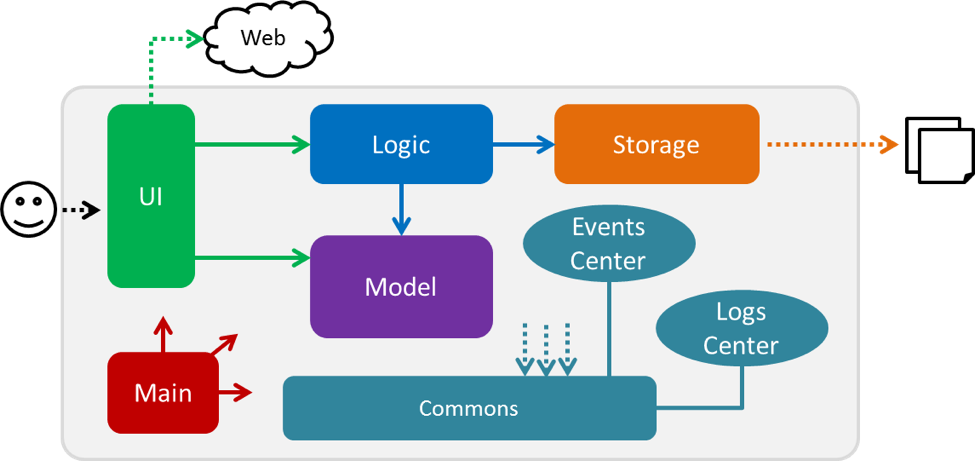
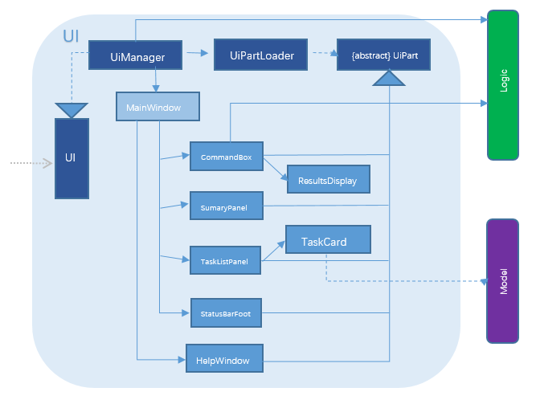
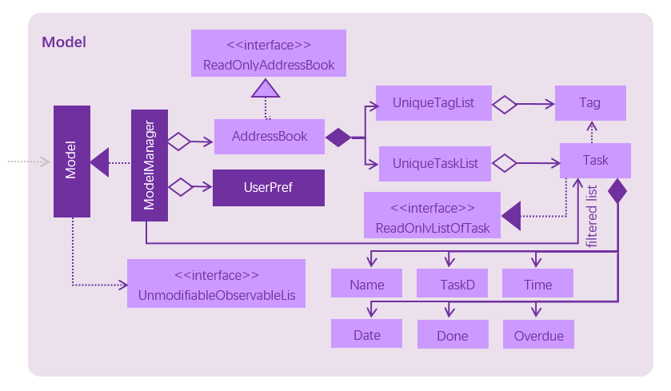

#
# Developer Guide

**Table of contents**

* [Introduction](#introduction)
* [Setting Up](#setting-up)
* [Design](#design)
* [Testing](#testing)
* [Dev Ops](#dev-ops)
* [Appendix A: User Stories](#appendix-a--user-stories)
* [Appendix B: Use Cases](#appendix-b--use-cases)
* [Appendix C: Non Functional Requirements](#appendix-c--non-functional-requirements)
* [Appendix D: Glossary](#appendix-d--glossary)
* [Appendix E : Product Survey](#appendix-e--product-survey)

## **Introduction**

###**Overview**

_Unburden_ is an application which will help you to manage your tasks better. Unburden provides a simple command line interface which does not require any form of clicking. _Unburden_ is written in Java.

###**Purpose**

This developer guide focuses primarily on the APIs used, the different components that work together and the main 4 components of _Unburden_. This developer guide will clearly explain the design of the software and also to showcase the core functionalities of the software. As such, the main purpose of this developer guide is to provide a general introduction and summary of the classes and components that are used within this application to help prospective developers who wish to develop _Unburden_ further.

###**Audience**

The main audience of this developer&#39;s guide is directed towards the students who may be interested to further develop this application or even prospective team members. This developer guide may also interest developers who are interested to join the team.

###**Level of Difficulty**

The entire application uses a huge range of APIs and requires a deep understanding of:

-  Java programming language

Since the entire piece of code is written in Java, prospective developers have to be adept with the Java programming language. In addition, APIs are used extensively throughout the entire code.

- Eclipse IDE

The main code is very long and hence it requires an integrated development environment to help in the process of editing and testing.

- JavaFX

Being familiar with JavaFX will enable prospective developers to edit the user interface smoothly.

In essence, having all of the skills above will definitely help to enhance the understanding of the code and hence allow future developers to add on to the existing code easily and efficiently.

## **Setting up**

###**Prerequisites**

1. JDK 8.0\_60 or later
2. Having any Java 8 version is not enough.
3. This app will not work with earlier versions of Java 8.
4. Eclipse IDE
5. e(fx)clipse plugin for Eclipse (Do the steps 2 onwards given in [this page](http://www.eclipse.org/efxclipse/install.html#for-the-ambitious))
6. Buildship Gradle Integration plugin from the Eclipse Marketplace

###**Importing the project into Eclipse**

1. Fork this repo, and clone the fork to your computer
2. Open Eclipse (Note: Ensure you have installed the e(fx)clipse and buildship plugins as given in the prerequisites above)
3. Click File &gt; Import
4. Click Gradle &gt; Gradle Project &gt; Next &gt; Next
5. Click Browse, then locate the project&#39;s directory
6. Click Finish

## **Design**

> 

The architectural design shows how the various components work in tandem with each other. Main only has one class MainApp and it is responsible for:

 1. Starting up _Unburden_: Initializes all components in order and ensures that the app starts to run
 2. Exiting _Unburden_: Shuts down all components in order and clears the memory

The rest of the app consists of 4 main components other than main. They are :

 1. Logic : Decides what to output with the inputs and executes commands
 2. Model : Holds the data during runtime
 3. UI: Controls the UI of the app
 4. Storage: Reads and writes data to the hard disk

Each component has a interface which all its classes implements and is named after the component itself.

###**UI component**

> 

The UI component focuses on interacting with the user by displaying the necessary information to the user when requested. It is also responsible for the outlook of the application. The UI component consists of the abstract UiPart class which is the base class for the UI parts and each &quot;UI part&quot; is represented by a distinct part of the UI such as the panels or status bars.

In essence, the UI makes use of JavaFx UI framework and majority of the classes import javafx methods. The various layouts of each &quot;UI part&quot; are stores as .fxml files in the src/main/resources/viewfolder. These files are named according to the respective class names. For example, the layout of the HelpWindow.java is stored in src/main/resources/view/HelpWindow.fxml

####**API**

The UI component consists mainly of:

 1. UI class
 2. UIManager class
 3. UIPart class
 4. UILoader class
 5. BrowserPanel class
 6. CommandBox class
 7. MainWindow class
 8. ResultDisplay class
 9. HelpWindow class
 10. TaskCard class
 11. TaskListPanel class

These classes work together to form the interface which the user interacts with when using the app. Each of the class are meant to function solely on one part of the UI. For instance, the ResultDisplay class is responsible for displaying the results of a command from the user.

The UI also consists of a MainWindow class which is made up of these &quot;UI parts&quot; such as CommandBox, ResultDisplay, TaskListPanel, StatusBarFooter, BrowserPanel.

All of these classes, including the MainWindow class inherit from the abstract UiPart class.

The UI component,

- Executes user commands using the Logic component.
- Auto-updates when data in the Model change.
- Responds to events raised from various parts of the App
- Updates the UI accordingly.

###**Logic component**

> 

The Logic component consists of the Parser class which is responsible to taking in the inputs from the UI component, deciphering it, and then creating a Command class that can handle the user&#39;s input correctly. LogicManager will then execute the command.

####**API**

The API of the Logic component consists mainly of:

 1. Logic class
 2. LogicManager class
 3. Parser class
 4. All the command classes eg. AddCommand, EditCommand, DeleteCommand

These classes work together to categorize the different possible inputs from the user and sieves the important keywords out so that Model can continue executing the command entered by the user.

TheLogiccomponent,

- Logic takes in the user&#39;s input and passes it to the Parser class
- Parser class will decide which Command class is able to handle the request
- LogicManager class takes the command and executes it by calling Model
- TaskResult class is created and returned to the UI to be displayed to the user

###**Model component**

> 

The Model component is mainly responsible for executing the outputs from the Logic component. It is also responsible for storing all the in-app data such as the user&#39;s preferences anddata which is needed when executing commands.

####**API**

The API of the Model component is in the Model class which consists of the main features of the task manager such as &#39;add&#39;, &#39;delete&#39; and updates the task manager accordingly. The ModelManager class, which represents the in-memory model of the task manager data, inherit from the Model interface.

ModelManager is able to:

 1)Store the user preference
 2)Store _Unburden&#39;s_ data

###**Storage component**

> 

The Storage component primarily focuses on storing data. Any data related to the application will be saved within Storage and can be accessed later when requested. Storage works closely with Modelto read and write data from the app as and when the user requests to add or show existing data.

####**API**

The API of the Model component consists mainly of:

 1. Model class
 2. ModelManager class
 3. ListOfTask class
 4. UserPref class
 5. ReadOnlyListOfTask class

These classes are responsible for storing the data from the user and also works with the Model component to execute the commands given by the user.

Storage is able to:

 1)Save the data entered in by the user and also read it back to Model when requested
 2)Save user preferences and read it back when needed

## **Testing**

Tests can be found in the./src/test/javafolder.

In Eclipse:

- To run all tests, right-click on the src/test/java folder and choose Run as &gt; JUnit Test
- To run a subset of tests, you can right-click on a test package, test class, or a test and choose to run as a JUnit test.

Using Gradle:

- See [md](https://github.com/nus-cs2103-AY1617S1/addressbook-level4/blob/master/docs/UsingGradle.md) for how to run tests using Gradle.

We have two types of tests:

1. GUI Tests - These are _System Tests_ that test the entire App by simulating user actions on the GUI. These are in the guitests package.
2. Non-GUI Tests - These are tests not involving the GUI. They include,
  1. _Unit tests_ targeting the lowest level methods/classes.
  2. g. address.commons.UrlUtilTest
  3. _Integration tests_ that are checking the integration of multiple code units (those code units are assumed to be working).
  4. g. address.storage.StorageManagerTest
  5. Hybrids of unit and integration tests. These test are checking multiple code units as well as how the are connected together.
  6. g. address.logic.LogicManagerTest

Headless GUI Testing : Thanks to the [TestFX](https://github.com/TestFX/TestFX) library we use, our GUI tests can be run in the _headless_ mode. In the headless mode, GUI tests do not show up on the screen. That means the developer can do other things on the Computer while the tests are running.

See [UsingGradle.md](https://github.com/nus-cs2103-AY1617S1/addressbook-level4/blob/master/docs/UsingGradle.md#running-tests) to learn how to run tests in headless mode.

###**Troubleshooting tests**

Problem: Tests fail because NullPointException when AssertionError is expected

- Reason: Assertions are not enabled for JUnit tests. This can happen if you are not using a recent Eclipse version (i.e. _Neon_r later)
- Solution: Enable assertions in JUnit tests as described.
- Delete run configurations created when you ran tests earlier.

## **Dev Ops**

While this app has been extensively developed, we feel that there is still room for improvement and can therefore be improved further. As such, the main reason for this section of the developer guide is to suggest possible improvements to _Unburden._

For future and prospective developers or students who are interested to join our team, do note that the following list is not exhaustive.

Some possible additions to be made:

- Allow this app to be run on a mobile device such as a mobile phone or tablet
- Create a login system which will protect each user&#39;s data and allow them to access their data from any device
- Add animations so as to appeal to a larger audience
- Implement a synchronous system based on a clock that will remind the user (possibly even when the application is not running) when he/she has a deadline approaching

## **Appendix A : User Stories**

Priorities: High (must have) - `* * *`, Medium (nice to have)  - `* *`,  Low (unlikely to have) - `*`

| **Priority** | **As a...** | **I want to...** | **So that I can...** | 
| --- | --- | --- | --- | --- |
| `* * *` | new user | list all the commands | know how to use the program |
|`* * *` | new user | view a command | know how to use that particular command |
|`* * *` | user | add a task | keep track of all my tasks/to-dos |
|`* * *` | user | add a task with a time and date | keep track of deadlines |
|`* * *` | user | add a floating task | remind myself on less important tasks |
|`* * *` | user | add a recurring task | be constantly reminded/won't accidentally delete this task |
|`* * *` | user | add a task with tags | properly categorize my tasks |
|`* * *` | user | delete a task | remove a completed task from the list |
|`* * *` | user | delete all tasks | declutter my task manager |
|`* * *` | user | delete all tasks with a certain tag | declutter my task manager |
|`* * *` | user | find a task by name/description | see what needs to be done |
|`* * *` | user | find a task by tags | find a task that may be related to another task |
|`* * *` | user | list all tasks | know what are the tasks I have entered |
|`* * *` | user | list all tasks due by today | know what are the tasks I need to complete by today |
|`* * *` | user | list all tasks with a deadline | know what are the tasks I can plan my schedule |
|`* * *` | user | list all tags | know what tags I can search for |
|`* * *` | user | edit any information of the task | make changes to the tasks that I have created |
|`* *` | user | undo previous command | remove any task that is entered wrongly |
|`* *` | user | keep my information safe | protect information that is private to me |
|`* *` | user | be reminded of my deadlines | meet my deadlines |
|`* *` | user | prioritize my tasks | know which tasks are more important |
|`* *` | user | keep my deleted tasks temporarily | restore them should I need to |
|`* *` | user | auto correct my typos when typing a command | not retype/edit the command every time I make a typo |
|`* *` | user | asked every time I add a task | ensure that all fields have been entered correctly |
|`* *` | user | asked every time I delete a task | not accidentally lose information |
|`* *` | user | asked every time I edit a task | not accidentally change the wrong information |
|`*` | user | find history of tasks of certain past periods of time | recall what I've done |
|`*` | user | predict and auto correct my typos | be lazy and not retype everything again |

## **Appendix B : Use Cases**

### Use case: Add task

##### MSS

1. User requests to add a task 
2. Unburden saves the task to the list of tasks and displays the existing list of tasks

   Use case ends
  
##### Extensions

1.1  User requests to add a task with a wrong format  
1.2  Unburden will give display a error message  
  
     Use case ends

### Use case: Delete task

##### MSS

1. User requests to delete a specific task by index
2. Unburden will delete the task and show the existing list of tasks

   Use case ends
    
##### Extensions
  
1.1  User requests to delete a specific task by giving an invalid index  
1.2  Unburden will show an error message  
  
     Use case ends

### Use case: Find task

##### MSS

1. User requests to find tasks based on a date
2. Unburden will search through the existing tasks with the specified deadline and shows a list to the user

   Use case ends
  
##### Extension
  
1.1  User requests to find tasks based on a name  
1.2  Unburden will search through the exisiting tasks with the specified task names and shows a list to the user  
  
     Use case ends
  
2.1  User requests to find tasks that are due today  
2.2  Unburden will search through the exisiting tasks and shows a list of tasks due today to the user  
  
     Use case ends
  
3.1  User requests to find tasks that are due tomorrow  
3.2  Unburden will search through the exisiting tasks and shows a list of tasks due tomorrow to the user  
  
     Use case ends

### Use case: Edit task

##### MSS

1. User requests to edit a task based on the index of the tasks and the new updated fields
2. Unburden updates the task to the given input fields and displays it to the user

   Use case: ends
  
##### Extension
  
1.1  User requests to edit a task based on an invalid index of tasks and the new updated fields  
1.2  Unburden shows an error message  
  
     Use case ends
  

## **Appendix C : Non Functional Requirements**

 1. The app should run smoothly 
 2. The app should be able to run all on all operating systems 
 3. The app should be able to store up to 1000 tasks per user 
 4. The app should not take up a lot of space 
 5. The app should be start up quickly 
 6. The app should be able to process requests from the user in under 1ms 
 7. The app should not crash 
 8. The app should not do anything else other than what the user inputs 
 9. The app should be able to recover from errors easily 

## **Appendix D : Glossary**

 1. UI - User Interface 
 2. API - Application Programming Interface 
 3. App - Application 
 4. IDE - Integrated Development environment 

## **Appendix E : Product Survey**

Based on research done, below is a table of some of the applicable features and which applications offer them. In effect, our group intends to sieve out the good features while omitting the less popular ones from these applications and implement them into _Unburden_.

|   | **Todoist** | **Wunderlist** | **Any.do** | **Remember the milk** | **Clear** |
| --- | --- | --- | --- | --- | --- |
| **Easy to setup and manage** | _Yes_ | _Yes, easy to understand_ | _Yes but not as well as the Wunderlist_ | _Yes_ | _Yes, but can be more intuitive_ |
| **Able to collaborate with other people** | _Yes, able to share with other people_ | _Yes, able to share with other people_ | _Yes, able to share with other people_ | _Yes, able to share with other people_ | _Yes, able to share with other people_  |
| **Focuses on tasks with specific deadline** | _No_ | _No_ | _Yes_ | _No_ | _No_ |
| **Using color tags to differentiate different tasks or lists** | _No_ | _No_ | _No_ | _No_ | _Yes, able to colour code tasks and lists so that it is easier to differentiate_ |
| **Able to set certain tasks as &quot;recurring&quot;** | _No_ | _No_ | _Yes, &quot;recurring&quot; tasks will continue to remind the user_ | _No_ | _No_ |
| **Able to navigate around using only command line** | _No_ | _No_ | _No_ | _No_ | _No_ |
