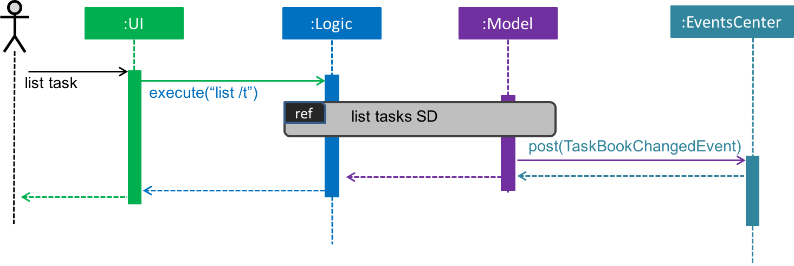
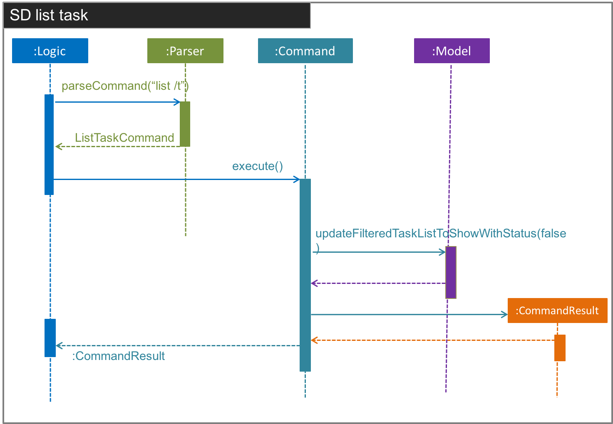
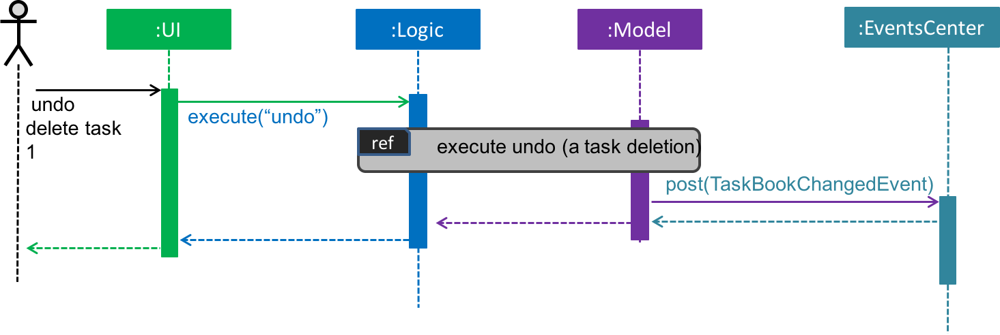
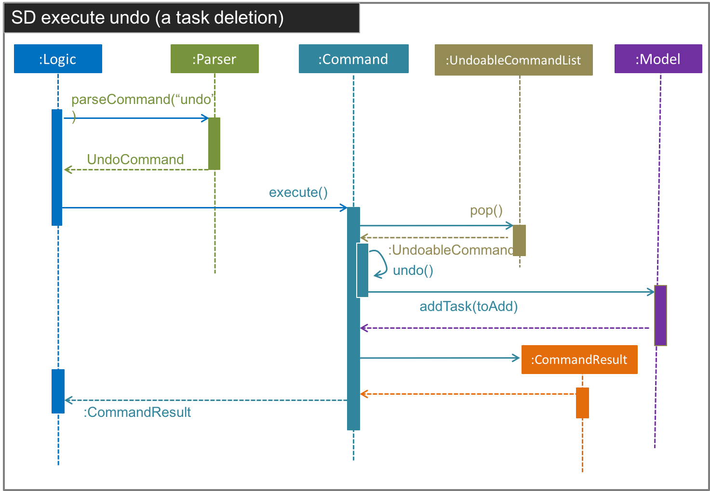

# Developer Guide 

* [Setting Up](#setting-up)
* [Design](#design)
* [Implementation](#implementation)
* [Testing](#testing)
* [Continuous Integration](#continuous-integration)
* [Making a Release](#making-a-release)
* [Managing Dependencies](#managing-dependencies)
* [Appendix A: User Stories](#appendix-a--user-stories)
* [Appendix B: Use Cases](#appendix-b--use-cases)
* [Appendix C: Non Functional Requirements](#appendix-c--non-functional-requirements)
* [Appendix D: Glossary](#appendix-d--glossary)
* [Appendix E : Product Survey](#appendix-e--product-survey)
* [Appendix F: Pull Request](#appendix-f--pull-request)

## Setting up

#### Prerequisites

1. **JDK `1.8.0_60`**  or later 

    > Having any Java 8 version is not enough.  
    This app will not work with earlier versions of Java 8.
    
2. **Eclipse** IDE
3. **e(fx)clipse** plugin for Eclipse (Do the steps 2 onwards given in
   [this page](http://www.eclipse.org/efxclipse/install.html#for-the-ambitious))
4. **Buildship Gradle Integration** plugin from the Eclipse Marketplace

#### Importing the project into Eclipse

0. Fork this repo, and clone the fork to your computer
1. Open Eclipse (Note: Ensure you have installed the **e(fx)clipse** and **buildship** plugins as given 
   in the prerequisites above)
2. Click `File` > `Import`
3. Click `Gradle` > `Gradle Project` > `Next` > `Next`
4. Click `Browse`, then locate the project's directory
5. Click `Finish`

  > * If you are asked whether to 'keep' or 'overwrite' config files, choose to 'keep'.
  > * Depending on your connection speed and server load, it can even take up to 30 minutes for the set up to finish
      (This is because Gradle downloads library files from servers during the project set up process)

## Design

 
The **_Architecture Diagram_** given above explains the high-level design of the App.
Given below is a quick overview of each component.

`Main` has only one class called [`MainApp`](../src/main/java/seedu/address/MainApp.java). It is responsible for,
* At app launch: Initializes the components in the correct sequence, and connect them up with each other.
* At shut down: Shuts down the components and invoke clean up method where necessary.

[**`Commons`**](#common-classes) represents a collection of classes used by multiple other components.
Two of those classes play an important role at the architecture level.
* `EventsCentre` : This class (written using [Google's Event Bus library](https://github.com/google/guava/wiki/EventBusExplained))
  is used to by componnents to communicate with other components using events (i.e. a form of _Event Driven_ design)
* `LogsCenter` : Used by many classes to write log messages to the App's log files.

The rest of the App consists four components.
* [**`UI`**](#ui-component) : The UI of tha App.
* [**`Logic`**](#logic-component) : The command executor.
* [**`Model`**](#model-component) : Holds the data of the App in-memory.
* [**`Storage`**](#storage-component) : Reads data from, and writes data to, the hard disk.

Each of the four components
* Defines its _API_ an interface with the same name as the Component. `Logic.java`
* Exposes its functionality using a `{Component Name}Manager` class e.g. `LogicManager.java`

The _Sequence Diagram_ below shows how the components interact for the scenario where the user issues the
command `delete 1`.

>Note how the `Model` simply raises a `ModelChangedEvent` when the model is changed,
 instead of asking the `Storage` to save the updates to the hard disk.

The diagram below shows how the `EventsCenter` reacts to that event, which eventually results in the updates
being saved to the hard disk and the status bar of the UI being updated to reflect the 'Last Updated' time.  

> Note how the event is propagated through the `EventsCenter` to the `Storage` and `UI` without `Model` having
  to be coupled to either of them. This is an example of how this Event Driven approach helps us reduce direct 
  coupling between components.

The sections below give more details of each component.

### UI component

 

**API** : [`Ui.java`](../src/main/java/seedu/address/ui/Ui.java)

The UI consists of a `MainWindow` that is made up of parts e.g.`CommandBox`, `ResultDisplay`, `PersonListPanel`,
`StatusBarFooter`, `BrowserPanel` etc. All these, including the `MainWindow` inherits from the abstract `UiPart` class
and they can be loaded using the `UiPartLoader`.

The `UI` component uses JavaFx UI framework. The layout of these UI parts are defined in matching `.fxml` files
 that are in the `src/main/resources/view` folder. 
 For example, the layout of the [`MainWindow`](../src/main/java/seedu/address/ui/MainWindow.java) is specified in
 [`MainWindow.fxml`](../src/main/resources/view/MainWindow.fxml)

The `UI` component,
* Executes user commands using the `Logic` component.
* Binds itself to some data in the `Model` so that the UI can auto-update when data in the `Model` change.
* Responds to events raises from various parts of the App and updates the UI accordingly.

### Logic component

 

**API** : [`Logic.java`](../src/main/java/seedu/address/logic/Logic.java)

1. `Logic` uses the `Parser` class to parse the user command.
2. This results in a `Command` object which is executed by the `LogicManager`.
3. The command execution can affect the `Model` (e.g. adding a person) and/or raise events.
4. The result of the command execution is encapsulated as a `CommandResult` object which is passed back to the `Ui`

### Model component

 

**API** : [`Model.java`](../src/main/java/seedu/address/model/Model.java)

The `Model`,
* Stores a `UserPref` object that represents the user's preferences
* Stores the Address Book data
* Exposes a `UnmodifiableObservableList<ReadOnlyPerson` that can be 'observed' e.g. the UI can be bound to this list
  so that the UI automatically updates when the data in the list change.
* Does not depend on any of the other three components.

### Storage component

 

**API** : [`Storage.java`](../src/main/java/seedu/address/storage/Storage.java)

The `Storage` component,
* can save `UserPref` objects in json format and read it back.
* can save the Address Book data in xml format and read it back.

### Common classes

Classes used by multiple components are in the `seedu.addressbook.commans` package. 

## Implementation

### Logging

We are using `java.util.logging.Logger` as our logger, and `LogsCenter` is used to manage the logging levels 
of loggers and handlers (for output of log messages)

- The logging level can be controlled using the `logLevel` setting in the configuration file 
  (See [Configuration](#configuration))
- The `Logger` for a class can be obtained using `LogsCenter.getLogger(Class)` which will log messages according to 
  the specified logging level

- Currently log messages are output through: `Console` and `.log`

**Logging Levels**

- SEVERE
  - Critical use case affected, which may possibly cause the termination of the application

- WARNING
  - Can continue, but with caution

- INFO
  - Information important for the application's purpose
    - e.g. update to local model/request sent to cloud
  - Information that the layman user can understand

- FINE
  - Used for superficial debugging purposes to pinpoint components that the fault/bug is likely to arise from
  - Should include more detailed information as compared to `INFO` i.e. log useful information!
    - e.g. print the actual list instead of just its size

### Configuration

Certain properties of the application can be controlled (e.g App name, logging level) through the configuration file 
(default: `config.json`):

## Testing

**In Eclipse**: 
> If you are not using a recent Eclipse version (i.e. _Neon_ or later), enable assertions in JUnit tests
  as described [here](http://stackoverflow.com/questions/2522897/eclipse-junit-ea-vm-option).

* To run all tests, right-click on the `src/test/java` folder and choose 
  `Run as` > `JUnit Test`
* To run a subset of tests, you can right-click on a test package, test class, or a test and choose 
  to run as a JUnit test.
  
**Using Gradle**:
* See [UsingGradle.md](UsingGradle.md) for how to run tests using Gradle. 

Tests can be found in the `./src/test/java` folder.

1. **GUI Tests** - These are _System Tests_ that test the entire App by simulating user actions on the GUI. 
   These are in the `guitests` package.
  
2. **Non-GUI Tests** - These are tests not involving the GUI. They include,
   1. _Unit tests_ targeting the lowest level methods/classes.  
      e.g. `seedu.address.commons.UrlUtilTest`
   2. _Integration tests_ that are checking the integration of multiple code units 
     (those code units are assumed to be working). 
      e.g. `seedu.address.storage.StorageManagerTest`
   3. Hybrids of unit and integration tests. These test are checking multiple code units as well as 
      how the are connected together. 
      e.g. `seedu.address.logic.LogicManagerTest`
  
**Headless GUI Testing** :
Thanks to the ([TestFX](https://github.com/TestFX/TestFX)) library we use,
 our GUI tests can be run in the _headless_ mode. 
 In the headless mode, GUI tests do not show up on the screen.
 That means the developer can do other things on the Computer while the tests are running. 
 See [UsingGradle.md](UsingGradle.md#running-tests) to learn how to run tests in headless mode.
  
## Continuous Integration

We use [Travis CI](https://travis-ci.org/) to perform _Continuous Integration_ on our projects.
See [UsingTravis.md](UsingTravis.md) for more details.

## Making a Release

Here are the steps to create a new release.
 
 1. Generate a JAR file [using Gradle](UsingGradle.md#creating-the-jar-file).
 2. Tag the repo with the version number. e.g. `v0.1`
 2. [Crete a new release using GitHub](https://help.github.com/articles/creating-releases/) 
    and upload the JAR file your created.
   
## Managing Dependencies

A project often depends on third party libraries. For example, Address Book depends on the 
[Jackson library](http://wiki.fasterxml.com/JacksonHome) for XML parsing. Managing these _dependencies_
can be automated using Gradle. For example, Gradle can download the dependencies automatically, which
is better than these alternatives. 
a. Include those libraries in the repo (this bloats the repo size) 
b. Require developers to download those libraries manually (this creates extra work for developers) 

## Appendix A : User Stories
:bomb: Priorities:
- High (Must Have): `* * *`
- Medium (Likely to Have) : `* *`
- Low (Unllikely to Have): `*`

Priority | As a ... | I want to ... | So that I can...
---------|----------|---------------|-----------------
`* * *` | user | be able to add a task into the program | enter it into the database
`* * *` | user | be able to list all the tasks in the database | keep track of all my tasks that I have to do 
`* * *` | user | be able to list the tasks undone or done | keep track of tasks which are done which are not
`* * *` | user | be able to edit the description of an existing task in the program | keep my tasks updated
`* * *` | user | be able to edit the priority of an existing task in the program | keep my priorities updated
`* * *` | user | be able to edit the deadline of an existing task in the program | keep the deadlines for my tasks updated
`* * *` | user | be able to edit the occurrence and duration of an event in the program | keep my events updated
`* * *` | user | be able to mark the completion of an existing task in the program | keep update list of uncompleted tasks 
`* * *` | user | be able to delete an existing task or event in the program | keep my tasks and events updated
`* * *` | user | be able to specify my storage location to save my files | keep my files saved in different responsories
`* * *` | user | be able to seek help with the operations and commands of the program | keep the program user friendly
`* * *` | user | be able to exit the program | keep a proper shutdown of the program
`* * *` | user | be able to simple search for tasks using keywords that are in the description | retrieve tasks easily
`* * *` | user | be able undo the most recent modification | revert from unintended modifications. 
`* * *` | user | be able to use flexible commands when adding tasks | have greater flexibility in adding tasks.
`* *` | user | be able to edit the category of an existing task or event in the program | correct any changes in categorization
`* *` | user | be able to search any words related to a task | retrieve tasks more easily

## Appendix B : Use Cases

(For all use cases below, the **System** is the `TaskBook` and the **Actor** is the `user`, unless specified otherwise)

#### Use case 1: Add task

**MSS**

1. User requests to add task of specified parameters
2. TaskBook adds task to system
Use case ends.

**Extensions**

1a. The add task request has invalid format
  > 1a1. Taskbook displays an error message
  Use case resumes at step 1

 

#### Use case 2: Add event

**MSS**

1. User requests to add event of specified parameters
2. TaskBook adds event to system
Use case ends.

**Extensions**
1a. The add event request has invalid format
  > 1a1. Taskbook displays an error message
    Use case resumes at step 1

 
#### Use case 3: List tasks/events

**MSS**

1. User requests to list tasks/events
2. TaskBook shows a list of tasks/events
Use case ends.

The Use case can be elaborated by the SD as below in addition the SD mentioned in the [Design](#design):  

 
 

The SD for list events is similiar to task. 

 

#### Use case 4: Edit task details

**MSS**
1. User requests to list tasks
2. TaskBook displays a list of tasks
3. User requests to edit task in the list with new specified parameters with the index of task in the list
4. TaskBook edits existing task in database according to new specified parameters
  Use case ends.

**Extensions**
3a. The given index is invalid
  > 3a1. Taskbook displays an error message that task cannot be found
  Use case resumes at step 2

 

#### Use case 5: Edit event details

**MSS**
1. User requests to list events
2. TaskBook displays a list of events
3. User requests to edit event in the list with new specified parameters with the index of event in the list
4. TaskBook edits existing event in database according to new specified parameters
  Use case ends.

**Extensions**
3a. The given index is invalid
  > 3a1. Taskbook displays an error message that the event cannot be found
  Use case resumes at step 2

 

#### Use case 6: Mark task as completed

**MSS**
1. User requests to list tasks
2. TaskBook displays a list of tasks
3. User requests to mark a task as completed with the index of task in the list
4. TaskBook marks the existing task as completed and archives the completed task
5. TaskBook displays the updated list of tasks

  Use case ends.

**Extensions**
3a. The given index is invalid
  > 3a1. Taskbook displays an error message that the task cannot be found
  Use case resumes at step 2

 

#### Use case 7: Delete task or event

**MSS**
1. User requests to list tasks or events
2. TaskBook displays a list of tasks or events
3. User requests to delete an existing task or event with the index in the list
4. TaskBook deletes the task or event
5. Taskbook displays the updated list of tasks or events

  Use case ends.

**Extensions**
3a. The given index is invalid
  > 3a1. Taskbook displays an error message that the task cannot be found
  Use case resumes at step 2

 

#### Use case 8: Specify storage location

**MSS**
1. User request to save file at a specific directory 
2. Taskbook saves the file at the specified directory

  Use case ends.

**Extensions**
1a. The selected directory is invalid
  > 1a1. Taskbook displays an error message that directory cannot be found
  Use case resumes at step 1

 

#### Use case 9: Help Command 

**MSS**
1. User requests for Help 
2. TaskBook displays the Help list 

  Use case ends.

**Extensions**
1a. The KEYWORD for Help Command is invalid
  > 1a1. Taskbook displays an error message that KEYWORD cannot be found
  Use case resumes at step 1

 

#### Use case 10: Simple find for tasks  

**MSS**
1. User request to find for tasks containing a set of keywords in description
2. TaskBook displays zero or more tasks matching the find criteria

  Use case ends.

**Extensions**
1a. No keywords entered after command word
  > 1a1. Taskbook displays help message on the find command
  Use case resumes at step 1  

 
 

 

#### Use case 11: Undo modification

**MSS**
1. User requests to undo the last modification. 
2. TaskBook shows the last command which modified the TaskBook database
3. TaskBook undoes the the last modification

  Use case ends.

**Extensions**
Extensions
1a. There is no command which modified the TaskBook during this session
  > 1a1. Taskbook displays displays a message indicating no commands can be undone
  Use case ends

Besides the abstract SD as shown in the section [Design](#design). A more detailed Sequence Diagram of undo a deletion of task is shown below:

 
 

## Appendix C : Non Functional Requirements
- Storage
  - Should not use relational databases. Data storage must be done using text files you create yourself. 
  - Should be stored locally and should be in a human editable text file. The intention of this constraint is to allow advanced users to manipulate the data by editing the data file.

- GUI
  - Text should be font size 12.
  - Text should be Times New Romans.

- Should work on the Windows 7 or later.
- Should work on any mainstream OS as long as it has Java 8 or higher installed.
- Should be able to hold up to 1000 tasks.
- Should come with automated unit tests and open source code.
- Should favor DOS style commands over Unix-style commands.
- Should work only with Command Line Interface as the main input with minimal use of mouse/clicking. GUI only serves as the source of output of results. 
- Should be a result of morphing the given sample code. i.e. enhance and/or evolve the given code to arrive at the new software. 
- Should work on a desktop without network/Internet connection. It should not be a mobile app or a cloud-based application. 
- Should work stand-alone. It should not be a plug-in to another software. 
- Should follow the Object-oriented paradigm. 
- Should work without requiring an installer. Having an optional installer is OK as longs as the portable (non-installed) version has all the critical functionality. 
- Should only work with Third Party User/Libraries if they,
are 
  - free.
  - do not require any installation by the user of your software.
  - do not violate other constraints. 

{More to be added}

## Appendix D : Glossary

##### Mainstream OS

> Windows, Linux, Unix, OS-X

##### DOS
> Disk Operating System on Microsoft. 

##### GUI
> Graphical User Interface

##### Floating tasks

> A task that does not have a deadline

## Appendix E : Product Survey

####iCalendar 
------
**Summary** 
>Built-in calendar application from Apple.

**Strength**
> 1. Add events by typing in event names, time, duration, location.
> 2. Browse events in various time scope: such as a week, a day… 
> 3. Various color schemes to differentiate calendars 
> 4. Vast number of external integrations, such as facebook events. 
> 5. Auto reminder synced to various devices 

**Weakness**
> 1. Duration edition of an event is troublesome, must state start time and end time. 
> 2. Each task in the calendar must have a specific time (at least which days) 

**Feedback**
> We can adopt its Strengths 1, 2, 3 in a similar way. 

------
####Todoist
**Summary** 
> A cross platform task-keeping and reminding application. 

**Strength**
> 1. Launch product using shortcuts 
> 2. Add events by mainly typing 
> 3. Support priority, tags(using @) , time (auto-recognition of time format), repetition (use of keyword every)
> 4. Browse events with different tags and priority
> 5. Various color schemes 
> 6. Reminder for today as well as next few days tasks. 
> 7. Support postpone to customized date
> 8. Support undoing an operation
> 9. Support subtasking  
> 10. Support sort based on priority, name, deadline

**Weakness**
> 1. No freemium reminder features

**Feedback**
> Highly recommended for all memebrs to use it. 

------
####Todo.txt
**Summary:**
> Todo.txt prides itself in its simplicity and ease of use for users. Currently, Todo.txt is available on mobile platforms as well as for desktop use. The lists are automatically synchronised across platforms whenever the list is updated.

**Strength:**
> 1. Available for use across platforms: mobile phones and desktop
> 2. Automatic synchronisation of Todo.txt across multiple platforms via connection with Dropbox
> 3. Simple text based UI with numerous functionalities
> 4. Allows for association with Projects (Tag the task with ‘+’)
> 5. Allows for adding of context; where and with what, (Tag the task with ‘@’)
> 6. Archives completed tasks to Done.txt for future reference
> 7. Suitable for programmers with intuitive UNIX commands such as ‘ls’
> 8. Able to list all tasks, tasks affiliated to a certain project, keyword in a task or a combination of the above
> 9. Able to prioritise tasks and associate a different colour to the different priorities

**Weakness:**
> 1. Unable to constantly view a list of all tasks 
> 2. Not aesthetically pleasing for use on the computer, especially to users who are not familiar with programming
> 3. Priorities are tagged to alphabetical characters and not priority levels (Ie. High, Medium, Low) 
> 4. Unable to set deadlines for task to be completed

***
####Fantastical2
**Summary:**
> Fantastical 2 is developed by Flexibits with the aim to create Apps that remove frustration and to make the lives of users better. Fantastical 2 is a powerful, yet simple to use, app encompassing multiple features for the Apple iPhone and Mac platforms. It combines and synchronises Apple Reminders, To-Do-List and Calendar across multiple devices..

**Strength:**
> 1. Can be synchronised across multiple device platforms
> 2. Voice recognition software for verbal input of tasks
> 3. Able to set deadlines for task
> 4. Clear colour coding for different categories of tasks and events as set by user
> 5. Able to set reminder for tasks and events
> 6. Good integration between tasks, events and calendar
> 7. Display of tasks, events and calendar is available in the UI

**Weakness:**
> 1. Cannot easily key in the duration of an event, user will have to state start and end time
> 2. Requires user to use Apple products for mobile phones and laptop as the app is limited to the Apple community

## Appendix F : Pull Request

None of the parts below are compulsory for a PR, but a good template to follow in general. Developers are free to add in or remove sections as stated below. 

### Context
Here you should write the context/background of the code changes, a good format to follow is.

* What's the problem/feature
* How what you are doing solves/adds that problem/feature
* Anything you feel will help to understand your changes

### Links
Here you should add links that are related to this Pull Request. For example:

* Issue Links
* Commit Links
* Documentation Links

### Media
Normally, if you are working on a feature that has a UI component, you
should add a gif or a video of the behaviour. If the behaviour is not
that complex and you feel like an image will do the trick, then it's
fine. For gifs/videos we use [recordit.co](http://recordit.co)/

If it's a feature without UI, you can ignore this part.

### Reviewers
Here you tag all the persons you feel should review the ticket (your project teammates for example)

