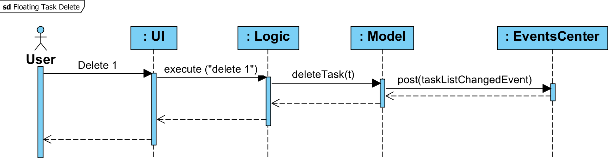
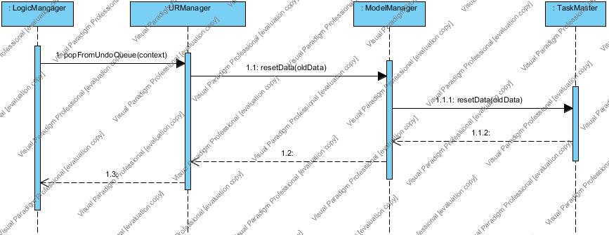
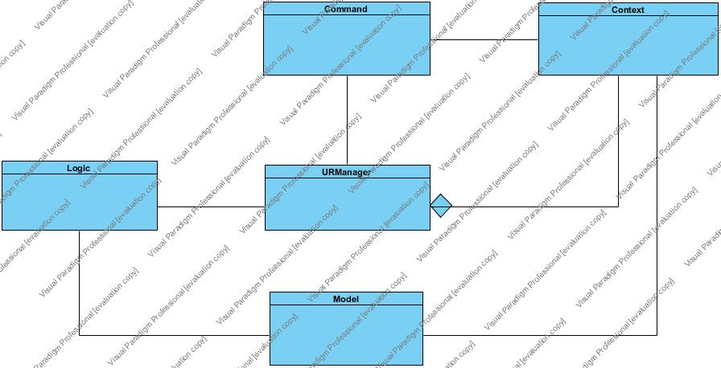
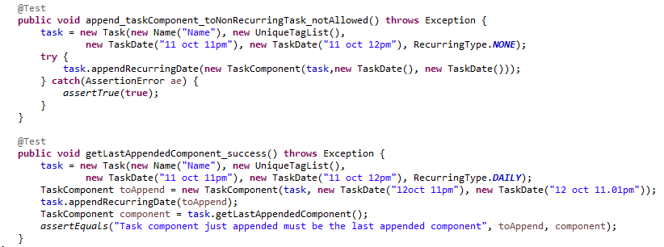
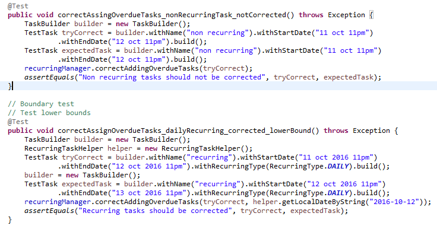
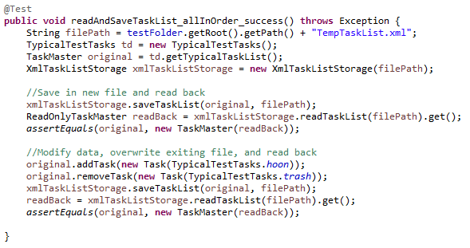
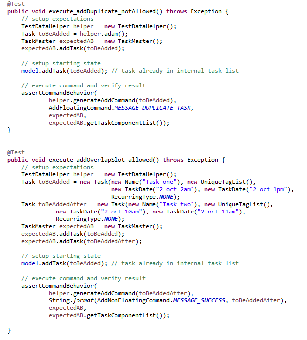

# Developer Guide 

* [Setting Up](#setting-up)
* [Design](#design)
* [Implementation](#implementation)
* [Testing](#testing)
* [Dev Ops](#dev-ops)
* [Appendix A: User Stories](#appendix-a--user-stories)
* [Appendix B: Use Cases](#appendix-b--use-cases)
* [Appendix C: Non Functional Requirements](#appendix-c--non-functional-requirements)
* [Appendix D: Glossary](#appendix-d--glossary)
* [Appendix E : Product Survey](#appendix-e-product-survey)

## Setting up

#### Prerequisites

1. **JDK `1.8.0_60`**  or later 

    > Having any Java 8 version is not enough.  
    This app will not work with earlier versions of Java 8.
    
2. **Eclipse** IDE
3. **e(fx)clipse** plugin for Eclipse (Do the steps 2 onwards given in
   [this page](http://www.eclipse.org/efxclipse/install.html#for-the-ambitious))
4. **Buildship Gradle Integration** plugin from the Eclipse Marketplace

#### Importing the project into Eclipse

0. Fork this repo, and clone the fork to your computer
1. Open Eclipse (Note: Ensure you have installed the **e(fx)clipse** and **buildship** plugins as given 
   in the prerequisites above)
2. Click `File` > `Import`
3. Click `Gradle` > `Gradle Project` > `Next` > `Next`
4. Click `Browse`, then locate the project's directory
5. Click `Finish`

  > * If you are asked whether to 'keep' or 'overwrite' config files, choose to 'keep'.
  > * Depending on your connection speed and server load, it can even take up to 30 minutes for the set up to finish
      (This is because Gradle downloads library files from servers during the project set up process)
  > * If Eclipse auto-changed any settings files during the import process, you can discard those changes.

## Design

### Architecture

 
The **_Architecture Diagram_** given above explains the high-level design of the App.
Given below is a quick overview of each component.

`Main` has only one class called [`MainApp`](../src/main/java/seedu/address/MainApp.java). It is responsible for,
* At app launch: Initializes the components in the correct sequence, and connect them up with each other.
* At shut down: Shuts down the components and invoke cleanup method where necessary.

[**`Commons`**](#common-classes) represents a collection of classes used by multiple other components.
Two of those classes play important roles at the architecture level.
* `EventsCentre` : This class (written using [Google's Event Bus library](https://github.com/google/guava/wiki/EventBusExplained))
  is used by components to communicate with other components using events (i.e. a form of _Event Driven_ design)
* `LogsCenter` : Used by many classes to write log messages to the App's log file.

The rest of the App consists four components.
* [**`UI`**](#ui-component) : The UI of tha App.
* [**`Logic`**](#logic-component) : The command executor.
* [**`Model`**](#model-component) : Holds the data of the App in-memory.
* [**`Storage`**](#storage-component) : Reads data from, and writes data to, the hard disk.

Each of the four components
* Defines its _API_ in an `interface` with the same name as the Component.
* Exposes its functionality using a `{Component Name}Manager` class.

For example, the `Logic` component (see the class diagram given below) defines it's API in the `Logic.java`
interface and exposes its functionality using the `LogicManager.java` class. 
 

The _Sequence Diagram_ below shows how the components interact for the scenario where the user issues the
command `delete 1`.

>Note how the `Model` simply raises a `taskListChangedEvent` when the Task Master data are changed,
 instead of asking the `Storage` to save the updates to the hard disk.

The diagram below shows how the `EventsCenter` reacts to that event, which eventually results in the updates
being saved to the hard disk and the status bar of the UI being updated to reflect the 'Last Updated' time.  

> Note how the event is propagated through the `EventsCenter` to the `Storage` and `UI` without `Model` having
  to be coupled to either of them. This is an example of how this Event Driven approach helps us reduce direct 
  coupling between components.

The _Sequence Diagram_ below show how recurring tasks are handled when they are first added by the user into Happy Jim Task Master. 

 

> Note task is a Task reference from the Model and thus any changes made in the RecurringTaskManager will mutate the values of the task.

The _Sequence Diagram_ below show how recurring tasks have dates appended to them every startup of Happy Jim Task Master

 

> Note that repeatingTasks is a reference to the UniqueTaskList from the TaskMaster. Any changes made to repeatingTasks in RecurringTaskManager will affect TaskMaster's version of UniqueTaskList.

The _Sequence Diagram_ below shows how Happy Jim Task Master handles undo request from user.

 

> Note that the context is a class that stores previous task master in the previous model before the target command executes.

The _Class Diagram_ below shows the structure of how Happy Jim Task Master implements undo and redo operations.

 

> Note that LogicManager maintains an URManager. UR manager contains two ArrayDeque, one for undo and the other for redo,  
> to store the command and its context, specifically, the model before the command executes. 
> To undo/redo a command, it is just to  restore the previous model (specifically, the data, which is TaskMaster). 
> As a result, as the task master grows, the consumption of memory to store the context grows. 
> To maintain a good performance regarding to memory consumption, we restrict maximum undo/redo number to 3.
> (Noted that it is possible to reach unlimited undo/redo by simply wiping off the limit number.)

The sections below give more details of each component.

### UI component

 

**API** : [`Ui.java`](../src/main/java/seedu/address/ui/Ui.java)

The UI consists of a `MainWindow` that is made up of parts e.g.`CommandBox`, `ResultDisplay`, `TaskListPanel`,
`StatusBarFooter`, `BrowserPanel` etc. All these, including the `MainWindow`, inherit from the abstract `UiPart` class
and they can be loaded using the `UiPartLoader`.

The `UI` component uses JavaFx UI framework. The layout of these UI parts are defined in matching `.fxml` files
 that are in the `src/main/resources/view` folder. 
 For example, the layout of the [`MainWindow`](../src/main/java/seedu/address/ui/MainWindow.java) is specified in
 [`MainWindow.fxml`](../src/main/resources/view/MainWindow.fxml)

The `UI` component,
* Executes user commands using the `Logic` component.
* Binds itself to some data in the `Model` so that the UI can auto-update when data in the `Model` change.
* Responds to events raised from various parts of the App and updates the UI accordingly.

### Logic component

 

**API** : [`Logic.java`](../src/main/java/seedu/address/logic/Logic.java)

1. `Logic` uses the `Parser` class to parse the user command.
2. This results in a `Command` object which is executed by the `LogicManager`.
3. The command execution can affect the `Model` (e.g. adding a person) and/or raise events.
4. The result of the command execution is encapsulated as a `CommandResult` object which is passed back to the `Ui`.

Given below is the Sequence Diagram for interactions within the `Logic` component for the `execute("delete 1")`
 API call. 
 

### Model component

 

**API** : [`Model.java`](../src/main/java/seedu/address/model/Model.java)

The `Model`,
* stores a `UserPref` object that represents the user's preferences.
* stores the Task Master data.
* exposes a `UnmodifiableObservableList<ReadOnlyTaskComponent>` that can be 'observed' e.g. the UI can be bound to this list
  so that the UI automatically updates when the data in the list change.
* does not depend on any of the other three components.

### Storage component

 

**API** : [`Storage.java`](../src/main/java/seedu/address/storage/Storage.java)

The `Storage` component,
* can save `UserPref` objects in json format and read it back.
* can save the Task Master data in xml format and read it back.

### Common classes

Classes used by multiple components are in the `seedu.taskmaster.commons` package.

## Implementation

### Logging

We are using `java.util.logging` package for logging. The `LogsCenter` class is used to manage the logging levels
and logging destinations.

* The logging level can be controlled using the `logLevel` setting in the configuration file
  (See [Configuration](#configuration))
* The `Logger` for a class can be obtained using `LogsCenter.getLogger(Class)` which will log messages according to
  the specified logging level
* Currently log messages are output through: `Console` and to a `.log` file.

**Logging Levels**

* `SEVERE` : Critical problem detected which may possibly cause the termination of the application
* `WARNING` : Can continue, but with caution
* `INFO` : Information showing the noteworthy actions by the App
* `FINE` : Details that is not usually noteworthy but may be useful in debugging
  e.g. print the actual list instead of just its size

### Configuration

Certain properties of the application can be controlled (e.g App name, logging level) through the configuration file 
(default: `config.json`):

## Testing

Tests can be found in the `./src/test/java` folder.

**In Eclipse**:
> If you are not using a recent Eclipse version (i.e. _Neon_ or later), enable assertions in JUnit tests
  as described [here](http://stackoverflow.com/questions/2522897/eclipse-junit-ea-vm-option).

* To run all tests, right-click on the `src/test/java` folder and choose
  `Run as` > `JUnit Test`
* To run a subset of tests, you can right-click on a test package, test class, or a test and choose
  to run as a JUnit test.

**Using Gradle**:
* See [UsingGradle.md](UsingGradle.md) for how to run tests using Gradle.

We have two types of tests:

1. **GUI Tests** - These are _System Tests_ that test the entire App by simulating user actions on the GUI. 
   These are in the `guitests` package.
   
   Currently, _Systems Tests_ have covered the basic functionalities of Happy Jim Task Master v0.4. 
   Following form shows the some of the essential commands and corresponding testcases.
   
   1. _AddCommandTest_ 
   
   
   | Case# | Event | Basis Path | Output |
   | :---:   | ---  | --- | ---  |
   | 1 | add floating task to existing task list `add eat with Hoon Meier` | 1 -> 2 | `New floating task added: eat with Hoon Meier Tags: ` |
   | 2 | add floating task to existing task list  `add play with Ida Mueller` | 1 -> 2 | `New floating task added: play with Ida Mueller Tags: ` |
   | 3 | add duplicate floating task to existing task master `add eat with Hoon Meier` | 1 | `This task already exists in the task list` |
   | 4 | clear existing task list `clear` | 1 -> 2 | `Task list  has been cleared!` |
   | 5 | add to empty task list `add take trash t/notUrgent` | 1 -> 2 | `New floating task added: take trash Tags: [notUrgent]` |
   | 6 | invalid add command `adds Johnny` | 1 | `Unknown command` |
   
   2. _ClearCommandTest_ 
   
   
   | Case# | Event | Basis Path | Output |
   | :---:   | ---  | :---: | ---  |
   | 1 | clear existing non-empty task list `clear` | 1 -> 2 | `Task list has been cleared!` |
   | 2 | verify other commands can work after task list cleared `add eat with Hoon Meier` | 1 -> 2 | `New floating task added: eat with Hoon Meier Tags: ` |
   | 3 | add duplicate floating task `delete 1` | 1 -> 2| `Deleted Task: eat with Hoon Meier Tags: ` |
   | 4 | verify clear command works when the list is empty `clear` | 1 -> 2 | `Task list has been cleared!` |
   
   3. _CommandBoxTest_
   
   
   | Case# | Event | Basis Path | Output |
   | :---:   | ---  | :---: | ---  |
   | 1 | command succeeds text cleared `add read book t/textBook t/weekly` | 1 -> 2 | `This task already exists in the task list` |
   | 2 | command fails text stays `invalid command` | 1 | `Unknown Command` |
   
   4. _DeleteCommandTest_
   
   
   | Case# | Event | Basis Path | Output |
   | :---:   | ---  | :---: | ---  |
   | 1 | delete the first in the list `delete 1` | 1 -> 2 | `Deleted Task: take trash Tags: [notUrgent]` |
   | 2 | delete the last in the list `delete 6` | 1 -> 2 | `Deleted Task: visit George Best Tags: ` |
   | 3 | delete from the middle of the list `delete 2` | 1 -> 2 | `Deleted Task: do homework Tags: ` |
   | 4 | delete with invalid index `delete 51` | 1 | `The task index provided is invalid` |
   
   5. _FindCommandTest_ 
   
   
   | Case# | Event | Basis Path | Output |
   | :---:   | ---  | :---: | ---  |
   | 1 | find in non-empty list with no results `find Mark` | 1 -> 2 | `0 tasks listed!` |
   | 2 | find in non-empty list with multiple results `find read` | 1 -> 2 | `2 tasks listed!` |
   | 3 | delete one result `delete 1` | 1 -> 2 | `Deleted Task: read book Tags: [textBook][weekly]` |
   | 4 | find in non-empty list with one result `find read` | 1 -> 2 | `1 tasks listed!` |
   | 5 | find in empty list `find Jean` | 1 -> 2 | `0 tasks listed!` |
   | 6 | invalid find command `findgeorge` | 1 | `Unknown command` |
   
  
2. **Non-GUI Tests** - These are tests not involving the GUI. They include,
   _Unit tests_ targeting the lowest level methods/classes. Below are some snippets,  
   
   _Task.java_ 
    
   
   _RecurringTaskManager.java_ 
    
   
   _Integration tests_ that are checking the integration of multiple code units 
     (those code units are assumed to be working). Below are some snippets,  

   _XmlTaskListStorage.java_ 
    
   
   Hybrids of unit and integration tests. These test are checking multiple code units as well as 
      how the are connected together. Below are some snippets, 
      e.g. `seedu.taskmaster.logic.LogicManagerTest` 
      In the `LogicManagerTest`, Happy Jim Task Master tests the logic it uses. 
      Typically, Happy Jim Task Master focuses on some boundary tests. 
    
	_LogicManagerTest.java_
	 
      e.g. To `find` a task, for instance, `Test Task 1 by 20 oct 11am `, 
      try execute  
      *`find by 20 oct 11am` --> exact boundary, task found; 
      *`find by 20 oct 10.59am` --> smaller boundary, lists nothing; 
      *`find by 20 oct 11.01am` --> lax boundary, task found. 
      > Note that this is a test not merely for `logic`, but also `parser` and `model`. 
      
  
**Headless GUI Testing** :
Thanks to the [TestFX](https://github.com/TestFX/TestFX) library we use,
 our GUI tests can be run in the _headless_ mode. 
 In the headless mode, GUI tests do not show up on the screen.
 That means the developer can do other things on the Computer while the tests are running. 
 See [UsingGradle.md](UsingGradle.md#running-tests) to learn how to run tests in headless mode.
  
## Dev Ops

### Build Automation

See [UsingGradle.md](UsingGradle.md) to learn how to use Gradle for build automation.

### Continuous Integration

We use [Travis CI](https://travis-ci.org/) to perform _Continuous Integration_ on our projects.
See [UsingTravis.md](UsingTravis.md) for more details.

### Making a Release

Here are the steps to create a new release.
 
 1. Generate a JAR file [using Gradle](UsingGradle.md#creating-the-jar-file).
 2. Tag the repo with the version number. e.g. `v0.1`
 2. [Crete a new release using GitHub](https://help.github.com/articles/creating-releases/) 
    and upload the JAR file your created.
   
### Managing Dependencies

A project often depends on third-party libraries. For example, Task Master depends on the
[Jackson library](http://wiki.fasterxml.com/JacksonHome) for XML parsing. Managing these _dependencies_
can be automated using Gradle. For example, Gradle can download the dependencies automatically, which
is better than these alternatives. 
a. Include those libraries in the repo (this bloats the repo size) 
b. Require developers to download those libraries manually (this creates extra work for developers) 

## Appendix A : User Stories

Priorities: High (must have) - `* * *`, Medium (nice to have)  - `* *`,  Low (unlikely to have) - `*`

Priority | As a ... | I want to ... | So that I can...
-------- | :-------- | :--------- | :-----------
`* * *` | new user | see usage instructions | refer to instructions when I forget how to use the App
`* * *` | new user | be prompted | because i don't know how to use the program
`* * *` | new user | have a help screen | get used to the software quickly
`* * *` | user | add a new task | to add a task to my schedule
`* * *` | user | delete a task | remove entries that I no longer need
`* * *` | user | find a person by name | locate details of persons without having to go through the entire list
`* * *`	| user | view tasks for the day | keep track of the task to do
`* * *`	| user | edit current tasks | change any mistakes
`* * *`	| user | have a filter | find tasks related to the filter
`* * *`	| user | block out time slots | reserve slots for tasks that are not confirmed yet
`* * *`	| user | add tasks (include floating tasks)
`* * *`	| user | delete the tasks | to remove existing tasks
`* * *` | user | undo my operations | correct my mistakes
`* * *`	| user | redo my operations | correct my mistakes 
`* *` | user | tag my tasks | know what is the type of tasks
`* *` | user | have recurring tasks | do weekly tasks easily
`* *` | user | save my files in another location | choose where to save my tasks 
`* *` | user | customize/add tags
`*` | user | archive the tasks
`*` | user | have autocomplete 	| be more productive
`*` | user | have gui | to make it easier to use
`*` | user | have a calendar or agenda on GUI | view my schedule more clearly
`*` | advanced user | customize the commands| to use it more easily

## Appendix B : Use Cases

(For all use cases below, the **System** is the `Happy Jim Task Manager` and the **Actor** is the `user`, unless specified otherwise)

#### Use case: UC00 - Help

**MSS** 
1.User requests help 
2.Happy Jim Task Manager shows all commands 
Use case ends

#### Use case: UC01 - Add floating Task

**MSS**

1.User requests to add floating task 
2.Happy Jim Task Manager shows added task  
Use case ends

**Extensions**

1a. Invalid format

> 1a1. Happy Jim Task Manager shows error message. 
   Use case ends

#### Use case: UC02 - Add non-floating Task

**MSS**

1.User requests to add non-floating task
2.Happy Jim Task Manager shows added task  
Use case ends

**Extensions**

1a. Invalid format

> 1a1. Happy Jim Task Manager shows error message 
  Use case ends

#### Use case: UC03 - View Tasks

**MSS**

1. User request to view Tasks on a day
2. Happy Jim Task Manager shows the Tasks of the day, Deadlines both incoming and for today and blocked out dates  
Use case ends

**Extensions**

1a. Invalid format

> 1a1. Happy Jim Task Manager shows error message
   Use case ends

2a. The list is empty

> Use case ends

#### Use case: UC04 - Find Tasks by keywords

**MSS**

1. User request to find a task by keywords
2. Happy Jim Task Manager shows the results  

**Extensions**

1a. Invalid command

> 1a1. Happy Jim Task Manager shows error message 
  Use case ends

2a. Task does not exist

> Use case ends

#### Use case: UC05 - Edit Task

**MSS**

1. User request to find Tasks(UC04) or view Tasks(UC03).
2. Happy Jim Task Manager shows Tasks(UC04) or (UC03).
3. User requests to edit a specific task by task_id
4. Happy Jim Task Manager edits the person  
Use case ends

**Extensions**

2a. The list is empty

> Use case ends

3a. Invalid command

> 3a1. Happy Jim Task Manager shows error message  
   Use case resumes at step 2

#### Use case: UC06 - Delete Task

**MSS**

1. User request to find Tasks(UC04) or view Tasks(UC03).
2. Happy Jim Task Manager shows Tasks(UC04) or (UC03).
3. User requests to delete a specific task in the list
4. Happy Jim Task Manager deletes the task  
Use case ends.

**Extensions**

2a. The list is empty

> Use case ends

3a. Invalid command

> 3a1. Happy Jim Task Manager shows an error message  
  Use case resumes at step 2
  
#### Use case: UC07 - Archive Completed Task

**MSS**

1. User request to find Tasks(UC04) or view Tasks(UC03).
2. Happy Jim Task Manager shows Tasks(UC04) or (UC03).
3. User requests to archive a specific task in the list
4. Happy Jim Task Manager archives the task  
Use case ends.

**Extensions**

2a. The list is empty

> Use case ends

3a. Invalid command

> 3a1. Happy Jim Task Manager shows an error message  
  Use case resumes at step 2

#### Use case: UC08 - View agenda for specific week

**MSS**

1. User request to view a week's agenda specified by a day.
2. Happy Jim Task Manager updates agenda.
3. Happy Jim Task Manager displays updayed agenda.  
Use case ends.

**Extensions**

1a. Invalid command

> 1a1. Happy Jim Task Manager shows an error message  
  Use case resumes at step 1

#### Use case: UC09 - Block Timeslot

**MSS**

1. User requests to block timeslot
2. Happy Jim Task Manager shows timeslot blocked
Use case ends

**Extensions**

1a. Invalid command

> 1a1. Happy Jim Task Manager shows error message 
   Use case ends

2a. Timeslot already occupied

> 2a1. Happy Jim Task Manager shows error message 
   Use case ends

#### Use case: UC10 - Undo Command

**MSS**

1. User request to undo command
2. Happy Jim Task Manager undo command
3. Happy Jim Task Manager displays undone command 
Use case ends

**Extensions**

1a. Invalid command

> 1a1. Happy Jim Task Manager shows error message 
   Use case ends

2a. No commands to undo

> Use case ends

2b. Reach the maximum undo times

> Use case ends

#### Use case: UC11 - Redo Command

**MSS**

1. User request redo command
2. Happy Jim Task Manager redo command
3. Happy Jim Task Manager displays redone command
Use case ends

**Extensions**

1a. Invalid command

> 1a1. Happy Jim Task Manager shows error message
   Use case ends

2a. No commands to redo

> Use case ends

2b. Reach the maximum redo times

> Use case ends

#### Use case: UC12 - Change Directory

**MSS**

1. User request to change directory
2. Happy Jim Task Manager displays the new directory path
3. Happy Jim Task Manager saves data to the new path 
Use case ends

**Extensions**

1a. Invalid command

> 1a1. Happy Jim Task Manager shows error message 
Use case ends

1b. File Path does not exist

> 1b1. Happy Jim Task Manager shows error message 
Use case ends

3a. Not enough file space

> 3a1. Happy Jim Task Manager shows i/o message 
Use case ends

#### Use case: UC13 - Exit

**MSS**

1. User request to exit
2. Happy Jim Task Manager closes and exits
Use case ends

## Appendix C : Non Functional Requirements

1. Should work on any [mainstream OS](#mainstream-os) as long as it has Java 8 or higher installed.
2. Should be able to hold up to 1000 tasks.
3. Should come with automated unit tests and open source code.
4. Should favor DOS style commands over Unix-style commands.
5. Should not take more than 500ms to respond.
6. Main functionalities should not require internet connection.
7. Should not require an install wizard
8. Should not contain any database
9. Should be able to tell whether the day is valid. Eg. 30 feb is invalid.
10. Should be able to handle cross-year tasks.

## Appendix D : Glossary

##### Mainstream OS

> Windows, Linux, Unix, OS-X

##### Filter

> Search keywords
 
##### Block time slots

> Block time slots is able to be deleted like normal task

##### Invalid Commands

> Invalid commands includes invalid arguments

##### Error message

> Error message includes suggestion for correct command

##### DATE

> Date is in DD mm format e.g. 29 sep

##### TIME

> Time is in 12 hours format 12pm, 7am

## Appendix E : Product Survey
Product Name | Strengths | Weaknesses
---|---|---
**Remember the Milk**|<li>Allows for recurring tasks</li><li>Allows floating tasks</li><li>Allows for location</li><li>Allows for estimate</li><li>Allows priority</li> | <li>Requires an accounr</li><li>Not really command line input friendly</li><li>Requires internet connection</li>
**Google Calendar**|<li>Generally suitable for target audience's requirements</li><li>Has a database to store tasks that can be synced</li>|	<li>Not command line input friendly</li><li>Requires internet connection</li>
**Any.do**|	<li>Can sync across platforms</li><li>Provide convenience service for scheduling</li>|	<li>Not command line input friendly</li><li>Requires an account</li><li>Requires internet connection`</li>
**Calendar Iphone App**|	<li>Separates tasks and calendar into one app</li><li>Able to add task and tag them</li><li>Able to add recurring task</li><li>Able to add in tasks to calendar in one line using auto detect</li><li>Able to view completed tasks</li>| 	<li>Not really command line input friendly, use touch input heavily</li>

