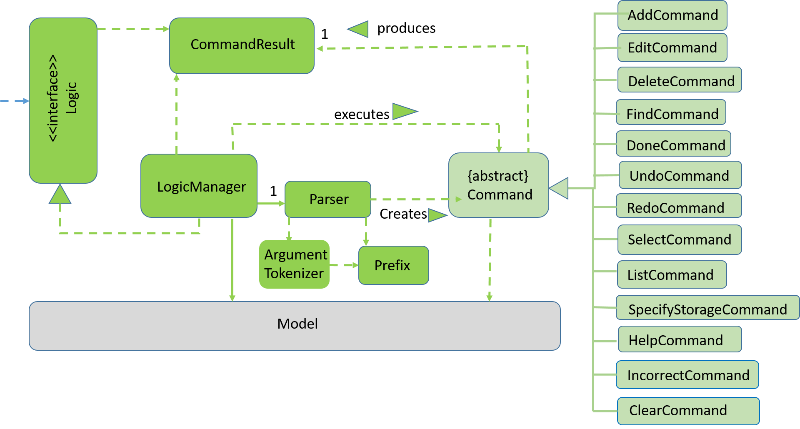
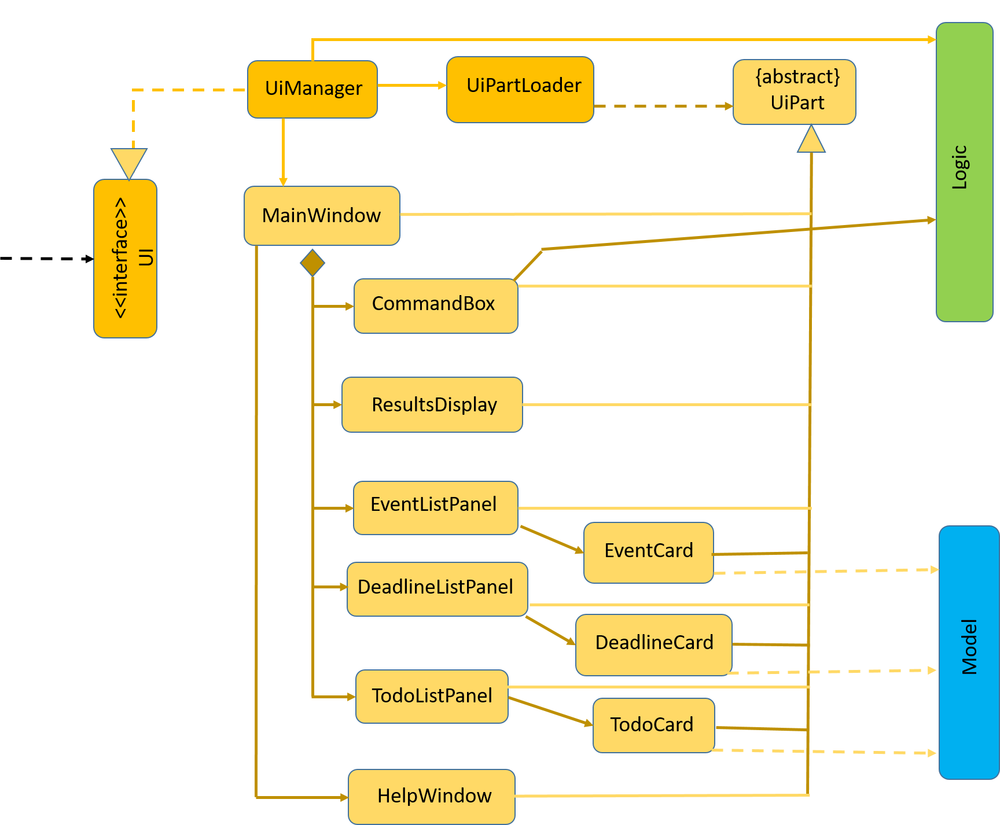
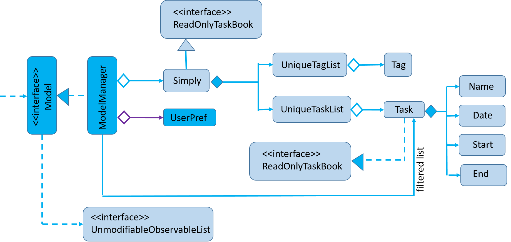
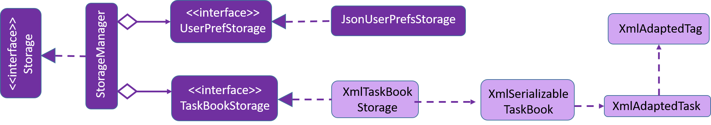

# Developer Guide 

* [Setting Up](#setting-up)
* [Design](#design)
* [Implementation](#implementation)
* [Testing](#testing)
* [Dev Ops](#dev-ops)
* [Appendix A: User Stories](#appendix-a--user-stories)
* [Appendix B: Use Cases](#appendix-b--use-cases)
* [Appendix C: Non Functional Requirements](#appendix-c--non-functional-requirements)
* [Appendix D: Glossary](#appendix-d--glossary)
* [Appendix E : Product Survey](#appendix-e-product-survey)

## Setting up

#### Prerequisites

1. **JDK `1.8.0_60`**  or later 

    > Having any Java 8 version is not enough.  
    This app will not work with earlier versions of Java 8.
    
2. **Eclipse** IDE.
3. **e(fx)clipse** plugin for Eclipse (Do the steps 2 onwards given in.
   [this page](http://www.eclipse.org/efxclipse/install.html#for-the-ambitious))
4. **Buildship Gradle Integration** plugin from the Eclipse Marketplace.

#### Importing the project into Eclipse

1. Fork this repo, and clone the fork to your computer.
2. Open Eclipse (Note: Ensure you have installed the **e(fx)clipse** and **buildship** plugins as given. 
   in the prerequisites above)
3. Click `File` > `Import`.
4. Click `Gradle` > `Gradle Project` > `Next` > `Next`.
5. Click `Browse`, then locate the project's directory.
6. Click `Finish`.

  > * If you are asked whether to 'keep' or 'overwrite' config files, choose to 'keep'.
  > * Depending on your connection speed and server load, it may take up to 30 minutes for the set up to complete.
      (This is because Gradle downloads library files from servers during the project set up process)
  > * If Eclipse auto-changed any settings files during the import process, you can discard those changes.

## Design

### Architecture

 
The **_Architecture Diagram_** given above explains the high-level design of the App.
Given below is a quick overview of each component.

`Main` has only one class called [`MainApp`](../src/main/java/seedu/simply/MainApp.java). It is responsible for:
* Initializing the components in the correct sequence, and connecting them up with each other on App launch.
* Shutting down the components and invoking cleanup method if necessary on App shut down.

[**`Commons`**](#common-classes) represents a collection of classes used by multiple components.
Two of those classes play important roles at the architecture level.
* `EventsCentre` : This class (written using [Google's Event Bus library](https://github.com/google/guava/wiki/EventBusExplained))
  is used by components to communicate with other components using events. (i.e. a form of _Event Driven_ design)
* `LogsCenter` : This class is used by many classes to write log messages to the App's log file.

The rest of the App consists of four components.
* [**`UI`**](#ui-component) : The UI of the App.
* [**`Logic`**](#logic-component) : The command executor.
* [**`Model`**](#model-component) : Holds the data of the App in-memory.
* [**`Storage`**](#storage-component) : Reads and writes data in the hard disk.

Each of the four components
* Defines its _API_ in an `interface` with the same name as the Component.
* Exposes its functionality using a `{Component Name} Manager` class.

For example, the `Logic` component (see the class diagram given below) defines it's API in the `Logic.java`
interface and exposes its functionality using the `LogicManager.java` class. 
    

The _Sequence Diagram_ below shows how the components interact for the scenario where the user issues the
command `delete E1`.

>Note that when the Task Book data is changed, instead of directly asking `Storage` to save the updates to the hard disk, 
 the `Model` raises a `TaskBookChangedEvent`.

The diagram below shows how the `EventsCenter` reacts to that event, which eventually results in the updates
being saved to the hard disk.  

> Note how the event is propagated through the `EventsCenter` to the `Storage` and `UI` without `Model` having
  to be coupled to either of them. This is an example of how this Event Driven approach helps us in reducing direct 
  coupling between components.

The sections below give more details of each component.
<!-- @@author A0147890U -->
### UI component

 

**API** : [`Ui.java`](../src/main/java/seedu/simply/ui/Ui.java)

The UI consists of a `MainWindow` that is made up of parts e.g.`CommandBox`, `ResultDisplay`, `EventListPanel`,
`DeadlineListPanel`, `TodoListPanel` etc. All these, including the `MainWindow`, inherits from the abstract `UiPart` class
and they can be loaded using the `UiPartLoader`.

The `UI` component uses the JavaFx UI framework. The layout of these UI parts are defined in matching `.fxml` files
 that are in the `src/main/resources/view` folder. 
 For example, the layout of the [`MainWindow`](../src/main/java/seedu/simply/ui/MainWindow.java) is specified in
 [`MainWindow.fxml`](../src/main/resources/view/MainWindow.fxml)

The `UI` component:
* Executes user commands using the `Logic` component.
* Binds itself to some data in the `Model` so that the UI can auto-update when data in the `Model` changes.
* Responds to events raised from various parts of the App and updates the UI accordingly.
<!-- @@author A0138993L -->
### Logic component

 

**API** : [`Logic.java`](../src/main/java/seedu/simply/logic/Logic.java)

* `Logic` uses the `Parser` class to parse the user command.
* This results in a `Command` object which is executed by the `LogicManager`.
* The command execution can affect the `Model` (e.g. adding a task) and/or raise events.
* The result of the command execution is encapsulated as a `CommandResult` object which is passed back to the `Ui`.

Given below is the Sequence Diagram for interactions within the `Logic` component for the `execute("delete E1")`
 API call. 
 
<!-- @@author A0139430L -->
### Model component

 

**API** : [`Model.java`](../src/main/java/seedu/simply/model/Model.java)

The `Model`:
* Stores a `UserPref` object that represents the user's preference.
* Stores the Task Book data.
* Exposes a `UnmodifiableObservableList<ReadOnlyTask>` that can be 'observed' e.g. the UI can be bound to this list
  so that the UI automatically updates when the data in the list changes.

> Note that `Model` does not depend on any of the other three components.
<!-- @@author A0135722L -->
### Storage component

 

**API** : [`Storage.java`](../src/main/java/seedu/simply/storage/Storage.java)

The `Storage` component:
* Saves `UserPref` objects in json format and reads it back.
* Saves the Task Book data in xml format and reads it back.

### Common classes

Classes used by multiple components are in the `seedu.simply.commons` package.

## Implementation

### Logging

We are using `java.util.logging` package for logging. The `LogsCenter` class is used to manage the logging levels
and logging destinations.

* The logging level can be controlled using the `logLevel` setting in the configuration file.
  (See [Configuration](#configuration))
* The `Logger` for a class can be obtained using `LogsCenter.getLogger(Class)` which will log messages according to
  the specified logging level.
* Currently log messages are output through: `Console` and to a `.log` file.

**Logging Levels**

* `SEVERE` : Critical problem detected which may possibly cause the termination of the application.
* `WARNING` : Can continue, but with caution.
* `INFO` : Information showing the noteworthy actions by the App.
* `FINE` : Details that is not usually noteworthy but may be useful in debugging.
  e.g. print the actual list instead of just its size.

### Configuration

Certain properties of the application can be controlled (e.g App name, logging level) through the configuration file 
(default: `config.json`):

## Testing

You can find the Tests in the `./src/test/java` folder.

**In Eclipse**:
> If you are not using a recent Eclipse version (i.e. _Neon_ or later), enable assertions in JUnit tests
  as described [here](http://stackoverflow.com/questions/2522897/eclipse-junit-ea-vm-option).

* To run all tests, right-click on the `src/test/java` folder and choose
  `Run as` > `JUnit Test`.
* To run a subset of tests, you can right-click on a test package, test class, or a test and choose
  to run as a JUnit test.

**Using Gradle**:
* You can see [UsingGradle.md](UsingGradle.md) for how to run tests using Gradle.

We have two types of tests:

1. **GUI Tests** - These are _System Tests_ which can be found in the `guitests` package that test the entire App by simulating user         actions on the GUI.
  
2. **Non-GUI Tests** - These are tests not involving the GUI. They include:
   1. _Unit tests_ targets the lowest level methods/classes.  
      e.g. `seedu.simply.commons.UrlUtilTest`
   2. _Integration tests_ checks the integration of multiple code units 
     (these code units are assumed to be working). 
      e.g. `seedu.simply.storage.StorageManagerTest`
   3. Hybrids of unit and integration tests. These tests checks multiple code units as well as 
      how they are connected together. 
      e.g. `seedu.simply.logic.LogicManagerTest`
  
**Headless GUI Testing** :
Thanks to the [TestFX](https://github.com/TestFX/TestFX) library we use,
 our GUI tests can run in the _headless_ mode. 
 In the headless mode, GUI tests do not show up on the screen.
 This means that you can do other things on the Computer while the tests are running. 
 See [UsingGradle.md](UsingGradle.md#running-tests) to learn how to run tests in headless mode.
  
## Dev Ops

### Build Automation

You can see [UsingGradle.md](UsingGradle.md) to learn how to use Gradle for build automation.

### Continuous Integration

We use [Travis CI](https://travis-ci.org/) to perform _Continuous Integration_ on our projects.
You can see [UsingTravis.md](UsingTravis.md) for more details.

### Making a Release

To make a new release, you can follow the steps below:
 
 1. Generate a JAR file [using Gradle](UsingGradle.md#creating-the-jar-file).
 2. Tag the repo with the version number. e.g. `v0.1`
 3. [Create a new release using GitHub](https://help.github.com/articles/creating-releases/) 
    and upload the JAR file you have created.
   
### Managing Dependencies

A project often depends on third-party libraries. For example, Task Book depends on the
[Jackson library](http://wiki.fasterxml.com/JacksonHome) for XML parsing. Managing these _dependencies_
can be automated using Gradle. For example, Gradle can download the dependencies automatically, which
is better than alternatives such as: 
1. Including these libraries in the repo. (This bloats the repo size) 
2. Requiring developers to download these libraries manually. (This creates extra work for developers) 

## Appendix A : User Stories

Priorities: High (must have) - `* * *`, Medium (nice to have)  - `* *`,  Low (unlikely to have) - `*`

Priority | As a ... | I want to ... | So that I can...
 -------- | :-------- | :--------- | :-----------
***  |  user  |  add tasks with a start time and an end time  |
***  |  user  |  add tasks with a deadline  | 
***  |  user  |  add tasks that can be done anytime | 
***  |  user  |  edit existing tasks  |  update tasks details  
***  |  user  |  delete existing tasks  |  remove tasks that are no longer needed
***  |  user  |  complete tasks  |  acknowledge the completion of tasks
***  |  user  |  undo the most recent operations  | undo wrong commands 
***  |  user  |  search by partial keyword  |  find related tasks containing the keyword
***  |  user  | specify my storage folder | use cloud syncing services on it
**  |  user  |  add recurring tasks  |  
**  |  user  |  have some variations in command keywords
**  |  user  |  set priorities  |  indicate tasks that are important
**  | user   | display completed tasks | know what I have done
**  |  user  |  hide completed tasks |  conceal tasks that are completed
*   |  user  | start the program with a shortcut/ key combination | save mouse clicks

## Appendix B : Use Cases

#### Use case: Add tasks with a start time and an end time 

**MSS**

1. User requests to add tasks with start time and end time.  
2. Task manager adds tasks into manager.  
Use case ends.  

**Extensions**

2a. There is already a task in the time slot.  

>2a1. Task manager shows an error message.  
 Use case ends.  
 

#### Use case: Edit existing tasks

**MSS**

1. User requests to edit an existing task.  
2. Task manager edits the task.  
Use case ends.  

**Extensions**
2a. The task requested by the user does not exist.  

>2a1. Task manager shows an error message.  
 Use case ends.  

#### Use case: Delete existing events

**MSS**

1. User requests to show the list of tasks.  
2. Task manager shows the list of tasks.  
3. User requests to delete a specific task. 
4. Task manager deletes the task.  
Use case ends.  

**Extensions**

2a. The list is empty.  

>Use case ends.  

3a. The given task does not exist.  

>3a1. Task manager shows an error message.  
 Use case ends.  

#### Use case: Complete tasks

**MSS**

1. User requests to mark a task as completed.  
2. Task manager marks the task as completed.  
Use case ends.  

**Extensions**
2a. The given task does not exist.   

>2a1. Task manager shows an error message.  
 Use case ends.  

#### Use case: undo the most recent operations

**MSS**

1. User requests to undo previous operations.  
2. Task manager performs the request.  
Use case ends.  

**Extensions**
2a. There are no previous operations.  

> 2a1. Task manager shows a warning message.  
  Use case ends.  

#### Use case: search by partial keyword

**MSS**

1. User requests to search for a task by keyword.  
2. Task Manager shows a list of tasks containing the keyword.  
Use case ends.  

**Extensions**

1a. The matching keyword is not found.  

>1a1. Task manager shows an error message.  
 Use case ends.  

## Appendix C : Non Functional Requirements

1. Should work on any [mainstream OS](#mainstream-os) as long as it has Java `1.8.0_60` or higher installed.
2. Should be able to hold up to a maximum of 1000 tasks per day.
3. Should come with automated unit tests and open source code.
4. Should favor DOS style commands over Unix-style commands.
5. Should load the command result within one second of execution.
6. Should not corrupt data if an unexpected crash occurs.
7. Should not require an installer to run the App.
8. Should be free.
9. Should be able to have functioning basic commands without the internet.

You can also visit the following page for more information on Project Constraints 
http://www.comp.nus.edu.sg/~cs2103/AY1617S1/

## Appendix D : Glossary

##### Mainstream OS

> Windows, Linux, Unix, OS-X

##### Private task detail

> A task detail that is not meant to be shared with others

## Appendix E : Product Survey

##Google Calendar

###Pros

1. Contains a quick add function which is similar to what we are trying to achieve, you can type the entire add command in one line with event description, time, location and it will interpret it for you and add as an event. 
2. Contains multiple calendars for different aspects of life. Eg. one for work, one for family, one for play.
3. Supports automatic addition of recurring events.
4. Supports sharing of calendar.
5. Supports sharing of events.
6. Supports real time video calls to all attendees of a shared event.
7. Supports colour coding for events so that you can self-categorize according to colour.
8. Supports switching of time frames. eg. view by week, month. 
9. Allows user to find a common time for everyone to attend a shared event created by you based on their Google Calendars.
10. Allows setting of time zones for each event, mainly used by frequent travellers.
11. Allows addition of documents, spreadsheets, and other files directly to an event so as to notify all guest of the details in a single platform.
12. Automatically synchronises with google account which is heavily integrated into android.
13. Ties with Google Maps for event locations. So if it is recognised in Google Maps, you can choose an exact meeting place.

###Cons

1. Severe mouse clicks required to fill up the numerous columns.
2. Security issues. It is connected to the web so there is the possibility of hacking which can reveal your life schedule.

##Todoist

###Pros

1. Contains a very high limit to storing of data.
2. Contains shortcut keys. Eg. To bold : control b; For italics : control i.
3. Contains tabs like today's or tomorrow's task for ease of access.
4. Contains multiple priority choices to user.
5. Contains duplication of templates from other projects.
6. Allows addition of labels/ tags.
7. Allows premium users to add links and files to a specific task - Eg. Links to work, files and documents. 
8. Supports third party integration. Eg. Links to dropbox and other services like Zapier, Google Drive, Cloud Magic, Sunrise Calendar, etc...
9. Supports shifting of tasks.
10. Supports colour code for priority.
11. Supports automatic addition of recurring events. Eg. every day/every Tuesday/ holidays etc...
12. Supports multiple categories called projects for sorting of task such as shopping , work, personal, errands, or create your own   
13. Supports sharing of projects and assigning of task to others.
14. Supports multiple filters like priority settings, tags/labels, tasks assigned to me or others, etc...

###Cons

1. Security issues. It is connected to the web so there is the possibility of hacking which can reveal your life schedule.
3. Multiple categories may confuse users.
4. Severe mouse clicks required for adding of tasks and to navigate between categories, checking purposes and boxes for filling of details.
5. Monetary means required for premium access.
6. Usage of a mouse required for shifting of tasks. Eg. drag and drop.

##Wunderlist

###Pros

1. Contains a easy to use search function.
2. Contains a visually pleasing interface.
3. Contains intuitive options and menu selections that is user friendly.
4. Contains customizable backgrounds.
5. Contains multiple task lists.
6. Contains shortcuts to starred tasks, overdues and today's tasks.
7. Contains cloud syncing functionality.
8. Supports multiple platforms such as windows, mac, android and ios.
9. Supports automatic addition of recurring events.
10. Supports setting of reminders and notifications.
11. Supports sharing of events.

###Cons

1. No available option for addition of subtasks.
2. No available option for addition of start date for events.
3. Monetary means required for premium access.
4. Uploading of files not supported.
5. Organisation of tasks not supported.
6. Function to sync with third party services like dropbox and google drive is not available.

##Trello

###Pros

1. Supports multiple platforms such as windows, mac, android and ios.
2. Supports sharing of tasks with other users.
3. Supports updates by email when other teammates make changes.
4. Supports syncing of tasks with web and other users in real time. 
5. Allows for free subscription, and also offers a professional package, with the privacy and administrative settings required by large enterprises.
6. Contains a visually pleasing interface.
7. Allows tasks to be tracked easily.

###Cons

1. No functionality to sort cards and reports in the order of user's preference.
2. No functionalities to assign a task to members in a checklist.
3. No functionality for calendar view for user preference.
4. Due dates are not allowed for input.
