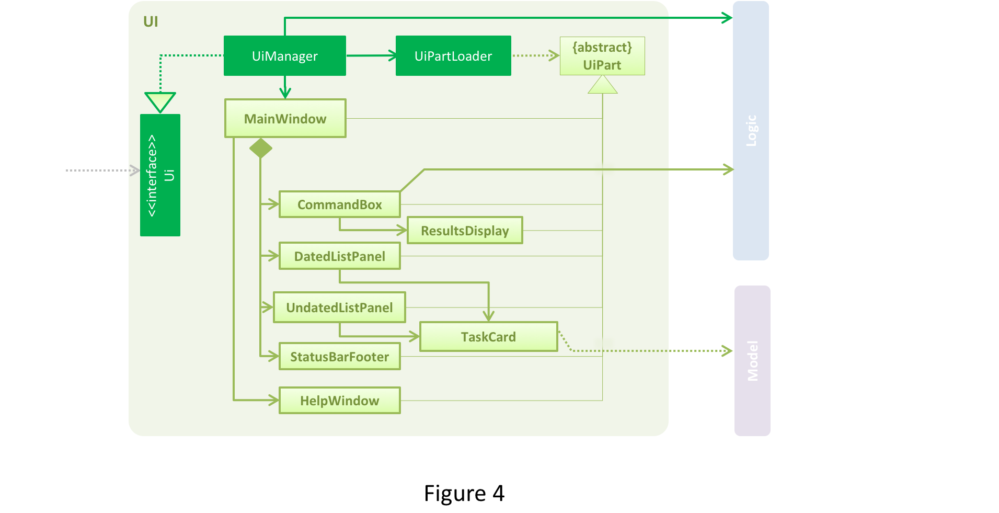
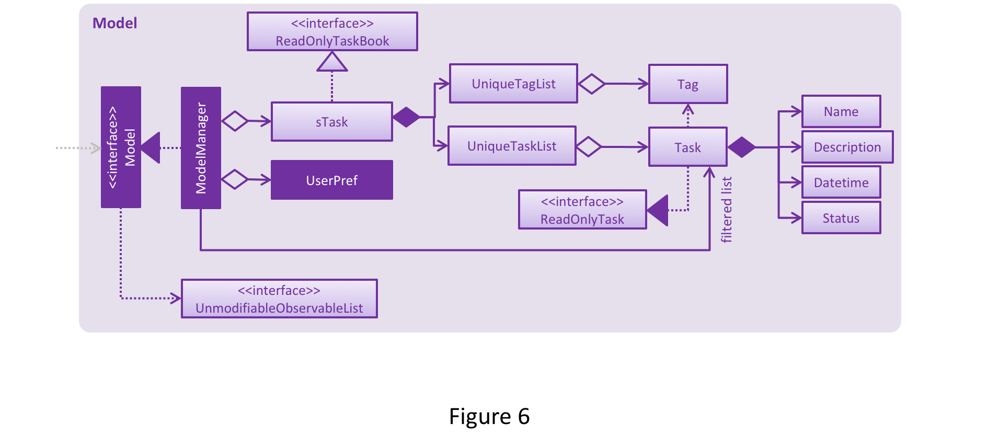
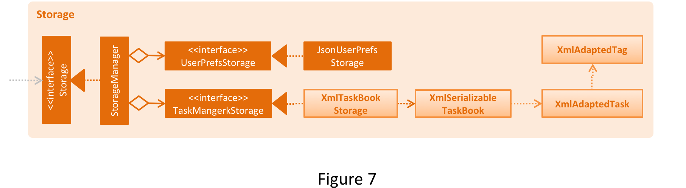

//@@author A0139024M
# Developer Guide 

1. [Setting Up](#1-setting-up)
2. [Design](#2-design)
3. [Implementation](#3-implementation)
4. [Testing](#4-testing)
5. [Continuous Integration](#5-continuous-integration)
6. [Making a Release](#6-making-a-release)
7. [Managing Dependencies](#7-managing-dependencies)
8. [Appendix A: User Stories](#appendix-a--user-stories)
9. [Appendix B: Use Cases](#appendix-b--use-cases)
10. [Appendix C: Non Functional Requirements](#appendix-c--non-functional-requirements)
11. [Appendix D: Glossary](#appendix-d--glossary)
12. [Appendix E : Product Survey](#appendix-e--product-survey)

## 0. Introduction 

&nbsp;&nbsp;&nbsp;&nbsp; Hello new developer! We are pleased to welcome you into our team and we hope that you will enjoy your time working with us. sTask is a reliable task management application that accepts 3 kinds of tasks, namely: floating tasks, deadlines and events. This application caters to users who prefer using the command-line interface. Our Developer Guide introduces you to our code base so that you can dive straight into code without much lead-time. The documents listed provide details about how to extend our application using Java's various APIs. 

Perfection is achieved not when there is nothing more to add, but rather when there is nothing more to take away
--Antoine de Saint-Exupery

## 1. Setting up

#### 1.1 Prerequisites

&nbsp;&nbsp;&nbsp;&nbsp; <b>1.1.1</b> **JDK `1.8.0_60`**  or later 

      Having any Java 8 version is not enough.
      This app will not work with earlier versions of Java 8.
    
&nbsp;&nbsp;&nbsp;&nbsp; <b>1.1.2</b> **Eclipse** IDE  
&nbsp;&nbsp;&nbsp;&nbsp; <b>1.1.3</b> **e(fx)clipse** plugin for Eclipse (Do the steps 2 onwards given in [this page](http://www.eclipse.org/efxclipse/install.html#for-the-ambitious))  
&nbsp;&nbsp;&nbsp;&nbsp; <b>1.1.4</b> **Buildship Gradle Integration** plugin from the Eclipse Marketplace  

#### 1.2 Importing the project into Eclipse

&nbsp;&nbsp;&nbsp;&nbsp; <b>1.2.1</b> Fork this repo, and clone the fork to your computer  
&nbsp;&nbsp;&nbsp;&nbsp; <b>1.2.2</b> Open Eclipse (Note: Ensure you have installed the **e(fx)clipse** and **buildship** plugins as given 
   in the prerequisites above)  
&nbsp;&nbsp;&nbsp;&nbsp; <b>1.2.3</b> Click `File` > `Import`  
&nbsp;&nbsp;&nbsp;&nbsp; <b>1.2.4</b> Click `Gradle` > `Gradle Project` > `Next` > `Next`  
&nbsp;&nbsp;&nbsp;&nbsp; <b>1.2.5</b> Click `Browse`, then locate the project's directory  
&nbsp;&nbsp;&nbsp;&nbsp; <b>1.2.6</b> Click `Finish`  

      If you are asked whether to 'keep' or 'overwrite' config files, choose to 'keep'.
      Depending on your connection speed and server load, it can even take up to 30 minutes for the set up to finish
      (This is because Gradle downloads library files from servers during the project set up process)
      If Eclipse auto-changed any settings files during the import process, you can discard those changes.

## 2. Design

  

>The **Architecture Diagram** given above explains the high-level design of the App.  
 Given below is a quick overview of each component.  
 
### 2.1 Main Component
 
 `Main` has only one class called [`MainApp`](../src/main/java/seedu/address/MainApp.java). It is responsible for

    At app launch: Initializes the components in the correct sequence, and connect them up with each other.
    At shut down: Shuts down the components and invoke clean up method where necessary.

### 2.2 Common Component

`Commons` represents a collection of classes used by multiple other components.
Two of those classes play an important role at the architecture level.
* `EventsCentre` : This class (written using [Google's Event Bus library](https://github.com/google/guava/wiki/EventBusExplained))
  is used by components to communicate with other components using events (i.e. a form of _Event Driven_ design)
* `LogsCenter` : Used by many classes to write log messages to the App's log files.
* Classes used by multiple components are in the `seedu.addressbook.commands` package. 

The rest of the App consists four components.
* [**`UI`**](#2-3-ui-component) : The UI of tha App.
* [**`Logic`**](#2-4-logic-component) : The command executor.
* [**`Model`**](2-5-model-component) : Holds the data of the App in-memory.
* [**`Storage`**](2-6storage-component) : Reads data from, and writes data to, the hard disk.

Each of the four components
* Defines its _API_ an interface with the same name as the Component. `Logic.java`
* Exposes its functionality using a `{Component Name}Manager` class e.g. `LogicManager.java`

The _Sequence Diagram_ below shows how the components interact for the scenario where the user issues the
command `delete 3`.

>Note how the `Model` simply raises a `ModelChangedEvent` when the model is changed,
 instead of asking the `Storage` to save the updates to the hard disk.

The diagram below shows how the `EventsCenter` reacts to that event, which eventually results in the updates
being saved to the hard disk and the status bar of the UI being updated to reflect the 'Last Updated' time.  

> Note how the event is propagated through the `EventsCenter` to the `Storage` and `UI` without `Model` having
  to be coupled to either of them. This is an example of how this Event Driven approach helps us reduce direct 
  coupling between components.

The sections below give more details of each component.

### 2.3 UI component

 

**API** : [`Ui.java`](../src/main/java/seedu/address/ui/Ui.java)

The UI consists of a `MainWindow` that is made up of parts e.g.`CommandBox`, `ResultDisplay`, `DatedTaskListPanel`,
`StatusBarFooter`, `UndatedTaskListPanel` etc. All these, including the `MainWindow` inherits from the abstract `UiPart` class
and they can be loaded using the `UiPartLoader`.

The `UI` component uses JavaFx UI framework. The layout of these UI parts are defined in matching `.fxml` files
 that are in the `src/main/resources/view` folder. 
 For example, the layout of the [`MainWindow`](../src/main/java/seedu/address/ui/MainWindow.java) is specified in
 [`MainWindow.fxml`](../src/main/resources/view/MainWindow.fxml)

The `UI` component,
* Executes user commands using the `Logic` component.
* Binds itself to some data in the `Model` so that the UI can auto-update when data in the `Model` change.
* Responds to events raises from various parts of the App and updates the UI accordingly.

### 2.4 Logic component

 

**API** : [`Logic.java`](../src/main/java/seedu/address/logic/Logic.java)

1. `Logic` uses the `Parser` class to parse the user command.
2. This results in a `Command` object which is executed by the `LogicManager`.
3. The command execution can affect the `Model` (e.g. adding a task) and/or raise events.
4. The result of the command execution is encapsulated as a `CommandResult` object which is passed back to the `Ui`

### 2.5 Model component

 

**API** : [`Model.java`](../src/main/java/seedu/address/model/Model.java)

The `Model`,
* Stores a `UserPref` object that represents the user's preferences
* Stores sTask data
* Exposes a `UnmodifiableObservableList<ReadOnlyPerson>` that can be 'observed' e.g. the UI can be bound to this list
  so that the UI automatically updates when the data in the list change.
* Does not depend on any of the other three components.

### 2.6 Storage component

 

**API** : [`Storage.java`](../src/main/java/seedu/address/storage/Storage.java)

The `Storage` component,
* can save `UserPref` objects in json format and read it back.
* can save the sTask data in xml format and read it back.

## 3. Implementation

### 3.1 Logging

We are using `java.util.logging.Logger` as our logger, and `LogsCenter` is used to manage the logging levels 
of loggers and handlers (for output of log messages)

    - The logging level can be controlled using the `logLevel` setting in the configuration file 
      (See [Configuration](#3-2-configuration))
    - The `Logger` for a class can be obtained using `LogsCenter.getLogger(Class)` which will log messages according to 
      the specified logging level
    - Currently log messages are output through: `Console` and `.log`

**Logging Levels**

* SEVERE 
 
     Critical use case affected, which may possibly cause the termination of the application

* WARNING

    Can continue, but with caution

* INFO

    Information important for the application's purpose e.g. update to local model/request sent to cloud
    Information that the layman user can understand

* FINE

    Used for superficial debugging purposes to pinpoint components that the fault/bug is likely to arise from
    Should include more detailed information as compared to `INFO` i.e. log useful information!
    e.g. print the actual list instead of just its size

### 3.2 Configuration

Certain properties of the application can be controlled (e.g App name, logging level) through the configuration file 
(default: `config.json`):

## 4. Testing

**In Eclipse**: 
> If you are not using a recent Eclipse version (i.e. _Neon_ or later), enable assertions in JUnit tests
  as described [here](http://stackoverflow.com/questions/2522897/eclipse-junit-ea-vm-option).

* To run all tests, right-click on the `src/test/java` folder and choose 
  `Run as` > `JUnit Test`
* To run a subset of tests, you can right-click on a test package, test class, or a test and choose 
  to run as a JUnit test.
  
**Using Gradle**:
* See [UsingGradle.md](UsingGradle.md) for how to run tests using Gradle. 

Tests can be found in the `./src/test/java` folder.

> **GUI Tests** - These are _System Tests_ that test the entire App by simulating user actions on the GUI. 
   These are in the `guitests` package.  
       
> **Non-GUI Tests** - These are tests not involving the GUI. They include:  

    1 Unit tests targeting the lowest level methods/classes. e.g. `seedu.address.commons.UrlUtilTest`
    2 Integration tests that are checking the integration of multiple code units (those code units are assumed to be working). e.g. `seedu.address.storage.StorageManagerTest`
    3 Hybrids of unit and integration tests. These test are checking multiple code units as well as  how the are connected together. e.g. `seedu.address.logic.LogicManagerTest`
  
**Headless GUI Testing** :
Thanks to the ([TestFX](https://github.com/TestFX/TestFX)) library we use,
 our GUI tests can be run in the _headless_ mode. 
 In the headless mode, GUI tests do not show up on the screen.
 That means the developer can do other things on the Computer while the tests are running.   
 See [UsingGradle.md](UsingGradle.md#running-tests) to learn how to run tests in headless mode.
  
## 5. Continuous Integration

We use [Travis CI](https://travis-ci.org/) to perform _Continuous Integration_ on our projects.
See [UsingTravis.md](UsingTravis.md) for more details.

## 6. Making a Release

Here are the steps to create a new release.
 
    1. Generate a JAR file [using Gradle](UsingGradle.md#creating-the-jar-file).
    2. Tag the repo with the version number. e.g. `v0.1`
    3. [Crete a new release using GitHub](https://help.github.com/articles/creating-releases/) 
    and upload the JAR file your created.
   
## 7. Managing Dependencies

A project often depends on third party libraries. For example, sTask depends on the 
[Jackson library](http://wiki.fasterxml.com/JacksonHome) for XML parsing. Managing these _dependencies_
can be automated using Gradle. For example, Gradle can download the dependencies automatically, which
is better than these alternatives. 

    1. Include those libraries in the repo (this bloats the repo size) 
    2. Require developers to download those libraries manually (this creates extra work for developers)

## Appendix A : User Stories

Priorities: High (must have) - `* * *`, Medium (nice to have)  - `* *`,  Low (unlikely to have) - `*`

Priority | As a ... | I want to ... | So that I can...
-------- | :-------- | :--------- | :-----------
`* * *` | new user | see usage instructions | refer to instructions when I forget how to use sTask.
`* * *` | user | add a new floating task | record the priority.
`* * *` | user | add a new deadline | record the date, time of the deadline.
`* * *` | user | add a new event| record the date, time and duration of the event.
`* * *` | user | find task(s) by name or tag | search for one or more tasks with either property.
`* * *` | user | see a list of all my incomplete tasks | have an overview of what I need to do.
`* * *` | user | see a list of all my completed tasks | have a sense of accomplishment.
`* * *` | user | see a list of all my overdue tasks | have an overview of what is overdue.
`* * *` | user | edit an existing task | modify or update entries that I have previously entered.
`* * *` | user | delete an existing task | delete entries that I no longer need to do.
`* * *` | user | undo a reversible action | quickly change any accidental actions. 
`* * *` | user | mark a task as done | keep track of what I have not done. 
`* * *` | user | change the data storage location | save it in a place I want to access easily. 
`* * *` | user | exit the application | close the application. 
`* *` | user | convert between a floating task, deadline or event | efficiently modify or update entries that I have previously entered.
`* *` | user | find task(s) by keyword, date, priority or tag | search for one or more tasks with certain properties. 
`* *` | user | view task(s) of a specific day | see what task(s) I have on that day. 

## Appendix B : Use Cases

(For all use cases below, the **System** is the `sTask` and the **Actor** is the `user`, unless specified otherwise)

#### Use case: Add task

**MSS**

1. User adds a deadline
2. sTask shows the added deadline
3. Use case ends

**Extensions**

&nbsp;&nbsp;&nbsp;&nbsp;1a. The given date and time is invalid
> 1a1. sTask shows an error message 
> 1a2. Use case resumes at step 1

#### Use case: Delete task

**MSS**

1. User requests to list all Tasks
2. sTask shows a list of tasks
3. User requests to delete a specific task in the list
4. sTask prompt confirmation from user
5. sTask deletes the task 
6. Use case ends.

**Extensions**

&nbsp;&nbsp;&nbsp;&nbsp;2a. The list is empty

> 2a1. Use case ends

&nbsp;&nbsp;&nbsp;&nbsp;3a. The given index is invalid

> 3a1. sTask shows an error message  
> 3a2. Use case resumes at step 2

#### Use case: Edit Task

**MSS**

1. User requests to list all Tasks
2. sTask shows a list of tasks
3. User requests to edit certain FIELDS of the task at INDEX 
4. sTask shows the result of edit 
5. Use case ends

**Extensions**

&nbsp;&nbsp;&nbsp;&nbsp;2a. The list is empty

> 2a1. Use case ends

&nbsp;&nbsp;&nbsp;&nbsp;3a. The given index is invalid
> 3a1. sTask shows an error message 
> 3a2. Use case resumes at step 2

&nbsp;&nbsp;&nbsp;&nbsp;3b. The given fields are invalid
> 3b1. sTask shows an error message 
> 3b2. Use case resumes at step 2

#### Use case: View task

**MSS**

1. User requests to view tasks on a specific date
2. sTask shows the tasks on the given date and month
3. Use case ends

**Extensions**

&nbsp;&nbsp;&nbsp;&nbsp;1a. The given date has no month
> 1a1. sTask shows the tasks on the given date on the current month

#### Use case: Help

**MSS**

1. User requests to see UserGuide
2. sTask shows a web view of the UserGuide
3. Use case ends

**Extensions**

&nbsp;&nbsp;&nbsp;&nbsp;2a. The user has no Internet connection
> 2a1. Web view shows blank page

#### Use case: Undo

**MSS**

1. User requests to undo the previous command
2. sTask displays a message that the previous reversible command is undone
3. Use case ends

**Extensions**

&nbsp;&nbsp;&nbsp;&nbsp;2a. User has no previous reversible command
> 2a1. sTask shows an error message

#### Use case: Save

**MSS**

1. User requests to change the data storage location
2. sTask displays a message that the data storage file is saved in the new location
3. Use case ends

**Extensions**

&nbsp;&nbsp;&nbsp;&nbsp;2a. User has no previous reversible command
> 2a1. sTask shows an error message

#### Use case: Exit

**MSS**

1. User requests to exit sTask
2. sTask application window close
3. Use case ends

## Appendix C : Non Functional Requirements

    1. Should work on any [mainstream OS](#mainstream-os) as long as it has Java `1.8.0_60` or higher installed.
    2. Should be able to hold up to 1000 tasks.
    3. Should come with automated unit tests and open source code.
    4. Should favor DOS style commands over Unix-style commands.
    5. Should be able to customize the app with a theme. 
    6. Should not exceed 100MB of storage.
    6. Should not exceed 100MB of RAM.
    7. Should have authentication features.
    8. Should be updated every month with new features and bug fixes.
    9. Should be free. 
    10. Should have welcome voices when you first start the application.

{More to be added}

## Appendix D : Glossary

##### Mainstream OS

> Windows, Linux, Unix, OS-X

## Appendix E : Product Survey

Product Name | Strengths | Weaknesss
-------------| :-------- | :--------- 
Colour Note | <ol><li> User can add task quickly; within 2 button clicks</li> <li> User can add tasks w/o specific datetime</li> <li>  Looking for suitable slot to schedule item is easy by looking at calendar view/day view</li><li>  Marking item as done is easy; simply clicking</li><li>  Deciding what to-do item to do next: all tasks are listed and easily rearrangeable by dragging</li><li>  Postponing an item is easy (even has shortcuts like tomorrow/ next tuesday)</li></ol> |<ol><li>Calendar can't block multiple slots</li><li> User cannot specify tasks that need to be done before/after specific datetime</li></ol>
ToDoIst  | <ol><li>User can add any task easily using shortcut key ‘q’ </li> <li>User can choose not to include the date and time. </li> <li>User can attach labels (tags) to these entries to categorise them</li> <li>User can view a list of upcoming tasks, up to the next 7 days.</li> <li>User can view a list of completed tasks.</li></ol> |<ol><li> User cannot add in a task to the next earliest available slot </li><li>User cannot add a task that has two possible dates and confirm one of it at a later time</li> <li>User cannot navigate through the application using only the keyboard.</li></ol>
Apple iOS Reminder | <ol><li>User can add task, both ad-hoc and events quickly; within 2 button press</li><li>User can include additional information anytime by accessing the task in the application easily</li><li>User can add tasks using external application </li><li>User is able to navigate through all the different tasks via touchscreen</li></ol> |<ol><li> User cannot add in task to the next available slot</li><li>User is unable to resolve conflict due to clashing events as the application is not able to detect similar date and time event</li><li>User is not able to undo any command he/she performed</li><li>No repeat option for recurring tasks, user has to repeatedly key in new task each time</li><li>User event and deadline tasks are not sync with any calendar application</li></ol>
Google Tasks | <ol><li>User can add a new Task by clicking the '+' button. </li><li>User can add an email as a task through the more option after selecting a particular email. </li><li>User can add notes or deadline to the the task by clicking '>' button to the right of each task.</li><li>User can view or clear completed tasks but cannot view the uncompleted ones. </li><li>User can integrate their tasks with Google Calendar.</li></ol> | <ol><li>User has to click pop-up calendar to select date instead of typing a command to do so. </li><li>Does not indicate that a task is overdue.</li></ol>

 

