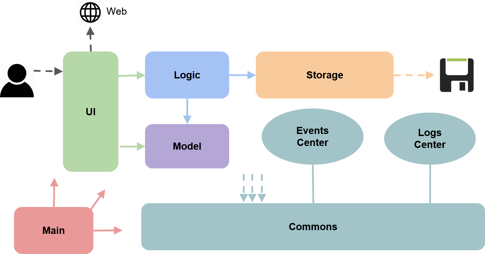
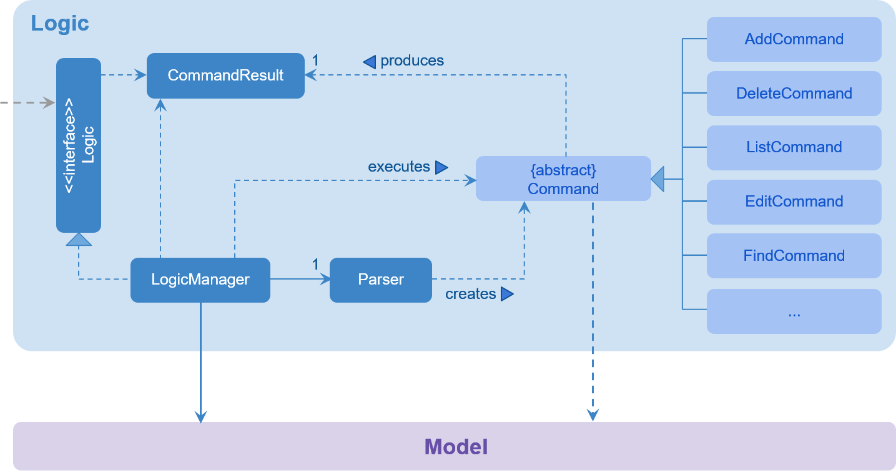
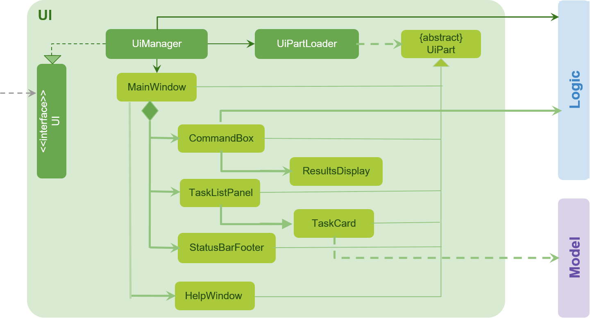
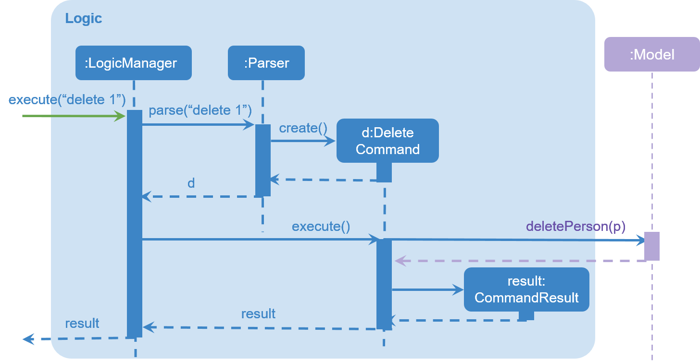
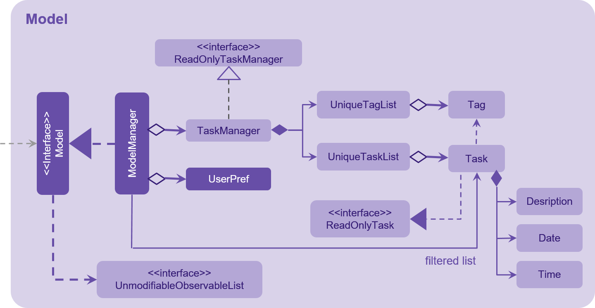
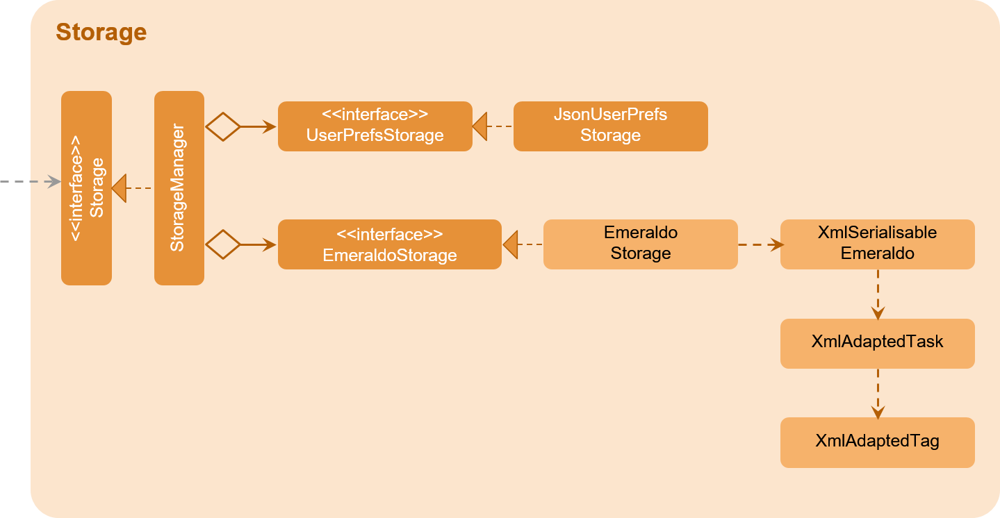

# Developer Guide 

* [Introduction](#introduction)
* [Setting Up](#setting-up)
* [Design](#design)
* [Implementation](#implementation)
* [Testing](#testing)
* [Dev Ops](#dev-ops)
* [Appendix A: User Stories](#appendix-a--user-stories)
* [Appendix B: Use Cases](#appendix-b--use-cases)
* [Appendix C: Non Functional Requirements](#appendix-c--non-functional-requirements)
* [Appendix D: Glossary](#appendix-d--glossary)
* [Appendix E : Product Survey](#appendix-e-product-survey)

<@@author A0139196U>
 
## Introduction

Emeraldo is a simple app for users to manage their daily tasks, such as keeping track of deadlines and scheduling of events.
This app is catered for folks who can type fast and prefer typing over mouse/voice commands.
It is also a Java desktop application that has a GUI.
 
This guide describes the design and implementation of Emeraldo.
Through this guide, you will gain an understanding how Emeraldo works and how you can further contribute to its development.
<@@author>

 
## Setting up

#### Prerequisites

1. **JDK `1.8.0_60`**  or later 

    > Having any Java 8 version is not enough  
    This app will not work with earlier versions of Java 8
    
2. **Eclipse** IDE
3. **e(fx)clipse** plugin for Eclipse
(Follow the guide from step 2 onwards given in [this page](http://www.eclipse.org/efxclipse/install.html#for-the-ambitious))
4. **Buildship Gradle Integration** plugin from the Eclipse Marketplace

 
#### Importing the project into Eclipse

1. Fork this repo and clone the fork to your computer
2. Open Eclipse (Note: Ensure you have installed the **e(fx)clipse** and **buildship** plugins as given 
   in the prerequisites above)
3. Click `File` > `Import`
4. Click `Gradle` > `Gradle Project` > `Next` > `Next`
5. Click `Browse`, then locate the project's directory
6. Click `Finish`

  > * If you are asked whether to 'keep' or 'overwrite' config files, choose to 'keep'
  > * Depending on your connection speed and server load, it can even take up to 30 minutes for the setup to finish
      (This is because Gradle downloads library files from servers during the project setup process)
  > * If Eclipse auto-changed any settings files during the import process, you can discard those changes

 
#### Troubleshooting

**Problem: Eclipse reports compile errors after new commits are pulled from Git**
 
* _Reason_: Eclipse fails to recognise new files that appeared due to the Git pull. 
* _Solution_: you have to refresh the project in Eclipse:  
  Right click on the project (in Eclipse package explorer), choose `Gradle` -> `Refresh Gradle Project`.
  
**Problem: Eclipse reports some required libraries missing**
 
* _Reason_: Required libraries may not have been downloaded during the project import. 
* _Solution_: you have to refresh the libraries by [running tests using Gradle](UsingGradle.md) once.

  
## Design

### Section A - Architecture
 
You may wish to walk through a **quick overview** of our components and how they interact with each other in section A of this chapter. The 4 main components (**UI, Logic, Model, Storage**) will be explained in details in section B.

 
 
 

The **_Architecture Diagram_** given above provides an overview of the high-level design of the App.
Given below is a quick overview of each component.

`Main` has only one class called [`MainApp`](../src/main/java/seedu/emeraldo/MainApp.java). It has 2 responsibilities:
1. At app launch: Initialises the components in the correct sequence, and connect them up with each other.
2. At shut down: Shuts down the components and invoke cleanup method where necessary.

[**`Commons`**](#common-classes) represents a collection of classes used by multiple other components.
Two of those classes play important roles at the architecture level.
* `EventsCentre` : This class (written using [Google's Event Bus library](https://github.com/google/guava/wiki/EventBusExplained))
  is used by components to communicate with other components using events. (i.e. a form of _Event Driven_ design)
* `LogsCenter` : Used by many classes to write log messages to the App's log file.

The rest of the App consists four components.
* [**`UI`**](#ui-component) : Shows UI of the App.
* [**`Logic`**](#logic-component) : Executes the commands.
* [**`Model`**](#model-component) : Holds the data of the App in-memory.
* [**`Storage`**](#storage-component) : Reads data from, and writes data to, the hard disk.

Each of the four components
* Defines its _API_ in an `interface` with the same name as the Component.
* Exposes its functionality using a `{Component Name}Manager` class.

For example, the `Logic` component (see the class diagram given below) defines its API in the `Logic.java`
interface and exposes its functionality using the `LogicManager.java` class. 
 
 
 

The _Sequence Diagram_ below shows how the components interact for the scenario where the user issues the
command `delete 1`.

>Note how the `Model` simply raises a `EmeraldoChangedEvent` when the Emeraldo data are changed,
 instead of asking the `Storage` to save the updates to the hard disk.

 
 
The diagram below shows how the `EventsCenter` reacts to that event, which eventually results in the updates
being saved to the hard disk and the status bar of the UI being updated to reflect the 'Last Updated' time.
 
 

> Note how the event is propagated through the `EventsCenter` to the `Storage` and `UI` without `Model` having
  to be coupled to either of them. This is an example of how this Event Driven approach helps us reduce direct 
  coupling between components.

Section B will elaborate more on each component.

 
##Section B - Understanding the component
###UI component

 

**API** : [`Ui.java`](../src/main/java/seedu/emeraldo/ui/Ui.java)

The UI consists of a `MainWindow` that is made up of parts e.g.`CommandBox`, `ResultDisplay`, `TaskListPanel`,
`StatusBarFooter`, etc. All these, including the `MainWindow`, inherit from the abstract `UiPart` class
and they can be loaded using the `UiPartLoader`.

The `UI` component uses JavaFx UI framework. The layout of these UI parts are defined in matching `.fxml` files
 that are in the `src/main/resources/view` folder.
 

 For example, the layout of the [`MainWindow`](../src/main/java/seedu/emeraldo/ui/MainWindow.java) is specified in
 [`MainWindow.fxml`](../src/main/resources/view/MainWindow.fxml)

The `UI` component,
* Executes user commands using the `Logic` component.
* Binds itself to some data in the `Model` so that the UI can auto-update when data in the `Model` change.
* Responds to events raised from various parts of the App and updates the UI accordingly.

 
### Logic component

 

**API** : [`Logic.java`](../src/main/java/seedu/emeraldo/logic/Logic.java)

1. `Logic` uses the `Parser` class to parse the user command.
2. This results in a `Command` object which is executed by the `LogicManager`.
3. The command execution can affect the `Model` (e.g. adding a task) and/or raise events.
4. The result of the command execution is encapsulated as a `CommandResult` object which is passed back to the `UI`.
 

Given below is the Sequence Diagram for interactions within the `Logic` component for the `execute("delete 1")`
 API call. 
 
 
 
 

### Model component

 

**API** : [`Model.java`](../src/main/java/seedu/emeraldo/model/Model.java)

The `Model`,
* stores a `UserPref` object that represents the user's preferences.
* stores the Emeraldo data.
* exposes a `UnmodifiableObservableList<ReadOnlyTask>` that can be 'observed' e.g. the UI can be bound to this list
  so that the UI automatically updates when the data in the list change.
* does not depend on any of the other three components.
 
 

### Storage component

 

**API** : [`Storage.java`](../src/main/java/seedu/emeraldo/storage/Storage.java)

The `Storage` component,
* can save `UserPref` objects in json format and read it back.
* can save the Emeraldo data in xml format and read it back.
 

### Common classes

Classes used by multiple components are in the `seedu.emeraldo.commons` package.
 
 

## Implementation

### Logging

We are using `java.util.logging` package for logging. The `LogsCenter` class is used to manage the logging levels
and logging destinations.

* The logging level can be controlled using the `logLevel` setting in the configuration file.
  (See [Configuration](#configuration))
* The `Logger` for a class can be obtained using `LogsCenter.getLogger(Class)` which will log messages according to
  the specified logging level.
* Currently log messages are output through: `Console` and to a `.log` file.

**Logging Levels**

* `SEVERE` : Critical problem detected which may possibly cause the termination of the application
* `WARNING` : Can continue, but with caution
* `INFO` : Information showing the noteworthy actions by the App
* `FINE` : Details that is not usually noteworthy but may be useful in debugging
  e.g. print the actual list instead of just its size
 
  
### Configuration

Certain properties of the application can be controlled (e.g App name, logging level) through the configuration file 
(default: `config.json`):
 
 

## Testing

Tests can be found in the `./src/test/java` folder.

**In Eclipse**:
* To run all tests, you can right-click on the `src/test/java` folder and choose
  `Run as` > `JUnit Test`
* To run a subset of tests, you can right-click on a test package, test class, or a test and choose
  `Run as` > `JUnit Test`

**Using Gradle**:
* See [UsingGradle.md](UsingGradle.md) for how to run tests using Gradle.

We have two types of tests:

1. **GUI Tests** - These are _System Tests_ that test the entire App by simulating user actions on the GUI. 
   These are in the `guitests` package.
  
2. **Non-GUI Tests** - These are tests not involving the GUI. They include,
   1. _Unit tests_ targeting the lowest level methods/classes.  
      e.g. `seedu.address.commons.UrlUtilTest`
   2. _Integration tests_ that are checking the integration of multiple code units 
     (those code units are assumed to be working). 
      e.g. `seedu.address.storage.StorageManagerTest`
   3. Hybrids of unit and integration tests. These test are checking multiple code units as well as 
      how the are connected together. 
      e.g. `seedu.address.logic.LogicManagerTest`
  
**Headless GUI Testing** :
Thanks to the [TestFX](https://github.com/TestFX/TestFX) library we use,
 our GUI tests can be run in the _headless_ mode. 
 In the headless mode, GUI tests do not show up on the screen.
 That means the developer can do other things on the Computer while the tests are running. 
 See [UsingGradle.md](UsingGradle.md#running-tests) to learn how to run tests in headless mode.
 
#### Troubleshooting tests
 **Problem: Tests fail because NullPointException when AssertionError is expected**
 * _Reason_: Assertions are not enabled for JUnit tests. 
   This can happen if you are not using a recent Eclipse version (i.e. _Neon_ or later)
 * _Solution_: Enable assertions in JUnit tests as described 
   [here](http://stackoverflow.com/questions/2522897/eclipse-junit-ea-vm-option).  
   Delete run configurations created when you ran tests earlier.

## Dev Ops

### Build Automation

See [UsingGradle.md](UsingGradle.md) to learn how to use Gradle for build automation.

### Continuous Integration

We use [Travis CI](https://travis-ci.org/) to perform _Continuous Integration_ on our projects.
See [UsingTravis.md](UsingTravis.md) for more details.

### Making a Release

You can follow these steps to create a new release:
 
 1. Generate a JAR file [using Gradle](UsingGradle.md#creating-the-jar-file).
 2. Tag the repo with the version number. e.g. `v0.1`
 3. [Create a new release using GitHub](https://help.github.com/articles/creating-releases/) 
    and upload the JAR file yor created.
   
### Managing Dependencies

A project often depends on third-party libraries. For example, Emeraldo depends on the
[Jackson library](http://wiki.fasterxml.com/JacksonHome) for XML parsing. Managing these _dependencies_
can be automated using Gradle. For example, Gradle can download the dependencies automatically, which
is better than these alternatives. 
a. Include those libraries in the repo (this bloats the repo size) 
b. Require developers to download those libraries manually (this creates extra work for developers) 

 
## Appendix A : User Stories

<@@author A0139749L>
#### High Priority `* * *`

As a ... | I want to ... | so that ...
---------|--------------|------------
new user | see usage instructions | I can refer to instructions when I use the Task Manager. 
new user | view more information about a particular command | I can learn how to use various commands. 
user | add a task by specifying a task description and the date and time | I can record tasks that need to be done by the date and time. 
user | add a scheduled event by specifying the event name and duration | I can record events that I need to attend. 
user | add a task by specifying a task description only | I can record tasks that need to be done some day. 
user | delete a task | I can remove entries that I no longer need. 
user | see all my tasks | I can easily know what I need to do at a glance. 
user | edit the task descriptions, date or time | I can update the details of my tasks. 

 
<@@author A0139342H>
#### Medium Priority `* *`

As a ... | I want to ... | so that ...
---------|--------------|------------
user | undo my previous actions | I can revert any mistakes made. 
user | sort the tasks by the date and time | I can see my tasks according to their urgency. 
user | search for my tasks using some keywords | I can easily view my tasks based on the specified keywords. 
user | mark tasks as completed or uncompleted | I can keep track of my tasks progress. 
user | specify a folder for data storage location | I can store the data file in a local folder controlled by a cloud syncing service. 

 
<@@author A0139196U>
#### Low Priority `*`

As a ... | I want to ... | so that ...
---------|--------------|------------
user | add tags to my task | I can categorise my tasks. 
user | input my dates and days in any format that I want | it is easier for my usage. 
user | implement recurring tasks | I don't have to add the task every week. 
advanced user | use shorter versions of the commands | I can type in the commands faster. 
busy user | know what I can do next | I can fill up my free time slots. 
busy user | reserve time slots for one or more tasks that may not be confirmed | I know which to prioritise.

 
## Appendix B : Use Cases

(For all use cases below, the **System** is the Task Manager and the **Actor** is the user, unless specified otherwise)

<@@author A0142290N>
####Use case: Add task

**MSS**

1. User requests to add task
2. TaskManager adds task and confirms that user has added the task 

**Extensions**

2a. The task has the exact same details as an existing task

> TaskManager shows error message: “This task has already been created.
	
 
#### Use case: Edit task

**MSS**

1. User requests to list task
2. TaskManager shows a list of task
3. User requests to edit a task
4. TaskManager brings task to the center of the window and asks user which field they would like to edit
5. User requests to edit a specific field e.g. "Edit Title"
6. TaskManager returns the title to the command line for editing and asks user to edit the title
7. User edits title
8. TaskManager edits title accordingly and asks user to exit edit or continue editing by typing "edit title" again
9. User exits edit
10. TaskManager returns back to list

**Extensions**

2a. The list is empty

> Use case ends

4a. The given index is invalid

> 4a1. TaskManager shows an error message
  Use case resumes at step 2

6a. The given field tag is empty

> 6b1. TaskManager asks to add to the field instead
> 6b2. User types new addition
> 6b3. TaskManager adds to the specified field

8a. User did not edit

> 8a1. TaskManager asks user to edit
> 8a2. User types edit
> 8a3. TaskManager edits
  Use case ends

 
<@@author A0139196U>
#### Use case: Delete task

**MSS**

1. User requests to list task
2. TaskManager shows a list of task
3. User requests to delete a specific task in the list
4. TaskManager display confirmation message
5. User enters "yes" to confirm delete
6. TaskManager deletes the task 
Use case ends.

**Extensions**

2a. The list is empty

> Use case ends

3a. The given index is invalid

> 3a1. TaskManager shows an error message
  Use case resumes at step 2

5a. The user input is invalid

> 5a1. TaskManager shows an error message
> 5a2. User enters input
Step 5a1 and 5a2 are repeated until the user enters a valid input

 
<@@author A0139342H>
#### Use case: List [category]
	
**MSS**

1. User requests to list by a certain category
2. TaskManager shows a list of task of that category

**Extensions**

2a. Category is unavailable

> Use case ends
	
2b. Category is by date

> TaskManager shows list of tasks by date, using start time of EVENTS and end time of DEADLINES

2c. Category is by tag

> TaskManager shows list of tasks by the particular tag in order of index
<@@author>

 
## Appendix C : Non Functional Requirements

1. Should work on any [mainstream OS](#mainstream-os) as long as it has Java `1.8.0_60` or higher installed.
2. Should be able to hold up to 1000 tasks.
3. Should come with automated unit tests and open source code.
4. Should favor DOS style commands over Unix-style commands.

{More to be added}

 
## Appendix D : Glossary

##### Mainstream OS

> Windows, Linux, Unix, OS-X

 
## Appendix E : Product Survey
<@@author A0139196U>

#### Wunderlist
 **Strengths**
  * Able to add items to any list and assign deadlines and reminders
  * Requires few taps/interaction to create a simple to-do item
  * Natural language feature lets user type simple due dates, such "tomorrow", and Wunderlist will interprets and assigns accordingly
  * Available on multiple platforms, access easily from laptop or phone
  * Simple interface
  * Able to share lists with others for collaboration
  * Able to sort list

<@@author A0139342H>
#### Todoist
 **Strengths**
  * Able to identify dates in tasks statements e.g 18oct, mon. Useful for Jim's command line habits
  * Has smartphone and desktop applications. Useful for Jim's requirement for portability
  * Has undo option
  * Allows the use of tags to classify different tasks e.g personal, school work.
  * Allows users to set priority levels to tasks
  * Has smartphone notifications for tasks due today
  * Multiple display formats: today, next 7 days, by tags

**Weaknesses**
  * Synced to the cloud. Users may have problems when there is no internet connection

<@@author A0139749L>
#### Centrallo
 **Strengths**
  * Supports email forwarding from your personal mail into Centrallo
  * Allows the creation of list, notes and checklist, where the notes and checklist can be filed under a particular list
  * Items can be tagged as priorities which is consolidated in a priorities
  * Notes, lists and checklists can be given different colours (7 to choose from)
  * Supports attachment of files (up to 25mb) to the notes
  * Offers 3 methods to sort the notes i.e. alphabetically, by created date and by updated date

**Weaknesses**
  * Only can move 1 note/checklist at a time
  * Limitations of 100 notes in total for a free account
  * Requires internet connection to access (no offline version)
  * No calendar view for a quick overview of all notes by dates
  * No quick overview of all notes in general (GUI highly resembles that of an email inbox - the notes occupy a narrow column on the screen with the rest of the screen occupied by the content of the notes)

<@@author A0142290N>
#### Trello
 **Strengths**
  * Able to create various lists, allows good organisation
  * Able to add friends into the lists which allows communication between colleagues
  * Different types of lists can be created such as checklists, description texts, deadlines, labels and attachments
  * Can move, copy, subscribe, archive
  * Can be used on both mobile and desktop
  * Can set lists to be visible or invisible to others
  * Can use powerups which has special add ons to the lists, thus Jim can customise it to his needs
  * Has reminders
  * Activity summary to allow Jim to know what he did earlier
  * Can share lists which Jim can tell his colleagues tasks he needs to do/the team needs to do

**Weaknesses**
  * Too many options, too troublesome for Jim's need to use single line command
  * Difficult to look for things Jim needs
  * No calendar view
  * More useful for teams than individuals
