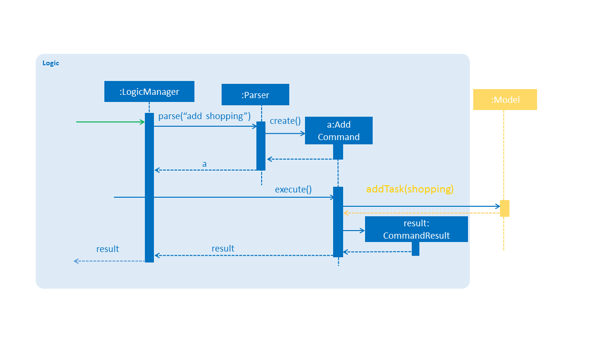

# Developer Guide

* [Setting Up](#setting-up)
* [Design](#design)
* [Implementation](#implementation)
* [Testing](#testing)
* [Dev Ops](#dev-ops)
* [Appendix A: User Stories](#appendix-a--user-stories)
* [Appendix B: Use Cases](#appendix-b--use-cases)
* [Appendix C: Non Functional Requirements](#appendix-c--non-functional-requirements)
* [Appendix D: Glossary](#appendix-d--glossary)
* [Appendix E : Product Survey](#appendix-e--product-survey)

## Setting up

#### Prerequisites

1. **JDK `1.8.0_60`**  or later 

	> Having any Java 8 version is not enough.  
	This app will not work with earlier versions of Java 8.
   
2. **Eclipse** IDE
3. **e(fx)clipse** plugin for Eclipse (Do the steps 2 onwards given in
  [this page](http://www.eclipse.org/efxclipse/install.html#for-the-ambitious))
4. **Buildship Gradle Integration** plugin from the Eclipse Marketplace

#### Importing the project into Eclipse

0. Fork this repo, and clone the fork to your computer
1. Open Eclipse (Note: Ensure you have installed the **e(fx)clipse** and **buildship** plugins as given
  in the prerequisites above)
2. Click `File` > `Import`
3. Click `Gradle` > `Gradle Project` > `Next` > `Next`
4. Click `Browse`, then locate the project's directory
5. Click `Finish`

 > * If you are asked whether to 'keep' or 'overwrite' config files, choose to 'keep'.
 > * Depending on your connection speed and server load, it can even take up to 30 minutes for the set up to finish
 	(This is because Gradle downloads library files from servers during the project set up process)
 > * If Eclipse auto-changed any settings files during the import process, you can discard those changes.

## Design

### Architecture

 
The **_Architecture Diagram_** given above explains the high-level design of the App.
Given below is a quick overview of each component.

`Main` has only one class called [`MainApp`](../src/main/java/seedu/task/MainApp.java). It is responsible for,
* At app launch: Initializes the components in the correct sequence, and connect them up with each other.
* At shut down: Shuts down the components and invoke cleanup method where necessary.

[**`Commons`**](#common-classes) represents a collection of classes used by multiple other components.
Two of those classes play important roles at the architecture level.
* `EventsCentre` : This class (written using [Google's Event Bus library](https://github.com/google/guava/wiki/EventBusExplained))
 is used by components to communicate with other components using events (i.e. a form of _Event Driven_ design)
* `LogsCenter` : Used by many classes to write log messages to the App's log file.

The rest of the App consists four components.
* [**`UI`**](#ui-component) : The UI of tha App.
* [**`Logic`**](#logic-component) : The command executor.
* [**`Model`**](#model-component) : Holds the data of the App in-memory.
* [**`Storage`**](#storage-component) : Reads data from, and writes data to, the hard disk.

Each of the four components
* Defines its _API_ in an `interface` with the same name as the Component.
* Exposes its functionality using a `{Component Name}Manager` class.

For example, the `Logic` component (see the class diagram given below) defines it's API in the `Logic.java`
interface and exposes its functionality using the `LogicManager.java` class. 
 

The _Sequence Diagram_ below shows how the components interact for the scenario where the user issues the
command `delete 1`.

>Note how the `Model` simply raises a `TaskManager ChangedEvent` when the to-do list data are changed,
instead of asking the `Storage` to save the updates to the hard disk.

The diagram below shows how the `EventsCenter` reacts to that event, which eventually results in the updates
being saved to the hard disk and the status bar of the UI being updated to reflect the 'Last Updated' time.  

> Note how the event is propagated through the `EventsCenter` to the `Storage` and `UI` without `Model` having
 to be coupled to either of them. This is an example of how this Event Driven approach helps us reduce direct
 coupling between components.

The sections below give more details of each component.

### UI component

 

**API** : [`Ui.java`](../src/main/java/seedu/task/ui/Ui.java)

The UI consists of a `MainWindow` that is made up of parts e.g.`CommandBox`, `ResultDisplay`, `PersonListPanel`,
`StatusBarFooter`, `BrowserPanel` etc. All these, including the `MainWindow`, inherit from the abstract `UiPart` class
and they can be loaded using the `UiPartLoader`.

The `UI` component uses JavaFx UI framework. The layout of these UI parts are defined in matching `.fxml` files
that are in the `src/main/resources/view` folder. 
For example, the layout of the [`MainWindow`](../src/main/java/seedu/task/ui/MainWindow.java) is specified in
[`MainWindow.fxml`](../src/main/resources/view/MainWindow.fxml)

The `UI` component,
* Executes user commands using the `Logic` component.
* Binds itself to some data in the `Model` so that the UI can auto-update when data in the `Model` change.
* Responds to events raised from various parts of the App and updates the UI accordingly.

### Logic component

 

**API** : [`Logic.java`](../src/main/java/seedu/task/logic/Logic.java)

1. `Logic` uses the `Parser` class to parse the user command.
2. This results in a `Command` object which is executed by the `LogicManager`.
3. The command execution can affect the `Model` (e.g. adding a person) and/or raise events.
4. The result of the command execution is encapsulated as a `CommandResult` object which is passed back to the `Ui`.

Given below is the Sequence Diagram for interactions within the `Logic` component for the `execute("delete 1")` API call. 

 

### Model component

 

**API** : [`Model.java`](../src/main/java/seedu/task/model/Model.java)

The `Model`,
* stores a `UserPref` object that represents the user's preferences.
* stores the to-do list data.
* exposes a `UnmodifiableObservableList<ReadOnlyTask>` that can be 'observed' e.g. the UI can be bound to this list
 so that the UI automatically updates when the data in the list change.
* does not depend on any of the other three components.

### Storage component

 

**API** : [`Storage.java`](../src/main/java/seedu/task/storage/Storage.java)

The `Storage` component,
* can save `UserPref` objects in json format and read it back.
* can save the to-do list data in xml format and read it back.

### Common classes

Classes used by multiple components are in the `seedu.task.commons` package.

## Implementation

### Logging

We are using `java.util.logging` package for logging. The `LogsCenter` class is used to manage the logging levels
and logging destinations.

* The logging level can be controlled using the `logLevel` setting in the configuration file
 (See [Configuration](#configuration))
* The `Logger` for a class can be obtained using `LogsCenter.getLogger(Class)` which will log messages according to
 the specified logging level
* Currently log messages are output through: `Console` and to a `.log` file.

**Logging Levels**

* `SEVERE` : Critical problem detected which may possibly cause the termination of the application
* `WARNING` : Can continue, but with caution
* `INFO` : Information showing the noteworthy actions by the App
* `FINE` : Details that is not usually noteworthy but may be useful in debugging
 e.g. print the actual list instead of just its size

### Configuration

Certain properties of the application can be controlled (e.g App name, logging level) through the configuration file
(default: `config.json`):

## Testing

Tests can be found in the `./src/test/java` folder.

**In Eclipse**:
> If you are not using a recent Eclipse version (i.e. _Neon_ or later), enable assertions in JUnit tests
 as described [here](http://stackoverflow.com/questions/2522897/eclipse-junit-ea-vm-option).

* To run all tests, right-click on the `src/test/java` folder and choose
 `Run as` > `JUnit Test`
* To run a subset of tests, you can right-click on a test package, test class, or a test and choose
 to run as a JUnit test.

**Using Gradle**:
* See [UsingGradle.md](UsingGradle.md) for how to run tests using Gradle.

We have two types of tests:

1. **GUI Tests** - These are _System Tests_ that test the entire App by simulating user actions on the GUI.
  These are in the `guitests` package.
2. **Non-GUI Tests** - These are tests not involving the GUI. They include,
  1. _Unit tests_ targeting the lowest level methods/classes.  
 	e.g. `seedu.task.commons.UrlUtilTest`
  2. _Integration tests_ that are checking the integration of multiple code units
	(those code units are assumed to be working). 
 	e.g. `seedu.task.storage.StorageManagerTest`
  3. Hybrids of unit and integration tests. These test are checking multiple code units as well as
 	how the are connected together. 
 	e.g. `seedu.task.logic.LogicManagerTest`
**Headless GUI Testing** :
Thanks to the [TestFX](https://github.com/TestFX/TestFX) library we use,
our GUI tests can be run in the _headless_ mode.
In the headless mode, GUI tests do not show up on the screen.
That means the developer can do other things on the Computer while the tests are running. 
See [UsingGradle.md](UsingGradle.md#running-tests) to learn how to run tests in headless mode.
## Dev Ops

### Build Automation

See [UsingGradle.md](UsingGradle.md) to learn how to use Gradle for build automation.

### Continuous Integration

We use [Travis CI](https://travis-ci.org/) to perform _Continuous Integration_ on our projects.
See [UsingTravis.md](UsingTravis.md) for more details.

### Making a Release

Here are the steps to create a new release.
1. Generate a JAR file [using Gradle](UsingGradle.md#creating-the-jar-file).
2. Tag the repo with the version number. e.g. `v0.1`
2. [Crete a new release using GitHub](https://help.github.com/articles/creating-releases/)
	and upload the JAR file your created.
  
### Managing Dependencies

A project often depends on third-party libraries. Managing these _dependencies_
can be automated using Gradle. For example, Gradle can download the dependencies automatically, which
is better than these alternatives. 
a. Include those libraries in the repo (this bloats the repo size) 
b. Require developers to download those libraries manually (this creates extra work for developers) 

<!-- @@author A0153467Y-->
## Appendix A : User Stories
 
Priorities: High (must have) - `* * *`, Medium (nice to have)  - `* *`,  Low (unlikely to have) - `*`
 
Priority | As a ... | I want to ... | So that I can...
-------- | :-------- | :--------- | :-----------
`* * *` | new user | see usage instructions | refer to instructions when I forget how to use the App
`* * *` | user | add a task with deadline|
`* * *` | user | add a task without start time and deadline| keep track of general, non-time based tasks
`* * *` | user | add an event with start time and close time|
`* * *` | user | add an event/task with tag|
`* * *` | user | delete a task| remove tasks that I do not have to take any further action on
`* * *` |user | undo my previous action | recover from commands entered by mistake
`* * *` | user | find a task from to-do list| find details of tasks without having to go through the entire list
`* * *` | user | update a task | change the specifications of a specific task
`* * *` | user | see the entire to-do list | know the number of task/ event that I have
`* * *` | user | specify the file location of the task list | store the list in a more convenient location (such as Dropbox)
`* *` | user | mark a task as completed | distinguish between completed and pending tasks
`* *` | user | sync events and tasks with due dates with Google Calendar| collate my tasks
`* *` |user | be able to mark certain tasks as important | easily distinguish tasks that require attention/action to be taken
 
## Appendix B : Use Cases
 
(For all use cases below, the **System** is the `MESS` and the **Actor** is the `user`, unless specified otherwise)
 
#### Use case: Add task
 
**MSS**
 
1. User requests to add a task
2. MESS adds the task to the list 
Use case ends.
 
**Extensions**

1a. The input command format is wrong
> MESS shows an error message with correct input format
Use case ends.

1b. The task name already exists on the list.
> MESS shows a message to inform user that task already exists
Use case ends.
 
 
#### Use case: Delete task by task name
 
**MSS**
 
1. User request to delete task by task name
2.  MESS deletes the task  
Use case ends.
 
**Extensions**
 
1a. The list is empty
>Use case ends
 
1b. No task match with task name
> Use case ends
 
#### Use case: Delete task by index
 
**MSS**
 
1. User requests to list tasks
2. MESS shows a list of tasks
3. User requests to delete a specific task in the list
4. MESS deletes the task  
Use case ends.
 
**Extensions**
 
1a. The list is empty
 
> Use case ends
 
3a. The given index is invalid
 
>MESS shows an error message  
   Use case ends.
 
#### Use case: Update task
 
**MSS**

1. User requests to list tasks
2. MESS shows a list of tasks
3. User requests to update a specific task in the list
4. MESS deletes the person  
Use case ends.
 
**Extensions**
 
1a. The list is empty
 
> User case ends
 
3a. The given index is invalid
 
>MESS shows an error message  
   User case ends.

 #### Use case: Undo previous action

**MSS**

1. User requests to undo
2. MESS undo the previous action 
Use case ends.

**Extensions**

1a. There is no previous action

> Use case ends

#### Use case: Find task

**MSS**

1. User requests to find a task
2. MESS shows the searched task  
Use case ends.

**Extensions**

1a. The find command format is wrong

>MESS shows an error message. r>
   Use case ends.

1b. There is no matched task

>MESS shows an no-match message  
   Use case ends.

#### Use case: List all tasks

**MSS**

1. User requests to list all tasks
2. MESS shows the entire list 
Use case ends.

**Extensions**

2a. The list is empty

> Nothing will be returned.  
Use case ends.

<!-- @@author A0144939R -->
#### Use case: Change storage location

**MSS**

1. User requests to change storage file location
2. MESS changes storage file location and saves in that location

**Extensions**
2a. The file path may not be valid

> Error message will be displayed  
Use case ends.

2b. The folder may not be writable(Lack permission)

> Error message will be displayed  
Use case ends.

<!-- @@author -->
## Appendix C : Non Functional Requirements
 
1. Should work on any mainstream OS as long as it has Java `1.8.0_60` or higher installed
2. Should be able to process user’s request and show result in 2 seconds.
3. Should be user-friendly for both beginners and advanced users.
4. Should be able to hold up to 1000 tasks.
5. Should be able to work offline
6. Should only input by keyboard
7. Should be able to change the storage location of data file
8. Should come with automated unit tests and open source code.

## Appendix D : Glossary
 
##### Mainstream OS
 
> Windows, Linux, Unix, OS-X

<!-- @@author-->
## Appendix E : Product Survey
 
### Google Calendar
#### Strengths
1. Simple 'what you see is what you get' interface
2. Multi-platform; can be run on various devices
3. Data is synchronized via google account
4. Color coding for organizing scheduled tasks and events
5. Global Search; data searched through other google products as well; Gmail, Drive, etc.
6. Automatic generation of start and end times enforcing structure in all entries
7. Recurring events
 
#### Weaknesses
1. No tagging mechanism for more complex organization
2. No analysis, summary nor statistics of data the user has entered
3. No anonymous use; must have a google account
4. Calendar cannot display a filtered set, thus clutter when high volume of data

<!-- @@author A0153467Y-->
### Todo.txt (laptop version)
#### Strength:
1. Simple editors(use CLI) to manage tasks
2. Can be used in every text editor, regardless of OS
3. Controlled by keyboard shortcuts
4. Able to show what’s the next important thing to get done
5. Can add the place or situation on your tasks
6. File contents is human-readable without requiring any tools other than plain text viewer
7. A single line in text file represents a single task which is easy to manage
8. Priority can be set for each task
9. Can be extended to add-ons
10. Can be connected to Dropbox
 
#### Weakness:
1. UI does not look good
2. All the output will only be shown in CLI format (no colour, no font change)
3. Need to update whether the task has finished or not by the user
4. No notification for task near deadline
5. Require users to remember too many commands
 
### Wunderlist (Free version)
 
#### Strength
1. Easy to use
2. Cross-platform application
3. Notification for tasks set by users
4. Share to-do list with others
5. Use hashtag to categorize tasks
6. Plug-in for Microsoft Outlook and Google Calendar
7. Can take notes (not only task)
 
#### Weakness
1. Cannot create task using one line command
2. Have limited number subtasks (only premium version has unlimited)
3. Cannot customize the interface (only premium version can do)
 
### Todoist (Free version)
#### Strength
1. Simple to use
2. Can share tasks with others
3. Recurring events
4. Have both online and offline access
5. Have different priority level for tasks
6. Can track your productivity and visualize your achievement trends over time.
 
#### Weakness
1. tasks for free version
2. Cannot use label to categorize tasks for free version
3. Synchronization to different platform is only available for premium version

#### Summary

In summary, there are a few strengths that the existing products have. They all have simple interfaces so that users can look at their to-do lists in a clear way. Many of them have notifications and priority which can be set for each task which is good for user to find urgent task. Categorize tasks is another key point for most of the products. This can let users to find out the relevant tasks easily. One of the existed product is quite similar to our application which are using one-line command to control the application. However, the interface of this software need to be improved. Therefore, interface, priority for tasks and the tag for tasks are some important features.
