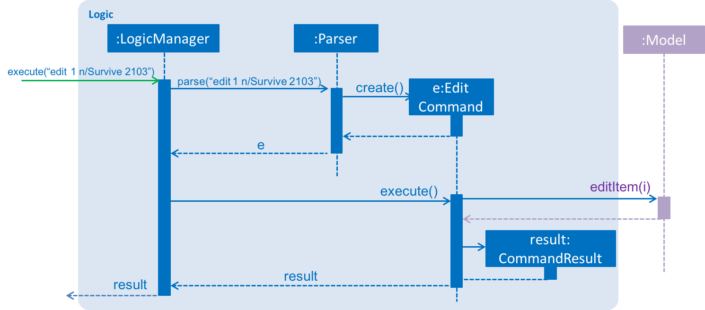

# Developer Guide

* [Setting Up](#setting-up)
* [Design](#design)
* [Implementation](#implementation)
* [Testing](#testing)
* [Dev Ops](#dev-ops)
* [Appendix A: User Stories] (#appendix-a--user-stories)
* [Appendix B: Use Cases] (#appendix-b--use-cases)
* [Appendix C: Non Functional Requirements] (#appendix-c--non-functional-requirements)
* [Appendix D: Glossary] (#appendix-d--glossary)
* [Appendix E : Product Survey](#appendix-e-product-survey)

## Setting up

#### Prerequisites

1. **JDK `1.8.0_60`**  or later 

    > Having any Java 8 version is not enough.  
    This app will not work with earlier versions of Java 8.

2. **Eclipse** IDE
3. **e(fx)clipse** plugin for Eclipse (Do the steps 2 onwards given in
   [this page](http://www.eclipse.org/efxclipse/install.html#for-the-ambitious))
4. **Buildship Gradle Integration** plugin from the Eclipse Marketplace

#### Importing the project into Eclipse

0. Fork this repo, and clone the fork to your computer
1. Open Eclipse (Note: Ensure you have installed the **e(fx)clipse** and **buildship** plugins as given
   in the prerequisites above)
2. Click `File` > `Import`
3. Click `Gradle` > `Gradle Project` > `Next` > `Next`
4. Click `Browse`, then locate the project's directory
5. Click `Finish`

  > * If you are asked whether to 'keep' or 'overwrite' config files, choose to 'keep'.
  > * Depending on your connection speed and server load, it can even take up to 30 minutes for the set up to finish
      (This is because Gradle downloads library files from servers during the project set up process)
  > * If Eclipse auto-changed any settings files during the import process, you can discard those changes.

## Design

### Architecture

 
The **_Architecture Diagram_** given above explains the high-level design of the App.
Given below is a quick overview of each component.

`Main` has only one class called [`MainApp`](../src/main/java/seedu/taskmanager/MainApp.java). It is responsible for,
* At app launch: Initializes the components in the correct sequence, and connect them up with each other.
* At shut down: Shuts down the components and invoke cleanup method where necessary.

[**`Commons`**](#common-classes) represents a collection of classes used by multiple other components.
Two of those classes play important roles at the architecture level.
* `EventsCentre` : This class (written using [Google's Event Bus library](https://github.com/google/guava/wiki/EventBusExplained))
  is used by components to communicate with other components using events (i.e. a form of _Event Driven_ design)
* `LogsCenter` : Used by many classes to write log messages to the App's log file.

The rest of the App consists four components.
* [**`UI`**](#ui-component) : The UI of the App.
* [**`Logic`**](#logic-component) : The command executor.
* [**`Model`**](#model-component) : Holds the data of the App in-memory.
* [**`Storage`**](#storage-component) : Reads data from, and writes data to, the hard disk.

Each of the four components
* Defines its _API_ in an `interface` with the same name as the Component.
* Exposes its functionality using a `{Component Name}Manager` class.

For example, the `Logic` component (see the class diagram given below) defines it's API in the `Logic.java`
interface and exposes its functionality using the `LogicManager.java` class. 
 

The _Sequence Diagram_ below shows how the components interact for the scenario where the user issues the
command `edit 1 n/Survive`.

>Note how the `Model` simply raises a `TaskManagerChangedEvent` when the Task Manager data are changed,
 instead of asking the `Storage` to save the updates to the hard disk.

The diagram below shows how the `EventsCenter` reacts to that event, which eventually results in the updates
being saved to the hard disk and the status bar of the UI being updated to reflect the 'Last Updated' time.  

> Note how the event is propagated through the `EventsCenter` to the `Storage` and `UI` without `Model` having
  to be coupled to either of them. This is an example of how this Event Driven approach helps us reduce direct
  coupling between components.

The sections below give more details of each component.

### UI component

 

**API** : [`Ui.java`](../src/main/java/seedu/taskmanager/ui/Ui.java)

The UI consists of a `MainWindow` that is made up of parts e.g.`CommandBox`, `ResultDisplay`, `ItemDetailsPanel`,
`StatusBarFooter`,  etc. All these, including the `MainWindow`, inherit from the abstract `UiPart` class
and they can be loaded using the `UiPartLoader`.

The `UI` component uses JavaFx UI framework. The layout of these UI parts are defined in matching `.fxml` files
 that are in the `src/main/resources/view` folder. 
 For example, the layout of the [`MainWindow`](../src/main/java/seedu/taskmanager/ui/MainWindow.java) is specified in
 [`MainWindow.fxml`](../src/main/resources/view/MainWindow.fxml)

The `UI` component,
* Executes user commands using the `Logic` component.
* Binds itself to some data in the `Model` so that the UI can auto-update when data in the `Model` change.
* Responds to events raised from various parts of the App and updates the UI accordingly.

### Logic component

 

**API** : [`Logic.java`](../src/main/java/seedu/taskmanager/logic/Logic.java)

1. `Logic` uses the `Parser` class to parse the user command.
2. This results in a `Command` object which is executed by the `LogicManager`.
3. The command execution can affect the `Model` (e.g. adding an item) and/or raise events.
4. The result of the command execution is encapsulated as a `CommandResult` object which is passed back to the `Ui`.

Given below is the Sequence Diagram for interactions within the `Logic` component for the `execute("edit 1 n/Survive 2103")`
 API call. 
 

### Model component

 

**API** : [`Model.java`](../src/main/java/seedu/taskmanager/model/Model.java)

The `Model`,
* stores a `UserPref` object that represents the user's preferences.
* stores the Taskmanager data.
* exposes a `UnmodifiableObservableList<ReadOnlyItem>` that can be 'observed' e.g. the UI can be bound to this list
  so that the UI automatically updates when the data in the list change.
* does not depend on any of the other three components.

### Storage component

 

**API** : [`Storage.java`](../src/main/java/seedu/taskmanager/storage/Storage.java)

The `Storage` component,
* can save `UserPref` objects in json format and read it back.
* can save the Taskmanager data in xml format and read it back.
* can save the Taskmanager data at a specified location and access the data accordingly.

### Common classes

Classes used by multiple components are in the `seedu.taskmanager.commons` package.

## Implementation

### Logging

We are using `java.util.logging` package for logging. The `LogsCenter` class is used to manage the logging levels
and logging destinations.

* The logging level can be controlled using the `logLevel` setting in the configuration file
  (See [Configuration](#configuration))
* The `Logger` for a class can be obtained using `LogsCenter.getLogger(Class)` which will log messages according to
  the specified logging level
* Currently log messages are output through: `Console` and to a `.log` file.

**Logging Levels**

* `SEVERE` : Critical problem detected which may possibly cause the termination of the application
* `WARNING` : Can continue, but with caution
* `INFO` : Information showing the noteworthy actions by the App
* `FINE` : Details that is not usually noteworthy but may be useful in debugging
  e.g. print the actual list instead of just its size

### Configuration

Certain properties of the application can be controlled (e.g App name, logging level) through the configuration file
(default: `config.json`):

## Testing

Tests can be found in the `./src/test/java` folder.

**In Eclipse**:
> If you are not using a recent Eclipse version (i.e. _Neon_ or later), enable assertions in JUnit tests
  as described [here](http://stackoverflow.com/questions/2522897/eclipse-junit-ea-vm-option).

* To run all tests, right-click on the `src/test/java` folder and choose
  `Run as` > `JUnit Test`
* To run a subset of tests, you can right-click on a test package, test class, or a test and choose
  to run as a JUnit test.

**Using Gradle**:
* See [UsingGradle.md](UsingGradle.md) for how to run tests using Gradle.

We have two types of tests:

1. **GUI Tests** - These are _System Tests_ that test the entire App by simulating user actions on the GUI.
   These are in the `guitests` package.

2. **Non-GUI Tests** - These are tests not involving the GUI. They include,
   1. _Unit tests_ targeting the lowest level methods/classes.  
      e.g. `seedu.taskmanager.commons.UrlUtilTest`
   2. _Integration tests_ that are checking the integration of multiple code units
     (those code units are assumed to be working). 
      e.g. `seedu.taskmanager.storage.StorageManagerTest`
   3. Hybrids of unit and integration tests. These test are checking multiple code units as well as
      how the are connected together. 
      e.g. `seedu.taskmanager.logic.LogicManagerTest`

**Headless GUI Testing** :
Thanks to the [TestFX](https://github.com/TestFX/TestFX) library we use,
 our GUI tests can be run in the _headless_ mode.
 In the headless mode, GUI tests do not show up on the screen.
 That means the developer can do other things on the Computer while the tests are running. 
 See [UsingGradle.md](UsingGradle.md#running-tests) to learn how to run tests in headless mode.

## Dev Ops

### Build Automation

See [UsingGradle.md](UsingGradle.md) to learn how to use Gradle for build automation.

### Continuous Integration

We use [Travis CI](https://travis-ci.org/) to perform _Continuous Integration_ on our projects.
See [UsingTravis.md](UsingTravis.md) for more details.

### Making a Release

Here are the steps to create a new release.

 1. Generate a JAR file [using Gradle](UsingGradle.md#creating-the-jar-file).
 2. Tag the repo with the version number. e.g. `v0.1`
 2. [Crete a new release using GitHub](https://help.github.com/articles/creating-releases/)
    and upload the JAR file your created.

### Managing Dependencies

A project often depends on third-party libraries. For example, Taskmanager depends on the
[Jackson library](http://wiki.fasterxml.com/JacksonHome) for XML parsing. Managing these _dependencies_
can be automated using Gradle. For example, Gradle can download the dependencies automatically, which
is better than these alternatives. 
a. Include those libraries in the repo (this bloats the repo size) 
b. Require developers to download those libraries manually (this creates extra work for developers) 

## Appendix A : User Stories

Priorities: High (must have) - `* * *`, Medium (nice to have)  - `* *`,  Low (unlikely to have) - `*`

Priority | As a ... | I want to ...           | So that I can...
-------- | :------- | :---------------------- | :---------------
`* * *`  | new user | see usage instructions  | use the app as intended
`* * *`  | user     | add a new task | add something to my todo list without a time restrictions
`* * *`  | user     | add a new deadline      | add something to my todo list with a deadline
`* * *`  | user     | add a new event         | add something to my todo list with a start and end time
`* * *`  | user     | view all tasks/deadlines/events   | view my entire todo list
`* * *`  | user     | view all undone tasks/deadlines/events | view items I need to work on
`* * *`  | user     | edit a task/deadline/event       | change the details of a task/deadline/event
`* * *`  | user     | mark a task/deadline as done| know that a task/deadline is completed
`* * *`  | user     | delete a task/deadline/event     | remove an item that is no longer necessary
`* * *`  | user     | set a deadline for task | know when to finish the task by
`* * *`  | user     | search tasks by name    | find the task that I need to do
`* * *`  | user     | undo the last command   | undo an unintentional operation
`* * *`  | user     | have multiple keywords/shortcuts for a command | be flexible about how I enter a command
`* * *`  | user     | specify the data storage location | use cloud syncing services and access my todo list on different devices
`* *`    | user     | sort uncompleted deadlines by deadline | know which deadline I should finish first

## Appendix B : Use Cases

(For all use cases below, the **System** is the `taskmanager` and the **Actor** is the `user`, unless specified otherwise)

#### Use case: Add a task/deadline/event
**Main Success Scenario (MSS)**

1. User requests to add task/deadline/event (TDE).
2. TaskManager adds TDE and displays result.  
Use case ends.

**Extensions**
>1a. Some or all required parameters are missing.
>1a1. TaskManager shows an error message.  
>Use case resumes at step 1.

#### Use case: Find an item
1. User requests to find an item by searching for a keyword
2. TaskManager lists the specific item

#### Use case: Edit a task/deadline/event
**MSS**

1. User requests to list task/deadline/event (TDE).
2. TaskManager shows a list of TDEs.
3. User requests to edit specific details of a specific TDE in the list.
4. TaskManager edits the TDE.  
Use case ends.

#### Use case: List all tasks
1.User requests to list all tasks
2.TaskManager shows a list of tasks

#### Use case: List all deadlines
1.User requests to list all deadlines
2.TaskManager shows a list of deadlines

#### Use case: List all events
1.User requests to list all events
2.TaskManager shows a list of events

**Extensions**

>2a. The TDE list is empty.  
>Use case ends.

>3a. The given index is invalid.
>3a1. TaskManager shows an error message.  
>Use case resumes at step 2.

>3b The given parameter is invalid.
>3b1 TaskManager shows an error message.  
>Use case resumes at step 2.

#### Use case: Delete an task/deadline/event

**MSS**

1. User requests to list task/deadline/event (TDE).
2. TaskManager shows a list of TDEs.
3. User requests to delete a specific TDE in the list.
4. TaskManager deletes the TDE.  
Use case ends.

**Extensions**

>2a. The TDE list is empty.  
>Use case ends.

>3a. The given index is invalid.
>3a1. TaskManager shows an error message.  
>Use case resumes at step 2.

>3b. User requests to delete two TDEs.
>3b1. TaskManager deletes the TDEs.  
>Use case ends.

#### Use case: Save data to a specific location

**MSS**

1. User requests to save data in a specified location.
2. TaskManager saves data to file in the specified location.  
Use case ends.

**Extensions**

>2a. The file path specified is invalid.
>2a1. TaskManager shows an error message.  
>Use case ends.>

## Appendix C : Non Functional Requirements

1. Should work on any [mainstream OS](#mainstream-os) as long as it has Java `1.8.0_60` or higher installed.
2. Should be able to hold up to 10000 TDE.
3. Should come with automated unit tests and open source code.
4. Should favor DOS style commands over Unix-style commands.

## Appendix D : Glossary

##### Deadline

> What you need to attend to with a specific deadline (e.g homework that requires submission)

##### Task:

> What you need to attend to that has no specific time/deadline (e.g call your mum to chat)

##### Event:

> What you need to attend to that has a start time and an end time (e.g lecture)

##### Date:

> Date is given in format `YYYY-MM-DD`

##### Time:

> Time is given in format `HH:MM`

##### Keyword:

> Keyword in name of deadline, task, or event

##### Mainstream OS

> Windows, Linux, Unix, OS-X

## Appendix E : Product Survey

Product Name | Strengths | Weaknesses           | Remarks
-------- | :------- | :---------------------- | :---------------
Google Calendar  | Used worldwide, easy to use, understands NLP | Slow, requires internet access, has crashed in recent history  | Our application works offline and is both faster and has NLP as well
Todo.txt        | Works across devices and operating systems    | Quite complicated for new users to pick up as it has a whole range of shortcut-commands | Our application accepts both short cut commands and normal commands, and syncs with Google Calendar to work across devices and platforms
Swipes          | Simple, cross-platform                        | Unable to specify data storage location  | Our application allows users to specify a location to save data
Fantastical     | Uses NLP, quick access in mini window         | Works only on Mac/iOS platform | Our application works on major computer operating systems, and since it allows syncing onto Google Calendar, one can even use mobile devices to view and update their task manager
Apple Reminders | Easy-to-use, fast, backed up on the cloud     | Only works in Apple's ecosystem  | Our application allows users to back up to Google Calendar, which works on most devices and thus most people can use it, along with backing up their data to the cloud through Google Calendar
Sunrise  | Works across platforms and devices     | Requires internet access to work | Our application works both online and offline
