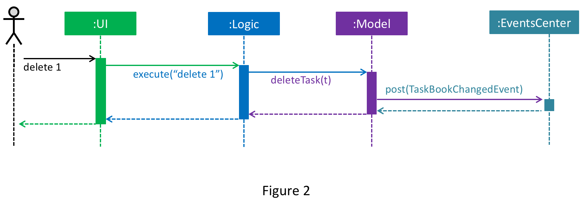

# Developer Guide 

* [Setting Up](#setting-up)
* [Design](#design)
* [Implementation](#implementation)
* [Testing](#testing)
* [Dev Ops](#dev-ops)
* [Appendix A: User Stories](#appendix-a--user-stories)
* [Appendix B: Use Cases](#appendix-b--use-cases)
* [Appendix C: Non Functional Requirements](#appendix-c--non-functional-requirements)
* [Appendix D: Glossary](#appendix-d--glossary)
* [Appendix E : Product Survey](#appendix-e--product-survey)

## Setting up

#### Prerequisites

1. **JDK `1.8.0_60`**  or later 

    > Having any Java 8 version is not enough.  
    This application will not work with earlier versions of Java 8.
    
2. **Eclipse** IDE

3. **e(fx)clipse** plugin for Eclipse (Do the steps 2 onwards given in
   [this page](http://www.eclipse.org/efxclipse/install.html#for-the-ambitious))
   
4. **Buildship Gradle Integration** plugin from the [Eclipse Marketplace](https://marketplace.eclipse.org/content/buildship-gradle-integration)

#### Importing the project into Eclipse

0. Fork this repo, and clone the fork to your computer
1. Open Eclipse (Note: Ensure you have installed the **e(fx)clipse** and **buildship** plugins as given 
   in the prerequisites above)
2. Click `File` > `Import`
3. Click `Gradle` > `Gradle Project` > `Next` > `Next`
4. Click `Browse`, then locate the project's directory
5. Click `Finish`

  > * If you are asked whether to 'keep' or 'overwrite' config files, choose to 'keep'.
  > * Depending on your connection speed and server load, it can even take up to 30 minutes for the set up to finish
      (This is because Gradle downloads library files from servers during the project set up process)
  > * If Eclipse auto-changed any settings files during the import process, you can discard those changes.
  
#### Troubleshooting project setup

**Problem: Eclipse reports compile errors after new commits are pulled from Git**
* Reason: Eclipse fails to recognize new files that appeared due to the Git pull. 
* Solution: Refresh the project in Eclipse:  
  Right click on the project (in Eclipse package explorer), choose `Gradle` -> `Refresh Gradle Project`.
  
**Problem: Eclipse reports some required libraries missing**
* Reason: Required libraries may not have been downloaded during the project import. 
* Solution: [Run tests using Gradle](UsingGradle.md) once (to refresh the libraries).
 

## Design

### Architecture

 
The **_Architecture Diagram_** given above explains the high-level design of the App.
Given below is a quick overview of each component.

`Main` has only one class called [`MainApp`](../src/main/java/seedu/address/MainApp.java). It is responsible for,
* At app launch: Initializes the components in the correct sequence, and connect them up with each other.
* At shut down: Shuts down the components and invoke cleanup method where necessary.

[**`Commons`**](#common-classes) represents a collection of classes used by multiple other components.
Two of those classes play important roles at the architecture level.
* `EventsCentre` : This class (written using [Google's Event Bus library](https://github.com/google/guava/wiki/EventBusExplained))
  is used by components to communicate with other components using events (i.e. a form of _Event Driven_ design)
* `LogsCenter` : Used by many classes to write log messages to the App's log file.

The rest of the App consists four components.
* [**`UI`**](#ui-component) : The UI of tha App.
* [**`Logic`**](#logic-component) : The command executor.
* [**`Model`**](#model-component) : Holds the data of the App in-memory.
* [**`Storage`**](#storage-component) : Reads data from, and writes data to, the hard disk.

Each of the four components
* Defines its _API_ in an `interface` with the same name as the Component.
* Exposes its functionality using a `{Component Name}Manager` class.

For example, the `Logic` component (see the class diagram given below) defines it's API in the `Logic.java`
interface and exposes its functionality using the `LogicManager.java` class. 
 

The _Sequence Diagram_ below shows how the components interact for the scenario where the user issues the
command `delete 3`.

>Note how the `Model` simply raises a `AddressBookChangedEvent` when the Address Book data are changed,
 instead of asking the `Storage` to save the updates to the hard disk.

The diagram below shows how the `EventsCenter` reacts to that event, which eventually results in the updates
being saved to the hard disk and the status bar of the UI being updated to reflect the 'Last Updated' time.  

> Note how the event is propagated through the `EventsCenter` to the `Storage` and `UI` without `Model` having
  to be coupled to either of them. This is an example of how this Event Driven approach helps us reduce direct 
  coupling between components.

The sections below give more details of each component.

### UI component

 

**API** : [`Ui.java`](../src/main/java/seedu/address/ui/Ui.java)

The UI consists of a `MainWindow` that is made up of parts e.g.`CommandBox`, `ResultDisplay`, `PersonListPanel`,
`StatusBarFooter`, `BrowserPanel` etc. All these, including the `MainWindow`, inherit from the abstract `UiPart` class
and they can be loaded using the `UiPartLoader`.

The `UI` component uses JavaFx UI framework. The layout of these UI parts are defined in matching `.fxml` files
 that are in the `src/main/resources/view` folder. 
 For example, the layout of the [`MainWindow`](../src/main/java/seedu/address/ui/MainWindow.java) is specified in
 [`MainWindow.fxml`](../src/main/resources/view/MainWindow.fxml)

The `UI` component,
* Executes user commands using the `Logic` component.
* Binds itself to some data in the `Model` so that the UI can auto-update when data in the `Model` change.
* Responds to events raised from various parts of the App and updates the UI accordingly.

### Logic component

 

**API** : [`Logic.java`](../src/main/java/seedu/address/logic/Logic.java)

1. `Logic` uses the `Parser` class to parse the user command.
2. This results in a `Command` object which is executed by the `LogicManager`.
3. The command execution can affect the `Model` (e.g. adding a person) and/or raise events.
4. The result of the command execution is encapsulated as a `CommandResult` object which is passed back to the `Ui`.

Given below is the Sequence Diagram for interactions within the `Logic` component for the `execute("delete 1")`
 API call. 
 

### Model component

 

**API** : [`Model.java`](../src/main/java/seedu/address/model/Model.java)

The `Model`,
* stores a `UserPref` object that represents the user's preferences.
* stores the Address Book data.
* exposes a `UnmodifiableObservableList<ReadOnlyPerson>` that can be 'observed' e.g. the UI can be bound to this list
  so that the UI automatically updates when the data in the list change.
* does not depend on any of the other three components.

### Storage component

 

**API** : [`Storage.java`](../src/main/java/seedu/address/storage/Storage.java)

The `Storage` component,
* can save `UserPref` objects in json format and read it back.
* can save the Address Book data in xml format and read it back.

### Common classes

Classes used by multiple components are in the `seedu.addressbook.commons` package.

## Implementation

### Logging

We are using `java.util.logging` package for logging. The `LogsCenter` class is used to manage the logging levels
and logging destinations.

* The logging level can be controlled using the `logLevel` setting in the configuration file
  (See [Configuration](#configuration))
* The `Logger` for a class can be obtained using `LogsCenter.getLogger(Class)` which will log messages according to
  the specified logging level
* Currently log messages are output through: `Console` and to a `.log` file.

**Logging Levels**

* `SEVERE` : Critical problem detected which may possibly cause the termination of the application
* `WARNING` : Can continue, but with caution
* `INFO` : Information showing the noteworthy actions by the App
* `FINE` : Details that is not usually noteworthy but may be useful in debugging
  e.g. print the actual list instead of just its size

### Configuration

Certain properties of the application can be controlled (e.g App name, logging level) through the configuration file 
(default: `config.json`):

## Testing

Tests can be found in the `./src/test/java` folder.

**In Eclipse**:
* To run all tests, right-click on the `src/test/java` folder and choose
  `Run as` > `JUnit Test`
* To run a subset of tests, you can right-click on a test package, test class, or a test and choose
  to run as a JUnit test.

**Using Gradle**:
* See [UsingGradle.md](UsingGradle.md) for how to run tests using Gradle.

We have two types of tests:

1. **GUI Tests** - These are _System Tests_ that test the entire App by simulating user actions on the GUI. 
   These are in the `guitests` package.
  
2. **Non-GUI Tests** - These are tests not involving the GUI. They include,
   1. _Unit tests_ targeting the lowest level methods/classes.  
      e.g. `seedu.address.commons.UrlUtilTest`
   2. _Integration tests_ that are checking the integration of multiple code units 
     (those code units are assumed to be working). 
      e.g. `seedu.address.storage.StorageManagerTest`
   3. Hybrids of unit and integration tests. These test are checking multiple code units as well as 
      how the are connected together. 
      e.g. `seedu.address.logic.LogicManagerTest`
  
**Headless GUI Testing** :
Thanks to the [TestFX](https://github.com/TestFX/TestFX) library we use,
 our GUI tests can be run in the _headless_ mode. 
 In the headless mode, GUI tests do not show up on the screen.
 That means the developer can do other things on the Computer while the tests are running. 
 See [UsingGradle.md](UsingGradle.md#running-tests) to learn how to run tests in headless mode.
 
#### Troubleshooting tests
 **Problem: Tests fail because NullPointException when AssertionError is expected**
 * Reason: Assertions are not enabled for JUnit tests. 
   This can happen if you are not using a recent Eclipse version (i.e. _Neon_ or later)
 * Solution: Enable assertions in JUnit tests as described 
   [here](http://stackoverflow.com/questions/2522897/eclipse-junit-ea-vm-option).  
   Delete run configurations created when you ran tests earlier.

## Dev Ops

### Build Automation

See [UsingGradle.md](UsingGradle.md) to learn how to use Gradle for build automation.

### Continuous Integration

We use [Travis CI](https://travis-ci.org/) to perform _Continuous Integration_ on our projects.
See [UsingTravis.md](UsingTravis.md) for more details.

### Making a Release

Here are the steps to create a new release.
 
 1. Generate a JAR file [using Gradle](UsingGradle.md#creating-the-jar-file).
 2. Tag the repo with the version number. e.g. `v0.1`
 3. [Create a new release using GitHub](https://help.github.com/articles/creating-releases/) 
    and upload the JAR file your created.
   
### Managing Dependencies

A project often depends on third-party libraries. For example, Address Book depends on the
[Jackson library](http://wiki.fasterxml.com/JacksonHome) for XML parsing. Managing these _dependencies_
can be automated using Gradle. For example, Gradle can download the dependencies automatically, which
is better than these alternatives. 
a. Include those libraries in the repo (this bloats the repo size) 
b. Require developers to download those libraries manually (this creates extra work for developers) 

## Appendix A : User Stories

Priorities: High (must have) - `* * *`, Medium (nice to have)  - `* *`,  Low (unlikely to have) - `*`

Priority | As a ... | I want to ... | So that I can...
-------- | :-------- | :--------- | :-----------
`* * *` | user | add a new task with a deadline and priority level | sort by urgency and importance
`* * *` | user | know if any events clash | reschedule
`* * *` | user | see all current tasks on the calendar | know what I have to do
`* * *` | new user | see usage instructions | refer to instructions when I forget how to use the App
`* * *` | user | delete a task | remove entries that I no longer need
`* * *` | user | modify a task’s deadline or priority level | account for changes in deadlines and importance
`* * *` | user | find a task by name | locate details of persons without having to go through the entire list
`* * *` | user | know the most urgent and important task | do it first
`* *` | user | be reminded when a deadline is approaching | not forget to complete the task
`* *` | user | schedule my free time | work on tasks
`* *` | user | set tasks to autorepeat | not have to reschedule repeating tasks
`* *` | user | see a weekly view of tasks | know what is ahead of me
`* *` | user | see the list of overdue tasks if there is any at the start of the day | get things done still
`* *` | user | group all relevant tasks | manage them in groups
`*` | Advance user | outline procedures needed to complete a task | remember how to approach said tasks
`*` | user with many tasks in the task manager | sort tasks by name | locate a task easily
`*` | user with friends | share a task with my friends | delegate tasks in a group
`*` | user | store all necessary contacts | bring up contact details when I need them
`*` | user | delegate a task to my friends | lessen the workload
`* *` | user | attach relevant files or notes to the task | keep project data in one place
`*` | Advanced user | track the amount of time spend on a task | detect and manage time wasters
`*` | user | keep track of ideas and history | not forget ideas
`*` | user | see the number of tasks completed at the end of the day | have a sense of accomplishment. If 0 tasks though there is at least one task to be completed for that day, encourage the user to work harder

{More to be added}

## Appendix B : Use Cases

(For all use cases below, the **System** is the `TaskManager` and the **Actor** is the `user`, unless specified otherwise)

### Use case 1 - Add a task

**MSS**

1. System prompts the user to input a command.
2. Actor enters the add command and the details of the task.
3. System add the task to the list.
4. System will indicate through a message that (TASKNAME added).
5. The System will show the updated list.
6. Use case ends.

**Extensions**

2a. Actor fails to input details of the task.

> 2a1. System will respond with an error message (e.g. "Invalid command format!")

> Use case resumes at step 1

2b. Actor enters in a task with the same name and details.

> 2b1. System displays an error message ("This task already exists in the task manager")

> Use case resumes at step 1

### Use case 2 - Delete a task

**MSS**

1. Actor requests the lists from the System.
2. System shows the task list.
3. Actor inputs the delete command of a task based on its index on the list.
4. System will delete the task.
5. System displays a feedback message that the task has been deleted.
6. The displayed list will be updated to reflect the new state.
7. Use case ends.

**Extensions**

1a. The list is empty

> Use case ends

3a. The Actor inputs an invalid index

> 3a1. System will display an error message ("The index inputted is invalid")

> Use case resumes at step 2

### Use case 3 -  Edit a task

**MSS**

1. Actor requests the list of the task manager (Can be general using `list` command or more specific using `find`.)
2. Actor inputs the edit command, the index of the task being changed and the relevant details
3. System will update the task with its new details.
4. System will display a feedback message that the task has been updated successfully.
5. List displayed will reflect the updated details of the specific task.
6. Use case ends. 

**Extensions**

2a. Actor inputs an invalid index

> 2a1. System will display an error message ("The index inputted is invalid")

> Use case resumes at step 2.

2b. Actor inputs incorrect detail format.

> 2b1. System will display an error message ("Invalid command format!")

> Use case resumes at step 2.

## Appendix C : Non Functional Requirements

1. Should work on any [mainstream OS](#mainstream-os) as long as it has Java `1.8.0_60` or higher installed.
2. Should be able to hold 10000 tasks.
3. Should come with automated unit tests and open source code.
4. Should favor DOS style commands over Unix-style commands.
5. Should be able to have user designated UI customizations.
6. Should not violate any copyrighted material.
7. Should have a response time that is less than a second.
8. Should be able to function in an offline state.
9. Should not require any extensions beyond the available software to function.
10. Should store data in an editable format.
11. Should run on royalty free libraries and API's.

## Appendix D : Glossary

##### Mainstream OS

> Windows, Linux, Unix, OS-X

## Appendix E : Product Survey

### Google Calendar Quick Add 

**Strengths**

1. Has an intuitive User Interface. 
2. Is able to have user shared schedules to accomadate for better planning.

**Weaknesses**

1. Indicates an event clashes but does not prevent you from creating the event.
2. Inability to customize events appering on your calendar.

### Todoist

**Strengths**

1. Able to access your tasks on over 10 different platforms.
2. Has the ability to allow users to collaborate on shared tasks.

**Weaknesses**

1. Does not allow user to set a location for the task.
2. Has no web based capabilities.

### dapulse

**Strengths**

1. Able to customize labels for grouped tasks (in a column) 
2. The in built scheduling service is convenient.

**Weaknesses**

1. If the task is simple the task scheduling process becomes overcomplicated.

### Things

**Strengths**

1. Has the ability to link tasks that fall under the same category.
2. The Graphical User Interface is intuitive and aesthetically pleasing.

**Weaknesses**

1. Is cost prohibitive.
2. Not available on certain platforms.

