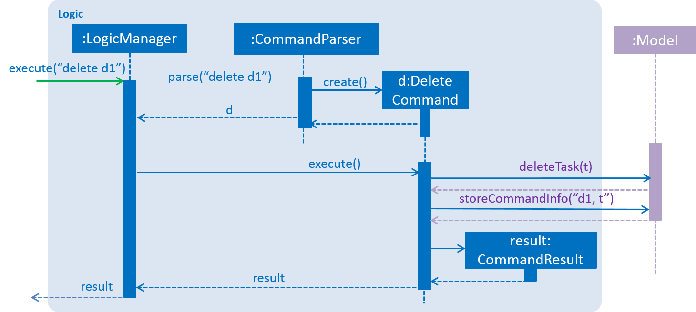

# Developer Guide 

* [Introduction](#introduction)
* [Setting Up](#setting-up)
* [Design](#design)
* [Implementation](#implementation)
* [Testing](#testing)
* [Dev Ops](#dev-ops)
* [Appendix A: User Stories](#appendix-a--user-stories)
* [Appendix B: Use Cases](#appendix-b--use-cases)
* [Appendix C: Non Functional Requirements](#appendix-c--non-functional-requirements)
* [Appendix D: Glossary](#appendix-d--glossary)
* [Appendix E : Product Survey](#appendix-e--product-survey)

## Introduction

TasKitty is an easy-to-use task manager designed specially for the average computer or laptop user who wants to keep track of their busy schedules. It is a Java desktop application that is perfect for keyboard lovers, as it implements a command-line interface in its GUI.

This guide describes the design and implementation of TasKitty. It will help you understand how TasKitty works and how you can further contribute to its development. We have organised this guide into the 4 major components that make up the core functionality of TasKitty, so that you can have an overview of how these essential components are linked before reading further into the parts that make up each component respectively.

## Setting up

### Prerequisites

1. **JDK `1.8.0_60`**  or later 

    > Having any Java 8 version is not enough.  
    This app will not work with earlier versions of Java 8.
   
2. **Eclipse** IDE
3. **e(fx)clipse** plugin for Eclipse (Do the steps 2 onwards given in
   [this page](http://www.eclipse.org/efxclipse/install.html#for-the-ambitious))
4. **Buildship Gradle Integration** plugin from the Eclipse Marketplace

### Importing the project into Eclipse

0. Fork this repo, and clone the fork to your computer
1. Open Eclipse (Note: Ensure you have installed the **e(fx)clipse** and **buildship** plugins as given 
   in the prerequisites above)
2. Click `File` > `Import`
3. Click `Gradle` > `Gradle Project` > `Next` > `Next`
4. Click `Browse`, then locate the project's directory
5. Click `Finish`

  > * If you are asked whether to 'keep' or 'overwrite' config files, choose to 'keep'.
  > * Depending on your connection speed and server load, it can  take up to 30 minutes for the set up to finish
      (This is because Gradle downloads library files from servers during the project set up process).
  > * You can discard any changes that Eclipse may have auto-changed in any settings files during the import process.

## Design

### Architecture
  

 

<em>Fig. 1 Architecture Diagram</em>

  

The Figure 1 above, the _Architecture Diagram_, explains the high-level design of the task manager.
Given below is a quick overview of each component.

`Main` has only one class called [`MainApp`](../src/main/java/seedu/taskitty/MainApp.java). It is responsible for
* initializing the components in the correct sequence, and connecting them with each other at app launch.
* shutting down the components and invoking the cleanup method where necessary at shut down.

[**`Commons`**](#common-classes) represents a collection of classes used by multiple other components.
Two of those classes play important roles at the architecture level:
* `EventsCentre` : This class (written using [Google's Event Bus library](https://github.com/google/guava/wiki/EventBusExplained))
  is used by components to communicate with other components using events (i.e. a form of _Event Driven_ design).
* `LogsCenter` : This class is used by many classes to write log messages to the App's log file.

The rest of the App consists of four components.
* [**`UI`**](#ui-component) : Handles user interactions with the application.
* [**`Logic`**](#logic-component) : Executes commands.
* [**`Model`**](#model-component) : Holds the data of the App in-memory.
* [**`Storage`**](#storage-component) : Reads data from, and writes data to, the hard disk.

Each of the four components
* defines its _API_ in an `interface` with the same name as the component.
* exposes its functionality using a `{Component Name}Manager` class.
  

 

<em>Fig. 2 Logic Class Diagram</em>

  

For example, Figure 2 above shows the `Logic` component that defines its API in the `Logic.java`
interface and exposes its functionality using the `LogicManager.java` class. 
  

 

<em>Fig. 3 Sequence Diagram for Delete Task</em>

  

Figure 3 above, the _Sequence Diagram_, shows how the components interact for the scenario where the user issues the
command `delete 1`.

>Note how the `Model` simply raises a `TaskManagerChangedEvent` when the TaskManager data are changed,
 instead of asking the `Storage` to save the updates to the hard disk.
  

 

<em>Fig. 4 Sequence Diagram for Delete Task Event Handling</em>

  

Figure 4 above shows how the `EventsCenter` reacts to that event, which eventually results in the updates
being saved to the hard disk and the status bar of the UI being updated to reflect the 'Last Updated' time.  

> Note how the event is propagated through the `EventsCenter` to the `Storage` and `UI` without `Model` having
  to be coupled to either of them. This is an example of how this Event Driven approach helps us reduce direct 
  coupling between components.

The sections below give more details of each component.

### UI component
  

 

<em>Fig. 5 UI Class Diagram</em>

  

**API** : [`Ui.java`](../src/main/java/seedu/taskitty/ui/Ui.java) 
Figure 5 shows the UI class diagram. 
The UI consists of a `MainWindow` that is made up of parts e.g.`CommandBox`, `ResultDisplay`, `TaskListPanel`,
`StatusBarFooter`, `EventsListPanel` etc. All these, including the `MainWindow`, inherit from the abstract `UiPart` class
and they can be loaded using the `UiPartLoader`. 
The `UI` component uses JavaFx UI framework. The layouts of these UI parts are defined in matching `.fxml` files
 that are in the `src/main/resources/view` folder. 
 For example, the layout of the [`MainWindow`](../src/main/java/seedu/taskitty/ui/MainWindow.java) is specified in
 [`MainWindow.fxml`](../src/main/resources/view/MainWindow.fxml).

The `UI` component:
* executes user commands using the `Logic` component.
* binds itself to some data in the `Model` so that the UI can auto-update when data in the `Model` change.
* responds to events raised from various parts of the App and updates the UI accordingly.

### Logic component
  

 

<em>Fig. 6 Logic Class Diagram</em>

  

**API** : [`Logic.java`](../src/main/java/seedu/taskitty/logic/Logic.java) 
Figure 6 shows the Logic class diagram. 
`Logic` uses the `Parser` class to parse the user command. 
This results in a `Command` object which is executed by the `LogicManager`. 
The command execution can affect the `Model` (e.g. adding a task) and/or raise events. 
The result of the command execution is encapsulated as a `CommandResult` object which is passed back to the `Ui`.
  

 

<em>Fig. 7 Delete Task Sequence Diagram for Logic</em>

  

Figure 7 above shows the Sequence Diagram for interactions within the `Logic` component for the `execute("delete 1")`
API call. 

### Model component
  

 

<em>Fig. 8 Model Class Diagram</em>

  

**API** : [`Model.java`](../src/main/java/seedu/taskitty/model/Model.java) 
Figure 8 above shows the Model class diagram. 
The `Model`component:
* stores a `UserPref` object that represents the user's preferences.
* stores the Task Manager data.
* exposes a `UnmodifiableObservableList<ReadOnlyTask>` that can be 'observed' e.g. the UI can be bound to this list
  so that the UI automatically updates when the data in the list change.
* does not depend on any of the other three components.

### Storage component
  

 

<em>Fig. 9 Storage Class Diagram</em>

  

**API** : [`Storage.java`](../src/main/java/seedu/taskitty/storage/Storage.java) 
Figure 9 above shows the Storage class diagram. 
The `Storage` component:
* saves `UserPrefs` objects in json format and reads it back.
* saves the Task Manager data in xml format and reads it back.

### Common classes

Classes used by multiple components are in the `seedu.taskitty.commons` package.

## Implementation

### Configuration

Certain properties of the application can be controlled (e.g App name, logging level) through the configuration file 
(default: `config.json`).

### Logging

We are using `java.util.logging` package for logging. The `LogsCenter` class is used to manage the logging levels
and logging destinations.

* The logging level can be controlled using the `logLevel` setting in the configuration file
  (See [Configuration](#configuration)).
* The `Logger` for a class can be obtained using `LogsCenter.getLogger(Class)` which will log messages according to
  the specified logging level.
* Currently log messages are output through: `Console` and to a `.log` file.

**Logging Levels**

* `SEVERE` : Critical problem detected which may possibly cause the termination of the application
* `WARNING` : Can continue, but with caution
* `INFO` : Information showing the noteworthy actions by the App
* `FINE` : Details that are not usually noteworthy but may be useful in debugging
  e.g. print the actual list instead of just its size

## Testing

Tests can be found in the `./src/test/java` folder.

**In Eclipse**:
> If you are not using a recent Eclipse version (i.e. _Neon_ or later), enable assertions in JUnit tests
  as described [here](http://stackoverflow.com/questions/2522897/eclipse-junit-ea-vm-option).

* To run all tests, right-click on the `src/test/java` folder and choose
  `Run as` > `JUnit Test`.
* To run a subset of tests, right-click on a test package, test class, or a test and choose
  to run as a JUnit test.

**Using Gradle**:
* See [UsingGradle.md](UsingGradle.md) for how to run tests using Gradle.

We have two types of tests:

1. **GUI Tests** - These are _System Tests_ that test the entire App by simulating user actions on the GUI. 
   These are in the `guitests` package.
  
2. **Non-GUI Tests** - These are tests not involving the GUI. They include,
   * _Unit tests_ that target the lowest level methods/classes.  
      e.g. `seedu.taskitty.commons.UrlUtilTest`
   * _Integration tests_ that check the integration of multiple code units 
     (those code units are assumed to be working). 
      e.g. `seedu.taskitty.storage.StorageManagerTest`
   * _Hybrids of unit and integration tests_ that check multiple code units as well as 
      how the are connected together. 
      e.g. `seedu.taskitty.logic.LogicManagerTest`
  
**Headless GUI Testing** :
Thanks to the [TestFX](https://github.com/TestFX/TestFX) library we use,
 our GUI tests can be run in the headless mode. 
 In the headless mode, GUI tests do not show up on the screen.
 That means the developer can do other things on the Computer while the tests are running.  
 See [UsingGradle.md](UsingGradle.md#running-tests) to learn how to run tests in headless mode.
  
## Dev Ops

### Build Automation

See [UsingGradle.md](UsingGradle.md) to learn how to use Gradle for build automation.

### Continuous Integration

We use [Travis CI](https://travis-ci.org/) to perform _Continuous Integration_ on our projects.
See [UsingTravis.md](UsingTravis.md) for more details.

### Making a Release

Here are the steps to create a new release:
 
 1. Generate a JAR file [using Gradle](UsingGradle.md#creating-the-jar-file).
 2. Tag the repo with the version number. e.g. `v0.1`.
 3. [Create a new release using GitHub](https://help.github.com/articles/creating-releases/) 
    and upload the JAR file your created.
   
### Managing Dependencies

A project often depends on third-party libraries. For example, Task Manager depends on the
[Jackson library](http://wiki.fasterxml.com/JacksonHome) for XML parsing. Managing these _dependencies_
can be automated using Gradle. For example, Gradle can download the dependencies automatically, which
is better than  
* including those libraries in the repo (this bloats the repo size) 
* requiring developers to download those libraries manually (this creates extra work for developers) 

## Appendix A : User Stories

Priorities: High (must have) - `* * *`, Medium (nice to have)  - `* *`,  Low (unlikely to have) - `*`

Priority | As a ... | I want to ... | So that I can...
-------- | :-------- | :--------- | :-----------
`* * *` | new user | see usage instructions | refer to instructions when I forget how to use the task manager
`* * *` | user | add new tasks with no date and time | keep track of tasks that have no date and time
`* * *` | user | add new tasks with deadlines | keep track of deadlines
`* * *` | user | add new tasks with start and end time | keep track of tasks with start time and end time
`* * *` | user | view all tasks today | keep track of my agenda for today
`* * *` | user | view all tasks for a specific date | keep track of my tasks
`* * *` | user | view all completed tasks | remember what I have completed
`* * *` | user | find a task using keywords | find a specific task easily
`* * *` | user | edit a task | update the details of specific tasks
`* * *` | user | edit deadline/event timeslot | track the changes in my schedule accordingly
`* * *` | user | delete a task | remove a task that is no longer required to be done
`* * *` | user | undo the latest action | undo accidental mistakes
`* * *` | user | mark a task as done | record what I have completed
`* * *` | user | store all tasks in a file | share and sync the file on different computers
`* *` | user | enter commands in any format | insert tasks more intuitively according to my own style
`* *` | user| be notified of overdue tasks | complete those tasks as soon as possible
`*` | user | add recurring tasks | avoid adding the same commands multiple times
`*` | user | view instructions as I type | remember less commands
`*` | user | use keyboard shortcuts | use the task manager more quickly

## Appendix B : Use Cases

(For all use cases below, the **Program** is the `Task Manager`, unless specified otherwise)

  
### Use case: Create new todo task

**MSS**

1. User creates new task with the name of the task only
2. Program saves the task with given name as a todo 

Use case ends

**Extensions**

* Name is invalid

> * Program returns error message, saying that name given is invalid 
  Use case resumes at step 1

  
### Use case: Create new deadline task

**MSS**

1. User creates new task with name, date and time
2. Program saves the task with given name, date and time as a deadline 

Use case ends

**Extensions**

* Name is invalid

> * Program returns error message, saying that name given is invalid 
  Use case resumes at step 1

* The date/time given is invalid

> * Program returns error message, saying that date/time given is invalid 
  Use case resumes at step 1
	
* The date/time entered is already over

> * Program returns error message, saying that deadline entered is already over 
  Use case resumes at step 1

  
### Use case: Create new event task

**MSS**

1. User creates new task with name, date, start and end time
2. Program saves the task with given name, date, start and end time as an event 

Use case ends

**Extensions**

* Name is invalid

> * Program returns error message, saying that name given is invalid 
  Use case resumes at step 1

* The date/time given is invalid

> * Program returns error message, saying that date/time given is invalid 
  Use case resumes at step 1
	
* The date/time entered is already over

> * Program returns error message, saying that deadline entered is already over 
  Use case resumes at step 1

* The start time is later then end time

> * Program returns error message, saying that the start time cannot be later then the end time 
  Use case resumes at step 1

  
### Use case: View all tasks

**MSS**

1. User requests to view all tasks
2. Program shows the list of todo tasks, events for today and all deadlines 

Use case ends

**Extensions**

* There are no events for today

> * Program returns a message, saying there are no tasks for today 
  Use case ends
  
* There are no tasks with deadlines

> * Program returns a message, saying there are no tasks with deadlines 
  Use case ends
  
  
### Use case: View all tasks at specified date

**MSS**

1. User requests to view all tasks at a specified date
2. Program shows all todo tasks, the list of events for the specified date and deadlines up to the specified date 

Use case ends

**Extensions**

* Date is invalid

> * Program returns errors message, saying that date given is invalid 
  Use case resumes at step 1

* There are no events for the specified date

> * Program returns a message, saying there are no events for the specified date 
  Use case ends

* There are neither deadlines before nor on the specified date

> * Program returns a message, saying there are neither tasks due before nor on the specified date 
  Use case ends

  
### Use case: View completed tasks

**MSS**

1. User requests to view all completed tasks
2. Program shows the list of completed todo tasks 

Use case ends

**Extensions**

* There are no completed tasks

> * Program returns a message, saying there are no completed tasks 
  Use case ends
 
   
### Use case: Find a specific task

**MSS**

1. User requests to find all tasks with a specified keyword
2. Program shows the list of tasks that contain the keyword 

Use case ends

**Extensions**

* Keyword is invalid

> * Program returns errors message, saying that keyword given is invalid 
  Use case resumes at step 1

  
### Use case: Edit details of a task

**MSS**

1. User requests to view tasks [(Use case: View all tasks at specified date)](#use-case-view-all-tasks-at-specified-date)
2. User edits the details of a task (selected using the alphabet representing the category and the index)
3. Program saves changes and shows the updated list tasks for the specified date 

Use case ends

**Extension**

* There are no tasks for the specified date

> Use case ends

* The given index is invalid

> * Program returns error message, saying that index is invalid 
  Use case resumes at step 2

* The given alphabet is invalid (not `t`, `d`, or `e`)

> * Program returns error message, saying that alphabet representing the type of task is invalid 
  Use case resumes at step 2
  
* Changes made are invalid

> * Program returns error message (similar to error messages when creating a new task), depending on type of error 
  Use case resumes at step 2

  
### Use case: Delete a task

**MSS**

1. User requests to view tasks [(Use case: View all tasks at specified date)](#use-case-view-all-tasks-at-specified-date)
2. User requests to delete a task from the list
3. Program removes the task from storage 

Use case ends

**Extension**

* There are no tasks for the specified date

> Use case ends.

* The given index is invalid

> * Program returns error message, saying that index is invalid 
  Use case resumes at step 2

* The given alphabet is invalid (not `t`, `d`, or `e`)

> * Program returns error message, saying that alphabet representing the type of task is invalid 
  Use case resumes at step 2

  
### Use case: Mark a task when done

**MSS**

1. User requests to view tasks [(Use case: View all tasks at specified date)](#use-case-view-all-tasks-at-specified-date)
2. User requests to mark a task from the list as `done`
3. Program tags the task as `done` 

Use case ends

**Extension**

* There are no tasks for the specified date

> Use case ends

* The given index is invalid

> * Program returns error message, saying that index is invalid 
  Use case resumes at step 2
  
* The given alphabet is invalid (not `t`, `d`, or `e`)

> * Program returns error message, saying that alphabet representing the type of task is invalid 
  Use case resumes at step 2
 
   
### Use case: Undo previous action

**MSS**

1. User requests to undo previous action
2. Program restores the previous version 
Use case ends

**Extension**

* There are no actions to undo.

> * Program returns error message, saying that no action was executed since startup of task manager 
  Use case ends.

   
### Use case: Save data to a specified folder

**MSS**

1. User requests to save data to a folder
2. Program saves data to the specified folder 
Use case ends

**Extension**

* There is no folder specified by user.

> * Program returns error message, saying that command was invalid 
  Use case resumes at step 1.

* Specified folder has not been created.

> * Program automatically creates the folder 
  Use case ends.

## Appendix C : Non Functional Requirements

* Should work on any [mainstream OS](#mainstream-os) as long as it has Java `1.8.0_60` or higher installed.
* Should work on a desktop without network/Internet connection.
* Should work stand-alone.
* Should not use relational databases.
* Should work without requiring an installer.
* Should come with automated unit tests and open source code.
* Should favor DOS style commands over Unix-style commands.
* Should react to every command within 0.5 seconds.
* Should be able to create tasks as far into the future as the user requires.
* Should have intuitive commands for users.
* Should store data in a human editable file.

## Appendix D : Glossary

#### Mainstream OS
> Windows, Linux, Unix, OS-X

## Appendix E : Product Survey

#### Ian: `Google Calendar`

**Pros**

* Can be accessed from almost any device (online/offline).
* Is intuitive (Clicking Interface).
* Can sync calendars with different people.
* Has layers for calendar.
* Can locate common free slots for multiple people.
* Can automatically detect events from gmail.
* Can use natural language as input.
* Can undo last action.
* Can add recurring reminders.
* Can add reminders to today if they are written for dates that have already passed.

**Cons**

* Cannot label events with different categories.
* Has many functionalities, but they are difficult to find.
* Truncates text on the calendar.
* Can only mark reminders as done.

#### Jun An: `Wunderlist`

**Pros**

* Has cross-platform support: Windows, OS, Android, IOS.
* Has easy task management tools including due dates, reminders, star, and list groups.
* Can email and print tasks list.
* Has cloud sharing for tasks lists.
* Can group all related lists into folders.
* Can filter tasks to see all tasks starred, completed and tasks due within a period.
* Can add anything from web straight to the list.
* Can add notes to tasks for extra details.
* Can set on notifications (eg. Email, in-app) for due dates.
  
**Cons**

* Has no repeat options for task.
* Has no options for subtasks or subcontexts.
* Has no undo function.
* Has limited functionalities(eg. Limited number of tasks and limited file sizes) for free versions, requires subscription fee to unlock all functionalities.

#### Rachel: `Todo.txt`

**Pros**

* Has many filters to choose from: project, context, priority, keyword, etc, so it is easy to narrow down a long list based on what you want to look for.
* Can sync with Dropbox automatically and quickly, so the user can conveniently access the list at any place that has an internet connection.
* Can be used on a command line interface e.g. terminal.
* Can be used on virtually any platform and edited using any text editor.
* Can save the list as a file in its original, human-readable format, so that even when the application is deleted or uninstalled, the file left behind retains the same readable format when opened by a text editor.
* Can sort tasks based on 5 priority labels (alphabets A - E, where A corresponds to the highest priority), with non-prioritised tasks listed at the bottom.
* Has a simple and minimalistic interface.

**Cons**

* Has no support for editing of directory in the application, so user has to manually edit one of the downloaded files “todo.cfg” in order to specify the directory in which the user wishes the save the file when used on a desktop.
* Has no support for routine tasks.
* Has no support for subtasks under main tasks.
* Has no undo function.
	

#### Jia Wern: `iCal`

**Pros**

* Can add events very easily by clicking in the corresponding timeslot.
* Can change duration of events easily by dragging the borders of the event.
* Has flexibility in terms of being able to set a task to be a recurring task, setting an event to be an entire day and even setting alarms/reminders for the event.
* Can categorize events and each category is distinctly colour coded.
* Works across all platforms (desktop, tablet, phone).
* Can search for events.
* Can undo their previous action.

**Cons**

* Requires users to fill details individually into the respective categories. There is no option to type everything in one line and the relevant sections will be filled up automatically.
* Has no way to mark an item as done.
* Has no automatic way to block of timings. An actual event has to be created and deleted should the event is not happening anymore.

