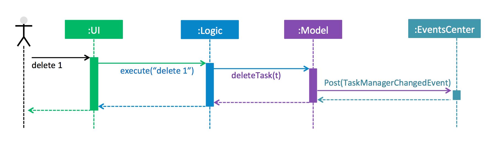
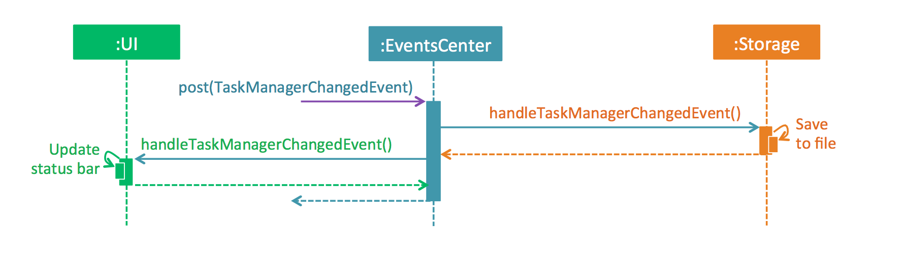

# Developer Guide

* [Setting Up](#setting-up)
* [Design](#design)
* [Implementation](#implementation)
* [Testing](#testing)
* [Dev Ops](#dev-ops)
* [Appendix A: User Stories](#appendix-a--user-stories)
* [Appendix B: Use Cases](#appendix-b--use-cases)
* [Appendix C: Non Functional Requirements](#appendix-c--non-functional-requirements)
* [Appendix D: Glossary](#appendix-d--glossary)
* [Appendix E : Product Survey](#appendix-e-product-survey)

## Setting up

#### Prerequisites

1. **JDK `1.8.0_60`**  or later 

    > Having any Java 8 version is not enough.  
    > This app will not work with earlier versions of Java 8.

2. **Eclipse** IDE
3. **e(fx)clipse** plugin for Eclipse (Do the steps 2 onwards given in
   [this page](http://www.eclipse.org/efxclipse/install.html#for-the-ambitious))
4. **Buildship Gradle Integration** plugin from the Eclipse Marketplace

#### Importing the project into Eclipse

0. Fork this repo, and clone the fork to your computer
1. Open Eclipse (Note: Ensure you have installed the **e(fx)clipse** and **buildship** plugins as given
   in the prerequisites above)
2. Click `File` > `Import`
3. Click `Gradle` > `Gradle Project` > `Next` > `Next`
4. Click `Browse`, then locate the project's directory
5. Click `Finish`

  > * If you are asked whether to 'keep' or 'overwrite' config files, choose to 'keep'.
  > * Depending on your connection speed and server load, it can even take up to 30 minutes for the set up to finish
      (This is because Gradle downloads library files from servers during the project set up process)
  > * If Eclipse auto-changed any settings files during the import process, you can discard those changes.

## Design

//@@author A0138848M
### Architecture

 
The **_Architecture Diagram_** given above reflects the high-level design of the OneLine. OneLine' main components are Main, Commons, User Interface (UI), Model, Logic, Storage.  

`Main` has only one class called [`MainApp`](../src/main/java/seedu/oneline/MainApp.java). It is responsible for initialising components in the correct sequence, and connecting components with each other when OneLine starts. Main also helps to shut down components and invokes clean-up methods when OneLine is exited.

[**`Commons`**](#common-classes) contains utility classes, customised exceptions, and other classes which may be used by multiple other components. Two classes play significant roles
* `EventsCentre` : This class (written using [Google's Event Bus library](https://github.com/google/guava/wiki/EventBusExplained)) is used by components to communicate with other components using events (i.e. a form of _Event Driven_ design)
* `LogsCenter` is used by classes to write log messages to OneLine’s log file.

[**`UI`**](#ui-component) manages the user’s interactions with OneLine. It listens to the user’s input entered via the command box. The UI will pass the information received from the users’ input to Logic, where it will then be handled and executed.

[**`Logic`**](#logic-component) is the control center of OneLine. When Logic receives new information from UI, it will pass the information to the Parser class to be processed, then executes the command that is returned. Logic also interacts with Storage to obtain tasks and categories from storage files as required.

[**`Model`**](#model-component) contains the Tag and Task classes, and stores OneLine‘s data in memory. Model watches for changes to OneLine’s data and handles these changes by raising appropriate events through EventsCenter.

[**`Storage`**](#storage-component) handles reading data from, and writing data to, the hard disk in the XML format.

The UI, Logic, Model and Storage components define their  _API_ in an `interface` with the same name. All functionalities are exposed through a `{Component Name}Manager` class.

For example, the Logic component defines its API in the Logic.java interface and exposes its functionality using the LogicManager.java class. The UML diagram below illustrates this architecture.  
 

The following _Sequence Diagram_ shows how the components interact to respond to a user’s `del 1` command.  

> Note how the `Model` simply raises a `TaskBookChangedEvent` when OneLine's data is  changed, instead of asking the `Storage` to save the updates to the hard disk.

The diagram below shows how the `EventsCenter` reacts to the event, which eventually results in updates being saved to the hard disk and the tag list being updated to reflect any possible changes.  

> Note how the event is propagated through the `EventsCenter` to the `Storage` and `UI` without `Model` having to be coupled to either of them. This is an example of how this Event Driven approach helps us reduce direct coupling between components.

The following more details of each component.

//@@author A0142605N  
### UI component  
 

**API** : [`Ui.java`](../src/main/java/seedu/oneline/ui/Ui.java)

The UI consists of a `MainWindow` that is made up of parts e.g.`CommandBox`, `ResultDisplay`, `TaskPane`, `TagListPanel` etc. All these, including the `MainWindow`, inherit from the abstract `UiPart` class
and they can be loaded using the `UiPartLoader`.

The `UI` component uses JavaFx UI framework. The layout of these UI parts are defined in matching `.fxml` files that are in the `src/main/resources/view` folder.  

 For example, the layout of the [`MainWindow`](../src/main/java/seedu/oneline/ui/MainWindow.java) is specified in
 [`MainWindow.fxml`](../src/main/resources/view/MainWindow.fxml)

The `UI` component has 3 main responsibilities:
* Executing user commands using the `Logic` component.
* Binding itself to data in the `Model` so that the UI can auto-update when the data changes.
* Responding to events raised from various parts of OneLine and updating the UI accordingly.

//@@author A1040156R
### Logic component  
 

**API** : [`Logic.java`](../src/main/java/seedu/oneline/logic/Logic.java)

1. `Logic` uses the `Parser` class to parse the user command.
2. This results in a `Command` object which is executed by the `LogicManager`.
3. The command execution can affect the `Model` (e.g. adding a task) and/or raise events.
4. The result of the command execution is encapsulated as a `CommandResult` object which is passed back to the `Ui`.

The Sequence Diagram below shows how the `Logic` component handles the `execute("del 1")` API call.  
 

//@@author A0138848M  
### Model component  
 

**API** : [`Model.java`](../src/main/java/seedu/oneline/model/Model.java)

The `Model`
* stores a `UserPref` object that represents the user's preferences for OneLine's GUI.
* stores the TaskBook data.
* exposes a `UnmodifiableObservableList<ReadOnlyTask>` that can be 'observed' e.g. the UI can be bound to this list so that the UI automatically updates when the data in the list change.
* does not depend on any of the other three components.

#### Task
 

**API** : [`Task.java`](../src/main/java/seedu/oneline/model/Task/Task.java)

A `Task` must have a name and an `isCompleted` flag, but may not have a `deadline`, `startTime`, `endTime` or `tag`. To represent a `Task` without a `deadline`, `startTime`, `endTime` or `tag`, we call the relevant class’ `getDefault()` method. Note that all fields in `Task` are compulsory and cannot be null.

A `Task` is defined as one of the following:
* floating task: a `task` whose `deadline`, `startTime` and `endTime` are set to their default values.
* deadline task: a `task` whose `deadline` is valid, and whose `startTime` and `endTime` are set to their default values
* event task: a `task` whose `startTime` and `endTime` are valid, and whose `deadline` is set to its default value

//@@author A0140156R
#### Model State
**API** : [`Model.java`](../src/main/java/seedu/oneline/model/Model.java)

A model state consists of a `ReadOnlyTaskBook`, as well as the predicate of the current filtered task list. Every time a mutating command (as specified by the `canUndo()` API) is called, the state of the model is stored in a ModelState as a stack.

Model then exposes indirect access to these states through the `undo()` and `redo()` API.

//@@author A0121657H  
### Storage component  
 

**API** : [`Storage.java`](../src/main/java/seedu/oneline/storage/Storage.java)

The `Storage` component saves and reads the `UserPref` objects in JSON format, and OneLine data in XML format.

//@@author
### Common classes

Classes used by multiple components are in the `seedu.oneline.commons` package.

## Implementation

### Logging

We are using `java.util.logging` package for logging. The `LogsCenter` class is used to manage the logging levels
and logging destinations.

* The logging level can be controlled using the `logLevel` setting in the configuration file
  (See [Configuration](#configuration))
* The `Logger` for a class can be obtained using `LogsCenter.getLogger(Class)` which will log messages according to
  the specified logging level
* Currently log messages are output through: `Console` and to a `.log` file.

**Logging Levels**

* `SEVERE` : Critical problem detected which may possibly cause the termination of the application
* `WARNING` : Can continue, but with caution
* `INFO` : Information showing the noteworthy actions by the App
* `FINE` : Details that is not usually noteworthy but may be useful in debugging
  e.g. print the actual list instead of just its size

### Configuration

Certain properties of the application can be controlled (e.g App name, logging level) through the configuration file
(default: `config.json`):

## Testing

Tests can be found in the `./src/test/java` folder.

**In Eclipse**:
> If you are not using a recent Eclipse version (i.e. _Neon_ or later), enable assertions in JUnit tests
  as described [here](http://stackoverflow.com/questions/2522897/eclipse-junit-ea-vm-option).

* To run all tests, right-click on the `src/test/java` folder and choose
  `Run as` > `JUnit Test`
* To run a subset of tests, you can right-click on a test package, test class, or a test and choose
  to run as a JUnit test.

**Using Gradle**:
* See [UsingGradle.md](UsingGradle.md) for how to run tests using Gradle.

We have two types of tests:

1. **GUI Tests** - These are _System Tests_ that test the entire App by simulating user actions on the GUI.
   These are in the `guitests` package.

2. **Non-GUI Tests** - These are tests not involving the GUI. They include,
   1. _Unit tests_ targeting the lowest level methods/classes.  
      e.g. `seedu.oneline.commons.UrlUtilTest`
   2. _Integration tests_ that are checking the integration of multiple code units
     (those code units are assumed to be working). 
      e.g. `seedu.oneline.storage.StorageManagerTest`
   3. Hybrids of unit and integration tests. These test are checking multiple code units as well as
      how the are connected together. 
      e.g. `seedu.oneline.logic.LogicManagerTest`

**Headless GUI Testing** :
Thanks to the [TestFX](https://github.com/TestFX/TestFX) library we use,
 our GUI tests can be run in the _headless_ mode.
 In the headless mode, GUI tests do not show up on the screen.
 That means the developer can do other things on the Computer while the tests are running. 
 See [UsingGradle.md](UsingGradle.md#running-tests) to learn how to run tests in headless mode.

## Dev Ops

### Build Automation

See [UsingGradle.md](UsingGradle.md) to learn how to use Gradle for build automation.

### Continuous Integration

We use [Travis CI](https://travis-ci.org/) to perform _Continuous Integration_ on our projects.
See [UsingTravis.md](UsingTravis.md) for more details.

### Making a Release

Here are the steps to create a new release.

 1. Generate a JAR file [using Gradle](UsingGradle.md#creating-the-jar-file).
 2. Tag the repo with the version number. e.g. `v0.1`
 2. [Create a new release using GitHub](https://help.github.com/articles/creating-releases/)
    and upload the JAR file your created.

### Managing Dependencies

A project often depends on third-party libraries. For example, OneLine depends on the
[Jackson library](http://wiki.fasterxml.com/JacksonHome) for XML parsing. Managing these _dependencies_
can be automated using Gradle. For example, Gradle can download the dependencies automatically, which
is better than these alternatives. 
a. Include those libraries in the repo (this bloats the repo size) 
b. Require developers to download those libraries manually (this creates extra work for developers) 

//@@author A0142605N
## Appendix A : User Stories

Priorities: High (must have) - `* * *`, Medium (nice to have)  - `* *`,  Low (unlikely to have) - `*`

| Priority | As a... | I want...                            | So that I...  |
|----------|---------|--------------------------------------|---------------|
| `* * *`  | user    | to create tasks without a deadline   | -             |
| `* * *`  | user    | to create tasks with a deadline      | -             |
| `* * *`  | user    | to create events with a timeslot     | -             |
| `* * *`  | user    | to create recurring tasks            | -             |
| `* * *`  | user    | to update tasks / events             | -             |
| `* * *`  | user    | to delete tasks                      | -             |
| `* * *`  | user    | to delete task fields                | -             |
| `* * *`  | user    | to view all my undone tasks          | -             |
| `* * *`  | user    | to mark tasks as done                | can keep track of my progress |
| `* * *`  | user    | to search for tasks I have entered   | - |
| `* * *`  | user    | to undo my pervious command          | can recover from mistakes in previous command |
| `* * *`  | user    | to view a list of all commands       | can see all commands if I forget them |
| `* * *`  | user    | to change storage location           | can store tasks in a portable device |
| `* *`    | user    | to see tasks grouped by deadline     | can get a better overview of which tasks I should focus on |
| `* *`    | user    | to categorise my tasks               | can group similar tasks together |
| `* *`    | user    | to view my tasks by their categories | - |
| `* *`    | user    | short and intuitive commands         | don't have to remember commands |
| `*`      | user    | to keep track of recurring tasks     | don't need to enter the repetitive tasks time and again |
| `*`      | user    | to be reminded of the tasks I need to complete | - |
| `*`      | user    | my commands to be auto-completed     | - |
| `*`      | user    | to view my tasks on a calendar       | can have a good overview of my workflow |
| `*`      | user    | to block off time slots for events   | will not accidentally plan clashing events |

//@@author A0138848M
## Appendix B : Use Cases

(For all use cases below, the **System** is `OneLine` and the **Actor** is the `user`, unless specified otherwise)

#### Use case: Add task

**MSS**

1. User adds task
2. OneLine creates the task  
Use case ends

**Extensions**

1a. OneLine detects an error in the data entered
>   1a1. OneLine requests for the correct data  
>   1a2. User enters new data  
    Steps 1b1-1b2 are repeated until data contains no errors
    Use case resumes from step 2.

#### Use case: Add task with category

**MSS**

1. User adds task with category  
2. OneLine creates the task  
Use case ends

**Extensions**

1a. User requests to add task with a new category
>   1a1. OneLine creates the category  
    Use case resumes from step 2.

1b. OneLine detects an error in the data entered
>   1b1. OneLine requests for the correct data  
>   1b2. User enters new data  
    Steps 1b1-1b2 are repeated until data contains no errors
    Use case resumes from step 2.

#### Use case: Delete task

**MSS**

1. User requests to list tasks
2. OneLine shows a list of tasks
3. User requests to delete a specific task in the list
4. OneLine deletes the task  
Use case ends.

**Extensions**

2a. The list is empty

> Use case ends

3a. The given index is invalid

> 3a1. OneLine shows an error message  
  Use case resumes from step 2

#### Use case: Edit task

**MSS**

1. User requests to list tasks
2. OneLine shows a list of tasks
3. User requests to edit a specific task in the list
4. OneLine edits the task  
Use case ends.

**Extensions**

2a. The list is empty

> Use case ends

3a. The given index is invalid

> 3a1. OneLine shows an error message  
  Use case resumes from step 2

3b. User requests to tag a task with a category that is not currently in the system
>   3b1. OneLine creates the category  
    Use case resumes from step 4.

3c. OneLine detects an error in the data entered
>   3c1. OneLine requests for the correct data  
>   3c2. User enters new data  
    Steps 3c1-3c2 are repeated until data contains no errors
    Use case resumes from step 4.

#### Use case: Mark task as done

**MSS**

1. User requests to list tasks
2. OneLine shows a list of tasks
3. User requests to mark a task as done
4. OneLine marks task as done  
Use case ends.

**Extensions**

2a. The list is empty

> Use case ends

3a. The given index is invalid

> 3a1. OneLine shows an error message  
  Use case resumes from step 2

#### Use case: Delete Category

**MSS**

1. User requests to delete category
2. OneLine deletes the category  
Use case ends

**Extensions**

1a. User requests to delete a category that does not exist  
> 1a1. OneLine shows an error message.  
 Use case ends.

#### Use case: Edit Category

**MSS**

1. User requests to edit category
2. OneLine edits the category
3. UI's sidebar updates to reflect the new changes  
Use case ends

**Extensions**

1a. User requests to edit a category that does not exist  
> 1a1. OneLine shows an error message.  
 Use case ends.

1b. OneLine detects an error in the data entered
> 1b1. OneLine requests for the correct data  
> 1b2. User enters new data  
 Steps 1b1-1b2 are repeated until data contains no errors 
 Use case resumes from step 2.

#### Use case: Find

**MSS**

1. User requests to find task / category by keyword
2. OneLine finds a list of tasks / categories which are similar to, or contain the keyword
3. OneLine shows the list of tasks / categories  
Use case ends

**Extensions**

2a. List is empty
> Use case ends.

//@@author A0142605N
## Appendix C : Non Functional Requirements

1. Should work on any [mainstream OS](#mainstream-os) as long as it has Java `1.8.0_60` or higher installed.
2. Should work without any Internet connection.
3. Should be able to hold up to 1000 tasks.
4. Should come with automated unit tests and open source code.
5. Should minimise keystrokes on commands.
6. Should be able to handle all invalid inputs.
7. Should have an initial load time of less than 2000ms
8. Should be easy for a user with no command line experience to use.
9. Should be written in clear, well-documented code which is easy to understand, reusable and maintainable.
10. Should have command line as the primary mode of input.
11. Should work stand-alone.
12. Should not use relational databasees.
13. Should be stored locally.
14. Should be stored in a human-editable text file.
15. Should not require an installer.

Some other project requirements can be seen [here](http://www.comp.nus.edu.sg/~cs2103/AY1617S1/contents/handbook.html#handbook-project-constraints).

//@@author A0138848M
## Appendix D : Glossary

##### Mainstream OS

> Windows, Linux, Unix, OS-X

##### Deadline task

> Tasks that have a specific deadline

##### Floating task

> Tasks that do not have a specific deadline

##### Event task

> Tasks that have a specific timeslot. i.e. Meeting from 1pm to 2pm.

##### Category

> User-defined tags used to categorise tasks

//@@author A0140156R
## Appendix E : Product Survey

Product Name | Strengths | Weaknesses
---|---|---
**Todoist**|<li>Clean interface</li><li>Simple usage</li><li>Project hierachy</li><li>Handles multiple date/time formats</li> | <li>1 page of tasks: No scrolling</li><li>Heavily relies on mouse usage: not many keyboard shortcuts</li><li>No calendar display</li>
**Wunderlist**|<li>Interface is elegant</li><li>Display updates in real time</li><li>Sound feedback</li><li>Manages recurring tasks</li><li>Sort by due date</li><li>Filter by date range</li>| <li>Misleading icons and buttons</li><li>No calendar display</li><li>Does not open on startup</li><li>Deadline notification through email, not the app</li>
**Google Calendar Quick Add**|  <li>Intuitive shortcuts and commands</li><li>Different command formats are acceptable</li><li>Clean interface</li><li>Task dependency cycles are detected when cyclic inputs are used</li>| <li>No view/edit/delete/search</li><li>Rigid settings</li>
**Todo.txt**|   <li>Search function works for phrases, case-insensitive flag like in google search to filter certain texts</li><li>Command history</li>|    <li>Difficult setup</li><li>-h does not provide full list of commands</li><li>Tasks marked done are deleted permanently</li><li>Command formats are rigid</li><li>No undo of previous actions.</li><li>Too minimalistic, such as no time/date support</li>
**Trello**| <li>Cross-platform usage</li><li>Integrates with other calendars</li><li>Collaboration support</li><li>Hierachy of tasks</li>|<li>A lot of fields to fill in</li><li>Recurring tasks have to be manually added</li><li>One rigid view, no option for summary/overview/timeline views</li><li>Many features, which are not immediately apparent</li>
**Apple Calendar**| <li>Cross-platform support</li><li>Color-coding for tasks</li><li>Day, month and year view</li>|    <li>No collaboration</li><li>Rigid fields for adding</li>
**S Planner**|  <li>Syncs to many calendar platforms</li><li>Google map support for locations</li><li>Supports recurring events</li><li>Collaboration support</li>| <li>Mobile-only</li><li>Floating tasks only available in Agenda view</li><li>Many clicks required to add tasks</li>
**Any.do**| <li>Interface is clean and intuitive</li>   <li>Syncs between mobile devices and PC</li>    <li>Descriptions can be added to tasks</li> <li>Support for recurring tasks</li>|   <li>Internet connection is required to access tasks</li><li>Fields need to be filled in to add tasks</li><li>Time/date is not easy to change</li><li>No alarm support</li>
