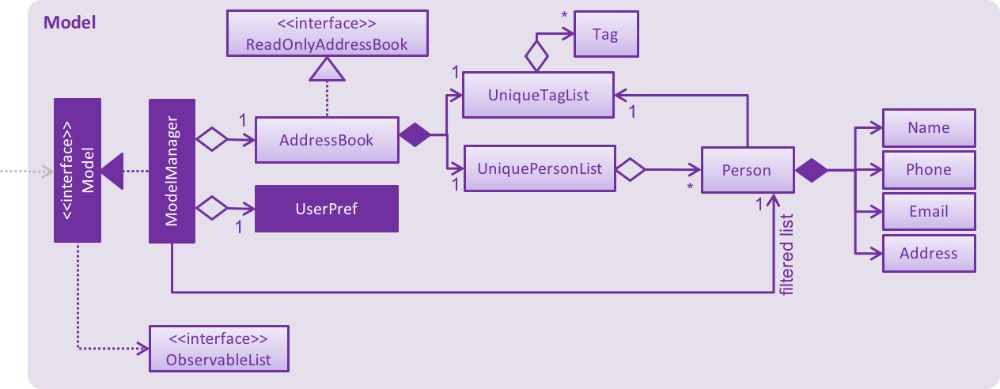

# Developer Guide 

* [Setting Up](#setting-up)
* [Design](#design)
* [Implementation](#implementation)
* [Testing](#testing)
* [Continuous Integration](#continuous-integration)
* [Making a Release](#making-a-release)
* [Managing Dependencies](#managing-dependencies)
* [Appendix A: User Stories](#appendix-a--user-stories)
* [Appendix B: Use Cases](#appendix-b--use-cases)
* [Appendix C: Non Functional Requirements](#appendix-c--non-functional-requirements)
* [Appendix D: Glossary](#appendix-d--glossary)
* [Appendix E : Product Survey](#appendix-e-product-survey)

## Setting up

#### Prerequisites

1. **JDK `1.8.0_60`**  or later 

    > Having any Java 8 version is not enough.  
    This app will not work with earlier versions of Java 8.
    
2. **Eclipse** IDE
3. **e(fx)clipse** plugin for Eclipse (Do the steps 2 onwards given in
   [this page](http://www.eclipse.org/efxclipse/install.html#for-the-ambitious))
4. **Buildship Gradle Integration** plugin from the Eclipse Marketplace

#### Importing the project into Eclipse

0. Fork this repo, and clone the fork to your computer
1. Open Eclipse (Note: Ensure you have installed the **e(fx)clipse** and **buildship** plugins as given 
   in the prerequisites above)
2. Click `File` > `Import`
3. Click `Gradle` > `Gradle Project` > `Next` > `Next`
4. Click `Browse`, then locate the project's directory
5. Click `Finish`

  > * If you are asked whether to 'keep' or 'overwrite' config files, choose to 'keep'.
  > * Depending on your connection speed and server load, it can even take up to 30 minutes for the set up to finish
      (This is because Gradle downloads library files from servers during the project set up process)
  > * If Eclipse auto-changed any settings files during the import process, you can discard those changes.

## Design

 
The **_Architecture Diagram_** given above explains the high-level design of the App.
Given below is a quick overview of each component.

`Main` has only one class called [`MainApp`](../src/main/java/seedu/address/MainApp.java). It is responsible for,
* At app launch: Initializes the components in the correct sequence, and connect them up with each other.
* At shut down: Shuts down the components and invoke clean up method where necessary.

[**`Commons`**](#common-classes) represents a collection of classes used by multiple other components.
Two of those classes play an important role at the architecture level.
* `EventsCentre` : This class (written using [Google's Event Bus library](https://github.com/google/guava/wiki/EventBusExplained))
  is used to by componnents to communicate with other components using events (i.e. a form of _Event Driven_ design)
* `LogsCenter` : Used by many classes to write log messages to the App's log files.

The rest of the App consists four components.
* [**`UI`**](#ui-component) : The UI of tha App.
* [**`Logic`**](#logic-component) : The command executor.
* [**`Model`**](#model-component) : Holds the data of the App in-memory.
* [**`Storage`**](#storage-component) : Reads data from, and writes data to, the hard disk.

Each of the four components
* Defines its _API_ an interface with the same name as the Component. `Logic.java`
* Exposes its functionality using a `{Component Name}Manager` class e.g. `LogicManager.java`

The _Sequence Diagram_ below shows how the components interact for the scenario where the user issues the
command `delete 3`.

>Note how the `Model` simply raises a `ModelChangedEvent` when the model is changed,
 instead of asking the `Storage` to save the updates to the hard disk.

The diagram below shows how the `EventsCenter` reacts to that event, which eventually results in the updates
being saved to the hard disk and the status bar of the UI being updated to reflect the 'Last Updated' time.  

> Note how the event is propagated through the `EventsCenter` to the `Storage` and `UI` without `Model` having
  to be coupled to either of them. This is an example of how this Event Driven approach helps us reduce direct 
  coupling between components.

The sections below give more details of each component.

### UI component

 

**API** : [`Ui.java`](../src/main/java/seedu/address/ui/Ui.java)

The UI consists of a `MainWindow` that is made up of parts e.g.`CommandBox`, `ResultDisplay`, `PersonListPanel`,
`StatusBarFooter`, `BrowserPanel` etc. All these, including the `MainWindow` inherits from the abstract `UiPart` class
and they can be loaded using the `UiPartLoader`.

The `UI` component uses JavaFx UI framework. The layout of these UI parts are defined in matching `.fxml` files
 that are in the `src/main/resources/view` folder. 
 For example, the layout of the [`MainWindow`](../src/main/java/seedu/address/ui/MainWindow.java) is specified in
 [`MainWindow.fxml`](../src/main/resources/view/MainWindow.fxml)

The `UI` component,
* Executes user commands using the `Logic` component.
* Binds itself to some data in the `Model` so that the UI can auto-update when data in the `Model` change.
* Responds to events raises from various parts of the App and updates the UI accordingly.

### Logic component

 

**API** : [`Logic.java`](../src/main/java/seedu/address/logic/Logic.java)

1. `Logic` uses the `Parser` class to parse the user command.
2. This results in a `Command` object which is executed by the `LogicManager`.
3. The command execution can affect the `Model` (e.g. adding a person) and/or raise events.
4. The result of the command execution is encapsulated as a `CommandResult` object which is passed back to the `Ui`

### Model component

 

**API** : [`Model.java`](../src/main/java/seedu/address/model/Model.java)

The `Model`,
* Stores a `UserPref` object that represents the user's preferences
* Stores the Address Book data
* Exposes a `UnmodifiableObservableList<ReadOnlyPerson` that can be 'observed' e.g. the UI can be bound to this list
  so that the UI automatically updates when the data in the list change.
* Does not depend on any of the other three components.

### Storage component

 

**API** : [`Storage.java`](../src/main/java/seedu/address/storage/Storage.java)

The `Storage` component,
* can save `UserPref` objects in json format and read it back.
* can save the Address Book data in xml format and read it back.

### Common classes

Classes used by multiple components are in the `seedu.addressbook.commans` package. 

## Implementation

### Logging

We are using `java.util.logging.Logger` as our logger, and `LogsCenter` is used to manage the logging levels 
of loggers and handlers (for output of log messages)

- The logging level can be controlled using the `logLevel` setting in the configuration file 
  (See [Configuration](#configuration))
- The `Logger` for a class can be obtained using `LogsCenter.getLogger(Class)` which will log messages according to 
  the specified logging level

- Currently log messages are output through: `Console` and `.log`

**Logging Levels**

- SEVERE
  - Critical use case affected, which may possibly cause the termination of the application

- WARNING
  - Can continue, but with caution

- INFO
  - Information important for the application's purpose
    - e.g. update to local model/request sent to cloud
  - Information that the layman user can understand

- FINE
  - Used for superficial debugging purposes to pinpoint components that the fault/bug is likely to arise from
  - Should include more detailed information as compared to `INFO` i.e. log useful information!
    - e.g. print the actual list instead of just its size

### Configuration

Certain properties of the application can be controlled (e.g App name, logging level) through the configuration file 
(default: `config.json`):

## Testing

**In Eclipse**: 
> If you are not using a recent Eclipse version (i.e. _Neon_ or later), enable assertions in JUnit tests
  as described [here](http://stackoverflow.com/questions/2522897/eclipse-junit-ea-vm-option).

* To run all tests, right-click on the `src/test/java` folder and choose 
  `Run as` > `JUnit Test`
* To run a subset of tests, you can right-click on a test package, test class, or a test and choose 
  to run as a JUnit test.
  
**Using Gradle**:
* See [UsingGradle.md](UsingGradle.md) for how to run tests using Gradle. 

Tests can be found in the `./src/test/java` folder.

1. **GUI Tests** - These are _System Tests_ that test the entire App by simulating user actions on the GUI. 
   These are in the `guitests` package.
  
2. **Non-GUI Tests** - These are tests not involving the GUI. They include,
   1. _Unit tests_ targeting the lowest level methods/classes.  
      e.g. `seedu.address.commons.UrlUtilTest`
   2. _Integration tests_ that are checking the integration of multiple code units 
     (those code units are assumed to be working). 
      e.g. `seedu.address.storage.StorageManagerTest`
   3. Hybrids of unit and integration tests. These test are checking multiple code units as well as 
      how the are connected together. 
      e.g. `seedu.address.logic.LogicManagerTest`
  
**Headless GUI Testing** :
Thanks to the ([TestFX](https://github.com/TestFX/TestFX)) library we use,
 our GUI tests can be run in the _headless_ mode. 
 In the headless mode, GUI tests do not show up on the screen.
 That means the developer can do other things on the Computer while the tests are running. 
 See [UsingGradle.md](UsingGradle.md#running-tests) to learn how to run tests in headless mode.
  
## Continuous Integration

We use [Travis CI](https://travis-ci.org/) to perform _Continuous Integration_ on our projects.
See [UsingTravis.md](UsingTravis.md) for more details.

## Making a Release

Here are the steps to create a new release.
 
 1. Generate a JAR file [using Gradle](UsingGradle.md#creating-the-jar-file).
 2. Tag the repo with the version number. e.g. `v0.1`
 2. [Crete a new release using GitHub](https://help.github.com/articles/creating-releases/) 
    and upload the JAR file your created.
   
## Managing Dependencies

A project often depends on third party libraries. For example, Address Book depends on the 
[Jackson library](http://wiki.fasterxml.com/JacksonHome) for XML parsing. Managing these _dependencies_
can be automated using Gradle. For example, Gradle can download the dependencies automatically, which
is better than these alternatives. 
a. Include those libraries in the repo (this bloats the repo size) 
b. Require developers to download those libraries manually (this creates extra work for developers) 

## Appendix A : User Stories

Priorities: High (must have) - `* * *`, Medium (nice to have)  - `* *`,  Low (unlikely to have) - `*`

Priority | As a ... | I want to ... | So that I can...
-------- | :-------- | :--------- | :-----------
`* * *` | new user | see usage instructions | refer to instructions when I forget how to use the App
`* * *` | user | add a new task | so I can register my things to do
`* * *` | user | delete a task | remove entries that I no longer need
`* * *` | user | find a task by name | locate details of the task without having to go through the entire list
`* * *` | user | find a task by deadline | locate tasks that are due soon without having to go through the entire list
`* * *` | user | edit a task | update entries as needed
`* * *` | user | add a floating task | have a task without a deadline
`* * *` | user | add a recurring task | add repeating tasks only once
`* * *` | user | undo a task entered | increase my workflow
`* * *` | user | sort list by alphabetical order and date | find my tasks easily
`* * *` | user | specify the location of file storage | choose where to save the to do list
`* *` | user | mark tasks as done | archive my completed tasks
`* *` | user | see my tasks in user interface | have an easier time using the app
`* *` | user | set categories | organise my tasks
`* *` | user | block out timings | reserve time slots for tasks
`* *` | user | create subtasks | breakdown my tasks into smaller problems
`*` | user | specify my own natural language | customise the app
`*` | user | set reminders for tasks | reduce chances of forgetting to do a task
`*` | user | import a list of to do tasks | add in tasks without registering them individually

## Appendix B : Use Cases

(For all use cases below, the **System** is the `AddressBook` and the **Actor** is the `user`, unless specified otherwise)

#### Use case: Delete person

**MSS**

1. User requests to list persons
2. AddressBook shows a list of persons
3. User requests to delete a specific person in the list
4. AddressBook deletes the person  
Use case ends.

**Extensions**

2a. The list is empty

> Use case ends

3a. The given index is invalid

> 3a1. AddressBook shows an error message  
  Use case resumes at step 2

{More to be added}

## Appendix C : Non Functional Requirements

1. Should backup tasks list.
2. Should be able to store 1000 tasks.
3. Should only receive keyboard inputs.
4. Should be maintainable and scalable.
5. Should be user friendly for new users.
6. Should be able to be accessed offline.
7. Should come with automated unit testing.
8. Should be able to startup and quit within 1 second.
9. Should display up to date tasks when command is given.
10. Should be able to run on all [mainstream OS](#mainstream-os).
11. Should be able to display tasks within 1 second when command is given.
12. Should have a simple GUI that displays [relevant information](#relevant-information).

## Appendix D : Glossary

##### Mainstream OS

> Windows, Linux, Unix, OS-X

##### Relevant Information

> Tasks, due dates, priority

##### Floating Tasks

> Tasks with no specific deadline

## Appendix E : Product Survey

##### Google Calendar

> Pros:
  Able to sync calendars from other people
  Chrome extension for offline connectivity
  Multiple viewing options (Calendar/To do list view)
  Has a Command Line Interface (CLI)
  
> Cons:
  Unable to support floating task
  Unable to mark tasks as done
  Unable to block out and free up timings
  CLI commands only for addition of tasks
  Bad interface
  
##### Wunderlist

> Pros:
  Able to set categories
  Able to mark tasks as done
  Able to read tasks from e-mails
  Able to assign tasks to someone
  Able to search for tasks easily
  Able to migrate tasks from one category to another easily
  Web and offline desktop version available

> Cons:
  Unable to create subtask
  Unable to support recurring tasks
  Unable to block out time slots
  Unable to set start date for tasks
  Only has a list view
  
##### Todoist

> Pros:
  Able to set categories
  Able to collaborate with others
  Able to have sub-projects and sub-tasks
  Able to support recurring tasks
  Able to sort tasks by priority level
  Able to integrate from e-mail
  Able to backup auotmatically
  
> Cons:
  Unable to block out timings
  Unable to export out To-do list
  Minimal CLI
  Have to do alot of clicking

##### Any.Do

> Pros:
  Able to set categories by type and day
  Able to show completed tasks
  Able to collaborate with others
  Able to support sub-tasks
  Able to add attachments
  Able to support recurring tasks
  Able to mark task as done
  Able to notify and remind user
  Able to have action shortcuts
  Able to have different types of views

> Cons:
  Unable to support floating tasks
  No CLI
  
##### Evernote

> Pros:
  Able to quick search
  Able to support handwriting, embedded images/audio and links
  Able to work with camera
  
> Cons:
  No CLI
  No Calendar view
  
##### Trello

> Pros:
  Able to mark tasks as "in-progress"
  Able to view as calendar
  
> Cons:
  Unable to import or export
  Relies on UI interaction
  No CLI
  Need to pay for premium use to access 3rd party features
  No desktop version
  