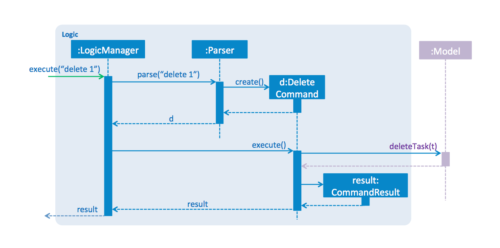

# Developer Guide

##Table of Contents:

* [Introduction](#introduction)

* [Setting Up](#setting-up)

* [Design](#design)

* [Implementation](#implementation)

* [Testing](#testing)

* [Dev Ops](#dev-ops)

* [Appendix A: User Stories](#appendix-a--user-stories)

* [Appendix B: Use Cases](#appendix-b--use-cases)

* [Appendix C: Non Functional Requirements](#appendix-c--non-functional-requirements)

* [Appendix D: Glossary](#appendix-d-:-glossary)

* [Appendix E : Product Survey](#appendix-e--product-survey)

## Introduction

WhatNow is a simple task management tool that aims to make your life easier. Instead of straining to remember the tasks that you have to do or hurriedly scribbling it on a post-it, you can now use WhatNow to organize your mountain of tasks.

This guide describes the design and implementation of WhatNow. It will help you understand how WhatNow works and how you can further contribute to its development. We have organised this guide in a top-down manner so that you can understand the big picture before moving on to the more detailed sections.

## Setting up

#### Prerequisites

1. **[JDK](#jdk) `1.8.0_60`**  or later 

    > Having any Java 8 version is not enough.

    This app will not work with earlier versions of Java 8

2. **[Eclipse](#eclipse)** IDE

3. **e(fx)clipse** plugin for Eclipse (Refer to "Importing the project into Eclipse" from step 2 onwards)

4. **Buildship [Gradle](#gradle) Integration** plugin from the Eclipse Marketplace

#### Importing the project into Eclipse

0. [Fork](#fork) this [repo](#repository), and clone the fork to your computer

1. Open Eclipse (Note: Ensure you have installed the **e(fx)clipse** and **buildship** plugins as given in the prerequisites above)

2. Click `File` > `Import`

3. Click `Gradle` > `Gradle Project` > `Next` > `Next`

4. Click `Browse`, then locate the project's directory

5. Click `Finish`

  > * If you are asked whether to 'keep' or 'overwrite' config files, choose to 'keep'.

  > * Depending on your connection speed and server load, it can even take up to 30 minutes for the setup to finish. This is because Gradle downloads library files from servers during the project set up process.

  > * If Eclipse changed any settings files during the import process automatically, you can discard those changes.

## Design

### Architecture

 

Figure 1: The Architecture Diagram  

Figure 1 explains the high-level design of WhatNow. Below is a quick overview of each component.

`Main` has only one class called [`MainApp`](../src/main/java/seedu/whatnow/MainApp.java). It is responsible for:

* Initializing the components in the correct sequence, and connecting them up with each other at launch of the application.

* Shutting down the components and invoking cleanup method when necessary at shutdown.

[**`Commons`**](#common-classes) represents a collection of classes used by multiple other components. Two of those classes play important roles at the architecture level:

* `EventsCentre` : This class (written using [Google's Event Bus library](https://github.com/google/guava/wiki/EventBusExplained)) is used by components to communicate with other components using events (i.e. a form of _Event Driven_ design).

* `LogsCenter` : This class is used by many classes to write log messages to the App's log file.

The rest of the App consists four components:

* [**`UI`**](#ui-component) : The UI of that App.

* [**`Logic`**](#logic-component) : The command executor.

* [**`Model`**](#model-component) : The component that holds the data of the App in-memory.

* [**`Storage`**](#storage-component) : The component that read data from, and writes data to, the hard disk.

Each of the four components:

* Defines its _API_ in an `interface` with the same name as the Component.

* Exposes its functionality using a `{Component Name}Manager` class.

 

Figure 2: The Logic component. 

Figure 2 shows an example of how a component (the `Logic` component) defines its API in the `Logic.java` interface and exposes its functionality using the `LogicManager.java` class.

 

Figure 3: Interaction of components for the `delete todo 1` command

Figure 3 shows how the components interact for the scenario where the user issues the delete todo 1 command.

> Note how the Model simply raises a WhatNowChangedEvent when the What Now data are changed, instead of asking the Storage to save the updates to the hard disk.

  

Figure 4: Interaction of `EventsCentre` with `UI` and `Storage` when a `WhatNowChangedEvent` is posted

Figure 4 shows how the EventsCentre reacts to the WhatNowChangedEvent which eventually results in the updates being saved to the hard disk and status bar of the UI being updated to reflect the ‘Last Updated’ time.

> Note how the event is propagated through the `EventsCenter` to the `Storage` and `UI` without `Model` having to be coupled to either of them. This is an example of how this Event Driven approach helps us reduce direct coupling between components.

The sections below gives more details of each component.

### UI component

 

Figure 5: The `UI` component.

**API** : [`Ui.java`](../src/main/java/seedu/whatnow/ui/Ui.java)

The `UI` consists of a `MainWindow` that is made up of parts e.g. `CommandBox`, `FeedbackDisplay`, `TodoTaskPanel`, `StatusBarFooter`, `ScheduleListPanel` etc. All these, including the `MainWindow`, are inherited from the abstract `UiPart` class and they can be loaded using the `UiPartLoader`.

The `UI` component uses JavaFx UI framework. The layout of these UI parts are defined in matching `.fxml` files that are in the `src/main/resources/view` folder.

For example, the layout of the [`MainWindow`](../src/main/java/seedu/whatnow/ui/MainWindow.java) is specified in [`MainWindow.fxml`](../src/main/resources/view/MainWindow.fxml)

The `UI` component:

* Executes user commands using the `Logic` component.

* Binds itself to some data in the `Model` so that the UI can auto-update when data in the `Model` change.

* Responds to events raised from various parts of the App and updates the UI accordingly.

### Logic component

 

Figure 6: The Logic component. 

**API** : [`Logic.java`](../src/main/java/seedu/whatnow/logic/Logic.java)

Logic uses the `Parser` class to parse the user command. This results in a `Command` object which is executed by the `LogicManager`. The command execution can affect the `Model` (e.g. adding a task) and/or raise events. The result of the command execution is then encapsulated as a `CommandResult` object and passed back to the UI.

 

Figure 8:  Sequence Diagram of interaction within the Logic component for execute(“add "buy milk" ")

 

Figure 8:  Sequence Diagram of interaction within the Logic component for execute(“delete todo 1”)

### Model component

 

Figure 8: The Model component.

**API** : [`Model.java`](../src/main/java/seedu/whatnow/model/Model.java)

* stores a `UserPref` object that represents the user's preferences.

* stores the WhatNow data.

* exposes a `UnmodifiableObservableList<ReadOnlyTask>` that can be 'observed' e.g. the UI can be bound to this list so that the UI automatically updates when the data in the list change.

* depends on none of the other three components

### Storage component

 

Figure 9: The `Storage` component.

**API** : [`Storage.java`](../src/main/java/seedu/whatnow/storage/Storage.java)

The `Storage` component:

* can save `UserPref` objects in json format and read it back.

* can save the WhatNow data in xml format and read it back.

### Common classes

Classes used by multiple components are in the `seedu.whatnow.commons` package.

## Implementation

### Logging

We are using `java.util.logging` package for logging. The `LogsCenter` class is used to manage the logging levels and logging destinations. The logging level can be controlled using the `logLevel` setting in the configuration file (See [Configuration](#configuration)). The `Logger` for a class can be obtained using `LogsCenter.getLogger(Class)` which will log messages according to the specified logging level. Currently log messages are output through `Console` and to a `.log` file.

**Logging Levels**

* `SEVERE` : Critical problem detected which may possibly cause the termination of the application

* `WARNING` : Potential problem detected, proceed with caution.

* `INFO` : Information showing the noteworthy actions by the App

* `FINE` : Details that are not usually noteworthy but may be useful in debugging

  e.g. print the actual list instead of just its size

### Configuration

Certain properties of the application can be controlled (e.g App name, logging level) through the configuration file (default: `config.json`).

## Testing

Tests can be found in the `./src/test/java` folder.

**In Eclipse**:

> If you are not using a recent Eclipse version (i.e. _Neon_ or later), enable assertions in JUnit tests as described [here](http://stackoverflow.com/questions/2522897/eclipse-junit-ea-vm-option).

* To run all tests, right-click on the `src/test/java` folder and choose `Run as` > `JUnit Test`

* To run a subset of tests, you can right-click on a test package, test class, or a test and choose to run as a JUnit test.

**Using Gradle**:

* See [UsingGradle.md](UsingGradle.md) for how to run tests using Gradle.

We have two types of tests:

1. **[GUI](#gui) Tests** - These are _System Tests_ that test the entire App by simulating user actions on the GUI. These are in the `guitests` package.

2. **Non-GUI Tests** - These are tests that do not involve the GUI. They include:

   1. _Integration tests_ that checks the integration of multiple code units

     (those code units are assumed to be working).

      e.g. `seedu.whatnow.storage.StorageManagerTest`

   2. Hybrid of unit and integration tests. These tests check the correctness of the multiple  code units as well as how they are connected together.

      e.g. `seedu.whatnow.logic.LogicManagerTest`

**Headless GUI Testing** :

Thanks to the [TestFX](https://github.com/TestFX/TestFX) library used, our GUI tests are able to run in the headless mode. In the headless mode, GUI tests do not show up on the screen. This means the developer can do other things on the Computer while the tests are running.

See [UsingGradle.md](UsingGradle.md#running-tests) to learn how to run tests in headless mode.

## Dev Ops

### Build Automation

See [UsingGradle.md](UsingGradle.md) to learn how to use Gradle for build automation.

### Continuous Integration

We use [Travis CI](https://travis-ci.org/) to perform _Continuous Integration_ on our projects. See [UsingTravis.md](UsingTravis.md) for more details.

### Making a Release

Here are the steps to create a new release.

 1. Generate a JAR file [using Gradle](UsingGradle.md#creating-the-jar-file).

 2. Tag the repo with the version number. e.g. `v0.1`

 2. [Create a new release using GitHub](https://help.github.com/articles/creating-releases/) 

    and upload the JAR file you created.

### Managing Dependencies

A project often depends on third-party libraries. For example, WhatNow depends on the

[Jackson library](http://wiki.fasterxml.com/JacksonHome) for XML parsing. Managing these _dependencies_ can be automated using Gradle. For example, Gradle can download the dependencies automatically, which is better than these alternatives of:

a. Including those libraries in the repo (this bloats the repo size)

b. Requiring developers to download those libraries manually (this creates extra work for developers)

## Appendix A : User Stories

Priorities: High (must have) - `* * *`, Medium (nice to have)  - `* *`,  Low (unlikely to have) - `*`  

Priority | As a ... | I want to ... | So that I can...
-------- | :-------- | :--------- | :----------
`* * *` | user | see user instructions | refer to instructions when I forget how to use the App
`* * *` | user | add a new task | write down tasks that I have to do
`* * *` | user | delete a task | remove completed or unwanted tasks
`* * *` | user | find a task by task description | locate the specific task without having to go through the entire list
`* * *` | user | view all tasks | look at the list of all tasks to be done
`* * *` | user | view completed tasks only | double check that I have really completed the tasks
`* * *` | user | edit a task | change any task without having to remove the old task and create a new one
`* *` | user | add a recurring task | add a task once only without having to add it multiple times 
`* *` | user | undo a command | undo an accidental command
`* *` | user | redo a command | redo an accidental undo command
`* *` | user | choose the data file location | store the file on the cloud (For e.g. Dropbox) to sync the data across multiple computers or other preferable locations.
`*` | user with many tasks in WhatNow | sort tasks by priority | locate the most important and immediate tasks easily

## Appendix B : Use Cases

System: WhatNow

Actor: User

For all cases, the System and Actor will be the same unless stated otherwise.  

#### **Use case: Help**

**MSS** 

1. User requests to see the list of available commands. 

2. System show a list of available commands. 

Use case ends. 

#### **Use case: Change location**

**MSS** 

1. User requests to change the data file storage location. 

2. System changes the location. 

  Use case ends. 

**Extensions** 

1a. The path does not exists. 

  >1a1. System displays `The path does not exists` message. 

  >Use case ends. 

1b. The given syntax is invalid. 

  >1b1. System displays the correct format for the command. 

  >Use case ends. 

#### **Use case: Add task**

**MSS** 

1. User requests to add a task into the system. 

2. System adds this task into its list of tasks. 

  Use case ends. 

**Extensions** 

1a. The task is already existing. 

  >1a1. System displays `task already exists` message. 

  >Use case ends. 

1b. The given syntax is invalid. 

  >1b1. System displays the correct format for the command. 

  >Use case ends. 

#### **Use case: List task**

**MSS** 

1. User requests to list the tasks following the specific keyword. 

2. System displays the list of all tasks of that keyword. 

  Use case ends. 

**Extensions** 

1a. If there are no tasks that match the keyword. 

  >1a1. System displays `no tasks` message. 

  >Use case ends. 

1b. The given syntax is invalid. 

  >1b1. System displays the correct format for the command. 

  >Use case ends. 

#### **Use case: Update task**

**MSS** 

1. User requests to update a specific task in the list. 

2. System updates the task. 

  Use case ends. 

**Extensions** 

1a. The task index is invalid. 

  >1a1. System displays `The task index provided is invalid` message. 

  >Use case ends. 

1b. The given syntax is invalid. 

  >1b1. System displays the correct format for the command. 

  >Use case ends. 

#### **Use case: Delete task**

**MSS** 

1. User requests to delete a specific task in the list. 

2. System deletes the task. 

  Use case ends. 

**Extensions** 

1a. The list is empty. 

  >Use case ends. 

1b. The given index is invalid. 

  >1b1. System displays the correct format for the command. 

  >Use case ends. 

1c. The user wants to delete a completed task.  

  >1c1. The user requests to list all the completed tasks. 

  >1c2. The System lists all completed tasks. 

  Use case resumes at step 1. 

#### **Use case: Undo**

**MSS** 

1. User requests to revert back to the state before the previous action. 

2. System reverts to the state before the user entered the previous command. 

**Extensions** 

1a. The user just launched the system and did not add a task previously. 

  >1a1. System displays `Nothing was undone` message. 

  >Use case ends. 

#### **Use case: Redo**

**MSS** 

1. User requests to revert back to the state that the system was previously in before `undo`. 

2. System reverts the `undo` that was done. 

**Extensions** 

1a. User did not type an `undo` command previously. 

  >1a1. System displays `Nothing to redo` message. 

  >Use case ends. 

#### **Use case: Search for a task**

**MSS** 

1. User requests to search a particular task with one or more keywords. 

2. System displays the search result that matches with at least one of the keywords. 

**Extensions** 

1a. The task does not exist. 

  >1a1.System will display `No such task.` 

            Use case ends. 

#### **Use case: List all completed tasks**

**MSS** 

1. User requests to list all completed tasks. 

2. System displays all completed tasks. 

**Extensions** 

1a. There are no completed tasks. 

  >1a1. System displays `0 tasks listed` message. 

  >Use case ends. 

## Appendix C : Non Functional Requirements

1. Should work on any [mainstream OS](#mainstream-os) that has Java 8 or higher installed.

2. Should be able to contain up to 20000 tasks.

3. Should come with automated unit tests and open source code.

4. Should favour natural language commands than [unix](#unix) commands.

5. Should have a response time of less than 1 second per command.

6. Should have an organised display of information.

7. Should backup data quarterly.

8. Should autoarchive tasks that are more than a year old.

9. Should be able to retrieve backup or archived data.

10. Should be secured.

## Appendix D : Glossary

##### Eclipse

> Integrated development environment used in computer programming.

##### Fork

>A fork is a copy of a repository.

##### Github

> Github is a web-based Git repository hosting service.

##### Gradle

> Gradle is an open source build automation system that builds upon the concepts of Apache Ant and Apache Maven and introduces a Groovy-based domain-specific language (DSL) instead of the XML form used by Apache Maven of declaring the project configuration.

##### GUI

> Graphical User Interface.

##### JDK

> Java Development Kit.

##### Mainstream OS

> Windows, Linux, Unix, OS-X

##### Repository

> A repository contains all of the project files (including documentation), and stores each file's revision history. 

##### UNIX Commands

> Commands used in all UNIX operating systems

## Appendix E : Product Survey

**Google Calendar** 

Strengths:

* Data are auto-synced between all devices.

* Users can configure reminders.

Weaknesses:

* An internet connection is required to use the product.

* A google account is required to use the product.

* A mouse is required to navigate the GUI.

**Todoist** 

Strengths:

* Clean, simple and easy to understand interface.

* Quick access is provided to check on everyday tasks.

* Quick add function of task is particularly helpful for lazy users.

* Freedom of adding more category of task besides the default. E.g. Personal, Shopping, Work.

* Allow users to have an immediate view of the task lying ahead on current day or week.

* Productivity Indicator feature is helpful in motivating user to stay on schedule.

* Priority can be set for every task to help decision making in performing task.

* Typos are automatically rectified. E.g. "Ev Thursday" is registered as "Every Thursday".

Weaknesses:

* Unable to add to labels to all tasks in the free version.

* Unable to set reminders in the free version.

* Unable to add notes/details onto the specific task in free version.

**Wunderlist** 

Strengths:

* Good GUI that is pleasing to the eye.

* Events can be shared with others. E.g. family, friends.

* Reminders are in place for upcoming tasks. (Alarms, email notification, notification light colour).

* Smart Due Dates automatically detects words like 'tomorrow' or 'next week' and adds an event for that day.

* Priorities can be set for tasks.

* Star To-dos moves starred tasks to the top of the list automatically.

* Folders can be customised to be personal. E.g. Family, Private, School, Work, etc.

* Facebook and Google account can be linked to the product.

* Tasks list can be duplicated.

* Completed to-do list are hidden unless selected.

Weaknesses:

* Slow in updating changes.

**Remember The Milk** 

Strengths:

* Product is available on multiple platforms. E.g. web, desktop and mobile.

* Edits can be done offline.

* Data are auto-synced between all devices.

* Product can be integrated with Gmail, Google Calendar and Evernote.

* Upcoming tasks are organised in the Today, Tomorrow and This Week view.

* Extra keyboard shortcuts for quicker experience. E.g. Shortcut menu is opened by just clicking on the key '?'.

Weaknesses:

* Need to be online to use your account.

* Need to have a google account.

* Need to use a mouse to navigate.