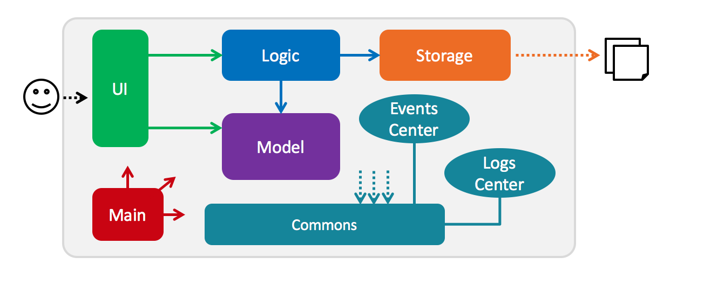

# Developer Guide 

* [Setting Up](#setting-up)
* [Design](#design)
* [Implementation](#implementation)
* [Testing](#testing)
* [Dev Ops](#dev-ops)
* [Appendix A: User Stories](#appendix-a-user-stories)
* [Appendix B: Use Cases](#appendix-b-use-cases)
* [Appendix C: Non Functional Requirements](#appendix-c-non-functional-requirements)
* [Appendix D: Glossary](#appendix-d-glossary)
* [Appendix E: Product Survey](#appendix-e-product-survey)

## Setting up

#### Prerequisites

1. **JDK `1.8.0_60`**  or later 

    > Having any Java 8 version is not enough.  
    This app will not work with earlier versions of Java 8.
    
2. **Eclipse** IDE
3. **e(fx)clipse** plugin for Eclipse (Do the steps 2 onwards given in
   [this page](http://www.eclipse.org/efxclipse/install.html#for-the-ambitious))
4. **Buildship Gradle Integration** plugin from the Eclipse Marketplace

#### Importing the project into Eclipse

0. Fork this repo, and clone the fork to your computer
1. Open Eclipse (Note: Ensure you have installed the **e(fx)clipse** and **buildship** plugins as given 
   in the prerequisites above)
2. Click `File` > `Import`
3. Click `Gradle` > `Gradle Project` > `Next` > `Next`
4. Click `Browse`, then locate the project's directory
5. Click `Finish`

  > * If you are asked whether to 'keep' or 'overwrite' config files, choose to 'keep'.
  > * Depending on your connection speed and server load, it can even take up to 30 minutes for the set up to finish
      (This is because Gradle downloads library files from servers during the project set up process)
  > * If Eclipse auto-changed any settings files during the import process, you can discard those changes.

## Design

### Architecture

 
The **_Architecture Diagram_** given above explains the high-level design of the App.
Given below is a quick overview of each component.

`Main` has only one class called [`MainApp`](../src/main/java/seedu/tasklitst/MainApp.java). It is responsible for,
* At app launch: Initializes the components in the correct sequence, and connect them up with each other.
* At shut down: Shuts down the components and invoke cleanup method where necessary.

[**`Commons`**](#common-classes) represents a collection of classes used by multiple other components.
Two of those classes play important roles at the architecture level.
* `EventsCentre` : This class (written using [Google's Event Bus library](https://github.com/google/guava/wiki/EventBusExplained))
  is used by components to communicate with other components using events (i.e. a form of _Event Driven_ design)
* `LogsCenter` : Used by many classes to write log messages to the App's log file.

The rest of the App consists four components.
* [**`UI`**](#ui-component) : The UI of tha App.
* [**`Logic`**](#logic-component) : The command executor.
* [**`Model`**](#model-component) : Holds the data of the App in-memory.
* [**`Storage`**](#storage-component) : Reads data from, and writes data to, the hard disk.

Each of the four components
* Defines its _API_ in an `interface` with the same name as the Component.
* Exposes its functionality using a `{Component Name}Manager` class.

For example, the `Logic` component (see the class diagram given below) defines its API in the `Logic.java`
interface and exposes its functionality using the `LogicManager.java` class. 
 

The _Sequence Diagram_ below shows how the components interact for the scenario where the user issues the
command `delete 3`.

>Note how the `Model` simply raises a `TaskListChangedEvent` when the Task list data are changed,
 instead of asking the `Storage` to save the updates to the hard disk.

The diagram below shows how the `EventsCenter` reacts to that event, which eventually results in the updates
being saved to the hard disk and the status bar of the UI being updated to reflect the 'Last Updated' time.  

> Note how the event is propagated through the `EventsCenter` to the `Storage` and `UI` without `Model` having
  to be coupled to either of them. This is an example of how this Event Driven approach helps us reduce direct 
  coupling between components.

The sections below give more details of each component.

### UI component

 

**API** : [`Ui.java`](../src/main/java/seedu/tasklist/ui/Ui.java)

The UI consists of a `MainWindow` that is made up of parts e.g.`CommandBox`, `ResultDisplay`, `TaskListPanel`,
`StatusBarFooter`, `BrowserPanel` etc. All these, including the `MainWindow`, inherit from the abstract `UiPart` class
and they can be loaded using the `UiPartLoader`.

The `UI` component uses JavaFx UI framework. The layout of these UI parts are defined in matching `.fxml` files
 that are in the `src/main/resources/view` folder. 
 For example, the layout of the [`MainWindow`](../src/main/java/seedu/tasklist/ui/MainWindow.java) is specified in
 [`MainWindow.fxml`](../src/main/resources/view/MainWindow.fxml)

The `UI` component,
* Executes user commands using the `Logic` component.
* Binds itself to some data in the `Model` so that the UI can auto-update when data in the `Model` change.
* Responds to events raised from various parts of the App and updates the UI accordingly.

### Logic component

 

**API** : [`Logic.java`](../src/main/java/seedu/tasklist/logic/Logic.java)

1. `Logic` uses the `Parser` class to parse the user command.
2. This results in a `Command` object which is executed by the `LogicManager`.
3. The command execution can affect the `Model` (e.g. adding a Task) and/or raise events.
4. The result of the command execution is encapsulated as a `CommandResult` object which is passed back to the `Ui`.

Given below is the Sequence Diagram for interactions within the `Logic` component for the `execute("delete 1")`
 API call. 
 

### Model component

 

**API** : [`Model.java`](../src/main/java/seedu/tasklist/model/Model.java)

The `Model`,
* stores a `UserPref` object that represents the user's preferences.
* stores the Task List data.
* exposes a `UnmodifiableObservableList<ReadOnlyTask>` that can be 'observed' e.g. the UI can be bound to this list
  so that the UI automatically updates when the data in the list change.
* does not depend on any of the other three components.

### Storage component

 

**API** : [`Storage.java`](../src/main/java/seedu/tasklist/storage/Storage.java)

The `Storage` component,
* can save `UserPref` objects in json format and read it back.
* can save the Task list data in xml format and read it back.

### Common classes

Classes used by multiple components are in the `seedu.tasklist.commons` package.

## Implementation

### Logging

We are using `java.util.logging` package for logging. The `LogsCenter` class is used to manage the logging levels
and logging destinations.

* The logging level can be controlled using the `logLevel` setting in the configuration file
  (See [Configuration](#configuration))
* The `Logger` for a class can be obtained using `LogsCenter.getLogger(Class)` which will log messages according to
  the specified logging level
* Currently log messages are output through: `Console` and to a `.log` file.

**Logging Levels**

* `SEVERE` : Critical problem detected which may possibly cause the termination of the application
* `WARNING` : Can continue, but with caution
* `INFO` : Information showing the noteworthy actions by the App
* `FINE` : Details that is not usually noteworthy but may be useful in debugging
  e.g. print the actual list instead of just its size

### Configuration

Certain properties of the application can be controlled (e.g App name, logging level) through the configuration file 
(default: `config.json`):

## Testing

Tests can be found in the `./src/test/java` folder.

**In Eclipse**:
> If you are not using a recent Eclipse version (i.e. _Neon_ or later), enable assertions in JUnit tests
  as described [here](http://stackoverflow.com/questions/2522897/eclipse-junit-ea-vm-option).

* To run all tests, right-click on the `src/test/java` folder and choose
  `Run as` > `JUnit Test`
* To run a subset of tests, you can right-click on a test package, test class, or a test and choose
  to run as a JUnit test.

**Using Gradle**:
* See [UsingGradle.md](UsingGradle.md) for how to run tests using Gradle.

We have two types of tests:

1. **GUI Tests** - These are _System Tests_ that test the entire App by simulating user actions on the GUI. 
   These are in the `guitests` package.
  
2. **Non-GUI Tests** - These are tests not involving the GUI. They include,
   1. _Unit tests_ targeting the lowest level methods/classes.  
      e.g. `seedu.tasklist.commons.UrlUtilTest`
   2. _Integration tests_ that are checking the integration of multiple code units 
     (those code units are assumed to be working). 
      e.g. `seedu.tasklist.storage.StorageManagerTest`
   3. Hybrids of unit and integration tests. These test are checking multiple code units as well as 
      how the are connected together. 
      e.g. `seedu.tasklist.logic.LogicManagerTest`
  
**Headless GUI Testing** :
Thanks to the [TestFX](https://github.com/TestFX/TestFX) library we use,
 our GUI tests can be run in the _headless_ mode. 
 In the headless mode, GUI tests do not show up on the screen.
 That means the developer can do other things on the Computer while the tests are running. 
 See [UsingGradle.md](UsingGradle.md#running-tests) to learn how to run tests in headless mode.
  
## Dev Ops

### Build Automation

See [UsingGradle.md](UsingGradle.md) to learn how to use Gradle for build automation.

### Continuous Integration

We use [Travis CI](https://travis-ci.org/) to perform _Continuous Integration_ on our projects.
See [UsingTravis.md](UsingTravis.md) for more details.

### Making a Release

Here are the steps to create a new release.
 
 1. Generate a JAR file [using Gradle](UsingGradle.md#creating-the-jar-file).
 2. Tag the repo with the version number. e.g. `v0.1`
 2. [Crete a new release using GitHub](https://help.github.com/articles/creating-releases/) 
    and upload the JAR file your created.
   
### Managing Dependencies

A project often depends on third-party libraries. For example, Task List depends on the
[Jackson library](http://wiki.fasterxml.com/JacksonHome) for XML parsing. Managing these _dependencies_
can be automated using Gradle. For example, Gradle can download the dependencies automatically, which
is better than these alternatives. 
a. Include those libraries in the repo (this bloats the repo size) 
b. Require developers to download those libraries manually (this creates extra work for developers) 

##Appendix A: User Stories

Priorities: High (must have) - `* * *`, Medium (nice to have)  - `* *`,  Low (unlikely to have) - `*`

Priority | As a ... | I want to ... | So that I can...
-------- | :-------- | :--------- | :-----------
`* * *` | new user | see usage instructions | refer to instructions when I forget how to use the App
`* * *` | user | add events, deadlines and [floating tasks] (#floating-tasks)| 
`* * *` | user | mark a task as complete | 
`* * *` | user | view events by category (overdue, today, tomorrow, next 7 days, floating, other tasks) or by date | keep track of upcoming events
`* * *` | user | view incomplete tasks | decide the next task to do
`* * *` | user | search events or tasks by keywords | view details of the event easily
`* * *` | user | edit event details | keep my task list updated
`* * *` | user | delete tasks | discard tasks that cannot be done
`* * *` | user | sort the event by date or priority | easily view events that requires immediate attention
`* *` | busy user | mark tasks as priority | display them at the top of my tasks
`* *` | user | set my storage file to some other folder/directory (e.g dropbox) | store a back up of my tasks in dropbox or google drive
`* *` | user | undo and redo the changes made to my tasklist | Keep my tasklist in order
`*` | user | Have recurring events | save the trouble of having to add a new task periodically. 
`*` | user | have auto-fill search | quickly search for relevant tasks 

##Appendix B: Use Cases

(For all use cases below, the **System** is the `TaskManager` and the **Actor** is the `user`, unless specified otherwise)

#### Use case UC01 - Add a task/event/deadline

**MSS**

Precondition: Parameters such as date, time and keywords entered should be valid.  

Guarantees: 
* Event, deadline or floating task added 

1. User enters add command and task details with relevant parameters.
2. System adds task into storage file and prints message showing the added task.

**Extensions**

1a. Clash of timeslots
> 1a1. System will identify the clash and will display to the user the list of actions to be taken.
User can ignore collision or replace existing task with current task or reschedule task or cancel operation.

#### Use case UC02 - Show tasks

**MSS**

Precondition: Task category entered should be valid

1. User enters show command and category.
2. System shows list of tasks under the category entered.
Use case ends.

/* @@author A0144919W */

#### Use case UC03 - Delete task

**MSS**

Precondition: There has to be at least one task for the use to delete.

Guarantees: 
* Event will be deleted from the storage file. 

1. User enters delete command and partial task name.
2. System shows a list of indexed tasks matching the task name.
3. User enters index number of task to be deleted.
4. System deletes the task.
Use case ends.

**Extensions**

2a. None of the existing tasks match the user input.
> 2a1. Use case ends.
 
3a. User cancels task deletion.
> 3a1. Use case ends.

3b. Entered index number is invalid.
> 3b1. System shows an error message.
Use case resumes at step 2.

#### Use case UC04 - Find tasks

**MSS**

Precondition: Only events stored in the storage file can be searched.

1. User enters find command and a keyword.
2. System displays a list of matching tasks.
3. User enters the index of a task from the list.
4. System displays the details of the particular task.

**Extensions**
1a. User enters find command and an index.
> 1a1. Use case jumps to Step 4.

2a. The given keyword is invalid
> 2a1. The system shows an error message  
  Use case resumes at Step 1.

2b. The list is empty
> Use case ends.

4a. User selects invalid task from the list
> 4a1. The system shows an error message  
   Use case resumes at Step 3.

#### Use case UC05 - Update task details

**MSS**

Precondition: Task has to exist in the storage file to update. 

Guarantees:  
* The corresponding task details will be updated to their new values. 

1. The user searches for the task (UC04) to be updated. 
2. System displays an indexed list of the task(s). 
3. User enters index of task to be updated, field to be changed and the new value for the field.
4. System stores updates in the storage file and prints message showing the updated entry. 

**Extensions**

2a. The list is empty
> Use case ends

3a. The given index is invalid
> 3a1. The system shows an error message  
  Use case resumes at Step 2

/* @@author */

#### Use case UC06 - Set storage directory

**MSS**

Precondition: The storage file has to exist in order for the directory shift to take place. 

Guarantees:  
* The corresponding file path will be updated to its new value. 

1. The user enters the file path, indicating the folder in which he wants to save the data.
2. When the user enters the file path, he should indicate the file name by which he wants to update the directory:
   e.g  Users/James/Desktop/[filename].xml
3. System will process the file path and will create a copy of the file in the new directory.
4. File in the old directory will be removed. 

##Appendix C: Non Functional Requirements

1. Should work on any [Mainstream OS](#mainstream-os) as long as it has Java 8 or higher installed.
2. Should be able to hold up to 1000 tasks.
3. Should come with automated unit tests and [open source] (#open-source) code.
4. Should favor DOS style commands over Unix-style commands.
5. Should not lose task/event details in the event that the App crashes.
6. Should have fast response time, results added and retrieved in less than a second.
7. Should not have bugs that interfere with the functionalities of the device.
8. There should be back up of documentations and code.
9. Should store data in encrypted form as a form of data security.
10. Should not require an installer to run the application.

More NFRs and project constraints listed [here](http://www.comp.nus.edu.sg/~cs2103/AY1617S1/contents/handbook.html#handbook-project-constraints).

##Appendix D: Glossary

#### Mainstream OS

> Windows, Linux, Unix, OS-X.

#### Floating tasks

> Tasks with no specific date/time which the user might need to take note of.

#### Open source

> Denotes software for which the original source code is made freely available, which may be redistributed and modified.

##Appendix E: Product Survey

/* @@author A0144919W */

#### Google Calendar (studied by Pankaj Bhootra)

Strengths:

1. User-friendly manner of adding new events and deadlines
2. Acknowledges the important features required by the project (marking a task as 'done', searching for a task by keywords, support for recurring events, quick add feature, etc.)
3. Automatic reminder feature for tasks
4. Categorizes events as "today", "this week" and "this month", etc. which is in line with the project requirement
5. Clear, concise, responsive and efficient UI

Weaknesses:

1. Does not provide support for floating tasks (need to provide a placeholder date/time while adding any task). Also not very good in recording tasks that need to be done before or after a specific date/time.
2. Does not provide CLI (Command Line Interface) for managing tasks
3. Too slow for users who retrieve/edit/store tasks frequently
4. Unavailable in places with no internet connectivity
5. Does not provide the feature to block multiple slots for unconfirmed tasks

/* @@author */

#### Todoist (studied by R Dheeraj)

Strengths:

1. Use of natural language inputs to add events or tasks.
   a> Use of hashtags to categorize the tasks into their respective archives/folders.
   b> Input words such as everyday and every week can be used to set the timeframe for recurring events.
2. There are color coded priority flags to help users decide on the priority of tasks.
   a> Users can filter tasks based on the priority level and a listed of task will be displayed, sorted by date. 
3. Tasks with no due dates can also be added and viewed. 
4. Apart from filters, users have an option of sorting their tasks by name, priority and date. In the homepage, there will be all the tasks displayed and users can choose their sort options to have a quick view. 
5. Upcoming tasks can also be filtered by their immediacy: today, next 7 days and next month. 
6. Comments/tags can also be added to each tasks. Sometimes, event/task name alone will not be comprehensive. Therefore, users could include description of event/task in the form of comments/tags under each event. 
7. A link with a list of all the shortcut keys for each function has been included. 

Weaknesses:

1. Reminder feature could only be utilized by premium members.
2. Additional features such as backups and productivity trackers are only available in the premium version.

#### Todo.txt (studied by Lester Tan)

Strengths:

1. Simple (CLI)
2. UNIX-style input, for those used to UNIX
3. Syncing between computer program and mobile application
4. Open-source: allows user-written extensions to be integrated
5. Ability to mark a task as a priority
6. Allows a series of tasks in a project to be listed out
7. Able to set tags ("contexts") for easy reference

Weaknesses:

1. No GUI
2. Fixed format for entering dates
3. No feature to search for free slots

#### Fantastical (studied by Fionna Tong)

Strengths:

1. Uses powerful natural language for adding events with or without date.
2. Keeps the calendar view and list of upcoming events active.
3. Full calendar window with options to view by day, week, month or year while adding events
4. Automatically shows public holidays in the calendar for easier scheduling.
5. Able to sync and integrate with existing calendars e.g. local, Google and Exchange - this allows Jim to access his calendar from both his work and personal laptops.
6. Supports different calendar sets.

Weaknesses:

1. Does not help look for a free slot to schedule an event.
2. Does not have a way to "block" multiple time slots for an event when the timing is uncertain, and release the blocked slots when the time is finalised.
3. Allows scheduling for different events at the same time without prompting the user.
4. No CLI.
