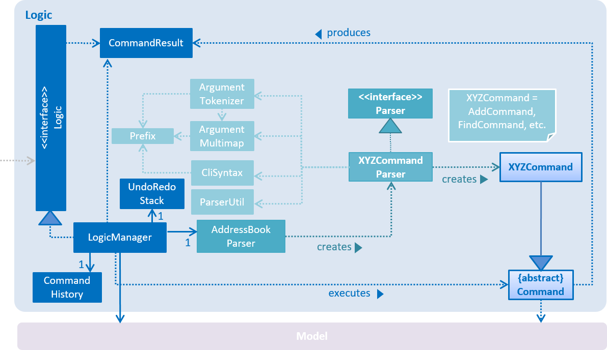

# Developer Guide 
* [Introduction](#introduction)
* [Setting Up](#setting-up)
* [Design](#design)
* [Implementation](#implementation)
* [Testing](#testing)
* [Dev Ops](#dev-ops)
* [Appendix A: User Stories](#appendix-a-user-stories)
* [Appendix B: Use Cases](#appendix-b-use-cases)
* [Appendix C: Non Functional Requirements](#appendix-c-non-functional-requirements)
* [Appendix D: Glossary](#appendix-d-glossary)
* [Appendix E : Product Survey](#appendix-e-product-survey)

## INTRODUCTION
RubyTask is a simple tool for busy professionals to schedule and manage their daily to-do tasks! It is a Java desktop application that allows efficient interaction with a GUI and does not require connection to the Internet.
This guide describes the design and implementation of RubyTask. It will help you understand how RubyTask works and how you can further contribute to its development.

## SETTING UP

#### Prerequisites

1. **JDK `1.8.0_60`**  or later 

    > Having any Java 8 version is not enough.  
    This app will not work with earlier versions of Java 8.
    
2. **Eclipse** IDE
3. **e(fx)clipse** plugin for Eclipse (Do the steps 2 onwards given in
   [this page](http://www.eclipse.org/efxclipse/install.html#for-the-ambitious))
4. **Buildship Gradle Integration** plugin from the Eclipse Marketplace

#### Importing the project into Eclipse

0. Fork this repo, and clone the fork to your computer
1. Open Eclipse (Note: Ensure you have installed the **e(fx)clipse** and **buildship** plugins as given 
   in the prerequisites above)
2. Click `File` > `Import`
3. Click `Gradle` > `Gradle Project` > `Next` > `Next`
4. Click `Browse`, then locate the project's directory
5. Click `Finish`

  > * If you are asked whether to 'keep' or 'overwrite' config files, choose to 'keep'.
  > * Depending on your connection speed and server load, it can even take up to 30 minutes for the set up to finish
      (This is because Gradle downloads library files from servers during the project set up process)
  > * If Eclipse auto-changed any settings files during the import process, you can discard those changes.

## DESIGN

### Architecture

 
_Figure 1: Components of RubyTask and their dependencies._  

Figure 1 gives a high-level design overview of the RubyTask, and a quick overview of each component follows.

`Main` has only one class called [`MainApp`](../src/main/java/seedu/address/MainApp.java). It is responsible for,
* At app launch: Initializes the components in the correct sequence, and connect them up with each other.
* At shut down: Shuts down the components and invoke cleanup method where necessary.

[**`Commons`**](#common-classes) represents a collection of classes used by multiple other components.
Two of those classes play important roles at the architecture level.
* `EventsCentre` : This class (written using [Google's Event Bus library](https://github.com/google/guava/wiki/EventBusExplained))
  is used by components to communicate with other components using events (i.e. a form of _Event Driven_ design)
* `LogsCenter` : Used by many classes to write log messages to the App's log file.

The rest of the App consists four components.
* [**`UI`**](#ui-component) : The UI of tha App.
* [**`Logic`**](#logic-component) : The command executor.
* [**`Model`**](#model-component) : Holds the data of the App in-memory.
* [**`Storage`**](#storage-component) : Reads data from, and writes data to, the hard disk.

Each of the four components
* Defines its _API_ in an `interface` with the same name as the Component.
* Exposes its functionality using a `{Component Name}Manager` class.

For example, the `Logic` component (illustrated in Figure 2) defines it's API in the `Logic.java`
interface and exposes its functionality using the `LogicManager.java` class. 
 
_Figure 2: Class Diagram of the `Logic `component_

The _Sequence Diagram_ (Figure 3) below shows how the components interact for the scenario where the user issues the
command `delete 3`.

 
_Figure 3: Sequence Diagram for delete command_

>Note how the `Model` simply raises a `AddressBookChangedEvent` when the Address Book data are changed,
 instead of asking the `Storage` to save the updates to the hard disk.

The next Sequence Diagram (Figure 4) shows how the `EventsCenter` reacts to that event, which eventually results in the updates
being saved to the hard disk and the status bar of the UI being updated to reflect the 'Last Updated' time.  
 
_Figure 4: Sequence Diagram of_ `EventsCenter`

> Note how the event is propagated through the `EventsCenter` to the `Storage` and `UI` without `Model` having
  to be coupled to either of them. This is an example of how this Event Driven approach helps us reduce direct 
  coupling between components.

We will now elaborate on the details of each component.

### UI component

 
_Figure 5: Class Diagram of the_ `UI `_component_

**API** : [`Ui.java`](../src/main/java/seedu/address/ui/Ui.java)

The UI consists of a `MainWindow` that is made up of parts e.g.`CommandBox`, `ResultDisplay`, `PersonListPanel`,
`StatusBarFooter`, `BrowserPanel` etc. All these, including the `MainWindow`, inherit from the abstract `UiPart` class
and they can be loaded using the `UiPartLoader`.

The `UI` component uses JavaFx UI framework. The layout of these UI parts are defined in matching `.fxml` files
 that are in the `src/main/resources/view` folder. 
 For example, the layout of the [`MainWindow`](../src/main/java/seedu/address/ui/MainWindow.java) is specified in
 [`MainWindow.fxml`](../src/main/resources/view/MainWindow.fxml)

The `UI` component,
* Executes user commands using the `Logic` component.
* Binds itself to some data in the `Model` so that the UI can auto-update when data in the `Model` change.
* Responds to events raised from various parts of the App and updates the UI accordingly.

### Logic component

 
_Figure 6: Class Diagram of the_ `Logic `_component_

**API** : [`Logic.java`](../src/main/java/seedu/address/logic/Logic.java)

* `Logic` uses the `Parser` class to parse the user command.
* This results in a `Command` object which is executed by the `LogicManager`.
* The command execution can affect the `Model` (e.g. adding a person) and/or raise events.
* The result of the command execution is encapsulated as a `CommandResult` object which is passed back to the `Ui`.

Figure 7 below illustrates the Sequence Diagram for interactions within the `Logic` component for the `execute("delete 1")`
 API call. 
 
_Figure 7: Sequence Diagram of interactions within the `Logic` component_

### Model component

 
_Figure 8: Class Diagram of the_ `Model `_component_

**API** : [`Model.java`](../src/main/java/seedu/address/model/Model.java)

The `Model`,
* stores a `UserPref` object that represents the user's preferences.
* stores the Address Book data.
* exposes a `UnmodifiableObservableList<ReadOnlyPerson>` that can be 'observed' e.g. the UI can be bound to this list
  so that the UI automatically updates when the data in the list change.
* does not depend on any of the other three components.

### Storage component

 
_Figure 9: Class Diagram of the_ `Storage `_component_

**API** : [`Storage.java`](../src/main/java/seedu/address/storage/Storage.java)

The `Storage` component,
* can save `UserPref` objects in json format and read it back.
* can save the Address Book data in xml format and read it back.

### Common classes

Classes used by multiple components are in the `seedu.addressbook.commons` package.

## IMPLEMENTATION

### Logging

We are using `java.util.logging` package for logging. The `LogsCenter` class is used to manage the logging levels
and logging destinations.

* The logging level can be controlled using the `logLevel` setting in the configuration file
  (See [Configuration](#configuration))
* The `Logger` for a class can be obtained using `LogsCenter.getLogger(Class)` which will log messages according to
  the specified logging level
* Currently log messages are output through: `Console` and to a `.log` file.

**Logging Levels**

* `SEVERE` : Critical problem detected which may possibly cause the termination of the application
* `WARNING` : Can continue, but with caution
* `INFO` : Information showing the noteworthy actions by the App
* `FINE` : Details that is not usually noteworthy but may be useful in debugging
  e.g. print the actual list instead of just its size

### Configuration

Certain properties of the application can be controlled (e.g App name, logging level) through the configuration file 
(default: `config.json`):

## TESTING

Tests can be found in the `./src/test/java` folder.

**In Eclipse**:
> If you are not using a recent Eclipse version (i.e. _Neon_ or later), enable assertions in JUnit tests
  as described [here](http://stackoverflow.com/questions/2522897/eclipse-junit-ea-vm-option).

* To run all tests, right-click on the `src/test/java` folder and choose
  `Run as` > `JUnit Test`
* To run a subset of tests, you can right-click on a test package, test class, or a test and choose
  to run as a JUnit test.

**Using Gradle**:
* See [UsingGradle.md](UsingGradle.md) for how to run tests using Gradle.

We have two types of tests:

1. **GUI Tests** - These are _System Tests_ that test the entire App by simulating user actions on the GUI. 
   These are in the `guitests` package.
  
2. **Non-GUI Tests** - These are tests not involving the GUI. They include,
   1. _Unit tests_ targeting the lowest level methods/classes.  
      e.g. `seedu.address.commons.UrlUtilTest`
   2. _Integration tests_ that are checking the integration of multiple code units 
     (those code units are assumed to be working). 
      e.g. `seedu.address.storage.StorageManagerTest`
   3. Hybrids of unit and integration tests. These test are checking multiple code units as well as 
      how the are connected together. 
      e.g. `seedu.address.logic.LogicManagerTest`
  
**Headless GUI Testing** :
Thanks to the [TestFX](https://github.com/TestFX/TestFX) library we use,
 our GUI tests can be run in the _headless_ mode. 
 In the headless mode, GUI tests do not show up on the screen.
 That means the developer can do other things on the Computer while the tests are running. 
 See [UsingGradle.md](UsingGradle.md#running-tests) to learn how to run tests in headless mode.
  
## DEV OPS

### Build Automation

See [UsingGradle.md](UsingGradle.md) to learn how to use Gradle for build automation.

### Continuous Integration

We use [Travis CI](https://travis-ci.org/) to perform _Continuous Integration_ on our projects.
See [UsingTravis.md](UsingTravis.md) for more details.

### Making a Release

Here are the steps to create a new release.
 
 1. Generate a JAR file [using Gradle](UsingGradle.md#creating-the-jar-file).
 2. Tag the repo with the version number. e.g. `v0.1`
 3. [Crete a new release using GitHub](https://help.github.com/articles/creating-releases/) 
    and upload the JAR file your created.
   
### Managing Dependencies

A project often depends on third-party libraries. For example, Address Book depends on the
[Jackson library](http://wiki.fasterxml.com/JacksonHome) for XML parsing. Managing these _dependencies_
can be automated using Gradle. For example, Gradle can download the dependencies automatically, which
is better than these alternatives. 
a. Include those libraries in the repo (this bloats the repo size) 
b. Require developers to download those libraries manually (this creates extra work for developers) 

## APPENDIX A: USER STORIES

Priorities: High (must have) - `* * *`, Medium (nice to have)  - `* *`,  Low (unlikely to have) - `*`

Priority | As a ... | I want to ... | So that I can...
-------- | :-------- | :--------- | :-----------
`* * *` | new user | see usage instructions | refer to instructions when I forget how to use the App
`* * *` | user | add a new task |
`* * *` | user | delete a task | remove entries that I no longer need
`* * *` | user | undo latest command | update task list quickly if there is a change-of-mind
`* * *` | user | edit a task | update task entry with fresh information without deleting and then adding
`* * *` | user | find a task by name | locate details of task without having to go through the entire list
`* * *` | user | add task without deadlines | track tasks that has no deadline and just need to be done "some day"
`* * *` | user | mark tasks that are already completed | keep track of what I have done
`* *` | user | hide lists of tasks by default | minimize chance of someone else seeing them by accident
`* *` | user | duplicate a task that recurs weekly | minimize number of additions for a recurring task
`*` | user with many tasks in the task manager | sort tasks by name | locate a task easily
`*` | user | have a backup of my schedule | make a recovery from the backup in case of a software or hardware crash

## APPENDIX B: USE CASES

(For all use cases below, the **System** is the `Task Manager` and the **Actor** is the `user`, unless specified otherwise)

### Use case: Add task

**MSS**

1.  User requests to add task
2.  RubyTask adds the task. Use case ends.

**Extensions**

1a. Invalid syntax for command
> 1a1. RubyTask shows an error message. Use case ends

### Use case: Find task with keywords

**MSS**

1.  User requests to list tasks matching keywords
2.  RubyTask shows a list of tasks matching keywords. Use case ends.

**Extensions**

2a. No matching tasks
> 2a1. RubyTask shows an error message. Use case ends

### Use case: Delete task

**MSS**

1.  User requests to list tasks
2.  RubyTask shows a list of tasks
3.  User requests to delete a specific task in the list
4.  RubyTask deletes the task. Use case ends.

**Extensions**

2a. The list is empty
> 2a1. Use case ends.

3a. The given index is invalid
> 3a1. RubyTask shows an error message.\
> 3a2. Use case resumes at step 2.

### Use case: Undo latest command

**MSS**

1.  User requests to add or delete task.
2.  User requests to undo latest command.
3.  RubyTask undoes the latest command. Use case ends.

**Extensions**

2a. Latest command is add task
> 2a1. RubyTask delete last added task. Use case ends.

2b. Latest command is delete task
> 2b1. RubyTask adds last deleted task. Use case ends.

2c. Latest command is invalid
> 2c1. Use case ends.

## APPENDIX C: NON FUNCTIONAL REQUIREMENTS

1. Should work on any [mainstream OS](#mainstream-os) as long as it has Java `1.8.0_60` or higher installed.
2. Should be able to hold up to 1000 persons.
3. Should come with automated unit tests and open source code.
4. Should favor DOS style commands over Unix-style commands.
5. Should be secure, not vulnerable to malicious inputs (e.g buffer overflow attacks).
6. Should be efficient, responses to inputs should not take longer than 2 seconds.
7.  Should be compact in size, i.e smaller than 10MB.

## APPENDIX D: GLOSSARY

##### Mainstream OS

> Windows, Linux, Unix, OS-X

## APPENDIX E: PRODUCT SURVEY

Google Calendar

*Pros* | *Cons* | 
-------- | --------
1. Simple UI, Default Weekly View | 1. Requires Internet to Sync
2. Good Overview of all timeslots available or unavailable  | 2. Do not have one-shot CLI approach (Even with quick add)
3. Collaboration feature, share calendar with friends | 3. Events must be allocated timeslots in 

Evernote

*Pros* | *Cons* | 
-------- | --------
1. Allows creation and update of notes over various platforms | 1. 1. Heavily dependent on Internet as user is cut off from database if there is no connection
2. Allows a variety of notes to be created and classified (e.g business cards, introduction manuals etc) | 2. Ability to organise and categorise notes is limited. Only 1-level notebooks and stacks are allowed unlike a file system.
3. Incorporates itself onto different platforms for ease of search and notifying user (e.g Google search) | 

Todo.txt

*Pros* | *Cons* | 
-------- | --------
1. Simple interface (e.g CLI) is available | 1. Not automatically sorted by dates
2. Does not require Internet connection | 2. Clashes of events are not prompted to the user
3. Can support large amount of task and details | 

Fantastical

*Pros* | *Cons* | 
-------- | --------
1. Both CLI and NLP is availablee | 1. Paid service
2. Does not require Internet connection | 2. Events have to be time-constrained
3. Can be brought up with keyboard shortcut | 
