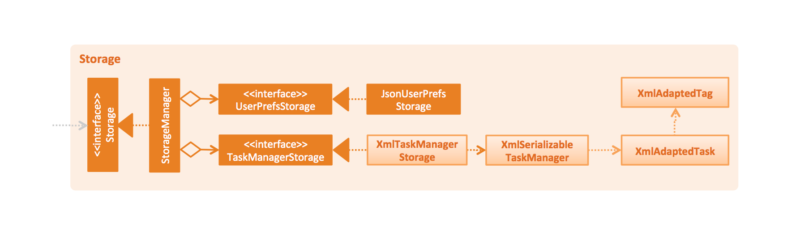

# Developer Guide 

* [Setting Up](#setting-up)
* [Design](#design)
* [Implementation](#implementation)
* [Testing](#testing)
* [Dev Ops](#dev-ops)
* [Appendix A: User Stories](#appendix-a-user-stories)
* [Appendix B: Use Cases](#appendix-b-use-cases)
* [Appendix C: Non Functional Requirements](#appendix-c-non-functional-requirements)
* [Appendix D: Glossary](#appendix-d-glossary)
* [Appendix E : Product Survey](#appendix-e-product-survey)

## Setting up

#### Prerequisites

1. **JDK `1.8.0_60`**  or later 

    > Having any Java 8 version is not enough.  
    This app will not work with earlier versions of Java 8.
    
2. **Eclipse** IDE
3. **e(fx)clipse** plugin for Eclipse (Do the steps 2 onwards given in
   [this page](http://www.eclipse.org/efxclipse/install.html#for-the-ambitious))
4. **Buildship Gradle Integration** plugin from the Eclipse Marketplace

#### Importing the project into Eclipse

0. Fork this repo, and clone the fork to your computer
1. Open Eclipse (Note: Ensure you have installed the **e(fx)clipse** and **buildship** plugins as given 
   in the prerequisites above)
2. Click `File` > `Import`
3. Click `Gradle` > `Gradle Project` > `Next` > `Next`
4. Click `Browse`, then locate the project's directory
5. Click `Finish`

  > * If you are asked whether to 'keep' or 'overwrite' config files, choose to 'keep'.
  > * Depending on your connection speed and server load, it can even take up to 30 minutes for the set up to finish
      (This is because Gradle downloads library files from servers during the project set up process)
  > * If Eclipse auto-changed any settings files during the import process, you can discard those changes.

## Design

<!--- @@author a0153617e -->

### Architecture

 
The **_Architecture Diagram_** given above explains the high-level design of the App.
Given below is a quick overview of each component.

`Main` has only one class called [`MainApp`](../src/main/java/jym/manager/MainApp.java). It is responsible for,
* At app launch: Initializes the components in the correct sequence, and connect them up with each other.
* At shut down: Shuts down the components and invoke cleanup method where necessary.

[**`Commons`**](#common-classes) represents a collection of classes used by multiple other components.
Two of those classes play important roles at the architecture level.
* `EventsCentre` : This class (written using [Google's Event Bus library](https://github.com/google/guava/wiki/EventBusExplained))
  is used by components to communicate with other components using events (i.e. a form of _Event Driven_ design)
* `LogsCenter` : Used by many classes to write log messages to the App's log file.

The rest of the App consists four components.
* [**`UI`**](#ui-component) : The UI of tha App.
* [**`Logic`**](#logic-component) : The command executor.
* [**`Model`**](#model-component) : Holds the data of the App in-memory.
* [**`Storage`**](#storage-component) : Reads data from, and writes data to, the hard disk.

Each of the four components
* Defines its _API_ in an `interface` with the same name as the Component.
* Exposes its functionality using a `{Component Name}Manager` class.

For example, the `Logic` component (see the class diagram given below) defines it's API in the `Logic.java`
interface and exposes its functionality using the `LogicManager.java` class. 
 

The _Sequence Diagram_ below shows how the components interact for the scenario where the user issues the
command `delete 1`.

>Note how the `Model` simply raises a `TaskManagerChangedEvent` when the Task Manager data are changed,
 instead of asking the `Storage` to save the updates to the hard disk.

The diagram below shows how the `EventsCenter` reacts to that event, which eventually results in the updates
being saved to the hard disk and the status bar of the UI being updated to reflect the 'Last Updated' time.  

> Note how the event is propagated through the `EventsCenter` to the `Storage` and `UI` without `Model` having
  to be coupled to either of them. This is an example of how this Event Driven approach helps us reduce direct 
  coupling between components.

The sections below give more details of each component.

### UI component

 

**API** : [`Ui.java`](../src/main/java/jym/manager/ui/Ui.java)

The UI consists of a `MainWindow` that is made up of parts e.g.`CommandBox`, `ResultDisplay`, `TaskListPanel`,
`StatusBarFooter`, `BrowserPanel` etc. All these, including the `MainWindow`, inherit from the abstract `UiPart` class
and they can be loaded using the `UiPartLoader`.

The `UI` component uses JavaFx UI framework. The layout of these UI parts are defined in matching `.fxml` files
 that are in the `src/main/resources/view` folder. 
 For example, the layout of the [`MainWindow`](../src/main/java/jym/manager/ui/MainWindow.java) is specified in
 [`MainWindow.fxml`](../src/main/resources/view/MainWindow.fxml)

The `UI` component,
* Executes user commands using the `Logic` component.
* Binds itself to some data in the `Model` so that the UI can auto-update when data in the `Model` change.
* Responds to events raised from various parts of the App and updates the UI accordingly.

### Logic component

 

**API** : [`Logic.java`](../src/main/java/jym/manager/logic/Logic.java)

1. `Logic` uses the `Parser` class to parse the user command.
2. This results in a `Command` object which is executed by the `LogicManager`.
3. The command execution can affect the `Model` (e.g. adding a task) and/or raise events.
4. The result of the command execution is encapsulated as a `CommandResult` object which is passed back to the `Ui`.

Given below is the Sequence Diagram for interactions within the `Logic` component for the `execute("delete 1")`
 API call. 
 

### Model component

 

**API** : [`Model.java`](../src/main/java/jym/manager/model/Model.java)

The `Model`,
* stores a `UserPref` object that represents the user's preferences.
* stores the Task Manager data.
* exposes a `UnmodifiableObservableList<ReadOnlyTask>` that can be 'observed' e.g. the UI can be bound to this list
  so that the UI automatically updates when the data in the list change.
* does not depend on any of the other three components.

### Storage component

 

**API** : [`Storage.java`](../src/main/java/jym/manager/storage/Storage.java)

The `Storage` component,
* can save `UserPref` objects in json format and read it back.
* can save the Task Manager data in xml format and read it back.

### Common classes

Classes used by multiple components are in the `jym.manager.commons` package.

## Implementation

### Logging

We are using `java.util.logging` package for logging. The `LogsCenter` class is used to manage the logging levels
and logging destinations.

* The logging level can be controlled using the `logLevel` setting in the configuration file
  (See [Configuration](#configuration))
* The `Logger` for a class can be obtained using `LogsCenter.getLogger(Class)` which will log messages according to
  the specified logging level
* Currently log messages are output through: `Console` and to a `.log` file.

**Logging Levels**

* `SEVERE` : Critical problem detected which may possibly cause the termination of the application
* `WARNING` : Can continue, but with caution
* `INFO` : Information showing the noteworthy actions by the App
* `FINE` : Details that is not usually noteworthy but may be useful in debugging
  e.g. print the actual list instead of just its size

### Configuration

Certain properties of the application can be controlled (e.g App name, logging level) through the configuration file 
(default: `config.json`):

## Testing

Tests can be found in the `./src/test/java` folder.

**In Eclipse**:
> If you are not using a recent Eclipse version (i.e. _Neon_ or later), enable assertions in JUnit tests
  as described [here](http://stackoverflow.com/questions/2522897/eclipse-junit-ea-vm-option).

* To run all tests, right-click on the `src/test/java` folder and choose
  `Run as` > `JUnit Test`
* To run a subset of tests, you can right-click on a test package, test class, or a test and choose
  to run as a JUnit test.

**Using Gradle**:
* See [UsingGradle.md](UsingGradle.md) for how to run tests using Gradle.

We have two types of tests:

1. **GUI Tests** - These are _System Tests_ that test the entire App by simulating user actions on the GUI. 
   These are in the `guitests` package.
  
2. **Non-GUI Tests** - These are tests not involving the GUI. They include,
   1. _Unit tests_ targeting the lowest level methods/classes.  
      e.g. `jym.manager.commons.UrlUtilTest`
   2. _Integration tests_ that are checking the integration of multiple code units 
     (those code units are assumed to be working). 
      e.g. `jym.manager.storage.StorageManagerTest`
   3. Hybrids of unit and integration tests. These test are checking multiple code units as well as 
      how the are connected together. 
      e.g. `jym.manager.logic.LogicManagerTest`
  
**Headless GUI Testing** :
Thanks to the [TestFX](https://github.com/TestFX/TestFX) library we use,
 our GUI tests can be run in the _headless_ mode. 
 In the headless mode, GUI tests do not show up on the screen.
 That means the developer can do other things on the Computer while the tests are running. 
 See [UsingGradle.md](UsingGradle.md#running-tests) to learn how to run tests in headless mode.
  
## Dev Ops

### Build Automation

See [UsingGradle.md](UsingGradle.md) to learn how to use Gradle for build automation.

### Continuous Integration

We use [Travis CI](https://travis-ci.org/) to perform _Continuous Integration_ on our projects.
See [UsingTravis.md](UsingTravis.md) for more details.

### Making a Release

Here are the steps to create a new release.
 
 1. Generate a JAR file [using Gradle](UsingGradle.md#creating-the-jar-file).
 2. Tag the repo with the version number. e.g. `v0.1`
 2. [Crete a new release using GitHub](https://help.github.com/articles/creating-releases/) 
    and upload the JAR file your created.
   
### Managing Dependencies

A project often depends on third-party libraries. For example, JYM depends on the
[Jackson library](http://wiki.fasterxml.com/JacksonHome) for XML parsing. Managing these _dependencies_
can be automated using Gradle. For example, Gradle can download the dependencies automatically, which
is better than these alternatives. 
a. Include those libraries in the repo (this bloats the repo size) 
b. Require developers to download those libraries manually (this creates extra work for developers) 

## Appendix A : User Stories

Priorities: High (must have) - `* * *`, Medium (nice to have)  - `* *`,  Low (unlikely to have) - `*`

<!--- @@author A0153440R -->

Priority | As a ... | I want to ... | So that I can...
-------- | :-------- | :--------- | :-----------
`* * *` | new user | see usage instructions | refer to instructions when I forget how to use the App
`* * *` | user | add a new task or event with a given deadline or date and priority | remember what tasks I have to do in the future. 
`* * *` | user | add a floating task with no given deadline or date | work on long term tasks that have no given deadline.
`* * *` | user | mark a task or event as completed | refer to which tasks I have finished or not finished
`* * *` | user | find a task or event by name | locate details of tasks/events without having to go through the entire list
`* * *` | user | list upcoming tasks in sorted order | determine which tasks I should do next
`* * *` | user | edit tasks | update tasks if things change.
`* * *` | user | undo recent commands | revert tasks/events created by mistake.
`* * *` | user | receive reminders for upcoming tasks | don't forget about tasks
`* * *` | user | specify the location to place the data storage | do things with it, like sync it to my Dropbox.
`* *` | user | add tasks through plain English | type more naturally than having to write in commands and flags.
`* *` | user | view tasks in a calendar format | figure out what events/tasks I have upcoming more easily.
`* *` | user | bring up the program with a hotkey | pull it up quickly and conveniently when I need to add a task.
`* *` | user | schedule multiple time blocks with one task | schedule tasks or events that have multiple and different deadlines or dates.
`* *` | user | auto-complete certain commands (complete, clear, anything longer than about 5 letters) | save time instead of having to type out the whole command.
`*` | user | manipulate the schedule with a mouse | save time manipulating the calendar directly as opposed to having to go back to the CLI and type in more command rescheduling events (e.g. drag-drop vs. retyping event details)
`*` | user | view list or calendar in a pop out window | look at it more easily while working on other items.
`*` | user | customize the GUI if need (manipulate color schemes, move text boxes/output boxes to various locations, etc.) | have an easier time manipulating the information and let the program be more pleasing to my eyes.

{More to be added}

## Appendix B : Use Cases

(For all use cases below, the **System** is the `JYM` and the **Actor** is the `user`, unless specified otherwise)

#### Use case: Mark Task completed.

**MSS**

1. User requests to view list of active tasks
2. System shows list of tasks
3. User requests to mark a task as completed from the list.
4. System marks task as completed  
Use case ends.

**Extensions**

2a. The list is empty

> Use case ends

3a. The given index is invalid

> 3a1. JYM shows an error message  
  Use case resumes at step 2

#### Use case: Update Task

**MSS**

1. User requests to view list of active tasks
2. System shows list of tasks
3. User requests to update a task with given description and/or deadline
4. System updates task.
Use case ends.

**Extensions**

2a. List is empty

> Use case ends

3a. Given index invalid

> 3a1. JYM shows error message  
  Use case resumes at step 2
  
3b. Invalid deadline supplied by user

> 3b1. JYM returns error message  
  Use case resumes at step 2
  
{More to be added}

## Appendix C : Non Functional Requirements

1. Program should load within 5 seconds
2. Storage file should be limited to 100MB default (can be changed by user)
3. Should work on any mainstream OS
4. Should hold up to 1000 tasks/events on the active task list at any time
5. Comes with automated unit tests.
6. Commands should be intuitive and easy to use.
7. Interface is simple and easy to understand for beginners (i.e. people seeing it for the first time are not confused by what box does what).

{More to be added}

## Appendix D : Glossary

##### Mainstream OS

> Windows, Linux, Unix, OS-X

##### Task

> An activity that needs to be completed by a certain date or time. Contains
a description, deadline, and priority.

##### Event

> An activity that happens within a set boundary of time, with a start and end time on a given date.
Contains a description, event date and time, priority, and location.

##### Floating Task

> A task with no set deadline. 

##### Active Task List

> List of tasks that have yet to be marked complete and whose deadlines have not passed yet.

## Appendix E : Product Survey

##### Google Calendar Quickadd

> Satisfies many stories, but cannot add multiple events simultaneously, and does not hold support for both tasks and events.  
> Everything is an event, and although one can create them in a certain way to make them act like tasks, it can be tedious and not optimal to do so.

<!--- @@author a0153617e -->

##### iStudiez Pro

> Satisfies many stories, in particular having a nice GUI and being able to view the task list in many formats. However, there is no shortcut to add tasks, and you cannot type everything in one line without tabbing over to a separate text box.

<!--- @@author A0116137M -->

##### S Planner (Samsung Phone Calendar, Android 4.2.2)

> Is only a smartphone app. Harder to type in tasks and events on the phone.  
> Syncs with Google Calendar.  

##### GO Note Widget (to-do list add-on for GO Launcher)

> Clean and simple interface (clutter-free)  
> Can mark tasks with colored labels  
> No option to state the start or end time of a task  
> Smartphone app.