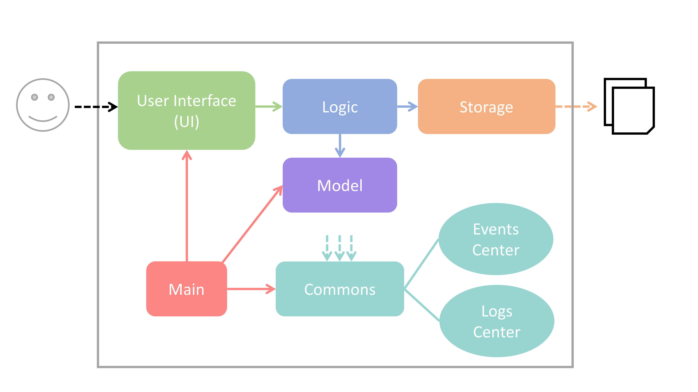
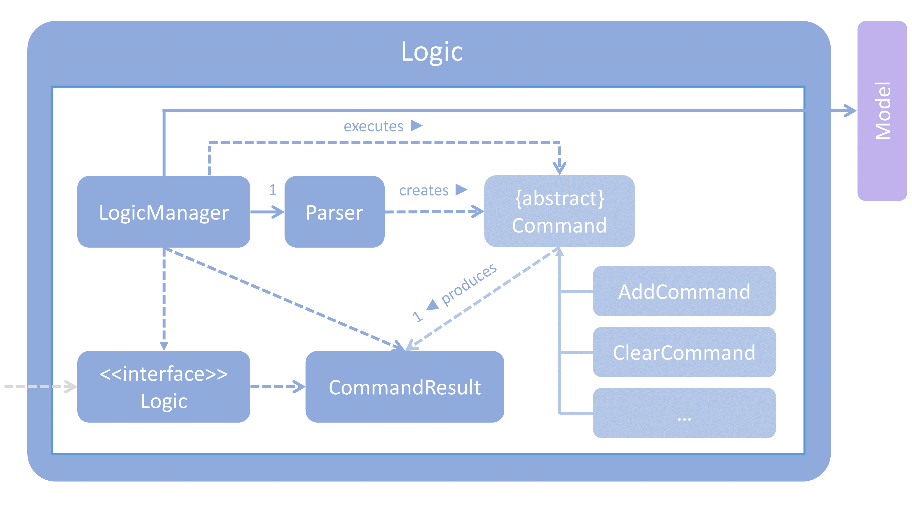

# Developer Guide 

 
## Introduction

Amethyst is a command-line task manager targeted at power users who would like to store, access and edit information about their tasks efficiently.

This guide describes the design and implementation of Amethyst, to help you understand how Amethyst works. Relevant information regarding implementation, testing and available developer tools/resources have also been included in this guide to help you along as you work on Amethyst's future development. We have organised this guide in a top-down manner so that you can understand the big picture before moving on to the more detailed sections. 

 
## Table of Contents
<!-- MarkdownTOC -->

- [Setting Up](#setting-up)
- [Architecture](#architecture)
- [UI Component](#ui-component)
    - [`UiManager` Class](#uimanager-class)
- [Logic Component](#logic-component)
    - [`LogicManager` Class](#logicmanager-class)
- [Model Component](#model-component)
    - [`ModelManager` Class](#modelmanager-class)
- [Storage Component](#storage-component)
    - [`StorageManager` Class](#storagemanager-class)
- [Commons Component](#commons-component)    
- [Implementation](#implementation)
- [Testing](#testing)
- [Dev Ops](#dev-ops)
- [Future Development](#future-development)
- [Appendix A: User Stories](#appendix-a--user-stories)
- [Appendix B: Use Cases](#appendix-b--use-cases)
- [Appendix C: Non-Functional Requirements](#appendix-c--non-functional-requirements)
- [Appendix D: Glossary](#appendix-d--glossary)
- [Appendix E : Product Survey](#appendix-e-product-survey)

<!-- /MarkdownTOC -->

 
## Setting Up

### Prerequisites

1. Install Java 8 Update 60 (JDK `1.8.0_60`) or higher.   
	Download the latest version via this [link](http://www.oracle.com/technetwork/java/javase/downloads/index.html).

    > Note that the application will not work with earlier versions of Java 8.
    
2. Install Eclipse Integrated Development Environment (IDE).   
    Download the latest version via this [link](http://download.eclipse.org/eclipse/downloads/).
    
3. Install e(fx)clipse plugin for Eclipse.   
    Begin at Step 2, with reference to this [instructional guide](http://www.eclipse.org/efxclipse/install.html#for-the-ambitious).
   
4. Install Buildship Gradle Integration plugin for Eclipse from the Eclipse Marketplace.   
	Install the latest version via this [link](https://marketplace.eclipse.org/content/buildship-gradle-integration).

### Import existing project into Eclipse

1. Fork this repository, and clone the fork to your computer.
2. Open Eclipse 
	
	> Ensure that you have installed the **e(fx)clipse** and **Buildship Gradle Integration** plugins as stated
   in the prerequisites above.
   
3. Click `File` > `Import`.
4. Click `Gradle` > `Gradle Project` > `Next` > `Next`.
5. Click `Browse`, then locate the project's directory.
6. Click `Finish`.

  > Select `keep` if you are asked whether to 'keep' or 'overwrite' configuration files.
  >
  > Note that project set up may take up to 30 minutes to finish. Project set up duration varies according to connection speed and server load. (Gradle downloads library files from servers during the project set up process.)
  > 
  > Discard changes if Eclipse auto-changed any settings file during the import process.

 
## Architecture

 

> Diagram 1: Architecture Class Diagram

The _Architecture Class Diagram_ given above explains to you the high-level design of the App.
You can refer to the sections below to get a quick overview of each component.

`Main` has only one class called [`MainApp`](../src/main/java/seedu/address/MainApp.java). It is responsible for,
* At app launch: Initializes the components in the correct sequence, and connect them up with each other.
* At shut down: Shuts down the components and invoke cleanup method where necessary.

[**`Commons`**](#commons-component) represents a collection of classes used by multiple other components.
Two of those classes play important roles at the architecture level.
* `EventsCenter` : This class (written using [Google's Event Bus library](https://github.com/google/guava/wiki/EventBusExplained))
  is used by components to communicate with other components using events (i.e. a form of _Event Driven_ design)
* `LogsCenter` : Used by many classes to write log messages to the App's log file.

The rest of the App consists of four components.
* [**`UI`**](#ui-component) : The UI of tha App.
* [**`Logic`**](#logic-component) : The command executor.
* [**`Model`**](#model-component) : Holds the data of the App in-memory.
* [**`Storage`**](#storage-component) : Reads data from, and writes data to, the hard disk.

Each of the four components
* Defines its _API_ in an `interface` with the same name as the Component.
* Exposes its functionality using a `{Component Name}Manager` class.

For example, the `Logic` component (class diagram given below) defines it's API in the `Logic.java`
interface and exposes its functionality using the `LogicManager.java` class. 
 

> Diagram 2: Logic Component Class Diagram

The _Delete Task Sequence Diagram_ below shows you how the components interact for the scenario where the user issues the
command `delete 3`.

> Diagram 3: Delete Task Sequence Diagram

> This diagram shows you how the `Model` simply raises a `TaskManagerChangedEvent` when the Task Manager data are changed,
 instead of asking the `Storage` to save the updates to the hard disk.

The diagram below illustrates to you how the `EventsCenter` reacts to that event, which eventually results in the updates
being saved to the hard disk and the status bar of the UI being updated to reflect the 'Last Updated' time.  

> Diagram 4: Delete Task Event Handing Sequence Diagram

> This diagram shows you how the event is propagated through the `EventsCenter` to the `Storage` and `UI` without `Model` having
  to be coupled to either of them. This is an example of how this Event Driven approach helps to reduce direct 
  coupling between components.

You can refer to the sections below for more details of each component.

 
## UI Component

 

> Diagram 5: UI Component Class Diagram

**API** : [`Ui.java`](../src/main/java/seedu/address/ui/Ui.java)

As you can see in the diagram, the UI consists of a `MainWindow` that is made up of parts e.g.`CommandBox`, `ResultDisplay`, `TaskListPanel`,
`StatusBarFooter` etc. All these different parts, including the `MainWindow`, inherit from the abstract `UiPart` class
and can be loaded using the `UiPartLoader`.

The `UI` component uses the JavaFx UI framework. The layout of each UI part is defined in the corresponding `.fxml` file in the `src/main/resources/view` folder. 
 For example, the layout of the [`MainWindow`](../src/main/java/seedu/address/ui/MainWindow.java) is specified in
 [`MainWindow.fxml`](../src/main/resources/view/MainWindow.fxml)

The `UI` component:
* Executes user commands using the `Logic` component.
* Binds itself to some data in the `Model` so that the UI can auto-update when data in the `Model` change.
* Responds to events raised from various parts of the App and updates the UI accordingly

 
## Logic Component

 

> Diagram 6: Logic Component Class Diagram

**API** : [`Logic.java`](../src/main/java/seedu/address/logic/Logic.java)

1. `Logic` uses the `Parser` class to parse the user command.
2. The `Parser` class returns a `Command` object which is executed by the `LogicManager`.
3. The command execution can affect the `Model` (e.g. adding a task) and/or raise events.
4. The result of the command execution is encapsulated as a `CommandResult` object which is passed back to the `Ui`.

Given below is the Sequence Diagram for interactions within the `Logic` component for the `execute("delete 1")`
 API call.   
 
 

> Diagram 7: Delete Task Sequence Diagram within Logic Component

 
## Model Component

 

> Diagram 8: Model Component Class Diagram

**API** : [`Model.java`](../src/main/java/seedu/address/model/Model.java)

The `Model`:
* stores a `UserPref` object that represents the user's preferences.
* stores the Task Manager data.
* exposes a `UnmodifiableObservableList<ReadOnlyTask>` that can be 'observed' e.g. the UI can be bound to this list
  so that the UI automatically updates when the data in the list change.
* does not depend on any of the other three components.

 
## Storage Component

 

> Diagram 9: Storage Component Class Diagram

**API** : [`Storage.java`](../src/main/java/seedu/address/storage/Storage.java)

The `Storage` component:
* reads user preferences in JSON format, and task manager data in XML format, from file paths specified in configuration file.
* saves changes to user preferences in JSON format, and task manager data in XML format.

 
## Commons Component

You can find all classes used by multiple components in the `seedu.address.commons` package.

 
## Implementation

### Logging

We are using `java.util.logging` package for logging. The `LogsCenter` class is used to manage the logging levels
and logging destinations.

* The logging level can be controlled using the `logLevel` setting in the configuration file
  (See [Configuration](#configuration))
* The `Logger` for a class can be obtained using `LogsCenter.getLogger(Class)` which will log messages according to
  the specified logging level
* Currently log messages are output through: `Console` and to a `.log` file.

**Logging Levels**

* `SEVERE` : Critical problem detected which may possibly cause the termination of the application
* `WARNING` : Can continue, but with caution
* `INFO` : Information showing the noteworthy actions by the App
* `FINE` : Details that is not usually noteworthy but may be useful in debugging
  e.g. print the actual list instead of just its size

### Configuration

Certain properties of the application can be controlled (e.g App name, logging level) through the configuration file 
(default: `config.json`):

 
## Testing

You can find the tests in the `./src/test/java` folder.

**In Eclipse**:
> If you are not using a recent Eclipse version (i.e. _Neon_ or later), enable assertions in JUnit tests
  as described [here](http://stackoverflow.com/questions/2522897/eclipse-junit-ea-vm-option).

* To run all tests, right-click on the `src/test/java` folder and choose
  `Run as` > `JUnit Test`
* To run a subset of tests, you can right-click on a test package, test class, or a test and choose
  to run as a JUnit test.

**Using Gradle**:
* See [UsingGradle.md](UsingGradle.md) for how to run tests using Gradle.

We have two types of tests:

1. **GUI Tests** - These are _System Tests_ that test the entire App by simulating user actions on the GUI. 
   These are in the `guitests` package.
  
2. **Non-GUI Tests** - These are tests not involving the GUI. They include,
   1. _Unit tests_ targeting the lowest level methods/classes.  
      e.g. `seedu.address.commons.UrlUtilTest`
   2. _Integration tests_ that are checking the integration of multiple code units 
     (those code units are assumed to be working). 
      e.g. `seedu.address.storage.StorageManagerTest`
   3. Hybrids of unit and integration tests. These test are checking multiple code units as well as 
      how the are connected together. 
      e.g. `seedu.address.logic.LogicManagerTest`
  
**Headless GUI Testing** :
Thanks to the [TestFX](https://github.com/TestFX/TestFX) library we use,
 you can run our GUI tests in the _headless_ mode. 
 In the headless mode, GUI tests do not show up on the screen.
 That means the developer can do other things on the Computer while the tests are running. 
 You can look at [UsingGradle.md](UsingGradle.md#running-tests) to learn how to run tests in headless mode.
  
 
## Dev Ops

### Build Automation

Refer to [UsingGradle.md](UsingGradle.md) to learn how to use Gradle for build automation.

### Continuous Integration

Refer to [UsingTravis.md](UsingTravis.md) to learn how to use [Travis CI](https://travis-ci.org/) to perform _Continuous Integration_ on your project.

### Making a Release

To create a new release:
 
 1. Generate a JAR file [using Gradle](UsingGradle.md#creating-the-jar-file).
 2. Tag the repository with the version number. e.g. `v0.1`
 2. [Crete a new release using GitHub](https://help.github.com/articles/creating-releases/) 
    and upload the JAR file your created.
   
### Managing Dependencies

A project often depends on third-party libraries. For example, Task Manager depends on the
[Jackson library](http://wiki.fasterxml.com/JacksonHome) for XML parsing. Managing these _dependencies_
can be automated using Gradle. For example, Gradle can download the dependencies automatically, which
is better than the following alternatives.   
  - Include those libraries in the repository (this bloats the repository size)   
  - Require developers to download those libraries manually (this creates extra work for developers) 

 
## Future Development

There are several additions that can be made to Amethyst to further increase its usefulness and usability.

#### GUI customisation
The GUI of the current implementation is fixed and cannot be changed. Allowing the user to customise the GUI
according to his/ her preferences, would enhance user experience and ease of use.

#### Saving and loading of statistics
By enabling user to save and load usage and productivity statistics (number of event/ deadline/ someday tasks 
completed or missed), user will be able to track work progress and improve upon his/ her work productivity.

#### Better command feedback
Having more specific feedback to users' commands will allow users to find that what exactly happened after 
the command was entered. Invalid commands will show more intelligent feedback based on what the user entered.

#### Auto-completion of commands
Allowing users to press a key to auto-complete a command makes it much easier to enter commands and 
reduces the margin of error.

#### History of commands
Users can traverse this history to re-execute previously typed commands. This becomes especially useful if a 
user wants to collate the source files in the same folder periodically.

 
## Appendix A: User Stories

Priority | As a ... | I want to ... | So that I can...
:------- | :--------| :------------ | :-----------
`* * *`  | new user | see usage instructions | refer to instructions when I forget how to use the application
`* * *`  | user | add a new task | keep a record of what I have to do without the need to remember them
`* * *`  | user | list tasks that fulfil specific parameters | filter tasks according to specific parameters 
`* * *`  | user | delete a task | remove entries that are no longer relevant
`* * *`  | user | find a task by name | locate details of tasks without having to go through the entire list
`* * *` | user | undo an action | easily revert the wrong actions I have done
`* * *` | user  | update a task | change the details whenever the situation changes without the need to re-add the task
`* * *` | user | mark a task as done | keep track of my progress
`* *`   | advanced user | set data storage location | sync data to the cloud and access tasks from multiple computers
`* *` | user | set command aliases | type more efficiently
`* *` | user | clear all tasks | start with a fresh page again when the task manager gets too messy

 
## Appendix B: Use Cases

#### Use case: Delete task

**MSS**

1. User requests to list tasks
2. Amethyst shows a list of tasks
3. User requests to delete task(s) in the list
4. Amethyst deletes task(s)  
Use case ends

**Extensions**

2a. The list is empty

> Use case ends

3a. The given index is invalid

> 3a1. Amethyst displays an error message  
  Use case resumes at step 2

#### Use case: Add task

**MSS**

1. User requests to add task
2. Amethyst adds the task  
[//]: # (3. Amethyst displays successful addition  )
Use case ends

**Extensions**

2a. Invalid format entered by user

> 2a1. Amethyst displays error message  
  2a2. Amethyst prompts user to input in correct format  
  Use case ends

2b. Duplicate entry (entries with the same task name, type, date and time) entered by user

> 2b1. Amethyst displays prompt message, requests user to differentiate entry  
  Use case ends

#### Use case: Mark task as done

**MSS**

1. User requests to list tasks
2. Amethyst shows a list of tasks
3. User requests to mark task(s) as done
4. Amethyst marks specified task(s) as done  
Use case ends

**Extensions**

2a. The list is empty

> Use case ends

3a. The given index is invalid

> 3a1. Amethyst displays an error message  
  Use case resumes at step 2
  
4a. Invalid format entered by user

> 4a1. Amethyst displays error message  
  4a2. Amethyst prompts user to input in correct format  
  Use case ends

#### Use case: Undo previous operation

**MSS**

1. User requests to execute a command
2. Amethyst executes specified command
3. User requests to undo previous action
4. Amethyst program returns to state before command was executed
5. (Steps 3 and 4 can be repeated to undo all operations up to and including first operation performed upon starting program)  
Use case ends

**Extensions**

2a. Invalid command format entered by user

> 2a1. Amethyst displays error message  
  2a2. Amethyst prompts user to input in correct command format  
  Use case ends

4a. No more operations to undo/ Program is at original state

> 4a1. Amethyst displays an error message, stating no more operations to undo  
  Use case ends

### Use case: Update task

**MSS**

1. User requests to list tasks
2. Amethyst shows a list of tasks
3. User requests to update specified task
4. Amethyst updates task(s)  
Use case ends

**Extensions**

2a. The list is empty

> Use case ends

3a. The given index is invalid

> 3a1. Amethyst displays an error message
  Use case resumes at step 2

4a. Invalid format entered by user

> 4a1. Amethyst displays error message
> 4a2. Amethyst prompts user to input in correct format
  Use case ends

 
## Appendix C: Non-Functional Requirements

1. Amethyst should work on any [mainstream operating systems (OSs)](#mainstream-operating-systems-oss) given that JDK `1.8.0_60` or higher has been installed.
2. Amethyst should work without network/internet connection
3. Amethyst should be a standalone and not a plug-in for another software
4. Amethyst should not make use of relational database
5. Amethyst should have critical functionality without the need for an installer
6. Amethyst should not require the user to pay
7. Data should stored locally in human editable text
8. Command Line Interface (CLI) should be the primary mode of input

 
## Appendix D: Glossary

##### Mainstream Operating Systems (OSs)

> Windows, Linux, Unix, OS X

 
## Appendix E: Product Survey
###Any.do
####Any.do is a mobile and online task manager application (not a command-line application).
####Strengths
1.	User can add new lists of tasks, add new tasks to a selected list.
2.	User can include task descriptions, notes and set date, time in 24- or 12-hour format.
3.	User can add sub-tasks under a selected task.
4.	User can delete tasks and lists of tasks.
5.	User can set recurring tasks.
6.	User can undo marking a task done.
7.	User can set the priority level of a task.
8.	User can choose to view completed tasks by list, time and priority.
9.	User can choose from different themes of UI.

####Weaknesses
1. Only two priority levels are supported.
2. List of uncompleted tasks is not sorted according to date and time, but by order of creation.

###Taskwarrior
####Taskwarrior is a well-developed command line task manager software. It has implemented many functionalities, but only the ones most applicable to the project are detailed in this document.
####Strengths
1.	User can execute all the must-have commands (CRUD, Undo, Mark Done etc.).
2.	User can also search or list by filters like status of tasks, due date, tags/virtual tags.
3.	User can also update the task name by using the prepend and append commands.
4.	User can set the priority level of a task.
5.	User can add recurring tasks.
6.	User can type very flexibly in terms of date and time. A wide range of accepted date/time formats is supported. User can also set duration of events by typing keywords like “3 weeks”.
7.	User can choose from different themes of UI.

####Weaknesses
1. Command words are usually long.
2. The use of colon is frequent to indicate command parameters, which might not be natural for the user.

###Wunderlist
####Wunderlist is a task manager application for mobile phones, tablets, and computers.
####Strengths
1.	User can add new lists of tasks, add new tasks to a selected list.
2.	User can set due date/time as well as reminder before the due date/time.
3.	User can add subtasks, notes and comments to a task.
4.	User can delete tasks and lists of tasks.
5.	User can set recurring tasks.
6.	User can search for tasks by entering keywords.
7.	User can undo marking a task done.
8.	User can “star” a task to indicate priority.
9.	User can sort the displayed tasks alphabetically, by creation date, due day, and priority.
10.	User can use the default short-cuts or customize the short-cuts.

####Weaknesses
1. Only one priority level is supported (mark as "starred").

###Todoist
####Todoist is an online and mobile task manager application.
####Strengths
1.	User can add new projects (lists) of tasks, add new tasks to a selected project (list).
2.	User can set due date/time as well as reminder before the due date/time.
3.	User can add comments to a task.
4.	User can delete tasks and projects of tasks.
5.	User can set recurring tasks.
6.	User can search for tasks by entering keywords.
7.	User can undo marking a task done.
8.	User can set different priority levels.
9.	User can sort the displayed tasks by name, priority, date.
10.	User can set new filters and labels to categorize different tasks. For example, the existing priority level is implemented as a filter.
11.	User can choose from different themes of UI.

####Weaknesses
1. List of completed tasks is in the order of completion, rather than in the order of task date or time. 
