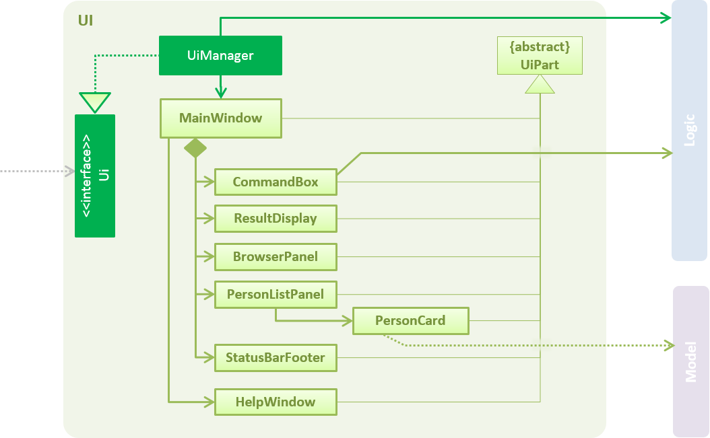

# Developer Guide

&nbsp;

## Table of contents

* [Introduction](#introduction)
* [Setting Up](#setting-up)
* [Design](#design)
* [Implementation](#implementation)
* [Testing](#testing)
* [Dev Ops](#dev-ops)
* [Appendix A: User Stories](#appendix-a--user-stories)
* [Appendix B: Use Cases](#appendix-b--use-cases)
* [Appendix C: Non Functional Requirements](#appendix-c--non-functional-requirements)
* [Appendix D: Glossary](#appendix-d--glossary)
* [Appendix E: Product Survey](#appendix-e--product-survey)

&nbsp;

[comment]: # (@@author A0148031R)
## Introduction

Agendum is a task manager for busy users to manage their schedules and tasks via keyboard commands. It is a Java desktop application that has a **GUI** implemented with JavaFX.

This guide describes the design and implementation of Agendum. It will help developers (like you) understand how Agendum works and how to further contribute to its development. We have organized this guide in a top-down manner so that you can understand the big picture before moving on to the more detailed sections. Each sub-section is mostly self-contained to provide ease of reference.

&nbsp;

## Setting up

### Prerequisites

* **JDK `1.8.0_60`**  or above 

    > This application will not work with any earlier versions of Java 8.

* **Eclipse** IDE

* **e(fx)clipse** plugin for Eclipse (Do the steps 2 onwards given in
   [this page](http://www.eclipse.org/efxclipse/install.html#for-the-ambitious))

* **Buildship Gradle Integration** plugin from the
   [Eclipse Marketplace](https://marketplace.eclipse.org/content/buildship-gradle-integration)

### Importing the project into Eclipse

1. Fork this repo, and clone the fork to your computer

2. Open Eclipse (Note: Ensure you have installed the **e(fx)clipse** and **buildship** plugins as given in the prerequisites above)

3. Click `File` > `Import`

4. Click `Gradle` > `Gradle Project` > `Next` > `Next`

5. Click `Browse`, then locate the project's directory

6. Click `Finish`

  > * If you are asked whether to 'keep' or 'overwrite' config files, choose to 'keep'.
  > * Depending on your connection speed and server load, it can even take up to 30 minutes for the set up to finish
      (Gradle needs time to download library files from servers during the project set up process)
  > * If Eclipse automatically changed any settings during the import process, you can discard those changes.

    > After you are done importing Agendum, it will be a good practice to enable assertions before developing. This will enable Agendum app to verify assumptions along the way. To enable assertions, follow the instructions [here](http://stackoverflow.com/questions/5509082/eclipse-enable-assertions)

### Troubleshooting project setup

* **Problem: Eclipse reports compile errors after new commits are pulled from Git**
	* Reason: Eclipse fails to recognize new files that appeared due to the Git pull.
	* Solution: Refresh the project in Eclipse: 

* **Problem: Eclipse reports some required libraries missing**
	* Reason: Required libraries may not have been downloaded during the project import.
	* Solution: [Run tests using Gardle](UsingGradle.md) once (to refresh the libraries).

&nbsp;

## Design

[comment]: # (@@author A0133367E)
### 1. Architecture

 

The **_Architecture Diagram_** given above summarizes the high-level design of Agendum.
Here is a quick overview of the main components of Agendum and their main responsibilities.

#### `Main`
The **`Main`** component has a single class: [`MainApp`](../src/main/java/seedu/agendum/MainApp.java). It is responsible for initializing all components in the correct sequence and connecting them up with each other at app launch. It is also responsible for shutting down the other components and invoking the necessary clean up methods when Agendum is shut down.

#### `Commons`
[**`Commons`**](#6-common-classes) represents a collection of classes used by multiple other components.
Two Commons classes play important roles at the architecture level.

* `EventsCentre` (written using [Google's Event Bus library](https://github.com/google/guava/wiki/EventBusExplained))
  is used by components to communicate with other components using events.
* `LogsCenter` is used by many classes to write log messages to Agendum's log file to record noteworthy system information and events.

#### `UI`
The [**`UI`**](#2-ui-component) component is responsible for interacting with the user by accepting commands, displaying data and results such as updates to the task list.

#### `Logic`
The [**`Logic`**](#3-logic-component) component is responsible for processing and executing the user's commands.

#### `Model`
The [**`Model`**](#4-model-component) component is responsible for representing and holding Agendum's data.

#### `Storage`
The [**`Storage`**](#5-storage-component) component is responsible for reading data from and writing data to the hard disk.

Each of the `UI`, `Logic`, `Model` and `Storage` components:

* Defines its _API_ in an `interface` with the same name as the Component
* Exposes its functionality using a `{Component Name}Manager` class.

For example, the `Logic` component (see the class diagram given below) defines it's API in the `Logic.java`
interface and exposes its functionality using the `LogicManager.java` class. 
 

#### Event Driven Approach
Agendum applies an Event-Driven approach and the **Observer Pattern** to reduce direct coupling between the various components. For example, the `UI` and `Storage` components are interested in receiving notifications when there is a change in the to-do list in `Model`. To avoid bidrectional coupling, `Model` does not inform these components of changes directly. Instead, it posts an event and rely on the `EventsCenter` to notifying the register Observers in `Storage` and `UI`.

Consider the scenario where the user inputs `delete 1` described in the _Sequence Diagram_ below. The `UI` component will invoke the `Logic` component’s  _execute_ method to carry out the given command, `delete 1`. The `Logic` component will identify the corresponding task and will call the `Model` component _deleteTasks_ method to update Agendum’s data and raise a `ToDoListChangedEvent`.

The diagram below shows what happens after a `ToDoListChangedEvent` is raised. `EventsCenter` will inform its subscribers. `Storage` will respond and save the changes to hard disk while `UI` will respond and update the status bar to reflect the 'Last Updated' time.  

#### Model-View-Controller approach
To further reduce coupling between components, the Model-View-Controller pattern is also applied. The 3 components are as follows:
* Model: The `Model` component as previously described, maintains and holds Agendum's data.
* View: Part of the `UI` components and resources such as the .fxml file is responsible for displaying Agendum's data and interacting with the user. Through events, the `UI` component is able to get data updates from the model.
* Controller: Parts of the `UI` component such as (`CommandBox`) act as 'Controllers' for part of the UI. The `CommandBox` accepts user command input and request `Logic` to execute the command entered. This execution may result in changes in the model.

#### Activity Diagram

  

The Activity Diagram above illustrates Agendum's workflow. Brown boxes represent actions taken by Agendum while orange boxes represent actions that involve interaction with the user.  

After Agendum is launched, Agendum will wait for the user to enter a command. Every command is parsed. If the command is valid and adheres to the given format, Agendum will executes the command. Agendum `Logic` component checks the input such as indices before updating the model and storage if needed.  

Agendum will then display changes in the to-do list and feedback of each command in the UI. The user can then enter a command again. Agendum will also give pop-up feedbacks when the command format or inputs are invalid.

The following sections will then give more details of each individual component.

[comment]: # (@@author A0148031R)
### 2. UI component

The `UI` is the entry point of Agendum which is responsible for showing updates to the user; changes in data in the `Model` automatically updates `UI` as well. `UI` executes user commands using the Logic Component. In addition, `UI` responds to events raised from various other parts of Agendum and updates the display accordingly.

 

**API** : [`Ui.java`](../src/main/java/seedu/agendum/ui/Ui.java)

The UI consists of a `MainWindow` that is made up of parts e.g.`CommandBox` and `ResultPopup`. All these, including the `MainWindow`, inherit the abstract `UiPart` class. They can be loaded using `UiPartLoader`.

The `commandBox` component controls the field for user input, and it is associated with a `CommandBoxHistory` object which saves the most recent valid and invalid commands. `CommandBoxHistory` follows a singleton pattern to restrict the instantiation of the class to one object.

Agendum has 3 different task panel classes `UpcomingTasksPanel`, `CompletedTaskPanel` and `FloatingTasksPanel`. They all inherit from the the `TaskPanel` class and hold and load `TaskCard` objects.

The `UI` component uses JavaFX UI framework. The layout of these UI parts are defined in matching `.fxml` files that are in the `src/main/resources/view` folder. For example, the layout of the [`MainWindow`](../src/main/java/seedu/agendum/ui/MainWindow.java) is specified in
 [`MainWindow.fxml`](../src/main/resources/view/MainWindow.fxml)

[comment]: # (@@author A0003878Y)
### 3. Logic component

`Logic` provides several APIs for `UI` to execute the commands entered by the user. It also obtains information about the to-do list to render to the user.
The **API** of the logic component can be found at [`Logic.java`](../src/main/java/seedu/agendum/logic/Logic.java)

The class diagram of the Logic Component is given below. `LogicManager` implements the `Logic Interface` and has exactly one `Parser`. `Parser` is responsible for processing the user command and creating instances of concrete `Command` objects (such as `AddCommand`) which will then be executed by the `LogicManager`. New command types must implement the `Command` class. Each `Command` class produces exactly one `CommandResult`.

 

The `CommandLibrary` class is responsible for managing the various Agendum's reserved command keywords and their aliases. The `Parser` checks and queries the `CommandLibrary` to ascertain if a command word given has been aliased to a reserved command word. `AliasCommand` and `UnaliasCommand` will also check and update the `CommandLibrary` to add and remove aliases. The singleton pattern is applied to restrict the instantiation of the class to one object. This is to ensure that all other objects, such as `Parser`, `AliasCommand` and `UnaliasCommand` objects will refer to the same instance that records and manages all the alias relationships.  

You can view the Sequence Diagram below for interactions within the `Logic` component for the `execute("delete 1")` API call. 

 

#### Command Pattern
The Parser creates concrete Command objects such as `AddCommand` objects. `LogicManager` will then execute the various commands, such as `AddCommand` and `UndoCommand`. Each command does a different task and gives a different result. However, as all command types inherit from the abstract class `Command` and implement the _`execute`_ method, LogicManager (the invoker) can treat all of them as Command Object without knowing each specific Command type. By calling the _`execute`_ method, different actions result.

[comment]: # (@@author A0133367E)
### 4. Model component

As mentioned above, the `Model` component stores and manages Agendum's task list data and user's preferences. It also exposes a `UnmodifiableObservableList<ReadOnlyTask>` that can be 'observed' by other components e.g. the `UI` can be bound to this list and will automatically update when the data in the list change.

Due to the application of the **Observer Pattern**, it does not depend on other components such as `Storage` but interact by raising events instead.

The `Model` class is the interface of the `Model` component. It provides several APIs for the `Logic` and `UI` components to update and retrieve Agendum’s task list data. The **API** of the model component can be found at [`Model.java`](../src/main/java/seedu/agendum/model/Model.java).  

The structure and relationship of the various classes in the `Model` component is described in the diagram below.    

 

`ModelManager` implements the `Model` Interface. It contains a `UserPref` Object which represents the user’s preference and a `SyncManager` object which is necessary for the integration with Google calendar.

`SyncManager` implements the `Sync` Interface. The `SyncManager` redirects the job of syncing a task to a `SyncProvider`. In Agendum, we have one provider, `SyncProviderGoogle` that implements the `SyncProvider` Interface. This is done so that it would be easy to extend Agendum to sync with other providers. One would just have to create a new class that extends the `SyncProvider` Interface and register that class with `SyncManager`.

`ModelManager` contains a **main** `ToDoList` object and a stack of `ToDoList` objects referred to as `previousLists`. The **main** `ToDoList` object is the copy that is indirectly referred to by the `UI` and `Storage`. The stack, `previousLists` is used to support the [`undo` operation](#### undo).

Each `ToDoList` object has one `UniqueTaskList` object. A `UniqueTaskList` can contain multiple `Task` objects but does not allow duplicates.  

The `ReadOnlyToDoList` and `ReadOnlyTask` interfaces allow other classes and components, such as the `UI`, to access but not modify the list of tasks and their details.  

Currently, each `Task` has a compulsory `Name` and last updated time. It is optional for a `Task` to have a start and end time. Each `Task` also has a completion status which is represented by a boolean.

Design considerations:
> * `ToDoList` is a distinct class from `UniqueTaskList` as it can potentially be extended to have another `UniqueTagList` object to keep track of tags associated with each task and `ToDoList` will be responsible for syncing the tasks and tags.
> * `Name` is a separate class as it might be modified to have its own validation regex e.g. no / or "

Using the same example, if the `Logic` component requests `Model` to _deleteTasks(task)_, the subsequent interactions between objects can be described by the following sequence diagram.  

The identified task is removed from the `UniqueTaskList`. The `ModelManager` raises a `ToDoListChangedEvent` and back up the current to do list to `previousLists`

> `Model`’s _deleteTasks_ methods actually take in `ArrayList<ReadOnlyTask>` instead of a single task. We use _deleteTasks(task)_ for simplicity in the sequence diagram.

#### undo

`previousLists` is a Stack of `ToDoList` objects with a minimum size of 1. The `ToDoList` object at the top of the stack is identical to the **main** `ToDoList` object before any operation that mutate the to-do list is performed and after any operation that mutates the task list successfully (i.e. without exceptions).

This is achieved with the _backupCurrentToDoList_ function which pushes a copy of the **main** `ToDoList` to the stack after any successful changes, such as the marking of multiple tasks.

To undo the most recent changes, we simply pop the irrelevant `ToDoList` at the top of the `previousLists` stack and copy the `ToDoList` at the top of the stack back to the **main** list 

This approach is reliable as it eliminates the need to implement an "undo" method and store the changes separately for each command that will mutate the task list.

Also, it helps to resolve the complications involved with manipulating multiple task objects at a go. For example, the user might try to mark multiple tasks and one of which will result in a `DuplicateTaskException`. To revert the undesired changes to the **main** `ToDoList`, we can copy the the `ToDoList` at the top of the stack back to the **main** list. In such unsuccessful operations, the changes would not have persisted to Storage.

[comment]: # (@@author A0148095X)
### 5. Storage component

 

**API** : [`Storage.java`](../src/main/java/seedu/agendum/storage/Storage.java)

The `Storage` component has the following functions:

* saves `UserPref` objects in json format and reads it back.
* saves the Agendum data in xml format and reads it back.

Other components such as `Model` require the functionalities defined inside the `Storage` component in order to save task data and user preferences to the hard disk. The `Storage` component uses the *Facade* design pattern. Components such as `ModelManager` access storage sub-components through `StorageManager` which will then redirect method calls to its internal component such as `JsonUserPrefsStorage` and `XmlToDoListStorage`. `Storage` also shields the internal details of its components, such as the implementation of `XmlToDoListStorage`, from external classes.

The Object Diagram below shows what it looks like during runtime.

 

The Sequence Diagram below shows how the storage class will interact with model when `Load` command is executed.

 

### 6. Common classes

Classes used by multiple components are in the `seedu.agendum.commons` package.

They are further separated into sub-packages - namely `core`, `events`, `exceptions` and `util`.

* Core - This package consists of the essential classes that are required by multiple components.
* Events -This package consists of the different type of events that can occur; these are used mainly by EventManager and EventBus.
* Exceptions - This package consists of exceptions that may occur with the use of Agendum.
* Util - This package consists of additional utilities for the different components.

&nbsp;

[comment]: # (@@author A0133367E)
## Implementation

### 1. Logging

We are using `java.util.logging` package for logging. The `LogsCenter` class is used to manage the logging levels
and logging destinations.

* The logging level can be controlled using the `logLevel` setting in the configuration file
  (See [Configuration](#2-configuration))
* The `Logger` for a class can be obtained using `LogsCenter.getLogger(Class)` which will log messages according to
  the specified logging level
* Currently log messages are output through `Console` and to a `.log` file.

**Logging Levels**

Currently, Agendum has 4 logging levels: `SEVERE`, `WARNING`, `INFO` and `FINE`. They record information pertaining to:

* `SEVERE` : A critical problem which may cause the termination of Agendum 
   e.g. fatal error during the initialization of Agendum's main window
* `WARNING` : A problem which requires attention and caution but allows Agendum to continue working 
   e.g. error reading from/saving to config file
* `INFO` : Noteworthy actions by Agendum 
  e.g. valid and invalid commands executed and their results
* `FINE` : Less significant details that may be useful in debugging 
  e.g. all fine details of the tasks including their last updated time

### 2. Configuration

You can alter certain properties of our Agendum application (e.g. logging level) through the configuration file.
(default:`config.json`).

&nbsp;

[comment]: # (@@author A0148095X)
## Testing

You can find all the test files in the `./src/test/java` folder.

### Types of Tests

#### 1. GUI Tests

These are _System Tests_ that test the entire App by simulating user actions on the GUI.
They are in the `guitests` package.

#### 2. Non-GUI Tests

These are tests that do not involve the GUI. They include,
   * _Unit tests_ targeting the lowest level methods/classes.  
      e.g. `seedu.agendum.commons.StringUtilTest` tests the correctness of StringUtil methods e.g. if a source string contains a query string, ignoring letter cases.
   * _Integration tests_ that are checking the integration of multiple code units
     (individual code units are assumed to be working). 
      e.g. `seedu.agendum.storage.StorageManagerTest` tests if StorageManager is correctly connected to other storage components such as JsonUserPrefsStorage.
   * Hybrids of _unit and integration tests_. These tests are checking multiple code units as well as
      how the are connected together. 
      e.g. `seedu.agendum.logic.LogicManagerTest` will check various code units from the `Model` and `Logic` components.

#### 3. Headless Mode GUI Tests

Thanks to the [TestFX](https://github.com/TestFX/TestFX) library we use,
our GUI tests can be run in [headless mode](#headless-mode).  
See [UsingGradle.md](UsingGradle.md#running-tests)  for instructions on how to run tests in headless mode.

### How to Test

#### 1. Using Eclipse

* To run all tests, right-click on the `src/test/java` folder and choose `Run as` > `JUnit Test`
* To run a subset of tests, you can right-click on a test package, test class, or a test and choose to run as a JUnit test.

#### 2. Using Gradle

* Launch a terminal on Mac or command window in Windows. Navigate to Agendum’s project directory. We recommend cleaning the project before running all tests in headless mode with the following command `./gradlew clean headless allTests` on Mac and `gradlew clean headless allTests` on Windows.
* See [UsingGradle.md](UsingGradle.md) for more details on how to run tests using Gradle.

>#### Troubleshooting tests
>**Problem: Tests fail because NullPointException when AssertionError is expected**

>* Reason: Assertions are not enabled for JUnit tests.
   This can happen if you are not using a recent Eclipse version (i.e. _Neon_ or later)
>* Solution: Enable assertions in JUnit tests as described
   [here](http://stackoverflow.com/questions/2522897/eclipse-junit-ea-vm-option).  
   Delete run configurations created when you ran tests earlier.

&nbsp;

[comment]: # (@@author A0148031R)
## Dev Ops

### 1. Build Automation

We use Gradle to run tests and manage library dependencies. The Gradle configuration for this project is defined in _build.gradle_.

### 2. Continuous Integration

We use [Travis CI](https://travis-ci.org/) to perform _Continuous Integration_ on our project. When code is pushed to this repository, Travis CI will run the project tests automatically to ensure that existing functionality will not be negatively affected by the changes.

### 3. Making a Release

To contribute a new release:

 1. Generate a JAR file [using Gradle](UsingGradle.md#creating-the-jar-file).
 2. Tag the repo with the version number. e.g. `v1.1`
 2. [Create a new release using GitHub](https://help.github.com/articles/creating-releases/)
    and upload the JAR file you created.

### 4. Managing Dependencies

Agendum depends on third-party libraries, such as the
[Jackson library](http://wiki.fasterxml.com/JacksonHome), for XML parsing, [Natty](http://natty.joestelmach.com) for date & time parsing, [Reflection](https://code.google.com/archive/p/reflections/) for examining classes at runtime and [Google Calendar SDK](https://developers.google.com/api-client-library/java/apis/calendar/v3) for sync. Managing these dependencies have been automated using Gradle. Gradle can download the dependencies automatically hence the libraries are not included in this repo and you do not need to download these libraries manually. To add a new dependency, update `build.gradle`.

&nbsp;

[comment]: # (@@author A0148095X)
## Appendix A : User Stories

> Priorities: 
> * High (must have) - `* * *`
> * Medium (nice to have)  - `* *`
> * Low (unlikely to have) - `*`

Priority | As a ... | I want to ... | So that I can...
-------- | :-------- | :--------- | :-----------
`* * *` | User | See usage instructions | View more information about the features and commands available
`* * *` | User | Add a task | Keep track of tasks which I need work on
`* * *` | User | Add a task with start and end time | Keep track of events that need to be completed within a certain time-frame
`* * *` | User | Add a task with a deadline | Keep track of a task to be done by a specific date and time
`* * *` | User | Rename a task | update or enhance the description of a task
`* * *` | User | Edit or remove start and end time of tasks | Reschedule events with defined start and end dates
`* * *` | User | Edit or remove deadlines of tasks | Reschedule tasks which must be done by a certain date and time
`* * *` | User | Mark task(s) as completed | Keep record of tasks that have been completed without deleting, to distinguish between completed and uncompleted tasks
`* * *` | User | Unmark task(s) from completed | Update the status of my task(s) if there are new changes or I want to continue working on a recently completed task(s).
`* * *` | User | Delete task(s) | Remove task(s) that will never get done or are no longer relevant
`* * *` | User | Undo my last action(s) | Easily correct any accidental mistakes in the last command(s)
`* * *` | User | Search based on task name | Find a task without going through the entire list using a few key words.
`* * *` | User | View all my tasks | Return to the default view of task lists after I am done searching for tasks
`* * *` | User | Specify my data storage location | Easily relocate the raw file for editing and/or sync the file to a Cloud Storage service
`* * *` | User | Load from a file | Load Agendum’s task list from a certain location or a Cloud Storage service
`* * *` | User | Exit the application by typing a command | Close the app easily
`* *` | User | Filter overdue tasks and upcoming tasks (due within a week) | Decide on what needs to be done soon
`* *` | User | Filter tasks based on marked/unmarked | Review my completed tasks and decide on what I should do next
`* *` | User | Clear the command I am typing with a key | Enter a new command without having to backspace the entire command line
`* *` | Advanced user | Specify my own alias commands | Enter commands faster or change the name of a command to suit my needs
`* *` | Advanced user | Remove the alias for a command | Use it for another command alias
`* *` | Advanced user | Scroll through my past few commands | Check what I have done and redo actions easily
`* *` | Google calendar user | Sync my tasks from Agendum to Google calendar | Keep track of my tasks using both Agendum and Google Calendar
`*` | User | Add multiple time slots for a task | “Block” multiple time slots when the exact timing of a task is certain
`*` | User | Add tags for my tasks | Group tasks together and organise my task list
`*` | User | Search based on tags | Find all the tasks of a similar nature
`*` | User | Add/Remove tags for existing tasks | Update the grouping of tasks
`*` | User | Be notified of deadline/time clashes | Resolve these conflicts manually
`*` | User | Key in emojis/symbols and characters from other languages e.g. Mandarin | Capture information in other languages
`*` | User | Clear all existing tasks | Easily start afresh with a new task list
`*` | User | See the count/statistics for upcoming/ overdue and pending tasks | Know how many tasks I need to do
`*` | User | Sort tasks by alphabetical order and date | Organise and easily locate tasks
`*` | Advanced user | Import tasks from an existing text file | Add multiple tasks efficiently without relying on multiple commands
`*` | Advanced user | Save a backup of the application in a custom file | Restore it any time at a later date
`*` | Busy user | Add recurring events or tasks | Keep the same tasks in my task list without adding them manually
`*` | Busy User | Search for tasks by date (e.g. on/before a date) | Easily check my schedule and make plans accordingly
`*` | Busy User | Search for a time when I am free | Find a suitable slot to schedule an item
`*` | Busy user | Can specify a priority of a task | Keep track of what tasks are more important

&nbsp;

[comment]: # (@@author A0148031R)
## Appendix B : Use Cases

>For all use cases below, the **System** is `Agendum` and the **Actor** is the `user`, unless specified otherwise

### Use case 01 - Add a task

**MSS**

1. System prompts the Actor to enter a command
2. Actor enters an add command with the task name into the input box.
3. System adds the task.
4. System shows a feedback message ("Task `name` added") and displays the updated list
   Use case ends.

**Extensions**

2a. No task description is provided

> 2a1. System shows an error message (“Please provide a task name/description”)  
> Use case resumes at step 1

2b. There is an existing task with the same description and details

> 2b1. System shows an error message (“Please use a new task description”)  
> Use case resumes at step 1

### Use case 02 - Delete a task

**MSS**

1. Actor requests to delete a specific task in the list by its index
2. System deletes the task.
3. System shows a success feedback message to describe the task deleted and displays the updated list
   Use case ends.

**Extensions**

1a. The index given is invalid (e.g. it is a string or out of range)

> 1a1. System shows an error message to inform the user of the incorrect format/index given
> Use case ends

### Use case 03 - Rename a task

**MSS**

1. Actor requests to rename a specific task in the list by its index and also input the new task name
2. System updates the task
3. System shows a success feedback message to describe the task renamed and displays the updated list
   Use case ends.

**Extensions**

1a. The index given is invalid (e.g. it is a string or out of range)

> 1a1. System shows an error message to inform the user of the incorrect format/index given
> Use case ends

1b. No task name is provided

> 1b1. System shows an error message to inform the user of the incorrect format/missing name
> Use case ends

2a. Renaming a task will result in a duplicate (will become exactly identical to another task)

> 2a1. System shows an error message to inform user of potential duplicate  
> Use case ends

### Use case 04 - Schedule a task’s start and end time/deadline

**MSS**

1. Actor requests to list tasks
2. System shows a list of tasks
3. Actor inputs index and the new start/end time or deadline of the task to be modified
4. System updates the task
5. System shows a feedback message (“Task `index`'s time/date has been updated”) and displays the updated list
6. Use case ends.

**Extensions**

2a. The list is empty

> Use case ends

3a. The given index is invalid

> 3a1. System shows an error message (“Please select a task on the list with a valid index”)  
> Use case resumes at step 2

3b. The new input time format is invalid

> 3b1. System shows an error message (“Please follow the given time format”)  
> Use case resumes at step 2

[comment]: # (@@author A0133367E)
### Use case 05 - Undo previous command that modified the task list

**MSS**

1. Actor requests to undo the last change to the task list.
2. System revert the last change to the task list.
3. System shows a success feedback message and displays the updated list.
   Use case ends.

**Extensions**

2a. There are no previous modifications to the task list (since the launch of the application)

> 2a1. System alerts the user that there are no previous changes  
> Use case ends

### Use case 06 - Mark a task as completed

**MSS**:

1. Actor requests to mark a task specified by its index in the list as completed
2. System marks the task as completed 
3. System shows a success feedback message, updates and highlights the selected task.
   Use case ends

**Extensions**

1a. The index given is invalid (e.g. it is a string or out of range)

> 1a1. System shows an error message to inform the user of the incorrect format/index given
> Use case ends

2a. Marking a task will result in a duplicate (will become exactly identical to an existing task)

> 2a1. System shows an error message to inform user of potential duplicate  
> Use case ends

### Use case 07 - Unmark a task

**MSS**:

1. Actor requests to unmark a task followed by its index
2. System unmarks the task from completed
3. System shows a success feedback message, updates and highlights the selected task.
   Use case ends

**Extensions**

1a. The index given is invalid (e.g. it is a string or out of range)

> 1a1. System shows an error message to inform the user of the incorrect format/index given
> Use case ends

2a. Unmarking a task will result in a duplicate (will become exactly identical to an existing task)

> 2a1. System shows an error message to inform user of potential duplicate  
> Use case ends

[comment]: # (@@author A0148095X)
### Use case 08 - Add alias commands

**MSS**

1. Actor enters a alias command and specify the name and new alias name of the command
2. System alias the command
3. System shows a feedback message (“The command `original command` can now be keyed in as `alias key`”)
4. Use case ends.

**Extensions**

1a. There is no existing command with the original name specified

> 1a1. System shows an error message (“There is no such existing command”)  
> Use case ends

1b. The new alias name is already reserved/used for other commands

> 1b1. System shows an error message ("The alias `alias key` is already in use")  
> Use case ends

### Use case 09 - Remove alias commands

**MSS**

1. Actor enters the unalias command followed by `alias key`
2. System removes the alias for the command
3. System shows a feedback message ("The alias `alias key` for `original command` has been removed.")
4. Use case ends.

**Extensions**

1a. There is no existing alias
> 1a1. System shows an error message (“There is no such existing alias”)  
> Use case ends

### Use case 10 - Specify data storage location

**MSS**

1. Actor enters store command followed by a path to file
2. System updates data storage location to the specified path to file
3. System saves task list to the new data storage location
4. System shows a feedback message ("New save location: `location`")
5. Use case ends.

**Extensions**

1a. Path to file is input as 'default'
> 1a1. System updates data storage location to default  
> 1a2. System shows a feedback message ("Save location set to default: `location`")  
> Use case ends

1b. File exists
> 1b1. System shows an error message ("The specified file exists; would you like to use LOAD instead?")  
> Use case ends

1c. Path to file is in the wrong format
> 1c1. System shows an error message ("The specified path is in the wrong format. Example: store agendum/todolist.xml")  
> Use case ends

1d. Path to file is not accessible
> 1d1. System shows an error message ("The specified location is inaccessible; try running Agendum as administrator.")  
> Use case ends

### Use case 11 - Load from data file

**MSS**

1. Actor enters load command followed by a path to file
2. System saves current task list into existing data storage location
3. System loads task list from specified path to file
2. System updates data storage location to the specified path to file
3. System shows a feedback message ("Data successfully loaded from: `location`")
4. Use case ends.

**Extensions**

1a. Path to file is invalid
> 1a1. System shows an error message ("The specified path to file is invalid: `location`")  
> Use case ends

2a. File does not exist
> 1a1. System shows an error message ("The specified file does not exist: `location`")  
> Use case ends

3a. File is in the wrong format
> 3a1. System shows an error message ("File is in the wrong format.") 
> Use case ends

&nbsp;

[comment]: # (@@author A0003878Y)
## Appendix C : Non Functional Requirements

1.  Should work on any [mainstream OS](#mainstream-os) as long as it has Java `1.8.0_60` or higher installed.
2.	Should be able to hold up to 800 tasks in total (including completed tasks).
3.	Should come with automated unit tests.
4.	Should use a Continuous Integration server for real time status of master’s health.
5.	Should be kept open source code.
6.	Should favour DOS style commands over Unix-style commands.
7.	Should adopt an object oriented design.
8.	Should not violate any copyrights.
9.	Should have a response time of less than 2 second for every action performed.
10.	Should work offline without an internet connection.
11.	Should work as a standalone application.
12.	Should not use relational databases to store data.
13.	Should store data in an editable text file.
14.	Should not require an installer.
15.	Should not use paid libraries and frameworks.
16.	Should be a free software.
17.	Should be easily transferrable between devices; only 1 folder needs to be transferred.
18.	Should have documentation that matches the source code
19.	Should not have unhandled exceptions from user input
20.	Should be installable without assistance other than the user guide.
21. Should have understandable code such that new members can start working on the project within 1 week.

&nbsp;

[comment]: # (@@author A0148095X)
## Appendix D : Glossary

##### Mainstream OS:

Windows, Linux, Unix, OS-X

##### Headless Mode:

In the headless mode, GUI tests do not show up on the screen.  
This means you can do other things on the Computer while the tests are running.

&nbsp;

[comment]: # (@@author A0133367E)
## Appendix E : Product Survey

We conducted a product survey on other task managers. Here is a summary of the strengths and weaknesses of each application. The criteria used for evaluation are own preferences and Jim's requirements.

#### Main insights
* Keyboard friendliness of our application is extremely important. It is useful to distinguish our application from the rest. Keyboard shortcuts must be intuitive, easy to learn and remember.
    * Tab for autocomplete
    * Scroll through command history or task list with up and down
    * Allow users to specify their own shorthand commands so they will remember
    * Summoning the help window with a keyboard shortcut
* Clear visual feedback on the status of the task
    * Overdue and upcoming tasks should stand out
    * Should also be able to see if a task is completed or recurring
    * Identify if the task is selected/has just been updated
* Organized overview of all tasks
    * Tasks should be sorted by their deadline/happening time
    * Users might like to see their recently updated/completed tasks at the top of the list
    * Allow user to see these various types of tasks and distinguish them without having to switch between lists (i.e. have multiple lists)
* Will be nice to allow more details for tasks
    * detailed task descriptions
    * tagging
* Commands should be intuitive and simple enough for new users
    * more natural language like parsing for dates with prepositions as keywords

#### Wunderlist

*Strengths:*

* Clearly displays tasks that have not been completed
* Tasks can be categorized under different lists
* Tasks can have sub tasks
* Possible to highlight tasks by marking as important (starred) or pinning tasks
* Can set deadlines for tasks
* Can create recurring tasks
* Can associate files with tasks
* Can be used offline
* Keyboard friendly – keyboard shortcuts to mark tasks as completed and important
* Search and sort functionality makes finding and organizing tasks easier
* Possible to synchronize across devices
* Give notifications and reminders for tasks near deadline or overdue

*Weaknesses:*

* Wunderlist has a complex interface and might require multiple clicks to get specific tasks done. For example, it has separate field to add tasks, search for tasks and a sort button. There are various lists & sub-lists. Each list has a completed/uncompleted  section and each task needs to be clicked to display the associated subtasks, notes, files and comment.
* New users might not know how to use the advanced features e.g. creating recurring tasks

#### Google calendar

*Strengths:*

* Have a weekly/monthly/daily calendar view which will make it easy for users to visualize their schedules
* Can create recurring events
* Integrated with Gmail. A user can add events from emails easily and this is desirable since Jim's to do items arrive by emails
* Can be used offline
* Possible to synchronize across devices
* Calendar can be exported to CSV/iCal for other users
* CLI to quick add an event to a calendar instead of clicking through the screen
* Comprehensive search by name/details/people involved/location/time

*Weaknesses:*

* Not possible to mark tasks as completed
* Not possible to add tasks without deadline or time
* CLI does not support updating of tasks/deleting etc. Still requires clicking.
* New users might not know of the keyboard shortcuts
