<!-- @@author A0141128R-->
# User Guide

  

* [Quick Start](#quick-start)
* [Features](#features)
* [FAQ](#faq)
* [Command Summary](#command-summary)

## Quick Start

0. Ensure you have Java version `1.8.0_60` or later installed in your Computer. 
   > Having any Java 8 version is not enough.
   >
   > This app will not work with earlier versions of Java 8.
   
1. Download the latest `CMDo.jar` from the 'releases' tab.
2. Copy the file to the folder you want to use as the home folder for your CMDo.
3. Double-click the file to start the app. The GUI should appear in a few seconds. 
   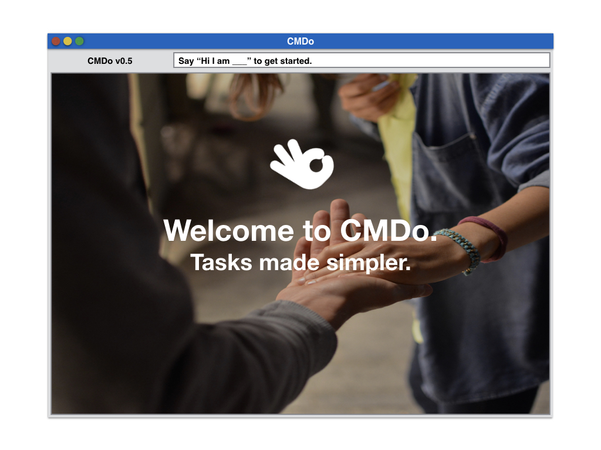
   

4. Type the command in the command box and press <kbd>Enter</kbd> to execute it.  
   e.g. typing **`help`** and pressing <kbd>Enter</kbd> will open the help window. 
   
5. Some example commands you can try:
   * **`list`** : lists all task
   * **`add`**` email prof damith to feedback on the module on wednesday` : 
     adds a task named `email prof damith to feedback on module` to the To Do List.
   * **`delete`**` 3` : deletes the task 3 “email prof damith” in the current list
   * **`exit`** : exits the app
6. Refer to the [Features](#features) section below for details of each command. 

## Features

#### Viewing help : `help`
Format: `help`

> Help is also shown if you enter an incorrect command e.g. `abcd`

 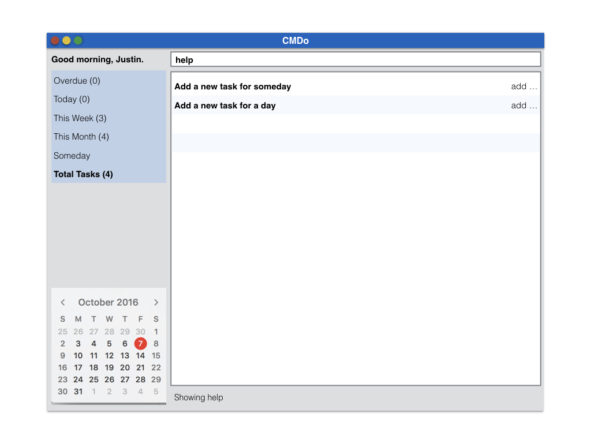 

#### Adding a task in CMDo: `add`
Adds a task to CMDo  
Format: `add 
 <day> <time> /<priority> -<tag>` 

> You need to type your details in '' after add, eg. add 'feed dog'.
> 
> You can type anything in details. It must not end with `by`, `on`, `before` or `at`.
> 
> If will default as a one hour block if end time is not keyed in or if only one time slot is keyed in.
>
> For time, typing `tml`, `tmr`, `tomorrow` will still be recognised as tomorrow.
>
> For time, typing `1300`, `1pm`, will be recognised as 1300.
> 
> For priority, use `/low`, `/medium` or `/high`. Tasks added without specific priority will default to low.
 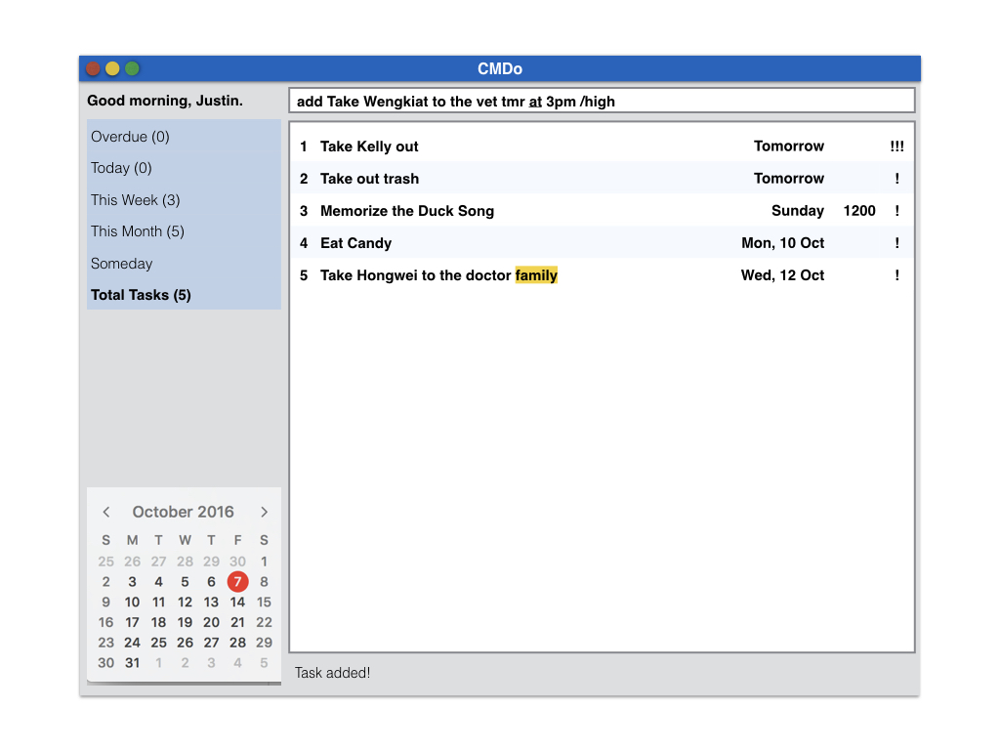 
 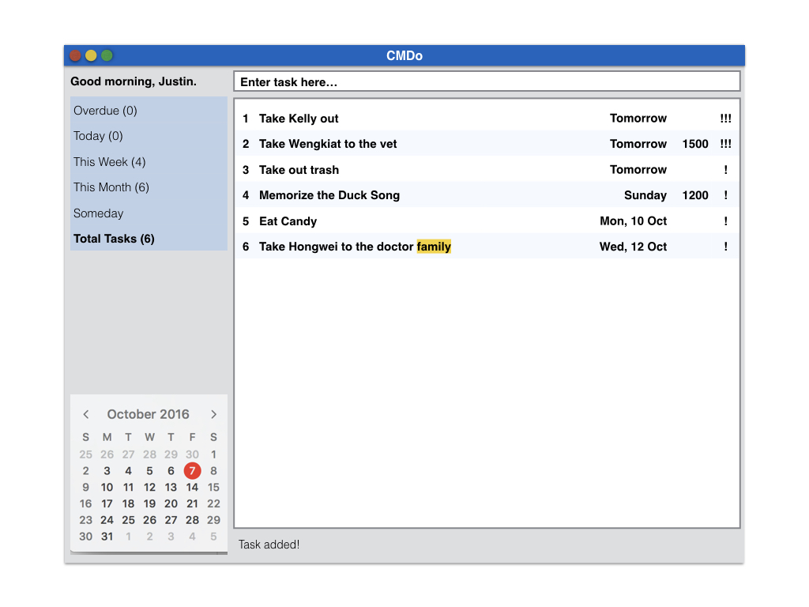 
> You can also add a tag to the task by using `-`.
 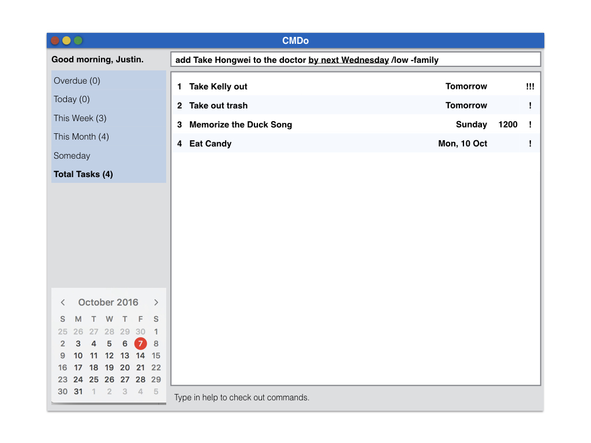 
 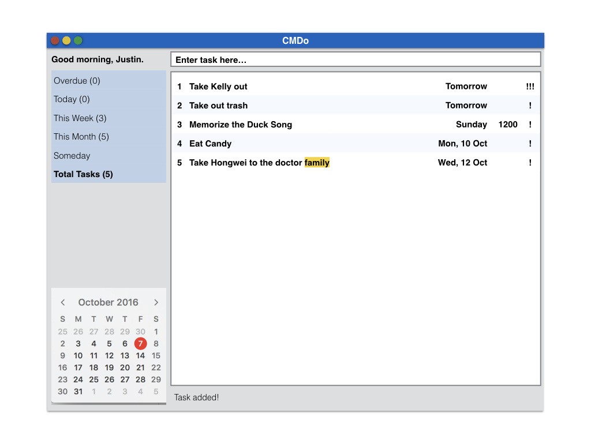 

#### Blocking time slots in CMDo: `block`
Block a time slot in CMDo  
Format: `block <day> <time> /<priority> -<tag>` 
 
> You need to type your details in '' after add, eg. add 'feed dog'.
> 
> You can type anything in details. It must not end with `by`, `on`, `before` or `at`.
> 
> If will default as a one hour block if end time is not keyed in or if only one time slot is keyed in.
>
> For time, typing `tml`, `tmr`, `tomorrow` will still be recognised as tomorrow.
>
> For time, typing `1300`, `1pm`, will be recognised as 1300.

#### Finding task in CMDo : `find <day>` or `param` or `/priority`
Shows a list of all task in the CMDo on that day. It also acts as a filter. 
Format: `find <today>`

> Key in <day> and all task due on that day will appear
>  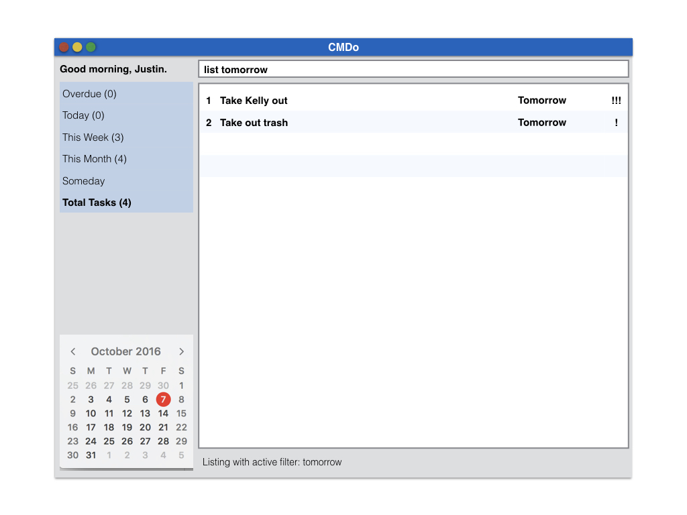 
> Key in <done> and all done task will appear
>  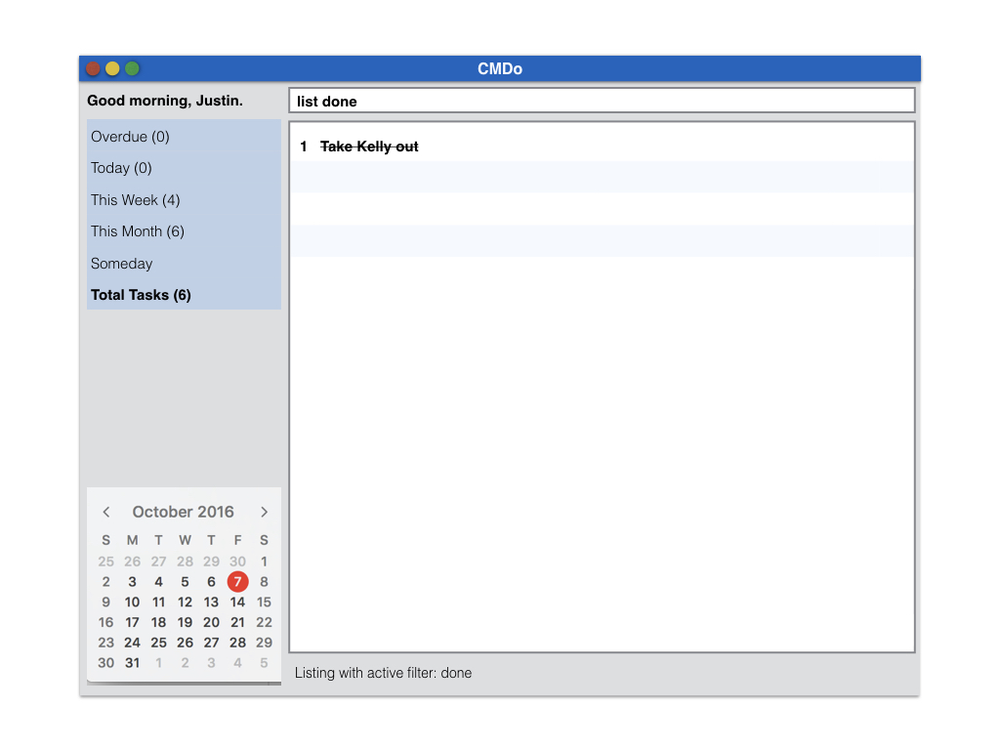 
> Key in any search parameter and list command will add a filter for you
 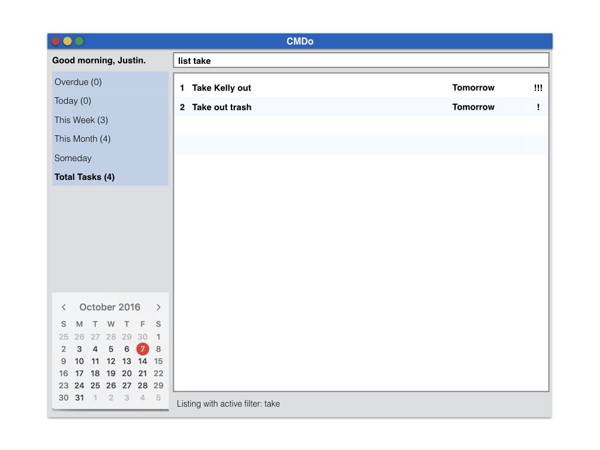 
> Key in </priority> to show all tasks with specified priority
 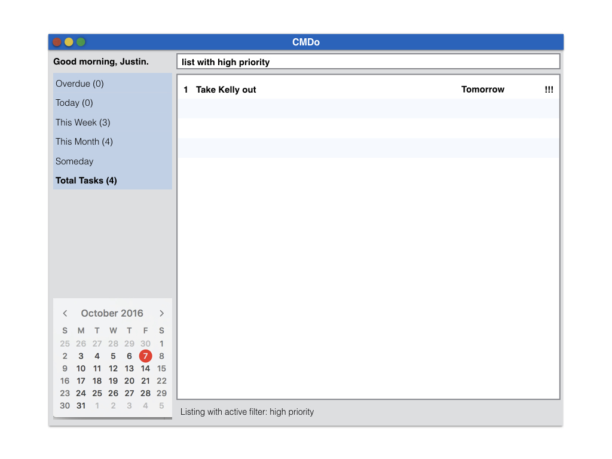 

#### Listing all task in CMDo : `list`
Shows a list of all task in the CMDo. 
Format: `list`

#### Deleting a task in CMDo : `delete`
Deletes the specified task from the to do list.
Format: `delete INDEX`

> Deletes the person at the specified `INDEX`. 
  The index refers to the index number shown in the most recent listing. 
  The index **must be a positive integer** 1, 2, 3, ...

Examples: 
* `list all`
  `delete 2`
  Deletes the 2nd task in the to do list.
* `find email` 
  `delete 1`
  Deletes the 1st task in the results of the `find` command.

#### Edit task : `edit`
Update existing tasks in the CMDo list by just typing in the details you want to change. 
Format: `edit INDEX details`  

> Examples: 
> * `edit 2 eat candy tomorrow`
>  Edit the 2nd task in the to do list to eat candy with date due as tomorrow 
>  
> * `edit 1 Bear`
>  Edit task 1 details only
>  
> * `edit 1 1300 `
> Edit task 1 time only
>
> * `edit 1 12/12/2016 `
> Edit task 1 date only
>
> * `edit 1 /high `
> Edit task 1 priority only
>
> * `edit 1 remove priority `
> Removes Priority of task 1, alternatively, 'rp' can be typed in place of 'remove priority' 
>
> * `edit 1 floating `
> Edit task 1 to a floating task
>
> * `edit 1 12/11/2016 1300 to 12/12/2016 1400 `
> Edit task 1 to a task with time range

####  Mark a task as done : `done <index>`
Done a task so tick it off the list

Format: `done <index>`  
  
 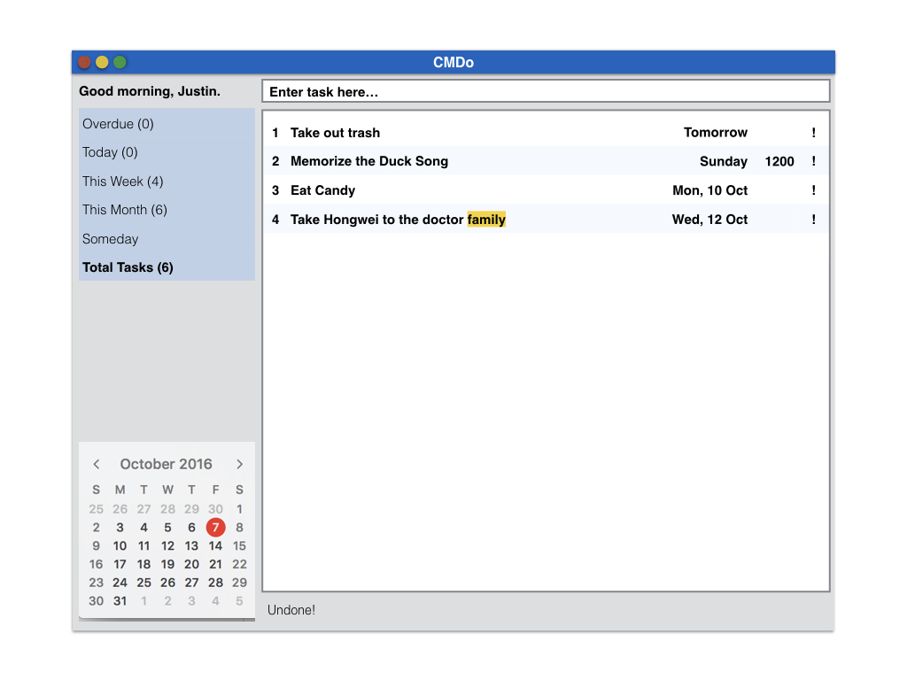 

#### Undo the last action : `undo`
Undo the earlier action
Format: `undo`  

 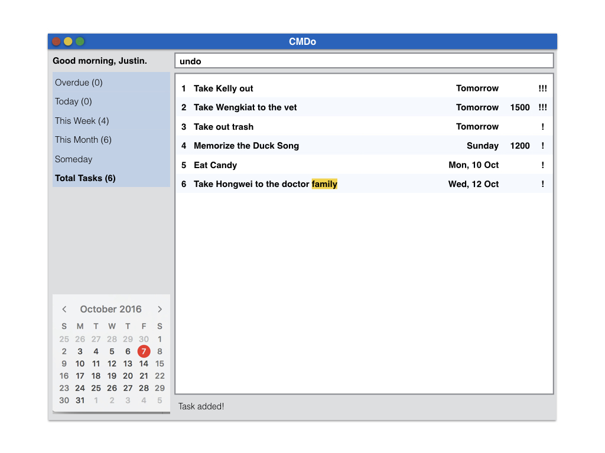 
  

#### Redo earlier action : `redo`
Redo the earlier action.
Format: `redo`

#### Change the storage location : `storage`
Change the storage location.
Format: `storage file/path/cmdo.xml`

> There is no need to explicitly write cmdo.xml
> Filepath which does not start with '/' will imply that the user is working in the app home directory.

#### Exiting the program : `exit`
Exits the program. 
Format: `exit`  

#### Saving the data 
To do list data are saved in the hard disk automatically after any command that changes the data. 
There is no need to save manually.

## FAQ

**Q**: How do I transfer my data to another Computer?
**A**: Install the app in the other computer and overwrite the empty data file it creates with 
       the file that contains the data of your previous Address Book.
       
**Q**: Is there a click function? 
**A**: No

**Q**: How do i customize the functions and commands to suit my style?
**A**: We will have in the next version :)

**Q**: Can i change the layout?
**A**: Yes

**Q**: How do i set priority to a task?
**A**: add priority under tags eg.(H for high, M for medium, L for low)

**Q**: Is there a cheat sheet for the commands?
**A**: `/help`

**Q**: Do I have to check my to-do list regularly, is there something to remind me?
**A**: You have to check your to-do list, isnt that the point?

**Q**: How do i block out slots for unconfirmed tasks?
**A**: use the block command

**Q**: How do i remove a blocked out slot to add task?
**A**: use the delete command to delete the blocked slot

**Q**: Where did all my tasks go when i try to add a task to a blocked slot?
**A**: When you attempt to add a task to a blocked slot, CMDo will list all your blocked slots, hence, you are only shown your blocked slots now. Simply use the command 'list all' to go back to your task listing.

**Q**: What if i input only one timing when using the block command?
**A**: It will create a blocked slot with one hour default end time from the start time which is the time you entered

**Q**: How do i see upcoming tasks?
**A**: The list will be sorted according to date and time

**Q**: How to scroll?
**A**: Use the page up and page down commands
       
## Command Summary

Command | Format  
-------- | :-------- 
Add | `add <task> <day> <start time> <end time> <priority>`
Block | `Block <day> <start time> <end time>`
Delete | `delete <INDEX>`
Done | `done <INDEX>`
Find | `find <keyword>`
List All | `list all / la`
List Done | `list done / ld`
List Block | `list block / lb`
Storage | `storage <new file path> `
Help | `help`
Undo | `undo`
Redo | `redo`
Edit | `edit <index> 
`
Page Up | <kbd>PgUp</kbd> (Windows) / <kbd>Fn</kbd>+<kbd>Shift</kbd>+<kbd>Up</kbd> (Mac)
Page Down | <kbd>PgDown</kbd> (Windows) / <kbd>Fn</kbd>+<kbd>Shift</kbd>+<kbd>Down</kbd> (Mac)
Exit | `exit`

_Last updated 28 Oct 2016_