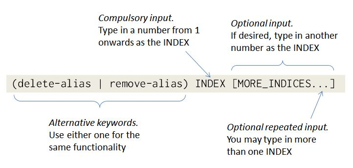

# User Guide

 
## About Amethyst

Amethyst is a command-line task manager targeted at power users who would like to store, access and edit information about their tasks efficiently.

 
## Table of Contents

1. [Quick Start](#1-quick-start)  
2. [Guidelines](#2-guidelines)
3. [Features](#3-features)  
    3.1. [View help](#31-view-help--help)  
    3.2. [Add a task](#32-add-a-task-add)  
    3.3. [List tasks](#33-list-tasks-list)  
    3.4. [Find tasks containing particular keyword(s) in task name](#34-find-tasks-containing-particular-keywords-in-task-name-find)  
    3.5. [Delete task(s)](#35-delete-tasks-del)  
    3.6. [Mark task(s) as done](#36-mark-tasks-as-done-done)  
    3.7. [Edit a task](#37-edit-a-task-edit)  
    3.8. [Undo last operation](#38-undo-last-operation-undo)   
    3.9. [Redo](#39-redo-redo)  
    3.10. [Clear all entries](#310-clear-all-entries-clear)  
    3.11. [Set data storage location](#311-set-data-storage-location-set-storage)  
    3.12. [Set an alias for an exisiting command](#312-set-an-alias-for-an-existing-command-add-alias)  
    3.13. [List aliases](#313-list-aliases-list-alias)  
    3.14. [Delete alias(es)](#314-delete-aliases-delete-alias--remove-alias)  
    3.15. [Auto-save] (#315-auto-save)  
    3.16. [Exit Amethyst](#316-exit-amethyst-exit)   
4. [Command Summary](#4-command-summary)

<!-- @@author A0143756Y -->
 
## 1. Quick Start

1. **Install Java 8 Update 60 or higher.** 
 
Download the latest version via this [link](http://www.oracle.com/technetwork/java/javase/downloads/index.html).

    > Note that the application will not work with earlier versions of Java 8.

2. **Download Amethyst Task Manager.**
 
Download the latest Amethyst Task Manager Java Archive (JAR) package file `Amethyst.jar` from the `Releases` tab via this [link](dummy link).

3. **Launch the program.**
 
Double-click the file to start Amethyst. You should see the Graphical User Interface (GUI) below.

4. **Enter a command.**
 
Type `help` and press `Enter` to view a list of all commands and their corresponding command formats. Try entering a command according to the command format specified.

 
## 2. Guidelines
<!-- @@author A0141019U -->
### Conventions

 
Refer to the table below to help you understand the conventions used in this guide. 

 

|Convention|Description|
|:---------|:----------|
|`highlight`|Words/phrases that can be entered into the command line are in `highlight`.|
|UPPER_CASE|Arguments for which you key in input are in UPPER CASE. Each word in a phrase is separated by an underscore.|
|[ ]|Arguments in square brackets are optional.|
|(x \| y \| z)|Alternative keywords are grouped in brackets and separated by vertical bars.|
|[x \| y \| z]|Optional alternative keywords are grouped in square brackets and separated by vertical bars.|
|...|An ellipsis after an argument indicates that you may enter more arguments of the same type.|

 
You may refer to the following to see how the command format for the `delete-alias | remove-alias` command should be interpreted.

 

 
### Date and time formats

 
For `add (deadline | dl)`, `add (someday |sd)` and `list` commands, which would be mentioned in following segments, you will need to input a date and a time/time period. The table below lists the alternative date and time formats that you could use when entering these commands.

 

|Format|Example   |
|:-----|:---------|
|dd-mm-yy|25-12-16|
|dd-mm-yyyy|25-12-2016|
|yyyy-mm-dd|2016-12-25|
|dd-MMM-yy|25-dec-16|
|dd-MMM-yyyy|25-dec-2016|
|HH:mm|16:00|
|hh:mm am/pm|04:00 pm|
|hh am/pm|4 pm|

 
> Do note the following:
> - All dates and times are case-insensitive. For example, both `25-dec-16` and `25-DEC-16` are read the same. Likewise, this applies for `04:00 pm` and `04:00 PM`.
> - Hyphens separating the day, month and year in each date format can be replaced by spaces or forward slashes. For example, `25/12/16` in place of `25-12-16`.
> - For the hh:mm am/pm and hh am/ pm time formats, am/pm can be written with or without a space after the hour. For example, both `4 pm` and `4pm` are valid.
> - `today`, `tomorrow` and `next week` are keywords/keyphrases that will be registered as the date today, the date tomorrow and the date seven days from today respectively.
> - Date and time/ time period arguments can be entered in any order. For example, `add event 'dinner with wife' on 25-12-16 from 19:00 to 21:00pm` and `add event 'dinner with wife' from 19:00 to 21:00pm on 25-12-16` are registered the same.

 
## 3. Features

<!-- @@author A0139339W -->
 
### 3.1. View help : `help`
New to Amethyst? Simply type `help` and press `Enter` to view a list of all commands and their corresponding command formats. 

Format: `help`

> Do note that the help window is also shown if you enter an incorrect command e.g. `abcd`.

 
### 3.2. Add a task: `add`

Embark on your first step to using Amethyst, by adding tasks to the task manager! Amethyst supports three different types of tasks, namely tasks to be done someday, deadlines and events.

 
#### Tasks to be done someday: `add (someday | sd)`
If you have tasks to be done someday, you can add it as a `someday` task using either the `someday` or `sd` keyword.  

Format: `add (someday | sd) 'NAME'`

Examples:
- `add someday 'Read Introduction to Algorithms book'`
- `add sd 'Organise study table'`

 
#### Deadlines: `add (deadline | dl)`
If you have tasks to be done by a certain date and time, you can add it as a `deadline` task using either the `deadline` or `dl` keyword.

Format: `add (deadline | dl) 'NAME' by HH:MM DD-MM-YY`

Examples:
- `add deadline 'Read lecture notes' by 16:00 12-10-16`
- `add dl 'RSVP to networking event' by 23:59 07-03-10`  

 
#### Events: `add (event | ev)`
If you have tasks to be done within a certain period, you can add it as an `event` task using either the `event` or `ev` keyword.  

Format: `add (event | ev) 'NAME' from HH:MM DD-MM-YY to HH:MM DD-MM-YY`

Examples:
- `add event 'Medical appointment' from 11:00 to 13:00 on 23-09-15`
- `add ev 'Jake and Lucy wedding dinner' from 18:00 to 21:00 on 11-11-11`

 
### 3.3. List tasks: `list`
After adding your tasks, you can take a look at what you have added so far using the list command. This command shows a numbered list of tasks filtered by the arguments you specify. If you list without specifying any argument, a list of all tasks added will be shown. 

Format: `list [TASK_TYPE] [done|not-done] [DD-MM-YY] [HH:MM]`

> Do note the following:
> - The three valid task types are `someday`, `deadline` and `event`.  
> - Tasks will be listed in chronological order.  
> - If you specify the time argument, tasks will be filtered as follows:  
>   * `event` tasks that are occuring at the specified time, start and end time inclusive.
>   * `deadline` tasks that are due before the specified time.

Examples:
- `list someday not-done`   
Lists all `someday` tasks that have not been completed.
- `list deadline 16-11-16`  
Lists all `deadline` tasks that are due on 16 November 2016.

<!-- @@author A0143756Y -->
 
### 3.4. Find tasks containing particular keyword(s) in task name: `find`
Search for a task by name by specifying the keywords/ keyphrases used in the task name. This command finds all tasks containing any of the specified keywords/keyphrases and displays the identified tasks in a numbered list.

Format: `find KEYPHRASE_WORD_ONE KEYPHRASE_WORD_TWO [KEYPHRASE_MORE_WORDS] ..., [MORE_KEYPHRASES] ...`

> Do note the following:
> - Keyphrases are separated by commas.
> - The search is case-insensitive. For example, `hANs bo` will match `Hans Bo`.
> - The order of the keywords within each phrase matters. For example, `Hans Bo` will not match `Bo Hans`.
> - The order of the keyphrases does not matter. For example, `Bo, Hans` will match `Hans Swagtacular Bo`.
> - Only the name of the task is searched.
> - Partial phrases will be matched For example, `ns B` will match `Hans Bo`.

Examples:
- `find meeting`  
  Returns `Meeting with John` and `Skytok project meeting` tasks.
- `find Physics test, chemistry, biology`  
  Returns all tasks containing any of the keywords/keyphrases `Physics test`, `chemistry`, or `biology`.

 
### 3.5. Delete task(s): `del`
Do you have a previously stored task that is no longer relevant? Delete the task from the task manager by specifying its index.  

Format: `del INDEX [MORE_INDICES] ...`

> Do note the following:
> - You may delete multiple tasks at one go, by specifying the indices of all the tasks that you wish to delete.  
> - The indices refer to the index numbers shown in the most recent listing.  
> - Indices entered must be positive integers (1, 2, 3, ..).

Examples:
- `list` 
  `del 2 4` 
  Deletes the second and fourth tasks in the task manager.
- `find birthday` 
  `del 1` 
  Deletes the first task found by `find birthday`.

 
### 3.6. Mark task(s) as done: `done`
Completed a task? Hurray! Give yourself a pat on the back for a job well done! Mark the task as done by specifying its index.  

Format: `done INDEX [MORE_INDICES] ...`

> Do note the following:
> - You may mark multiple tasks as done at one go, by specifying the indices of all the tasks you have completed.  
> - The indices refer to the index numbers shown in the most recent listing.  
> - Indices entered must be positive integers (1, 2, 3, ..).

Examples:
- `list not-done` 
  `done 5 8 9` 
  Marks the fifth, eighth and ninth tasks listed by `list not-done` as done.
- `find report` 
  `done 2` 
  Deletes the second task found by `find report`.

<!-- @@author A0141019U -->
 
### 3.7. Edit a task: `edit`
Accidentally entered wrong task information? Fret not! Use the `edit` command to change details of a task previously stored in the task manager.

Format: `edit INDEX ['NEW_NAME'] [from HH:MM DD-MM-YY] [to|by HH:MM DD-MM-YY] [done|not-done]`

> Do note the following:
> - Both the date and time must be specified if you are changing a time field.
> - The `from` and `to` edits are only valid for events.
> - The `by` edit is only valid for deadlines.
> - The date edit is valid for both events and deadlines, but not somedays.

Example:
* `list event`  
  `edit 1 'Hamlet at The Globe Theatre' from 08:00pm 23-11-2016 to 11:00pm 23-11-2016`  
  Edits the name of first task listed to 'Hamlet at The Globe Theatre' and its time period to 08:00pm-11:00pm on 23-11-2016.

 
### 3.8. Undo last operation: `undo`
It's very easy to make mistakes while typing. Instead of having to enter a command to reverse the effects of your last operation, you can simply type `undo`.  

Format: `undo`

> Do note that the `undo` command can be called repeatedly and will undo all operations up to
> and including the first operation performed upon starting the program.
> Calling `undo` subsequently will print an error to the console and no change to the data will occur.

 
### 3.9. Redo: `redo`
While undo reverses an action, redo reverses the last undo.  

Format: `redo`

> Do note that the `redo` command can be only be called immediately following an undo operation. 
> Redo can be called several times in a row to reverse a chain of undo commands.

<!-- @@author A0143756Y -->
 
### 3.10. Clear all entries: `clear`
Looking for a fresh start? Clear all entries from the task manager by entering `clear`.  

Format: `clear`

 
### 3.11. Set data storage location: `set-storage`
Set task manager data storage location according to your specifications. Task manager data will be saved to the folder, and with the file name you specify.

Format: `set-storage FOLDER_FILE_PATH save-as FILE_NAME`

> Do note the following:
> - All task manager data will be transferred to the new storage location. Data in the original location will be deleted.
> - You will need to exit and restart Amethyst for the new storage settings to be registered.

Example:
`set-storage C:\\Users\\Liang\\Desktop save-as TaskInformation`

 
### 3.12. Set an alias for an existing command: `add-alias`
Add a new shortcut for an existing command.  

Format: `add-alias 'COMMAND_ALIAS'='COMMAND_PHRASE'`

> Do note that on pressing `enter`, the entire string specified on the right-hand side of the equals sign will replace the alias.
> If an alias is typed within quotes, however, it will _not_ be replaced.

Examples:
- `add-alias 'add-dl'='add deadline'`   
The command input `add-dl 'Clean the garage' by 17:00 on 04-05-14` can now be used in place of `add deadline 'Clean the garage' by 17:00 on 04-05-1`. However, note that `add deadline 'buy add-dl a cake' by 4:00pm 12-Oct-16` does not register as `add deadline 'buy add deadline a cake' by 4:00pm 12-Oct-16`, since `add-dl` was enclosed by quotation marks.

 
### 3.13. List aliases: `list-alias`
List all configured aliases.  

Format: `list-alias`

 
### 3.14. Delete alias(es): `delete-alias | remove-alias`
Remove previously set aliases by specifying their indices.  

Format: `(delete-alias | remove-alias) INDEX [MORE_INDICES] ...`

Example:
- `list-alias`  
 `remove-alias 2 3`  
  Deletes the second and third aliases given by the `list-alias` command.

 
### 3.15. Auto-save
Amethyst auto-saves all changes after each command execution. No more 'changes were not saved' nightmares! 

 
### 3.16. Exit Amethyst: `exit`
Exit the program by keying in `exit`.  

Format: `exit`

<!-- @@author A0141019U -->
 
## 4. Command Summary

 
For easy reference, the table below lists all commands and their corresponding default command formats.

 
|Command|Format            |
|:------|:-----------------|
|help|`help`|
|add task to be done someday|`add (someday | sd) 'NAME'`|
|add deadline|`add (deadline | dl) 'NAME' by HH:MM DD-MM-YY`|
|add event|`add (event | ev) 'NAME' from HH:MM DD-MM-YY to HH:MM DD-MM-YY`|
|list|`list [DD-MM-YY] [TASK_TYPE] [done|not-done] [HH:MM]`|
|find|`find KEYPHRASE_WORD_ONE KEYPHRASE_WORD_TWO [KEYPHRASE_MORE_WORDS] ..., [MORE_KEYPHRASES] ...]`|
|delete|`del INDEX [MORE_INDICES] ...`|
|mark done|`done INDEX [MORE_INDICES...]`|
|edit|`edit INDEX ['NEW_NAME'] [from HH:MM to HH:MM | by HH:MM] [DD-MM-YY] [done|not-done]` |
|undo|`undo` |
|clear|`clear`|
|redo|`redo` |
|set storage location|`set-storage FOLDER_FILE_PATH save-as FILE_NAME`|
|add command alias|`add-alias 'COMMAND_ALIAS'='COMMAND_PHRASE'`|
|list command aliases|`list-alias`|
|delete command alias|`(delete-alias | remove-alias) INDEX [MORE_INDICES] ...`|
|exit|`exit`|
