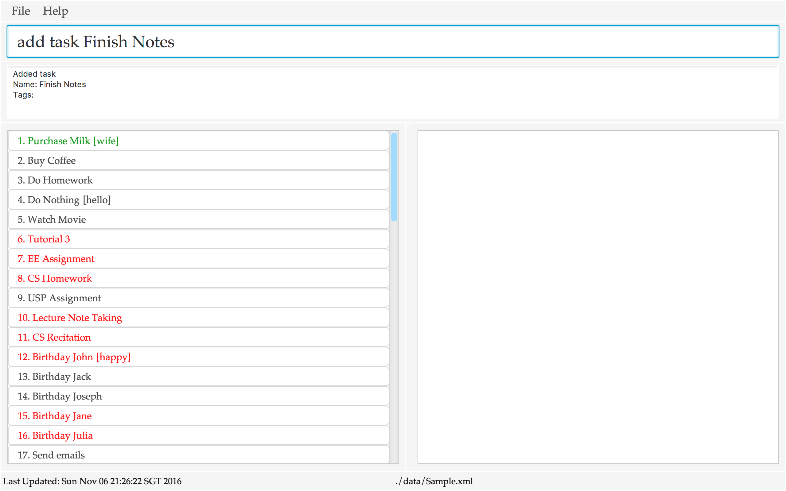
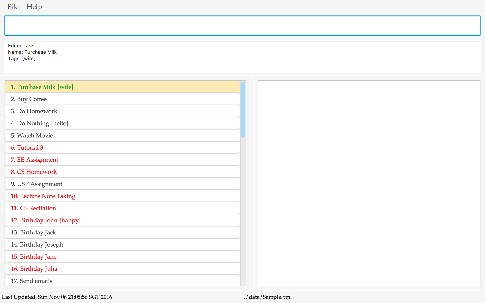
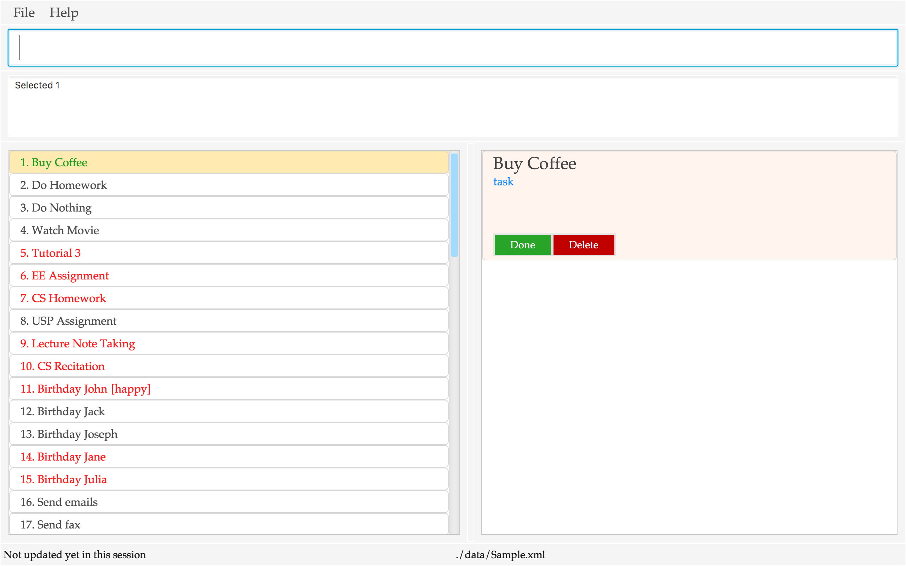
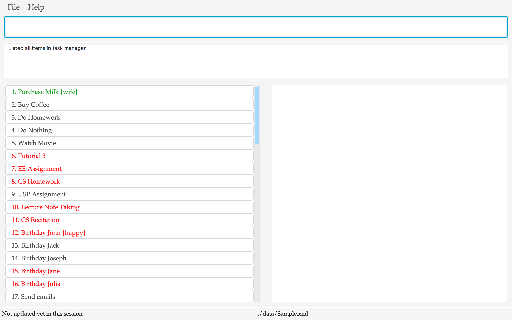
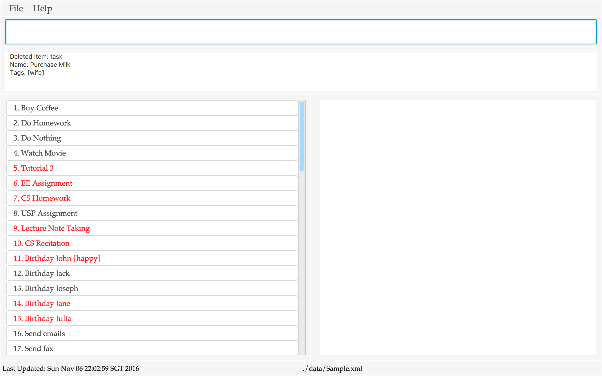
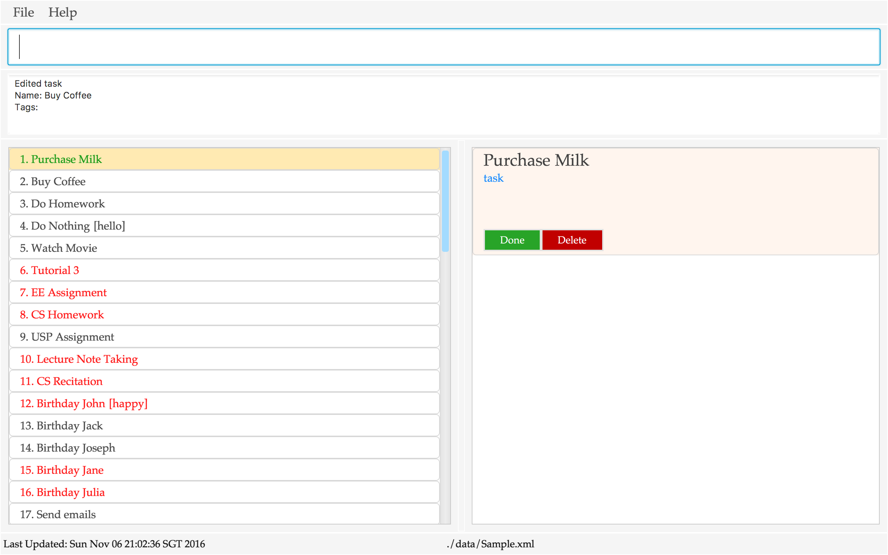
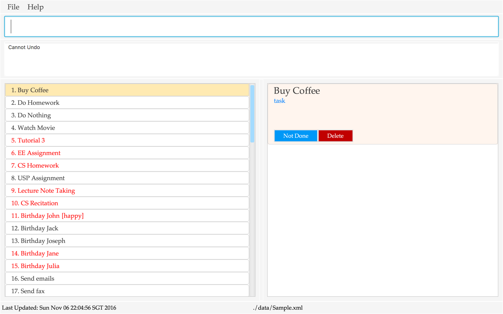
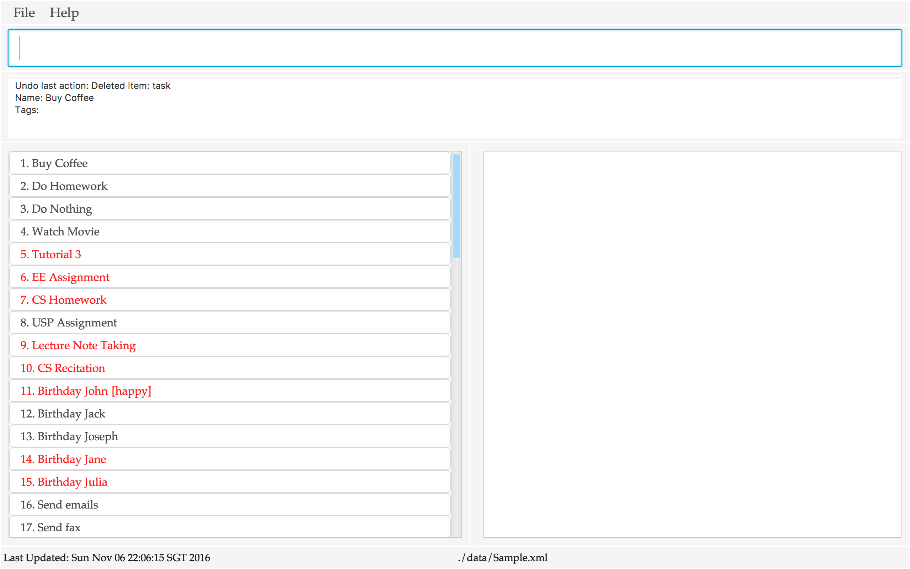
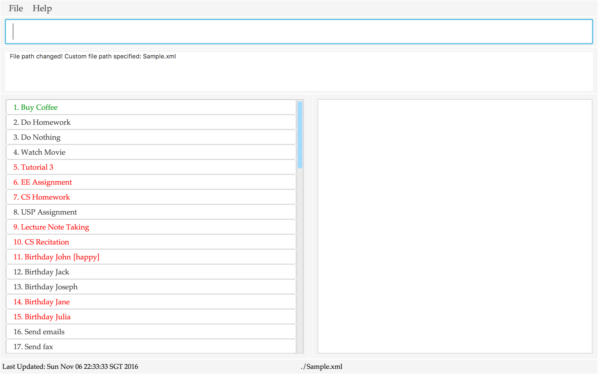

[comment]: # (@@author A0135792X)

# User Guide

* [Quick Start](#quick-start)
* [Features](#features)
* [FAQ](#faq)  
* [Command Summary](#command-summary)  
* [Credits](#credits)

## Quick Start

1. Ensure you have Java version `1.8.0_60` or later installed in your Computer. 
	> Having any Java 8 version is not enough. This app will not work with earlier versions of Java 8.

2. Download the latest `IvoryTasks.jar` from the [releases](../../../releases) tab. 

3. Copy the file to the folder you want to use as the home folder for your task manager. 

4. Double-click the file to start the app. The GUI should appear in a few seconds.

	> 
 

5. Type the command in the command box and press <kbd>Enter</kbd> to execute it.
   e.g. typing **`help`** and pressing <kbd>Enter</kbd> will open the help window. 

6. Some example commands you can try:
	* **`list`**: lists all items
	* **`add task n/Eat`**: adds a task named `Eat` to the taskmanager
	* **`delete 3`**: deletes the 3rd task shown in the current list
	* **`exit`**: exits the app
    

7. Refer to the [Features](#features) section below for details of each command. 

## Features
##### Refer to [Ivory Task components](https://github.com/CS2103AUG2016-T14-C3/main/blob/develop/docs/DeveloperGuide.md#appendix-d-glossary) for the component names used in this document.

[comment]: # (@@author A0140060A)

**Colour Legend**
> * Item List (Left Pane)
> 	* `green` : Completed Item
> 	* `orange` : Approaching Deadline
> 	* `red` : Overdue Deadline
> 	* `blue` : In Progress Event
>	* `grey` : Past Event
> * Item Details (Right Pane)
> 	* `dark green` : Event Start Datetime
> 	* `dark red` : Event / Deadline End Datetime

[comment]: # (@@author A0135792X)

**Command Format**
> * Words in `UPPER_CASE` are the parameters.
> * Items in `SQUARE_BRACKETS` are optional.
> * Items with `...` after them can have multiple instances.
> * `/` should only be used in user input after a parameter indicator (e.g. `n/`). Usage anywhere else may lead to unexpected results.
> * The order of parameters is fixed unless otherwise specified.

### Getting Started

1. Open the Application.

2. Visit [Features](#features) section below to see a list of commands you can use.

3. At any time, you can view the list of commands again by typing ‘h[elp]’ into the command box.

4. If you type an incorrect command, the command box will turn red to inform you.

### When you need help (To see a list of all commands)

1. Type ‘h[elp]’ and press `Enter`.

2. The list of commands, their format and their function will pop up.

### When you have a new deadline, task or event
* The order of all parameters after `NAME` is flexible.

[comment]: # (@@author A0065571A)

#### Add a deadline

1. Type `a[dd] d[eadline] [n/]NAME ed/DATE et/TIME` or `a[dd] d[eadline] n/NAME edt/DATE_TIME_TEXT(e.g. next wed 3pm)`. Press `Enter`.

2. `add` can be replaced by `a`. `deadline` can be replaced by `d`.

3. If et is not specified, et is assumed to be 23:59.

4. The deadline will be added to your to do list in the item list panel and message "Added deadline" is displayed in the results panel.

#### Add a task

1. Type `a[dd] t[ask] [n/]NAME`. Press `Enter`.

2. `add` can be replaced by `a`. `task` can be replaced by `t`.

3. The task will be added to your to do list in the item list panel and message "Added task" is displayed in the results panel.

  >  Example Command: `add task Finish Notes`  

	> 
 
	> App Response for `add task Finish Notes`

#### Add an event

1. Type `a[dd] e[vent] [n/]NAME sd/START_DATE st/START_TIME ed/END_DATE et/END_TIME` or `a[dd] e[vent] [n/]NAME sdt/START_DATE_TIME_TEXT(e.g. two hours later) edt/END_DATE_TIME_TEXT(e.g. next wed 3pm)`. Press `Enter`.

2. `add` can be replaced by `a`. `event` can be replaced by `e`.

3. If st is empty, st is assumed to be 00:00.

4. If et is empty, et is assumed to be 23:59.

5. The event will be added to your to do list in the item list panel and message "Added event" is displayed in the results panel.

[comment]: # (@@author A0140060A)

### When you need to find a deadline, task or event

1. Type `f[ind] KEYWORD`, where `KEYWORD` is part of the item's name and press `Enter`.

2. A list of items with names containing the keyword will be displayed in the item list panel.

3. App takes into account possible user typos and search results are up to 2 characters away from query.

	>  Example Command: `find tutorial`  

	> 
 
	> App Response for `find tutorial`

### When you need to edit a deadline, task or event
* At least one optional parameter must be specified.
* All optional parameters can be in any order.
* sdt/edt supports Natural Language Input. (Note: sdt/edt will be favoured if sdt/edt and sd/ed or st/et are entered together)
* Editing tags: `#` prefix to add a tag, `#-` to delete an existing tag. (Note: You cannot add a duplicate tag or delete a non-existent tag.)

#### Edit a task’s name
For tasks, you can only edit the name, its tags and the end date and time. Note: editing the end date and time automatically converts the task into a deadline.

##### If you know a keyword in the task's name

1. Type `f[ind] KEYWORD`. Press `Enter`.

2. Type `e[dit] INDEX [n/NEW_NAME] [edt/NEW_END_DATE_TIME] [ed/NEW_END_DATE et/NEW_END_TIME] [#TAG_TO_ADD] [#-TAG_TO_DELETE]`. Press `Enter`.

3. The edited item's details will be displayed in the results panel.

  > Example Command:
  > 1. `find random module`
  > 2. `edit 1 n/CS2103

##### If you know the index of the task in the displayed list

1. Type `e[dit] INDEX [n/NEW_NAME] [edt/NEW_END_DATE_TIME] [ed/NEW_END_DATE et/NEW_END_TIME] [#TAG_TO_ADD] [#-TAG_TO_DELETE]`. Press `Enter`.

2. The edited item's details will be displayed in the results panel.

  > Example Command: `edit 1 #wife`  
  > 
 
  > App Response for `edit 1 #wife`

#### Edit a deadline's name, end date and end time
For deadlines, you can only edit the name, end date and time and its tags.

##### If you know the keyword of the deadline

1. Type `f[ind] KEYWORD`. Press `Enter`.

2. Type `e[dit] INDEX [n/NEW_NAME] [edt/NEW_END_DATE_TIME] [ed/NEW_END_DATE] [et/NEW_END_TIME] [#TAG_TO_ADD] [#-TAG_TO_DELETE]`. Press `Enter`.

3. The edited item's details will be displayed in the results panel.

	> Example Command:
	> 1. `find random module`
	> 2. `edit 1 n/CS2103 edt/next thursday 2 pm #work #-play`

##### If you know the index of the deadline in the displayed list

1. Type `e[dit] INDEX [n/NEW_NAME] [edt/NEW_END_DATE_TIME] [ed/NEW_END_DATE] [et/NEW_END_TIME] [#TAG_TO_ADD] [#-TAG_TO_DELETE]`. Press `Enter`.

2. The edited item's details will be displayed in the results panel.

	> Example Command: `edit 1 n/CS2103 edt/next thursday 2 pm #work #-play`

#### Edit an event’s name, start date, start time, end date and end time

For events, you can edit all optional parameters.
(Note: editing the end datetime to be before the start datetime is an illegal operation and is not allowed)

##### If you know the keyword of the event

1. Type `f[ind] KEYWORD`. Press `Enter`.

2. Type `e[dit] INDEX [n/NEW_NAME] [sdt/NEW_START_DATE_TIME] [sd/NEW_START_DATE] [st/NEW_START_TIME] [edt/NEW_END_DATE_TIME]  [ed/NEW_END_DATE] [et/NEW_END_TIME] [#TAG_TO_ADD] [#-TAG_TO_DELETE]`. Press `Enter`.

3. The edited item's details will be displayed in the results panel.

	> Example Command:
	> 1. `find random module`
	> 2. `edit 1 n/CS2103 sdt/next friday 2 pm edt/next friday 4 pm #work #-play`

##### If you know the index of the event in the displayed list

1. Type `e[dit] INDEX [n/NEW_NAME] [sdt/NEW_START_DATE_TIME] [sd/NEW_START_DATE] [st/NEW_START_TIME] [edt/NEW_END_DATE_TIME] [ed/NEW_END_DATE] [et/NEW_END_TIME] [#TAG_TO_ADD] [#-TAG_TO_DELETE]`. Press `Enter`.

2. The edited item's details will be displayed in the results panel.

	> Example Command: `edit 1 n/CS2103 sdt/next friday 2 pm edt/next friday 4 pm #work #-play`

### When you need to view the details of your deadlines, tasks and events

1. Type `s[elect] INDEX` and press `Enter`. Alternatively, click on the item in the item list panel.

2. The selected item's details will be displayed in the item details panel.

	> Example Command: `select 1`
	> 
 
	> App Response for `select 1`

[comment]: # (@@author )

### When you need to view your deadlines, tasks and events

#### View all deadlines, tasks and events

1. Type `l[ist]`. Press `Enter`.

2. The item list panel refreshes with all deadlines, tasks, and events displayed.

  > Example Command: `list`
  > 
 
  > App Response for `list`

[comment]: # (@@author A0140060A)

#### View all uncompleted deadlines, tasks and events

1. Type `l[ist]n[ot]d[one]`. Press `Enter`.

2. All uncompleted items will be displayed in the item list panel.

	> Example Command: `listnotdone`

[comment]: # (@@author )

#### View all tasks

1. Type `l[ist]t[ask]`. Press `Enter`.

2. The item List panel refreshes with all tasks displayed.

#### View all deadlines

1. Type `l[ist]d[eadline]`. Press `Enter`.

2. The item List panel refreshes with all deadlines displayed.

#### View all events

1. Type `l[ist]e[vent]`. Press `Enter`.

2. The item List panel refreshes with all events displayed.

[comment]: # (@@author A0143641M)

### When you want to delete a deadline, task or event
* The index(es) specified refer(s) to the index number(s) shown in the most recent listing.
* The index(es) must be positive integers 1, 2, 3...

#### Delete one deadline, task or event

1. Type `del[ete] INDEX`. Press `Enter`.

2. Deleted item details are displayed in the results panel. The item list panel refreshes the list of items.

  >  Example Command: `delete 1`  

  > 
 
  > App Response for `delete 1`

#### Delete multiple deadlines, tasks or events

1. Type `del[ete] INDEX ...`. Press `Enter`.

2. The list of deleted items and their details are listed in the results panel in ascending index order from the last listing. The item list panel refreshes the list of items.

[comment]: # (@@author A0065571A)

### When you are done with a deadline, task or event

1. Type `d[one] INDEX`. Press `Enter`.

2. The item List panel refreshes the list of items, with updated status for the done item.

	> Example Command: `done 1`  
	> 
 
	> App Response for `done 1`

### When you are not done with a deadline, task or event

1. Type `n[ot]d[one] INDEX`. Press `Enter`.

2. The item List panel refreshes list of items, with updated status for the not done item.

	> Example Command: `notdone 1`  
	> 
 
	> App Response for `notdone 1`

### When you want to undo your last action that caused a changed in your todo list

1. Type `u[ndo]`. Press `Enter`.  

2. The item List panel displays items as per previous state. Details of the undone action will be displayed in the results panel.

	> Example Command:
	> 1. `undo`
	> 
 
	> App Response for `undo`

### When you want to redo your last undone action

1. Type `r[edo]`. Press `Enter`.  

2. The item List panel reverts the list of items to before the latest undo action. Details of the latest undo action will be displayed in the results panel.

	> Example Command: `redo`
	> 
 
	> App Response for `redo`

[comment]: # (@@author A0143641M)

### When you want to specify a custom save location for your data file

> * You must specify the name of the file to save in .xml format.
> * File paths are relative to the home folder that your app is in.
> * Note: This command cannot be undone.
> * Note: Current data will overwrite any existing data in the specified custom data file location if it already exists.

1. Type `save VALID_FILE_PATH_NAME`. Press `Enter`.

  > Example Command: `save Sample.xml`  
  > 
 
  > App Response for `Save Sample.xml`

[comment]: # (@@author A0140060A)

# FAQ

1. What if I have no Internet connection?
> IvoryTasks is fully functional offline but you will not be able to view the User Guide.

2. What if I would like to edit a huge number of tasks, deadlines, events at once with a script?
 > IvoryTasks uses a human editable xml file to store its data. You may edit it directly or write a script to do so. However, please note that straying from the format IvoryTasks will cause unexpected results.

# Command Summary

Command | Format  | Example
-----: | ----- | :------------------
Add Task | `a[dd] t[ask] [n/]NAME [#TAG_TO_ADD]` | `add task tutorial`
Add Deadline | `a[dd] d[eadline] [n/]NAME ed/DATE et/TIME` or `a[dd] d[eadline] [n/]NAME edt/DATE_TIME_TEXT [#TAG_TO_ADD]` | `add deadline reach v0.4 edt/thursday 2pm`
Add Event | `a[dd] e[vent] [n/]NAME sd/START_DATE st/START_TIME  ed/END_DATE et/END_TIME [#TAG_TO_ADD]` or `a[dd] e[vent] [n/]NAME sdt/START_DATE_TIME_TEXT edt/END_DATE_TIME_TEXT [#TAG_TO_ADD]` | `add event 2103 lecture sdt/friday 2pm edt/friday 4pm`
Clear | `cl[ear]` | `clear`
Delete | `del[ete] INDEX ...` | `delete 1`
Done | `d[one] INDEX` | `done 1`
Edit Task | `e[dit] INDEX [n/NEW_NAME] [edt/NEW_END_DATE_TIME] [ed/NEW_END_DATE et/NEW_END_TIME] [#TAG_TO_ADD] [#-TAG_TO_DELETE]` | `edit 6 n/CS2103`
Edit Deadline | `e[dit] INDEX [n/NEW_NAME] [edt/NEW_END_DATE_TIME] [ed/NEW_END_DATE] [et/NEW_END_TIME] [#TAG_TO_ADD] [#-TAG_TO_DELETE]` | `edit 6 edt/tomorrow 6pm`
Edit Event | `e[dit] INDEX [n/NEW_NAME] [sdt/NEW_START_DATE_TIME] [sd/NEW_START_DATE] [st/NEW_START_TIME] [edt/NEW_END_DATE_TIME] [ed/NEW_END_DATE] [et/NEW_END_TIME] [#TAG_TO_ADD] [#-TAG_TO_DELETE]` | `edit 6 sdt/yesterday`
Find | `f[ind] KEYWORD [MORE_KEYWORDS]` | `find random module`
Help | `h[elp]` | `help`
List all items | `l[ist]` | `list`
List Tasks | `l[ist]t[ask]` |`lt`
List Deadlines | `l[ist]d[eadline]` | `ld`
List Events | `l[ist]e[vent]` | `le`
List all uncompleted items | `l[ist]n[ot]d[one]` | `lnd`
Notdone | `n[ot]d[one] INDEX` | `nd 1`
Redo | `r[edo]` | `redo`
Specify custom save location | `save VALID_FILE_PATH_NAME` | `save C:\Users\Jim\data.xml`
Select | `s[elect] INDEX` | `select 1`
Undo | `u[ndo]` | `undo`

# Credits

This application makes use of the [addressbook-level4](https://github.com/se-edu/addressbook-level4) code provided by the NUS SoC CS2103 Teaching Team.

Libraries used:  
[prettytime](https://github.com/ocpsoft/prettytime)
