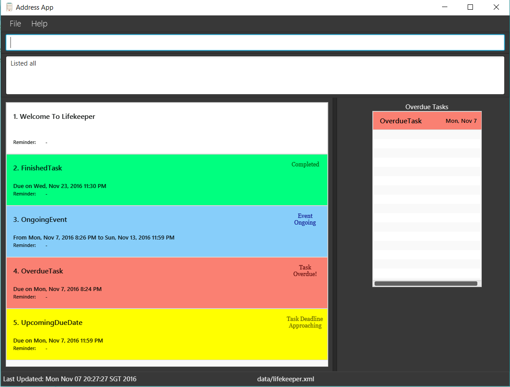

# User Guide

* [Quick Start](#quick-start)
* [Features](#features)
* [FAQ](#faq)
* [Command Summary](#command-summary)

## Quick Start

0. Ensure you have Java version `1.8.0_60` or later installed in your Computer. 
   > Having any Java 8 version is not enough.  
   This app will not work with earlier versions of Java 8.
   
1. Download the latest `lifekeeper.jar` from the [releases](../../../releases) tab.
2. Copy the file to the folder you want to use as the home folder for your Lifekeeper.
3. Double-click the file to start the app. The GUI should appear in a few seconds. 
   > 

4. Type the command in the command box and press <kbd>Enter</kbd> to execute it.  
   e.g. typing **`help`** and pressing <kbd>Enter</kbd> will open the help window. 
5. Some example commands you can try:
   * **`list`** : lists all tasks
   * **`add`**` CS2103 T7A1 d/6 Oct 2016 p/2 r/5 Oct 2016 1800 t/teamC2` : 
     adds a task named `CS2103 T7A1` to the Lifekeeper.
   * **`delete`**` 3` : deletes the 3rd task shown in the current list
   * **`exit`** : exits the app
6. Refer to the [Features](#features) section below for details of each command. 

## Features

> **Command Format**
> * Words in `UPPER_CASE` are the parameters.
> * Items in `[SQUARE_BRACKETS]` are optional.
> * Items with `...` after them can have multiple instances.
> * The order of parameters is not fixed.

#### Viewing help : `help`
Format: `help`

> Help is also shown if you enter an incorrect command e.g. `abcd`
 
#### Adding a task or event: `add`

Adds a task to Lifekeeper 
Format: `add TASK_NAME [d/DEADLINE] [p/PRIORITY_LEVEL] [r/REMINDER] [t/TAG]...` 

> Tasks can have any number of tags (including 0)

`DEADLINE` accepts `Date Time` format input and variable inputs namely:
* `tomorrow [TIME]`
* `today [TIME]`

`PRIORITY_LEVEL` has to be an integer equal or larger than 1, with `1` being the top priority.

`REMINDER` accepts `Date Time` format input and variable inputs namely:
* `tomorrow [TIME]`
* `today [TIME]`
* `[TIME] before` sets reminder at the specified time before the `DEADLINE`. e.g. `0015 before` for a reminder 15 minutes before the `DEADLINE`.

Examples: 
* `add Grocery Shopping`
* `add Assignment 1 d/Tomorrow p/1 r/Today 2000`
* `add Assignment 2 d/Tomorrow p/1 r/0400 before`
* `add CS2103 T7A1 d/6 Oct 2016 p/2 r/5 Oct 2016 1800 t/teamC2`

Adds an event to Lifekeeper 
Format: `add EVENT_NAME s/START_TIME e/END_TIME [t/TAG]...` 

> Events can have any number of tags (including 0)

`START_TIME` and `END_TIME` accepts `Date Time` format input and variable inputs namely:
* `tomorrow [TIME]`
* `today [TIME]`
* `TIME` format assumes `today`

Examples: 
* `add Lunch s/1200 e/1300`
* `add Executive Meeting s/tomorrow 0900 e/tomorrow 1200`
* `add Concert s/tomorrow 1800 e/tomorrow 2000 t/Leisure`

#### Adding a category: `addcat`
Adds a category to Lifekeeper 
Format: `add CATEGORY_NAME` 

Examples: 
* `addcat Work`
* `addcat CS2103`
* `addcat Family `

#### Listing tasks : `list`
Shows a list of tasks in Lifekeeper, if any. 
Format: `list`

> All the tasks in Lifekeeper will be listed

#### Listing categories: `listcat`
Shows a list of all categories in LifeKeeper. 
Format: `listcat`

> All the categories in Lifekeeper will be listed

#### Finding tasks by name, tag(s) or the range of DEADLINEs: `find`
Finding all tasks containing the queried keyword in their name
* Finds tasks whose names contain any of the given keywords. 
* Format: `find tasks KEYWORD [MORE_KEYWORDS]`

> * The search is not case sensitive. e.g `study` will match `Study`
> * The order of the keywords matters. e.g. `Assignment Due` will not match `Due Assignment`
> * Words containing the keywords will be matched e.g. `Exam` will match `Exams`
> * Tasks matching at least one keyword will be returned (i.e. `OR` search).
    e.g. `Shopping` will match `Clothes Shopping`

Examples: 
* `find tasks Homework Assignment` 
  Returns Any tasks with words containing `Homework`, `homework`, `Assignment`, or `assignment` in their names.

Finding all tasks containing a certain tag    
* Finds tasks which has tags of given keywords attached to it.     
* Format: `find tags KEYWORD [MORE_KEYWORDS]`   
    
> * The search is not case sensitive.     
> * Only full words will be matched.    
> * Only tags matching the EXACT keyword will be returned.    
    
Examples:   
* `find tags CS2103`    
  Returns Any tasks containing the tag `CS2103` or `cs2103` but not `CS2103T` or `CS2103 Project`.    
    
Finding all tasks which has deadlines falling within certain dates    
* Finds tasks which has DEADLINEs falling between the specified range.     
* Format: `find date STARTING_DATE ENDING_DATE`    
    
> Date must be in the form `d MMM yyyy`, `d-MM-yyyy` or `d/MM/yyyy`
    
Examples:   
`find date 1 Oct 2016 31 Oct 2016`   
  Returns Any tasks which has DEADLINEs falling in between 1st October 2016 and 31st October 2016. 
`find date 1-11-2016 31-12-2016`   
  Returns Any tasks which has DEADLINEs falling in between 1st November 2016 and 31st December 2016.

#### Deleting a task: `delete`
Deletes the selected task from Lifekeeper. Irreversible. 
Format: `delete INDEX`

> Deletes the task with `INDEX`. 
  The index refers to the index number shown in the most recent listing. 
  

Examples: 
* `list` 
  `delete 1,3` 
  Deletes the 1st and 3rd task in the Lifekeeper task list.
* `find Dinner` 
  `delete 2` 
  Selects the 2nd task in the results of the `find` command and then deletes it.

#### Select: `select`
Category
Selects the category identified by the index number used in the last task listing. 
Format: `select INDEX`

> Selects the category at the specified `INDEX`. 
  The index refers to the index number shown in the most recent listing. 
  The index **must be a positive integer** 1, 2, 3, ...

Examples: 
* `list` 
  `select 2` 
  Selects the 2nd category in category list.

Task
Selects the task identified by the index number used in the last task listing. 
Format: `select INDEX`

> Selects the task at the specified `INDEX`. 
  The index refers to the index number shown in the most recent listing. 
  The index **must be a positive integer** 1, 2, 3, ...

Examples: 
* `list` 
  `select 2` 
  Selects the 2nd task in Lifekeeper.
* `find Dinner`   
  `select 1` 
  Selects the 1st task in the results of the `find` command.
* `list category`   
  `select 3` 
  `select 1` 
  Selects the 3rd category in the list and then select the 1st task shown in the category..

#### Marking a task as done: `done`
Marks the task as completed. 
Format: `done INDEX`

> Marks the task with `INDEX` as completed.
  The index refers to the index number shown in the most recent listing. 
  

Examples: 
* `list` 
  `done 1` 
  Marks the 1st task in the Lifekeeper task list as completed.
* `find Admin` 
  `done 2` 
  Selects the 2nd task in the results of the `find` command and then marks it as completed.

#### Editing a task: `edit`
Edits the selected task from Lifekeeper. Irreversible. 
Format: `edit [TASK_NAME] [c/CATEGORY] [d/DEADLINE] p/PRIORITY_LEVEL r/REMINDER [t/TAG]...`

> Edits the task that was previously selected with `INDEX`. 
  The index refers to the index number shown in the most recent listing. 
  

Examples: 
* `list task work` 
  `select 2` 
  `edit assignment 5 c/school` 
  Edit the selected the 2nd task in the category work by changing its name to assignment 5 and category from work to school..
* `find CS2103 Assignment` 
  `select 1`  
  `edit d/15/06/2017` 
  Selects the 1st task in the results of the `find` command and then change the DEADLINE to 15/06/2017.

#### Undoing an action : `undo`
Reverts the action that was previously executed. 
Format: `undo`

#### Clearing all entries : `clear`
Clears all entries from Lifekeeper. 
Format: `clear`  

#### Exiting the program : `exit`
Exits the program. 
Format: `exit`  

#### Saving the data 
Lifekeeper data are saved in the hard disk automatically after any command that changes the data. 
There is no need to save manually.

## FAQ

**Q**: How do I transfer my data to another Computer? 
**A**: Install the app in the other computer and overwrite the empty data file it creates with 
       the file that contains the data of your previous Lifekeeper folder.
       
## Command Summary

Command | Format  
-------- | :-------- 
Add | `add TASK_NAME d/DEADLINE p/PRIORITY_LEVEL r/REMINDER [t/TAG]...` 
Add Category |`addcat CATEGORY_NAME`
Edit | `edit [TASK_NAME] [c/CATEGORY] [d/DEADLINE] p/PRIORITY_LEVEL r/REMINDER [t/TAG]...`
Clear | `clear`
Delete | `delete [INDEX]...`
Find | `find KEYWORD [MORE_KEYWORDS]`
List | `list`
List Categories | `listcat`
Select | `select INDEX`
Done | `done`
Undo | `undo`
Help | `help`
Exit | `exit`