//@@author A0139772U
# User Guide

# Table of Contents: 
* [Introduction](#introduction)
* [Quick Start](#quick-start)
* [Features](#features)
* [FAQ](#faq)
* [Command Summary](#command-summary)

//@@author A0141021H
## Introduction
Are you feeling stressed or overwhelmed with the number of things you have to do? Are you drowning in the pool of to-dos and confused about where to start? WhatNow is here to throw you a lifebuoy and to help you manage all your tasks. It allows you to manage your tasks by entering simple commands without the use of a mouse. You can even find free slots amidst your busy schedule by keying in a special command: freetime.

Now that you know WhatNow is [about](../README.md), you can follow this guide to learn how to use it effectively.

Welcome to WhatNow!

## Quick Start

1. Ensure that you have Java version `1.8.0_60` or later installed in your Computer. 
   > Having any Java 8 version is not enough.
   This app will not work with earlier versions of Java 8.

2. Download the latest `WhatNow.jar` from the [releases](../../../releases) tab.
3. Copy the file to the folder you want to use as the home folder for your WhatNow.
4. Double-click the file to start the app. The GUI should appear in a few seconds. 

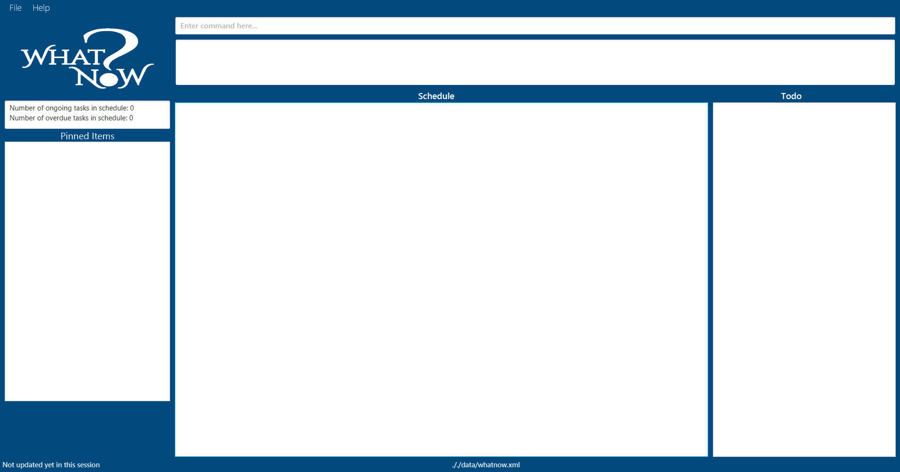 

Figure 1: GUI layout

5. Type a command in the command box and press <kbd>Enter</kbd> to execute it.
   e.g. typing **`help`** then press <kbd>Enter</kbd> will open the help window. 
6. Some example commands you can try:
   * **`list`** : lists all tasks in WhatNow.
   * **`add`**` "Buy groceries"` : adds a task called `Buy groceries` to WhatNow.
   * **`delete`**` todo 3` : deletes the 3rd task shown in the Todo tasks.
   * **`exit`** : exits WhatNow.
7. Refer to the [Features](#features) section below for details of each command. 

## Features

> **Command Format**
> * Words in `UPPER_CASE` are the parameters.
> * Items in `SQUARE_BRACKETS` are optional.
> * Items with `...` after them can have multiple instances.
> * The order of parameters is fixed.

### Changing storage location : `change`
Changes the data file storage location.

Format: `change location to PATH`

Example:
* `change location to C:\Users\user\Desktop`
Changes the data file storage location to C:\Users\user\Desktop.

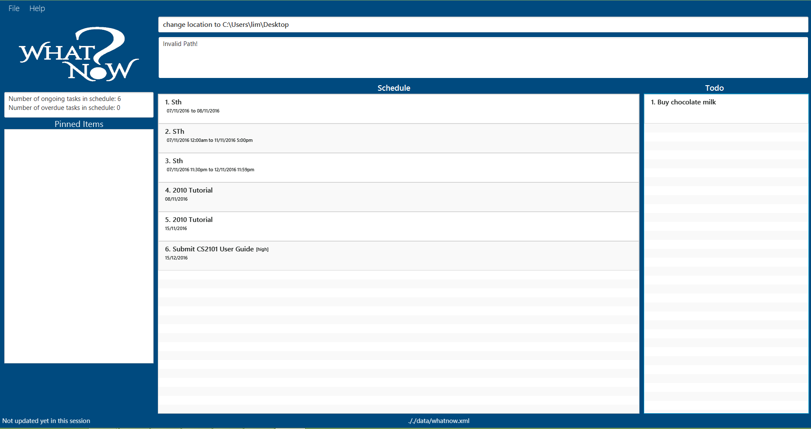 

Figure 2: The storage location is changed

//@@author A0139128A
### Adding a task: `add`
Adds everyday tasks, deadlines and events to WhatNow. Any task without date or time is considered a Todo task, otherwise it is considered a Schedule task. 

#### Adds a todo task to WhatNow
Format: `add "DESCRIPTION" [t/TAG]...`
> * All description should be written within double quotation marks.
> * Except for the double quotation marks, you can add any special character in the description.

Example:
* `add "Buy chocolate milk"`
Adds a Todo task "Buy chocolate milk".

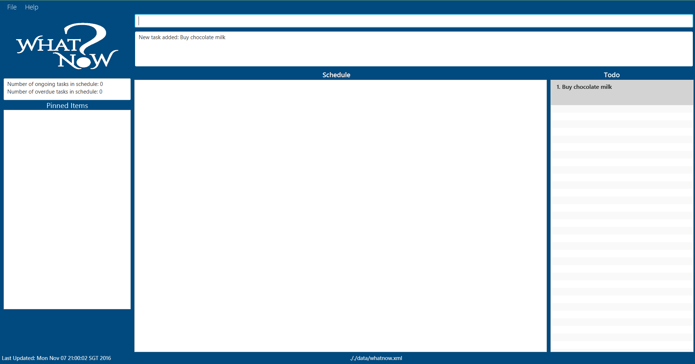 

Figure 3: A task without date and time specified added under Todo

#### Adds a deadline to WhatNow
Format: `add "DESCRIPTION" [DATE] [TIME] [every day/week/month/year till DATE][t/TAG]...`
> * All description should be written within double quotation marks.
> * Except for the double quotation marks, you can add any special character in the description.
> * Refer to the Date Format and Time Format at the end of the User Guide below for the various date and time formats.
> * The order for date and time is reversible. You can add an event with time followed by the date too.

Examples:
* `add "register for salsa class!" by 20-11-2016 6pm`
Adds a Schedule task "register for salsa class" by 20 November 2016 6pm.
* `add "CS2103 Project" by 20.11.2016 t/low`
Adds a Schedule task "CS2103 Project" of low priority on 20 November 2016.
* `add "Pay School Fees" by 11am t/medium`
Adds a Schedule task "Pay School Fees" of high priority on today 11am.
* `add "Submit CS2101 User Guide" by 9:30pm 12/12/2016 t/high`
Adds a Schedule task "Submit CS2101 User Guide" of high priority by 12 December 2016 9.30pm.

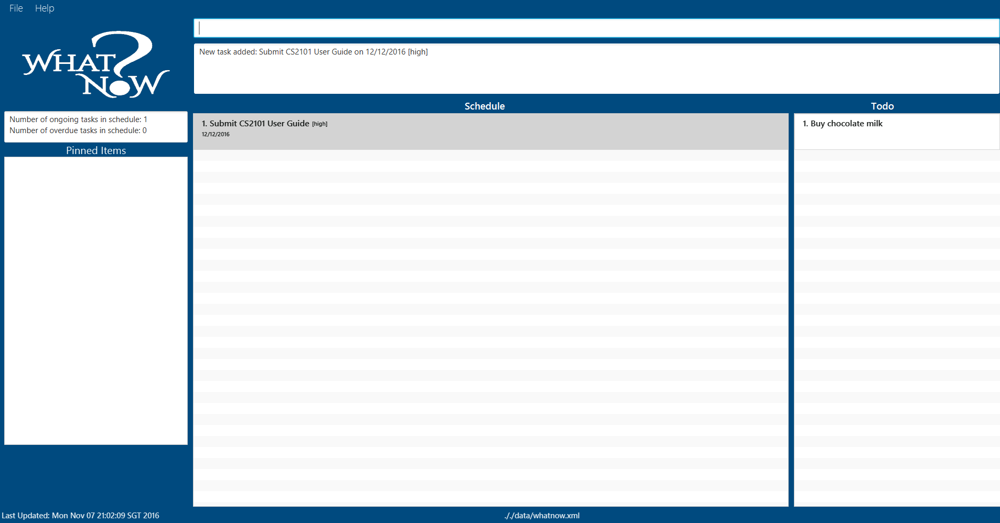 

Figure 4: A deadline task with date, time and priority specified added under Schedule tasks

#### Adds a one-day event to WhatNow
Format: `add "DESCRIPTION" [DATE] [TIME] [TIME] [every day/week/month/year till DATE] [t/TAG]...`
> * All description should be written within double quotation marks.
> * Except for the double quotation marks, you can add any special character in the description.
> * Refer to the Date Format and Time Format at the end of the User Guide below for the various date and time formats.

Examples:
* `add "CS2016 Tutorial" every Tuesday from 12pm to 2.30pm t/medium`
Adds a Schedule task "CS2106 Tutorial" of medium priority on every Tuesday from 12pm to 2.30pm.
* `add "Drashti's Birthday" every 30 Aug t/high`
Adds a Schedule task "Drashti's Birthday" of high priority every 30 Aug for the entire day.
* `add "Java Workshop" from 8am to 5pm t/high`
Adds a Schedule task "Java Workshop" of high priority from 8am to 5pm.

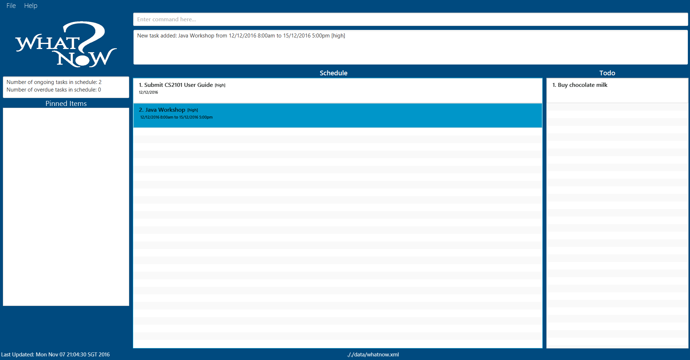 

Figure 5: An event task with period and priority added under Schedule tasks

#### Adds a multiple-day event to WhatNow
Format: `add "DESCRIPTION" [DATE] [TIME] [DATE] [TIME] [every day/week/month/year till DATE] [t/TAG]...`
> * All description should be written within double quotation marks.
> * Except for the double quotation marks, you can add any special character in the description.
> * Refer to the Date Format and Time Format at the end of the User Guide below for the various date and time formats.

Examples:
* `add "NUS Freshmen Computing Camp" from 12/8/2016 10am to 16/8/2016 8pm t/high`
Adds a Schedule task "NUS Freshmen Computing Camp" of high priority from 12/8/2016 10am to 16/8/2016 8pm.
* `add "Cousin sister's wedding in Spain!" from 20.12.2016 to 26.12.2016 t/high`
Adds a Schedule task "Cousin sister's wedding in Spain!" of high priority from 20/12/2016 to 26/12/2016.
* `add "French Beginner's Workshop" from 6-4-2017 to 8-4-2017 9pm`
Adds a Schedule task "French Beginner's Workshop" from 6-4-2017 to 8-4-2017 9pm.

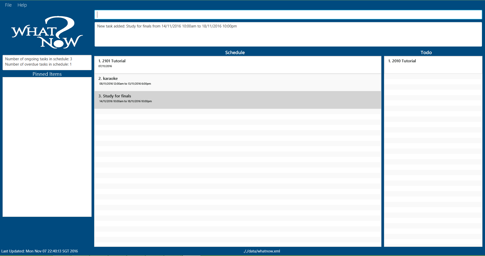 

Figure 6: An event task with period and priority added under Schedule tasks

> You can add a recurring task for a deadline, one-day event or multiple-day event as shown above.

//@@author A0139772U
###Marking a task as completed: done
Marks a task in WhatNow as completed.

Format: `done todo/schedule INDEX`
> * Marks the task at the specified INDEX from Todo or Schedule as completed.
> * Completed tasks will be hidden from the current view.
> * The index refers to the index number shown in the current listing.
> * The index must be a **positive integer** 1, 2, 3, ...

Examples:
* `done todo 1`
Marks the 1st Todo task from the displayed list in WhatNow as completed.
* `done schedule 2`
Marks the 2nd Schedule task from the displayed list in WhatNow as completed.

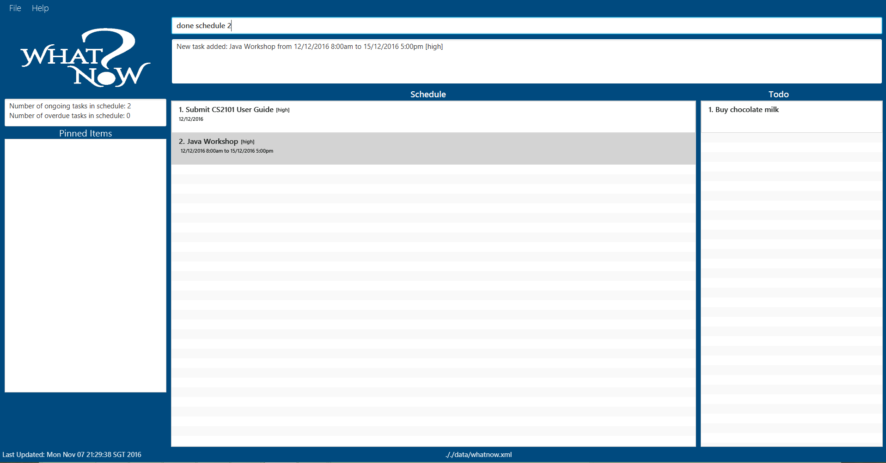 

Figure 7: Display before a task is marked done

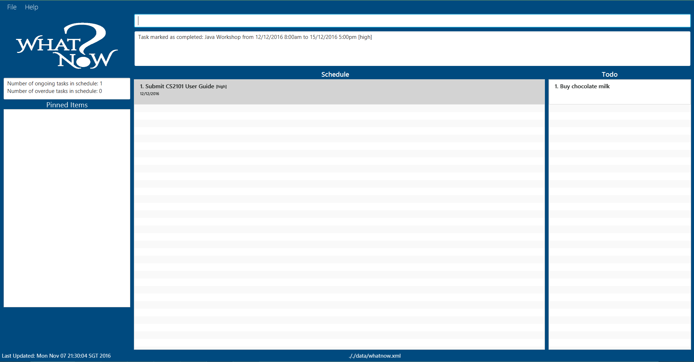 

Figure 8: Display after a task is marked done in the incomplete task list

 

Figure 9: Display after a task is marked done in the complete task list

### Listing all tasks: `list`
Shows a list of all tasks that match task type, date and time requested by you.

Format: `list [all/done]`
> * If all/done is not stated, then only the ongoing (i.e. incomplete) tasks will be displayed.

Examples:
* `list`
Returns the lists of all incomplete tasks.

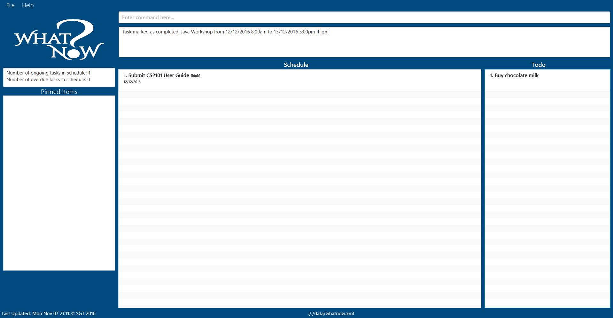 

Figure 10: Display with ongoing task listed

* `list done`
Returns the lists of all completed tasks.

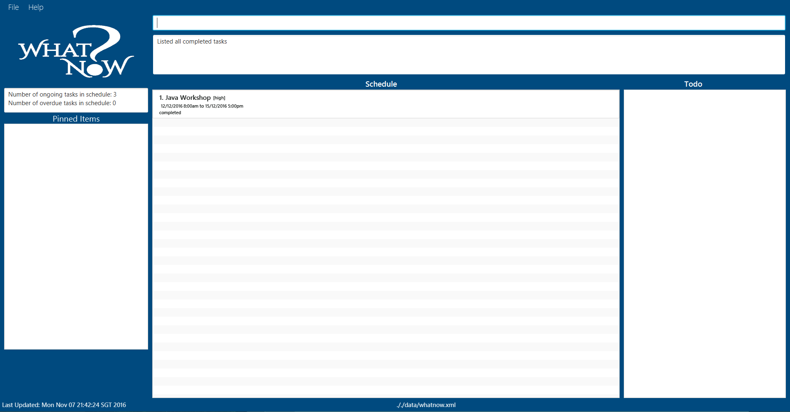 

Figure 11: Display with all completed tasks listed

* `list all`
Returns the lists of all incomplete and completed tasks.

 

Figure 12: Display with all tasks listed

//@@author A0141021H
###Marking a task as incomplete: undone
Marks a task in WhatNow as incomplete.

Format: `undone todo/schedule INDEX`
> * Marks the task at the specified INDEX from Todo or Schedule as incomplete.
* The index refers to the index number shown in the current listing.
* The index must be a **positive integer** 1, 2, 3, ...
* "list done" should be typed first followed by the undone command to mark a particular task incomplete.

Examples:
* `undone todo 1`
Marks the 1st Todo task from the displayed list in WhatNow as incomplete.
* `undone schedule 2`
Marks the 2nd Schedule task from the displayed list in WhatNow as incomplete.

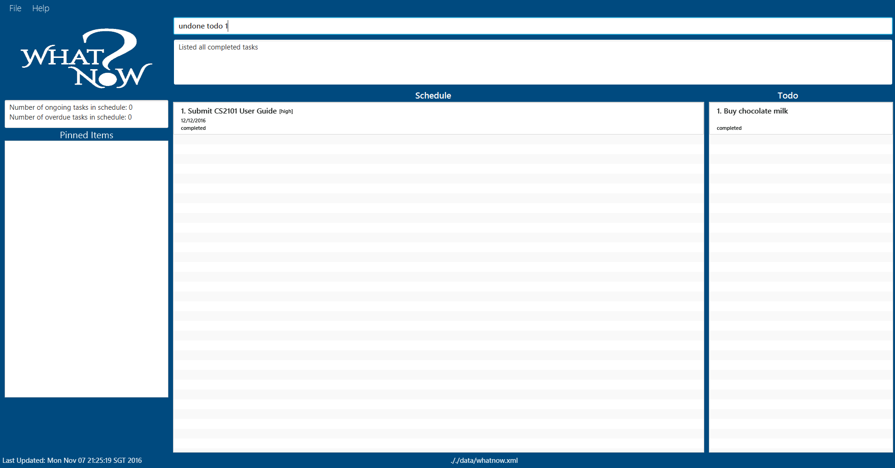 

Figure 13: Display of completed tasks. 

 

Figure 14: Display of completed tasks after undone command. 

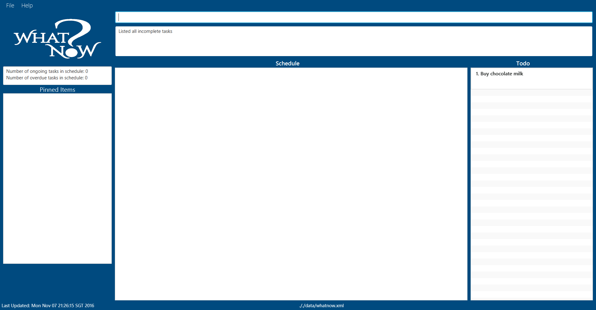 

Figure 15: Display of incomplete tasks. 

> * The total number of ongoing and overdue tasks can be viewed on the panel above the "Pinned Items" panel.

### Deleting a task: `delete`
Deletes a task in WhatNow.

Format: `delete todo/schedule INDEX`
> * Deletes the task at the specified `INDEX` from Todo or Schedule as specified.
* The index refers to the index number shown in the current listing.
* The index must be a **positive integer** 1, 2, 3, ...

Examples:
* `delete todo 4`
Deletes the 4th Todo task from the displayed list in WhatNow.
* `delete schedule 2`
Deletes the 2nd Schedule task from the displayed list in WhatNow.

 

Figure 16: Display before delete

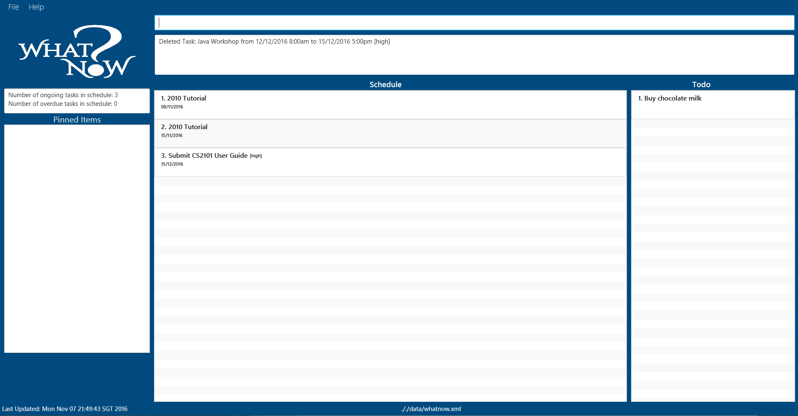 

Figure 17: Display after delete

//@@author A0126240W
### Updating a task: `update`
Updates a task from the list displayed.

Format: `update todo/schedule INDEX description/date/time/tag NEW_VALUE`
> * Updates the description/date/time/tag of the task at the specified INDEX from Todo or Schedule as specified.
* The index refers to the index number shown in the current listing.
* The index must be a **positive integer** 1, 2, 3, ...

Examples:
* `update todo 3 description Avengers`
Selects the 3rd Todo task from the displayed list and changes the task description to Avengers.
* `update todo 4 date 11 Nov`
Selects the 4th Todo task from the displayed list and changes the type of task from Todo to Schedule.
* `update schedule 1 date 15/12/2016`
Selects the 1st Schedule task from the displayed list and changes the date to 15/12/2016.
* `update schedule 4 time 10.30am`
Selects the 4th Schedule task from the displayed list and changes the date to 15/12/2016.
* `update schedule 2 time 9am to 5pm`
Selects the 2nd Schedule task from the displayed list and changes the time to the period from 9am to 5pm.
* `update schedule 3 date 15/8/2017 to 20/9/2017`
Selects the 3rd Schedule task from the displayed list and changes the date to the period from 15/8/2017 to 20/9/2017.

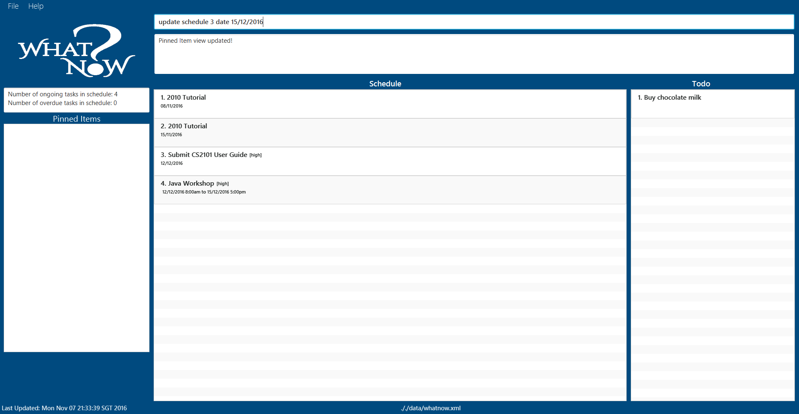 

Figure 18: Display before the update

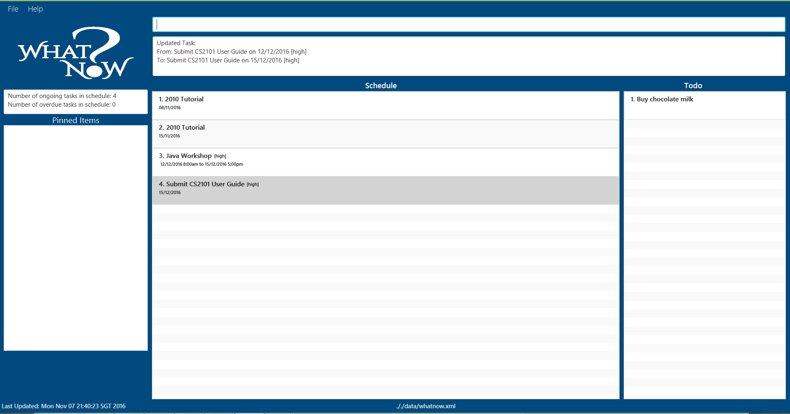 

Figure 19: Display after the update

### Undoing the previous action: `undo`
There can be multiple undoes to revert to the previous state.

Format: `undo`

Example:
* `undo`
Undoes the previous action.

> * Undo is supported in the add, delete, clear, list, change, done, undone, update command.

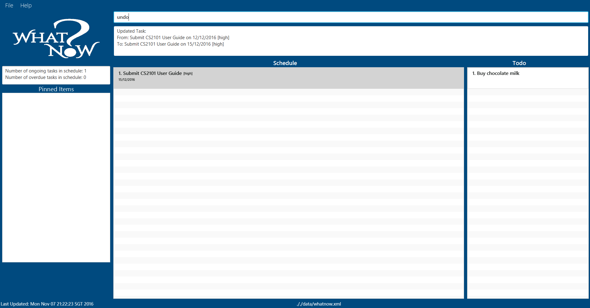 

Figure 20: Display before an undo is called after an update

 

Figure 21: Display after an undo is called after an update

### Redoing the previous action: `redo`
There can be multiple redoes to revert to the previous state.

> * Redo is supported in the add, delete, clear, list, change, done, undone, update command.

Format: `redo`

Example:
* `redo`
Redos the previous action.

 

Figure 22: Display before a redo is called after an undo

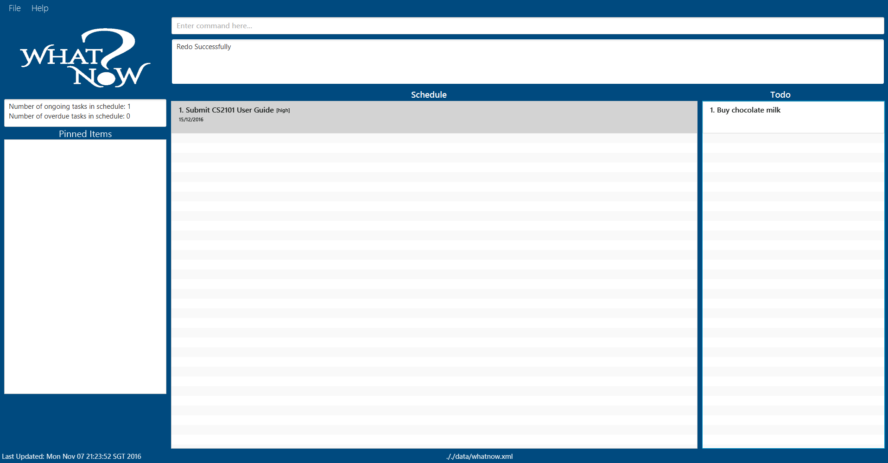 

Figure 23: Display after a redo is called after an undo

### Finding tasks containing any keyword in their description: `find`
Search for all tasks whose description contains any of the given keywords.

Format: `find KEYWORD [MORE_KEYWORDS]`
> * The search is not case sensitive. e.g. Read will match read.
* The order of the keywords does not matter. E.g. Read books will match books Read.
* Only the task description is searched.
* All task descriptions containing the keyword will be matched e.g. Book will match Books.
* Tasks matching at least one keyword will be returned (i.e. OR search). e.g. Read Study will match Read books.

Examples:
* `find Read`
Returns Read books and read.
* `find Read books lecture notes`
Returns any tasks having the description Read, books, lecture or notes (case insensitive).
* `find CS2101`
Returns any tasks having the description CS2101.

 

Figure 24: Display result before the find command is executed

 

Figure 25: Display result after the find command is executed

//@@author A0141021H
### Find Freetime: `freetime`
You can now search for your freetime on a particular date without manually finding for your freetime.

Format: `freetime [DATE/DAY]`
> * Refer to the Date Format below for the various ways of typing date. 

Examples:
* `freetime 11/10/2017`
Returns all the free time blocks for the day 11/10/2017.
* `freetime 9/3/2019`
Returns no free time blocks on the day 9/3/2019.

 

Figure 26: Display result before the freetime command is executed

 

Figure 27: Display result after the freetime command is executed

### Pin Items: `pin`
Pin the items of the selected date or tag onto the "Pinned Items" panel on the left.

Format: `pin [tag\date] [TAG\DATE]`
> * Refer to the Date Format below for the various ways of typing date. 
> * To unpin type `pin [tag\date] NONE`.

Examples:
* `pin date 6-4-2018`
Pins all tasks on 6/4/2018.

* `pin tag high`
Pins all tasks with a high tag.

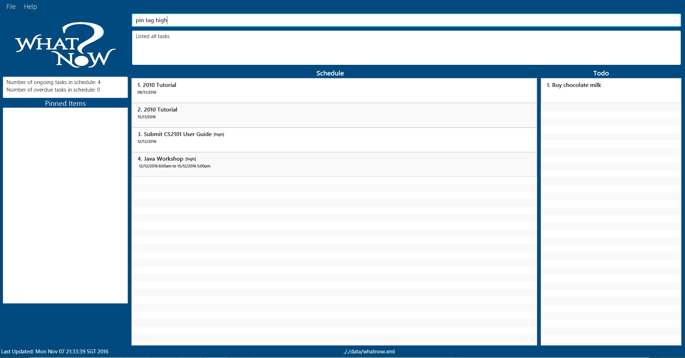 

Figure 28: Display result before the pin command for tag high is executed 

 

Figure 29: Display result after the pin command for tag high is executed 

### Viewing help: `help`
Opens the help page.

Format: `help`

### Saving the data
WhatNow data are saved in the hard disk automatically after any command that changes the data. There is no need to save manually after you make any changes or additions.

### Clearing all tasks: `clear`
Clears all tasks in WhatNow.

Format: `clear`

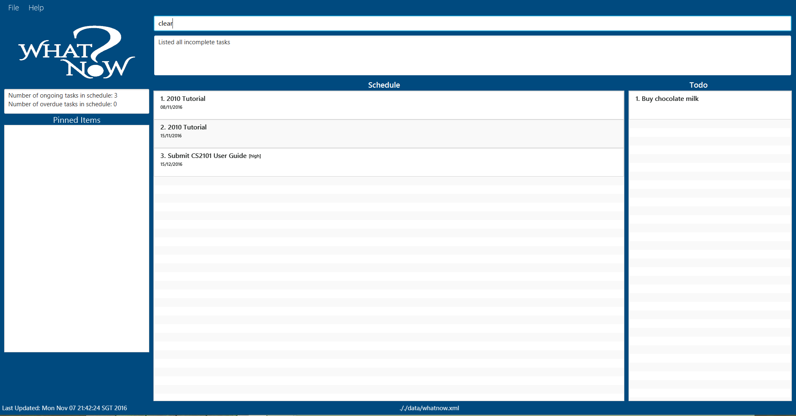 

Figure 30: Display cleared before the clear command is executed

 

Figure 31: Display cleared after the clear command is executed

### Exiting the program: `exit`
Exits the program.

Format: `exit`

## FAQ
Q: How do I transfer my data to another Computer?
A: Install the app in the other computer and overwrite the empty data file it creates with the file that contains the data of your previous WhatNow folder.

## Date Format
* If you type in a time without date, then it is assumed to be today's date or tomorrow's date depending on the time you add the task and the time of the task. Eg. If the current time is 5pm and I add a task: add "study" 1pm then it is assumed to be tomorrow's date.
* The various ways you could type in the date for the 7th of March 2016 is: 7/3/2016, 07/03/2016, 07/3/2016, 7/03/2016, 7-3-2016, 07-03-2016, 7.3.2016, 07.03.2016, 07.3.2016, 7 3 2016, 07 03 2016, 07 3 2016, 7 03 2016, 7th March 2016, 7 March 2016, 7 Mar 2016, 7th Mar 2016, 7 mar 2016, 7th mar 2016, 7 MAR 2016, 7th MARCH 2016, 7 MAR 2016, 7TH MAR 2016. 

## Time Format
* Please use the 12 hour format is used for any time inputs.
* The various ways you could type in the time for 5pm is: 5pm, 05pm, 5:00pm, 05:00pm, 05.00pm

## Command Summary
Command | Format
-------- | :--------
Add | `add "DESCRIPTION" [t/TAG]`   `add "DESCRIPTION" by TODAY/TOMORROW/DAY/DATE/TIME/DATE-TIME [every] [t/TAG]`   `add "DESCRIPTION" [DATE] [TIME] [TIME] [every day/week/month/year till DATE] [t/TAG]...`   ``add "DESCRIPTION" [DATE] [TIME] [DATE] [TIME] [every day/week/month/year till DATE] [t/TAG]...` 
Change | `change location to PATH`
Clear | `clear`
Delete | `delete todo/schedule INDEX`
Done | `done todo/schedule INDEX`
Exit | `exit`
Find | `find KEYWORD [MORE_KEYWORDS]`
Freetime | `freetime [DATE/DAY]`
Help | `help`
List | `list [all/done]`
Pin | `pin [tag/date] [TAG/DATE]`
Redo | `redo`
Undo | `undo`
Undone | `undone`
Update | `update todo/schedule INDEX description/date/start/end/priority/tag NEW_VALUE`