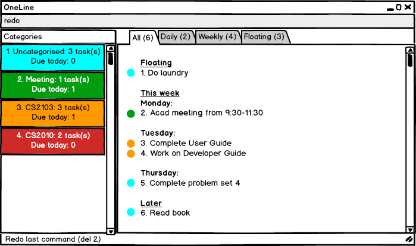

# User Guide 
* [Getting Started](#getting-started)
* [Features](#features)
* [FAQ](#faq)
* [Command Summary](#command-summary)

## Getting Started
1. Ensure you have Java version 1.8.0_60 or later installed in your Computer.
2. Download the latest OneLine.jar from the releases tab.
3. Copy the file to the folder you want to use as the home folder for OneLine.
4. Double-click the file to start the app. The GUI should appear in a few seconds.
5. Type command in the command box and hit <kbd>enter</kbd> to run it 

## Features
> [Square brackets] indicate that a field is optional  
> \<Angled brackets> indicate command parameters 

1. Viewing Help: ` help `
> Displays list of available commmands and descriptions 

2. Adding a Task / Event: ` add `   
    
    
    - `add <name> [.due <date>] [#<cat>] [#<cat>] ...` 
> eg ` add User guide .due Wednesday #cs2103 ` 
> If no date is specified, task will be set as a floating task   

    - `add <name> [.on <date>] [-at <location>]...`  

    - `add <name> [.from <date><time> .to <date><time>] ...`
> If no date is specified, date will be set to the current day, or the next day if set time has passed  
> If no time is specified, start times will be set to 0000 and end times to 2359 

	- `add <name> .every <day / week> ...` : sets task to be a recurring task
> eg `add Go jogging .every Friday ` 

3. Editing: ` edit `    

    - `edit <index> [.due <date>]` : edits task specified by index
> eg `edit 2 .due Tuesday ` 

    - `edit #<oldCat> [#<newCat>] [.c <colour>]` : edits category name and / or colour
    
4. Listing All Tasks: ` list `  
       

    - `list` :  lists all undone tasks sorted by by deadline  
    - `list <day / week>` : lists undone tasks with deadline in the current day / next 7 days  
    - `list float` : lists undone tasks with no deadline
    - `list #<cat>` : lists undone tasks in category
    - `list done` : lists tasks done within the past 7 days  
    
5. Mark Task as Done: ` done `  
   

    - `done <index>` : marks task specified by index as done 
    
6. Find: ` find `   
  

    - `find <keyword>` : returns list of tasks with names similar to keyword
    - `find #<keyword>` : returns list of categories with names similar to keyword
	
7. Deleting a Task: ` del `   
  

    - `del <index>` : deletes task spcified by index 
    - `del #<cat>` : deletes category 

8. Undo: ` undo `   
  

9. Redo: ` redo `   
  

10. Change Storage: ` save `    
  

	- `save <new path>` : changes the storage file to the file specified by new path 
    
11. Exiting Program: ` exit ` 

## FAQ
Q: How do I transfer my data to another Computer?

A: Install the app in the other computer and overwrite the empty data file it creates with the file that contains the data of your previous Address Book folder.

## Command Summary
| Command | Format |
| ------- | ------ |
| help | `help` |
| add | `add <name> [.due <date>] [#<cat>] [#<cat>] ...`   `add <name> [.on <date>] [.at <location>]...`  `add <name> [.from <date><time> .to <date><time>] ...`   `add <name> .every <day / week> ...` |
| edit | `edit <index> [.due <date>]` `edit #<oldCat> [#<newCat>] [.c <colour>]` |
| list | `list`   `list <day / week>`   `list float` `list #<cat>` `list done` |
| done | `done <index>` |
| find | `find <keyword>`   `find #<keyword>` |
| delete | `del <index>`   `del #<cat>`|
| storage | `save <path>` |
| exit | `exit` |
