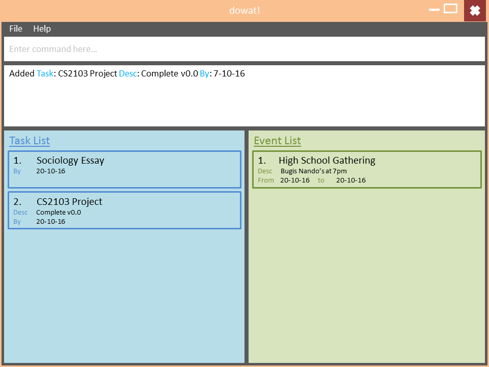

# User Guide

* [Quick Start](#quick-start)
* [Features](#features)
* [FAQ](#faq)
* [Command Summary](#command-summary)

## Quick Start

0. Ensure you have Java version `1.8.0_60` or later installed in your Computer. 
   > Having any Java 8 version is not enough.  
   This app will not work with earlier versions of Java 8.
   
1. Download the latest `dowat.jar` from the 'releases' tab.
2. Copy the file to the folder you want to use as the home folder for your task book.
3. Double-click the file to start the app. The GUI should appear in a few seconds. 
   > 

4. Type the command in the command box and press <kbd>Enter</kbd> to execute it.  
   e.g. typing **`help`** and pressing <kbd>Enter</kbd> will open the help window. 
5. Some example commands you can try:
   * **`list /t`** : lists all tasks that are not completed. 
   * **`add`** `CS2103 Lab 6 /desc finish lab /by 12-30-16` : 
     adds a task named `CS2103 Lab 6` with a description of `finish lab` by the deadline of 30th December.
   * **`mark`**` 3` : marks the 3rd task as complete.
   * **`exit`** : exits the app
6. Refer to the [Features](#features) section below for details of each command. 

## Features
 
<!-- @@author A0127570H -->

#### Adding a task
Adds a task to dowat 

Format: `add TASK_NAME [/desc DESCRIPTION] [/by DEADLINE_DATE_TIME]`  
 
> Words in `UPPER_CASE` are the parameters, parameters will follow behind their corresponding keyword. 
> With the exception of `TASK_NAME`, all other parameters are optional. The order of parameters are not fixed. 
> `DEADLINE_DATE_TIME` can be entered in any natural language format.
> For date, entering words like today, tomorrow and day after are recognised.
> Dates entered in numeric form must be in the format of MM-DD-YYYY.
> Only valid dates are recognised correctly.
> For time, entering 7pm, 1900 or 19.00 are recognised.
> If no time is entered, it is assumed to be due at 23:59 hours.

Examples: 
* `add CS2103 Lab 6 /desc hand in through codecrunch /by 12 midnight 12-30-16`  
* `add CS2103 V0.4 /by 30 Dec`  
   Adds a task "CS2103 V0.4" with deadline "23:59 30 December 2016"

#### Adding an event
Similar to adding a task, you can also add an event to dowat 

Format: `add EVENT_NAME /from START_DATE_TIME [/to END_DATE_TIME] [/desc DESCRIPTION]`  

> With the exception of `EVENT_NAME` and `START_DATE_TIME`, all other parameters are optional. The order of parameters are not fixed. 
> `START_DATE_TIME` and `END_DATE_TIME` can be entered in natural language.
> For date, entering words like today, tomorrow and day after are recognised.
> Dates entered in numeric form must be in the format of MM-DD-YYYY.
> Only valid dates are recognised correctly.
> For time, entering 7pm, 1900 or 19.00 are recognised.
> If no start time is entered, it is assumed to start at 00:00 hours.
> If `END_DATE_TIME` is not provided, the start and end dates will be the same, the default timing will be set 1 hour apart.

Examples:
* `add CS2103 Exam /desc final examination @ MPSH3 /from today 4pm > 6pm`  
* `add CS2103 Workshop /desc OOP workshop /from 12-01-16 > 12-07-16`  

<!-- @@author A0144702N -->
#### Listing tasks
Shows a list of tasks that are not marked done. Or shows a list of all tasks.  

Format: `list /t [/a]`

> Tasks that are marked done will not be shown by default.
> An `/a` optional flag will request the TaskBook to list all tasks, both marked done and not yet marked done. 

Examples: 
* `list /t`  
  Lists tasks that are not marked done.
* `list /t /a`  
  All tasks will be shown.

#### Listing events
Shows a list of events that are not completed. Or shows a list of all events.  

Format: `list /e [/a]`  

> Events that are completed will not be shown by default.
> An `/a` optional flag will request the TaskBook to list all events, both completed and passed. 

Examples: 
* `list /e ` 
  Lists events that are not completed yet. 
* `list /e /a`  
  All events will be shown.

<!-- @@author A0127570H -->

#### Editing a task
Edits an existing task in dowat 

Format: `edit /t INDEX [/name NEW_TASK_NAME] [/desc NEW_TASK_DESCRIPTION] [/by NEW_DEADLINE_DATE_TIME]`  

> Edits the task at the specified `INDEX`. The index refers to the index number shown in the most recent listing of tasks.
> Edits at least 1 field of the task. This includes name and/or description and/or deadline.
> The order of the fields are flexible.
> `NEW_DEADLINE_DATE_TIME` can be entered in natural language.
> Edited tasks are automatically marked as uncompleted.

Examples: 
* `edit /t 1 /desc CS2103 Project /by 12-30-16` 
  Edits the description of the 1st task to “CS2103 Project” and the deadline to 30 Dec
* `edit /t 4 /desc CS2103 TaskBook` 
  Edits the description of the 4th task to “CS2103 TaskBook”

#### Editing an event
Edits an existing event in dowat 

Format: `edit /e INDEX [/name NEW_EVENT_NAME] [/desc NEW_EVENT_DESCRIPTION] [/from NEW_START_DATE_TIME > NEW_END_DATE_TIME]`

> Edits the event at the specified `INDEX`. The index refers to the index number shown in the most recent listing of events.
> Edits any number of fields of the event. This includes name and/or description and/or start time and/or end time.
> The order of the fields are flexible.
> `NEW_START_DATE_TIME` and `NEW_END_DATE_TIME` can be entered in natural language.

Examples:
* `edit /e 1 /desc CS2103 Workshop /from 10-03-16 0000 /to 10-05-16 2359`  
  Edits the description of the 1st event to “CS2103 Workshop” and the duration to the period of 0000 hours, 3-10-16 to 2359 hours, 5-10-16
* `edit /e 4 /desc CS2103 TaskBook Project Meeting 4`  
  Edits the description of the 4th task to “CS2103 TaskBook Project Meeting 4”

<!-- @@author -->

#### Marking a task as completed
Mark an existing task as completed in dowat.

Format: `mark INDEX`

> Marks the task at the specified `INDEX` as completed. The index refers to the index number shown in the most recent listing of tasks.
> Completed tasks will not be shown in the list of tasks and will be archived in dowat.

Examples: 
* `mark 1`  
  Marks the 1st task as completed
  

#### Deleting a task/event
Deletes an existing task/event from dowat storage completely.  

Format: `delete /t|/e INDEX`

> Deletes the task/event at the specified `INDEX` in the most recent task/event listing.
> Deleted tasks/event will not be shown even with `list /e|/t /a` command. 

Examples:
* `delete /t 1`  
  Deletes the 1st task in the most recent listing

  
#### Selecting a task/event
Selects an existing task/event from the last shown task/event list.  

Format: `select /t|/e INDEX`

> Selects the task/event at the specified `INDEX` in the most recent task/event listing.

Examples:
* `select /t 1`  
  Selects the 1st task in the most recent listing

  
#### Changing the save location
dowat data are saved in a file called taskbook.txt in the project root folder. You can change the location by specifying the file path as a program argument.  

Format: `save FILEPATH`

Examples:
* `save C:\Desktop`  
  The filename must end in .txt for it to be acceptable to the program.

#### Viewing help
You can refer to the user guide via a pop-up window with the `help` command. Or you can specify a command which you need help for using `[KEY_WORD]` flag.  

Format: `help [KEY_WORD]`

> A list of commands available for help is also shown if you enter an incorrect command.

Examples:
* `help add`

#### Undo modifications
Can go back to historical versions of dowat with the use of undo commands. Only commands that modify dowat in the same session will be restored. Any versions of current session will not be accessible after restarting dowat.  

Format: `undo`

<!-- @@author A0144702N -->
#### Finding for events/tasks
With the find command, you can find for tasks or events which contain some keywords in their **name** as well as in their **descriptions**. 

Format: `find [/e|/t] KEYWORD [MORE_KEYWORDS]`

> `KEYWORDS` are case insensitive. Events/Tasks which contain at least one keyword in their names will be returned. 

Examples:
* `find cs2103`
  Shows tasks and events which have CS2103 (ignoring cases) in their names or description.
* `find CS`
  Partial match is not supported. Will not return any other tasks or events unless they contain "CS" (ignoring cases) in the names or description.
* `find CS2106 CS2103`
  Returns any tasks or events having "CS2106", "CS2103" in their names. 

<!-- @@author-->

#### Clearing of tasks
Clears all completed tasks or clears all tasks.  

Format: `clear /t [/a]`

> An `/a` optional flag will request the TaskBook to clear all tasks, both marked done and not yet marked done. 

Examples: 
* `clear /t`  
  Clears tasks that are marked done.
* `clear /t /a`  
  Clears all tasks.

#### Clearing of events
Clears all completed events or clears all events.  

Format: `clear /e [/a]`

> An `/a` optional flag will request the TaskBook to clear all events. 

Examples: 
* `clear /e`  
  Clears events that are marked done.
* `clear /e /a`  
  Clears all events.

  
#### Clearing of tasks and events
Clears all completed tasks and events or clears all tasks and events.  

Format: `clear [/a]`

> An `/a` optional flag will request the TaskBook to clear all tasks and events.

Examples: 
* `clear`  
  Clears all completed tasks and events.
* `clear /a`  
  Clears all tasks and events.
  
<!-- @@author A0144702N -->
#### Toggle calendar view
Toggle the view of calendar and focus to certain time time as user specified. 

Format: `show TIME [/day|/wk]`

> TIME parameter indicates the time you wanna jump to in the calendar, it can be "today", "tomorrow", etc... It follows the general rule of date and time of the rest of applications.
> An optional `/day` or `/wk` flag indicates which view mode you wanna toggle to. The default will be week view.

Examples:
* `show today /day`  
 It will focus on the current time of today's calendar in the day mode. 
* `show next week 8pm /wk`  
 It will focus on the 8pm time frame of the next week's calendar. 

<!-- @@author-->
  
#### Exiting the program
Format : `exit`

## FAQ

**Q**: How do I transfer my data to another Computer? 
**A**: Install the app in the other computer and overwrite the empty data file it creates with 
       the file that contains the data of your previous dowat.
       
## Command Summary

 Command | Format  
-------- | :-------- 
[Add Task](#adding-a-task) | `add TASK_NAME [/desc DESCRIPTION] [/by DEADLINE_DATE_TIME]`
[Add Event](#adding-an-event) | `add EVENT_NAME /from START_DATE_TIME [> END_DATE_TIME] [/desc DESCRIPTION] `
[List Task or Event](#listing-tasks) | `list /t|/e [/a]`
[Edit Task](#editing-a-task) | `edit /t INDEX [/name NEW_TASK_NAME] [/desc NEW_TASK_DESCRIPTION] [/by NEW_DEADLINE_DATE_TIME]`
[Edit Event](#editing-an-event) | `edit /e INDEX [/name NEW_EVENT_NAME] [/desc NEW_EVENT_DESCRIPTION] [/from NEW_START_DATE_TIME > NEW_END_DATE_TIME]`
[Mark Task](#marking-a-task-as-completed) | `mark INDEX`
[Delete Task or Event](#deleting-a-task/event) |`delete /t|/e INDEX`
[Select Task or Event](#selecting-a-task/event) |`select /t|/e INDEX`
[Save](#changing-the-save-location) | `save FILEPATH`
[Help](#viewing-help) | `help [COMMAND]`
[Undo](#undo-modifications) | `undo`
[Find](#finding-for-events/tasks) | `find KEYWORD [MORE_KEYWORDS]`
[Clear Tasks or Events](#clearing-completed/uncompleted-tasks/events) |`clear /t|/e [/a]`
[Clear Tasks and Events](#clearing-completed/uncompleted-tasks and events) |`clear [/a]`
[Show Day/Week view of the calendar of certain time](#toggle-calendar-view) | `show today [/day|/wk]`
[Exit](#exiting-the-program) | `exit`

