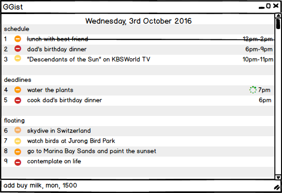
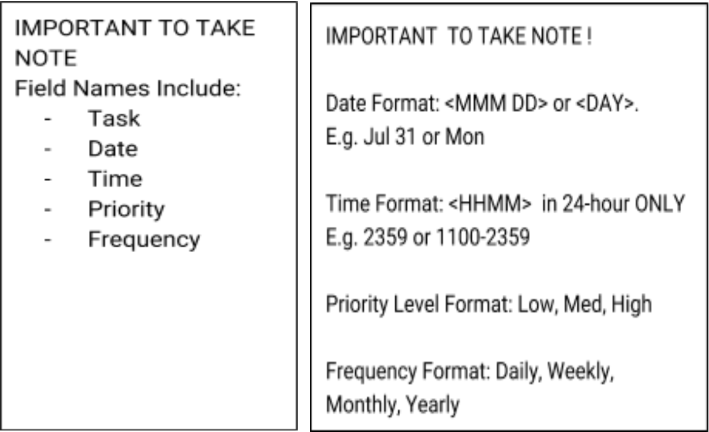
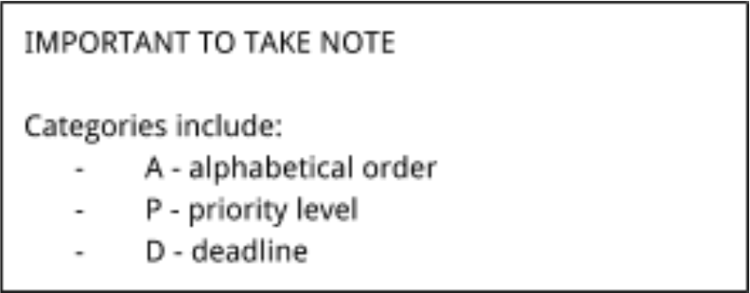

# User Guide

* [About GGist](#about-ggist)
* [Quick Start](#quick-start)
* [Features](#features)
* [Command Cheatsheet](#command-cheatsheet)

## About GGist

Are you constantly overwhelmed by the number of things you have to do everyday or do you have a really hard time managing them? If you answer is yes, GGist is the perfect solution to your daily struggle. GGist is a one-stop user friendly desktop organiser designed to aid working professionals like you to better organize and prioritise your everyday tasks.

Unlike most of the organisers in the market, GGist can be launched with a keyboard shortcut and accepts flexible natural language commands via keyboard. This makes it convenient for working professionals like you who can type fast, spend most of the time near a computer and prefer typing commands. 

Are you ready to embrace a new way of living and have your life better organized? Let’s begin!

## Quick Start

0. Ensure you have Java version `1.8.0_60` or later installed in your Computer. 
   > Having any Java 8 version is not enough.  
   This application may not work with earlier versions of Java 8.
   
1. Download the latest `GGist.jar` from the [releases](../../../releases) tab.
2. Copy the file to the folder you want to use as the home folder for your GGist application.
3. Double-click on the .jar file. Press both "control" and "G" at the same time to start the app. The GUI should appear in a few seconds. 
   > 

4. Type the command in the command box and press <kbd>Enter</kbd> to execute it.  
   e.g. typing **`help`** and pressing <kbd>Enter</kbd> will open the help window. 
5. Some example commands you can try:
   * **`list`**` 31 oct` : 
     lists all the tasks on 31 oct in GGist.
   * **`add`**` water the plants, jul 10, 1400` : 
     adds a task `water the plants` with deadline 2pm on the 10th of July to GGist.
   * **`delete`**` 3` : deletes the 3rd task shown in the current list
   * **`exit`** : exits the app
6. Refer to the [Features](#features) section below for details of each command. 

## Features

> **Command Format**
> * Words in `UPPER_CASE` are the parameters.
> * Items in `SQUARE_BRACKETS` are optional.
> * Items with `...` after them can have multiple instances.
> * The order of parameters is fixed.

#### Viewing help : `help`
Format: `help`

> Help is also shown if you enter an incorrect command e.g. `abcd`
 
#### Adding a task: `add`
Adds a task to GGist 
General format: `add TASK, [DATE], [TIME], [PRIORITY], [FREQUENCY]`

 

###### With deadline
Format: `add TASK, DATE, TIME, [PRIORITY], [FREQUENCY]`

Examples: 
* `add write diary, jul 10, 1300`
* `add prepare presentation slides, mon, 1400, high`

###### Without any deadline
Format: `add TASK, [DATE], [TIME], [PRIORITY], [FREQUENCY]`

Examples: 
* `add buy milk, low`
* `add buy present for brother's birthday`

###### With start and end time
Format: `add TASK, DATE, TIME, [PRIORITY], [FREQUENCY]`

For this kind of task, the parameter TIME is in the format START-END.

Examples: 
* `add dad's birthday celebration, jul 10, 1900-2100, high`
* `add company's D&D, sun, 1900-2200`

###### Recurring
To make tasks repeating, simply  add the FREQUENCY parameter at the back.

Format: `add TASK, [DATE], [TIME], [PRIORITY], [FREQUENCY]`

Examples: 
* `add water the plants, 0800, high, daily`
* `add facial appointment, jul 10, med, monthly`

#### Listing all tasks : `list`
Shows a list of all tasks in a particular day. 
Format: `list DATE`

#### Searching tasks by keywords: `search`
Searches and lists all tasks that contain the specified keyword. 
Format: `search KEYWORD` 

> * The search is not case sensitive.
> * The order of the keywords does not matter. e.g. `buy milk oct 21` will match `oct 21 buy milk`
> * Only full words will be matched e.g. `buy milk` will not match `buy cow`
> * Tasks matching keywords will be returned

Examples: 
* `search oct 1` 
  Lists all tasks that have the date `oct 1`.
* `search milk` 
  Lists the all the tasks with names containing the word `milk` if any can be found.
  
#### Deleting a person : `delete`
Deletes the specified task from the list. Irreversible. 
Format: `delete INDEX...`

> Deletes the task at the specified `INDEX`. 
  The index refers to the index number shown in the most recent listing. 
  The index **must be a positive integer** 1, 2, 3, ...

Examples: 
* `delete 2` 
  Deletes the task indexed number second in the current seen list.
* `search buy milk`  
  `delete 1` 
  Deletes the task indexed first in the results of the `search` command.

To delete more than one task, simply add in the other indexes separated with a comma.  

Example: 
* `delete 1, 2, 3`
* `search oct 1`
  `done 2, 3`
  
  
#### Undo : `undo`
Reverts the most recent action. 
Format: `undo`

#### Editing a task : `edit`
Edits task on the displayed list. 
Format: `edit INDEX PARAMETER NEW_INFORMATION`

 

Examples: 
* `edit 1 date oct 11`
* `list dec 30` 
  `edit 5 task buy coconut`
  
To make one of the parameters (except the task name) empty, follow the format below: 
Format: `edit INDEX PARAMETER clear`

Example: 
* `edit 3 time clear`

#### Sorting all tasks : `sort`
Sort all tasks according to the specified category. 
Three categories: Alphabetical order, priority level, deadlines 
Format: `sort CATEGORY`

 

Example: 
* `sort A`
* `sort D`

#### Reserving a time slot : `reserve`
Reserves a time slot and prevents you from scheduling conflicting tasks. 
Format: `reserve DATE, TIME`

Example: 
* `reserve mon, 1200-2300`
* `reserve oct 15, 1500-1500`

#### Marking a task as complete : `done`
Marks task on displayed list as complete. Does not remove it from the list. The completed tasks will be seen striked off. 
Format: `done INDEX`

Example: 
* `done 1`
* `search oct 1`
  `done 2`
 
To mark more than one task as complete, simply type in the other indexes separated with a comma.  
Format: `done INDEX, ...`

Example: 
* `done 1, 2, 3`

#### Exiting the program : `exit`
Exits the program. 
Format: `exit`  

#### Saving the data 
Task Manager data are saved in the hard disk automatically after any command that changes the data. 
There is no need to save manually.
       
## Command Cheatsheet

Command | Format  
--------| -------- 
Add     | `add TASK, DATE, TIME, PRIORITY, FREQUENCY`
Delete  | `delete INDEX`
Done    | `done INDEX`
Search  | `search KEYWORD`
Reserve | `reserve DATE, TIME`
Edit    | `edit INDEX FIELD NEW_INFORMATION`
List    | `list DATE`
Undo    | `undo`
Sort    | `sort CATEGORY`
Help    | `help`
Exit    | `exit`