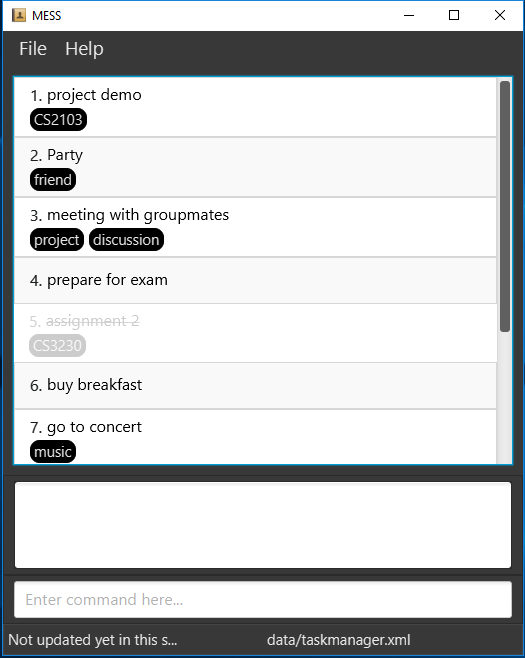
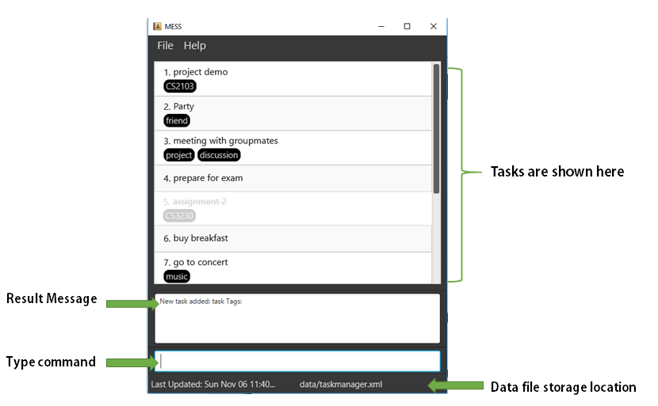
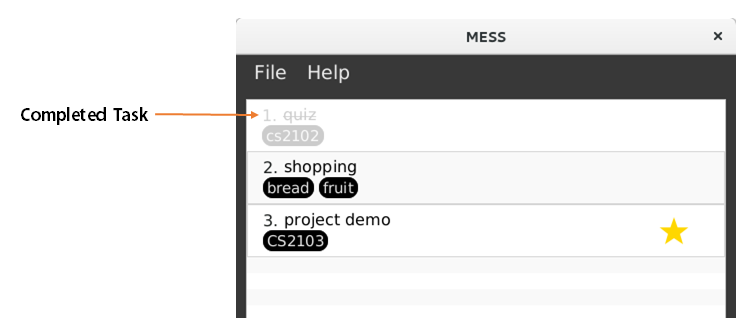
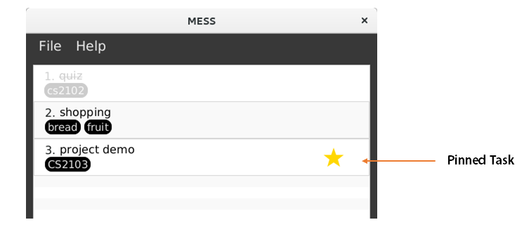

# User Guide

* [Quick Start](#quick-start)
* [Features](#features)
  * [Add](#adding-a-task-or-event-add)
  * [Alias](#aliasing-a-command-alias)
  * [Delete](#deleting-a-task--delete)
  * [Update](#update-entries--update)
  * [Complete](#marking-a-task-as-completed-complete)
  * [Uncomplete](#unmarking-a-completed-task-as-not-completed-uncomplete)
  * [Pin](#pin-a-task-as-important-pin)
  * [Unpin](#unpin-a-pinned-task-unpin)
  * [List](#listing-all-tasks--list)
  * [Find](#finding-all-tasks-and-events-containing-keyword-in-their-name--find)
  * [Find By Tags](#finding-all-tasks-by-tag-name--find)
  * [Search Box](#activate-real-time-search-searchbox)
  * [Undo](#undo-action--undo)
  * [Help](#viewing-help--help)
  * [Change-to](#change-storage-location--change-to)
  * [Exit](#exiting-the-program--exit)
* [FAQ](#faq)
* [Command Summary](#command-summary)

<!-- @@author A0153467Y -->
## Introduction

Nowadays, everyone has so many tasks to do. Have you ever missed your deadlines or forgotten your schedule? If so, MESS is here to help you! MESS is a to-do list application which reminds you of your tasks or events by showing your list of tasks on the application. No need to be afraid of forgetting your tasks anymore! You can easily use MESS through your keyboard by typing only simple and short commands. MESS can be used offline and even on your office computer. It helps you manage and organise both your tasks and your time.

Want to use MESS immediately? Let's get started!
<!-- @@author -->
## Quick Start

0. Ensure you have Java version `1.8.0_60` or later installed in your Computer. 
   > Having any Java 8 version is not enough.  
   This app will not work with earlier versions of Java 8.

1. Download the latest `MESS.jar` from the [releases](../../../releases) tab.
2. Copy the file to the folder you want to use as the home folder for your to-do list.
3. Double-click the file to start the app. The GUI should appear in a few seconds.
 

4. Type the command in the command box and press <kbd>Enter</kbd> to execute it.  
   e.g. typing **`help`** and pressing <kbd>Enter</kbd> will open the help window.
5. Some example commands you can try:
   * **`list`** : lists all tasks
   * **`add`**`CS2103 Tutorial`: adds a task named CS2103 Tutorial
   * **`alias`**`add a`: aliases the add command to the 'a' key
   * **`find`**`tutorial `: searches the task named tutorial   
   * **`delete`**`1`: delete the first task in the list
   * **`complete`** `1`: mark the first task as completed
   * **`uncomplete`** `1`: mark the completed first task on the list as not completed
   * **`update`**`1 name presentation ends tomorrow` : updates first task on the list to presentation having a deadline tomorrow while the number '1' is the index of task on the list
   * **`undo`** : undo previous one action
   * **`pin`**`1` : pin the first task in the list
   * **`unpin`**`1` : unpin the pinned first task in the list
   * **`change-to`**`data/taskmanager.xml`: change the storage location
   * **`exit`** :exit the program
6. Refer to the [Features](#features) section below for details of each command. 
7. Our UI contains different parts. The following picture introduce the UI:
 

## Features

**Command Format**
* The command is case insensitive.
* The order of parameters is fixed.
* Words in `UPPER_CASE` are the parameters.
* Words in `SQUARE_BRACKET` are optional.
<!-- @@author A0144939R -->

#### Adding a task or event: `add`
Adds a task to the to-do list 
Format: `add TASK_NAME [starts START_DATETIME ends CLOSE_DATETIME tag TAG]`

> Date format of START_DATE and CLOSE_DATE includes words like today, tomorrow, 3 days from now, day after tomorrow, noon, 12pm, 6am

> Use ISO date-time format if you wish to type exact date. e.g. 2016/9/1 represents 1st September 2016

* `TASK_NAME` need not be unique.
* If there is no argument, the task will become floating.
* `START_DATE` refer to the starting date and time of an event. For a task, the timestamp will be automatically saved as start date and time when the task is created. User can input start date and time for events.
* `TAG` is for users to write tags for different tasks. Multiple tags are available by typing `tag TAG tag TAG`.

Examples:
* `add proposal ends tomorrow`   Adds a proposal task with a deadline 24 hours from now
* `add meeting starts tomorrow 1pm ends tomorrow 3pm`  Adds a meeting event which start tomorrow at 1pm and ends tomorrow at 3pm
* `add shopping`   Adds a floating task named revision test which has not specify the start and end date
* `add tutorial tag cs2103`   Adds a floating task named tutorial with a tag CS2013
* `add quiz tag cs2102 tag easy`   Adds a floating task named tutorial with a tag CS2012 and easy
* `add test starts 9/1 2pm ends 9/1 3pm `   Adds a task starts on 1 September 2pm and ends on 1 September 3pm

#### Aliasing a command: `alias`
Aliases a command to a symbol  
Format: `alias COMMAND_NAME SYMBOL`

> Once aliased, the original command will still continue to work. Hence, symbols cannot be command names.
> One symbol can map to at most one command

* `COMMAND_NAME` Must be a valid command
* `SYMBOL` refers to the symbol you wish to alias to. SYMBOL cannot be a command name.

Examples:
* `alias add +`   Aliases the add command to the symbol +
* `alias alias q`  Aliases the alias command to the symbol q

<!-- @@author -->

#### Deleting a task : `delete`
Deletes a specific task by task index from the to-do list. 
Format: `delete INDEX`

> * INDEX refers to the number appears on the list in front the task name.

 

Examples:
* `delete 1` 
  Deletes the first task in the to-do list.

<!-- @@author A0144939R-->
#### Update entries : `update`
Update a specific task. 
Format: `update INDEX [name TASKNAME starts STARTDATETIME ends ENDDATETIME tag TAG remove-tag TO_REMOVE_TAG]`

> * INDEX refers to the number appears on the list in front the task name.
> * The task name is optional, but needs to be preceded by name
> * The TAG here will be added to the referred task and the original tag remains. If you want to delete a tag, use `remove-tag TO_REMOVE_TAG` to delete tag by name.
> * TO_REMOVE_TAG refers to the tag (or tags) that you want to be removed by typing the tags' name that you want to delete.
> * You can choose what to update. It depends on you whether you want to update only one information or update multiple information.

Examples:
* `update 2 name shopping ends 9pm` 
   update the task name of the second task on the list to shopping and the start time to 3/10/2016 9 p.m.

* `update 1 tag cs2103` 
  add the tag of the first task on to-do list to cs2103

* `update 3 ends three hours later`  
  update the task name of the third task on the list to a deadline three hours after you type this command

* `update 2 tag family remove-tag friends`    
   add a tag family to the second task and remove the tag named friends

<!-- @@author -->

<!-- @@author A0153467Y-->
#### Marking a task as completed: `complete`
Marks a specific task by index from the to-do list. 
Format: `complete INDEX`

> * INDEX refers to the number appears on the list in front the task name.

 

Example:
* `complete 2` 
   Marks the second task on the list as completed.

#### Unmarking a completed task as not completed: `uncomplete`
Unmarks a completed specific task as not completed by index from the to-do list. 
Format: `uncomplete INDEX`

> * INDEX refers to the number appears on the list in front the task name.

Example:
* `uncomplete 2` 
   Unmarks the completed second task on the list as not completed.

#### Pin a task as important: `pin`
Pin an important task. 
Format: `pin INDEX`

> * INDEX refers to the number appears on the list in front the task name.

 

Example:
* `pin 1` 
pin the first task to show that it is an important task.

#### Unpin a pinned task: `unpin`
Unpin a previously pinned task. 
Format: `unpin INDEX`

> * INDEX refers to the number appears on the list in front the task name.

Example:
* `unpin 1` 
unpin the pinned and first task on the list.
<!-- @@author -->

#### Listing all tasks : `list`
Shows a list of tasks and events in the todo list. 
Format: `list`

#### Finding all tasks and events containing keyword in their name: `find`
Finds tasks which have names containing any of the given keywords including substring. 
Format: `find KEYWORD`

> * The search is case insensitive. e.g `meeting` will match `Meeting`
> * Substring is able to be searched. e.g. `mee` will match `meeting`
> * The order of the keywords does not matter. e.g. `Hans Bo` will match `Bo Hans`
> * Only task name is searched.
> * Tasks matching at least one keyword will be returned (i.e. `OR` search).
	e.g. `Hans` will match `Hans Bo`

Examples:
* `find meeting` 
  Returns tasks having name or substring `meeting`
* `find cs2103` 
  Returns tasks having name or substring `cs2103`

<!-- @@author A0141052Y -->
#### Finding all tasks by tag name: `find-tag`
Finds tasks that contains all given tags.
Format: `find-tag TAG_NAME`

> * The search is case sensitive e.g. `urgent` will not match `URGENT`
> * Tasks must match all keywords (i.e. `AND` search).
  e.g. `urgent task` will only match tasks with both `urgent` and `task` tags

#### Activate real time search: `searchbox`
Activates the real time search, which is located in the same input box used to input commands. 
Format: `searchbox`

> * To exit from real time search, just hit <kbd>Enter</kbd>.
> * Similar functionality to `find`

<!-- @@author -->

<!-- @@author A0153467Y-->
#### Undo action : `undo`
Undo the previous action. 
Format: `undo`

> * Will only undo `add`, `delete` and `update` actions.
<!-- @@author -->

#### Viewing help : `help`
Show the help menu. Format: `help`
> Help is also shown if you enter an incorrect command e.g. `123abc`

#### Saving the data
To-do list data are saved in the hard disk automatically after any command that changes the data. 
There is no need to save manually.

<!-- @@author A0144939R -->

#### Change storage location : `change-to`
Shows a list of tasks and events in the todo list. 
Format: `change-to NEWFILEPATH`
Example:
* `change-to data/taskmanager.xml`

<!-- @@author -->
#### Exiting the program : `exit`
Exits the program. 
Format: `exit`

<!-- @@author A0153467Y -->
## FAQ
**Q**: Can I add event which have a start date and time to my to-do list ? 

**A**: Yes, you can create an event by typing command with a start and end date. For example, you have a trip from 10/10/2016 8:00 to 13/10/2016 21:00. You can type command like this: `add trip starts 8am 10th October ends 9pm 13th October`.

**Q**: If I don't know the deadline of my task yet, can I still add my task? 

**A**: Yes, you can still add your task. You can create a floating task by only type in command `add TASK_NAME` if you don't know the deadline of your task.

 

In this example, you can see shopping is a floating task without a start time and end time.

**Q**: What can I do if I forget those commands? 

**A**: You can use the help command or click help tab on the top which will give you a list of command summary. Even if you type the wrong command format, MESS will show you the correct command hints.
<!-- @@author -->  	

## Command Summary

Command | Format  
-------- | :--------
Add | `add TASK_NAME [starts START_DATE_TIME ends CLOSE_DATE_TIME tag TAG]`
Alias | `alias add a`
Delete |`delete INDEX`
Complete | `complete INDEX`
Uncomplete | `uncomplete INDEX`
List | `list`
Find | `find KEYWORD`
Update | `update INDEX [name NAME starts START_DATE_TIME ends CLOSE_DATE_TIME tag TAG remove-tag TAG]`
Undo | `undo`
Pin | `pin INDEX`
Unpin | `unpin INDEX`
Live Search | `searchbox`
Change Storage | `change-to NEW_PATH`
Help | `help`
Exit | `exit`
