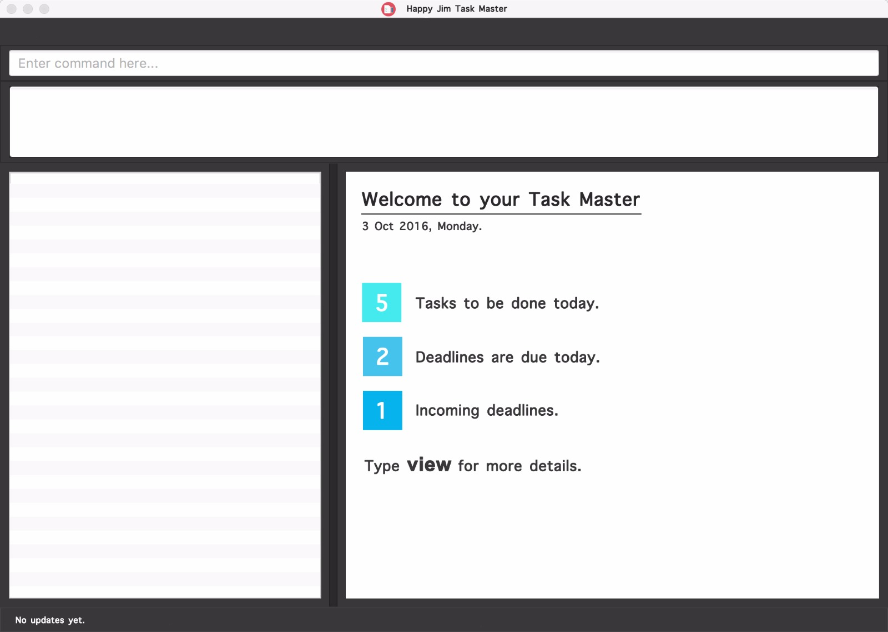
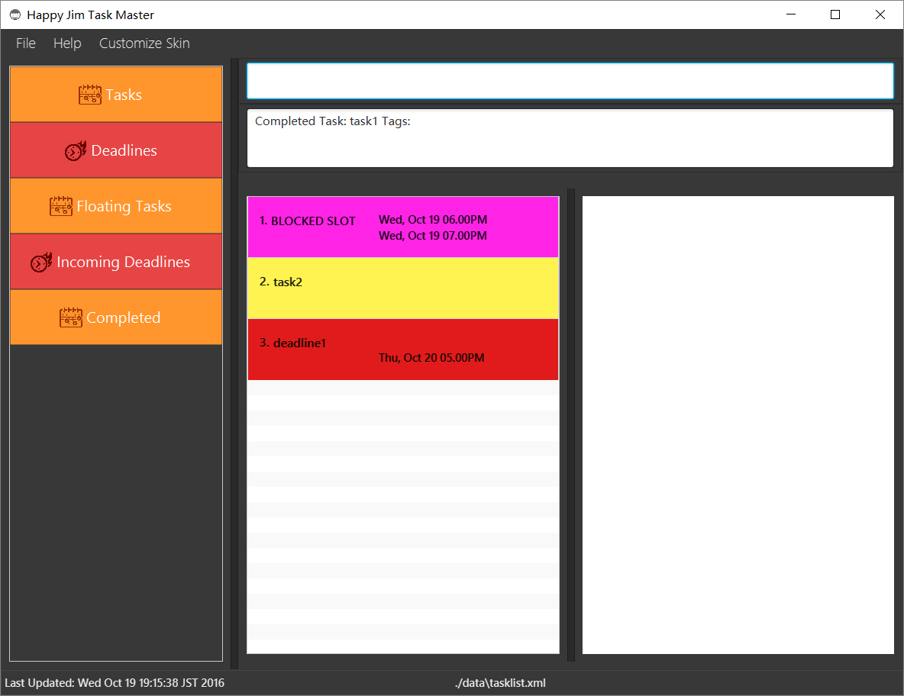
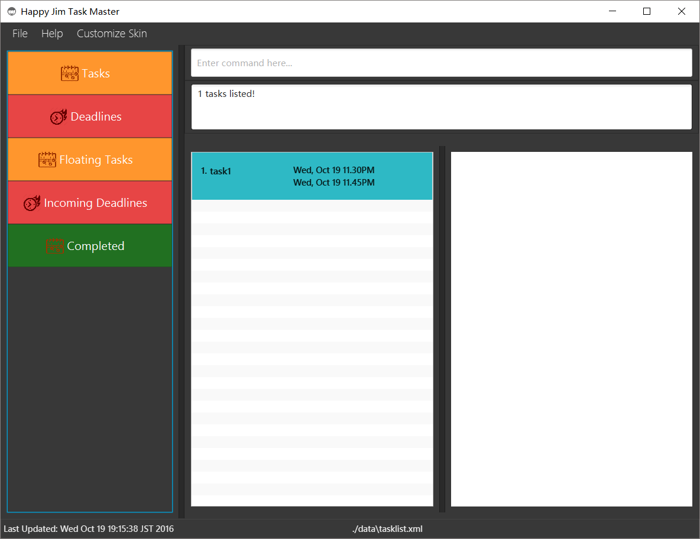
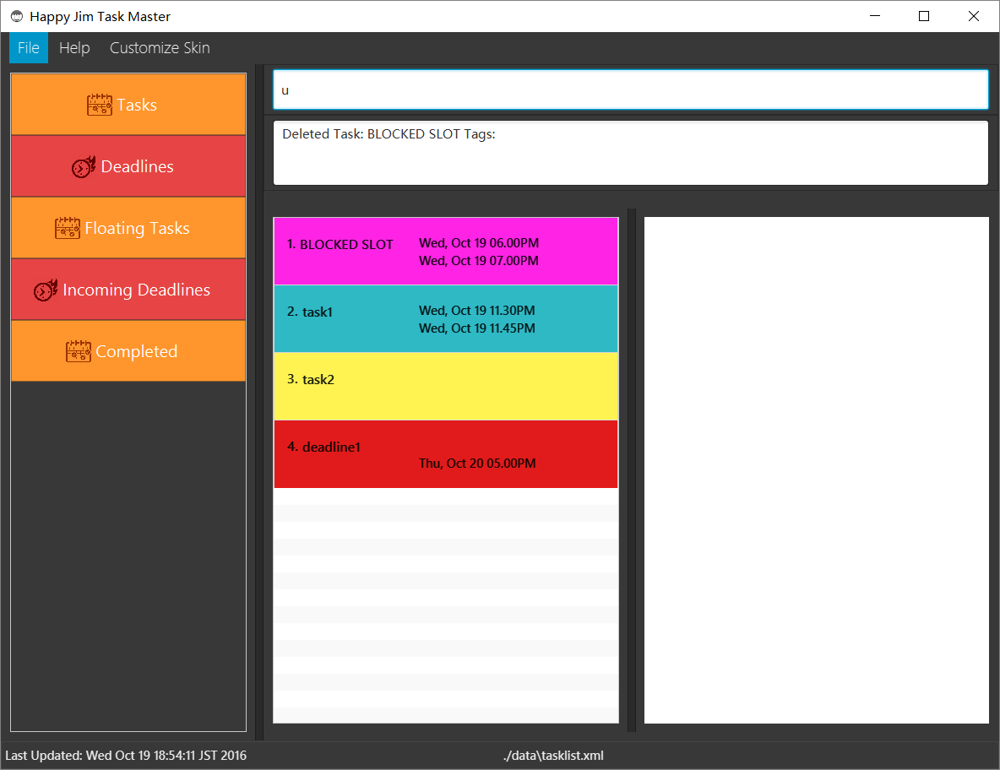
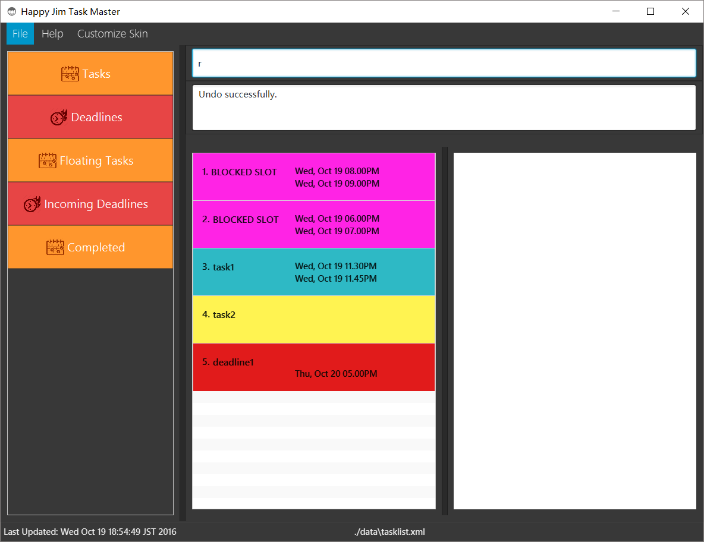
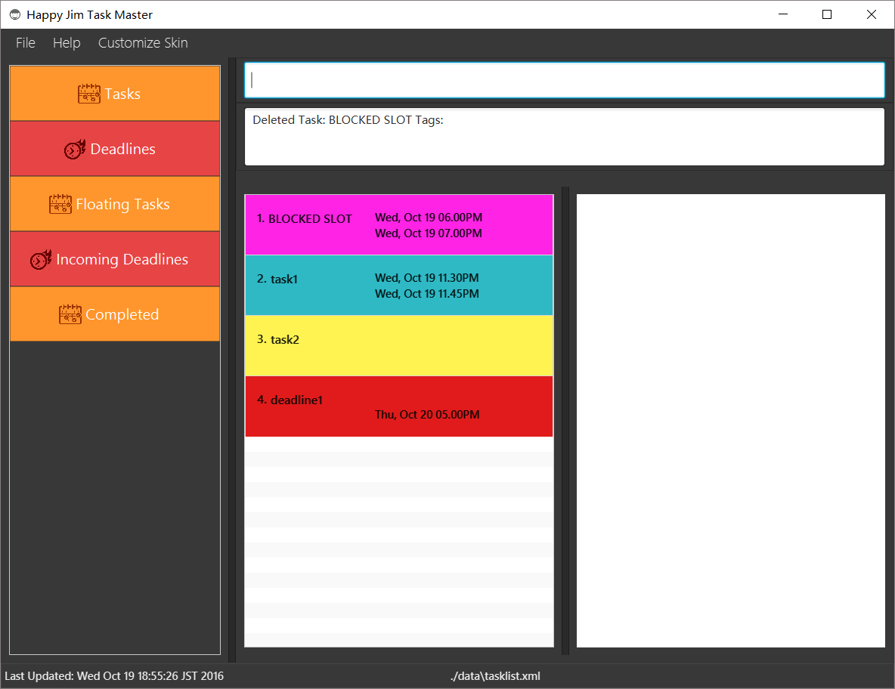
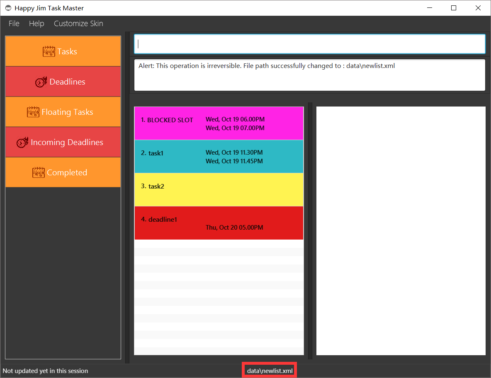

# User Guide

* [Quick Start](#quick-start)
* [Features](#features)
* [FAQ](#faq)
* [Command Summary](#command-summary)

## Quick Start

0. Ensure you have Java version `1.8.0_60` or later installed in your Computer. 
   > Having any Java 8 version is not enough.  
   This app will not work with earlier versions of Java 8.
   
1. Download the latest `happyjimtaskmanager.jar` from the [releases](../../../releases) tab.
2. Copy the file to the folder you want to use as the home folder for your Address Book.
3. Double-click the file to start the app. The GUI should appear in a few seconds. 
   > 

4. Type the command in the command box and press <kbd>Enter</kbd> to execute it.  
   e.g. typing **`help`** and pressing <kbd>Enter</kbd> will open the help window. 
5. Some example commands you can try:
   * **`view`** : View floating task of the day
   * **`add`**` Homework by 24 sep 6pm : 
     adds a task named `Homework` to the Task Master .
   * **`delete`**` 212` : deletes the task with ID 212 shown in the current list
   * **`exit`** : exits the app
6. Refer to the [Features](#features) section below for details of each command. 

## Features

> **Command Format**
> * Words in `UPPER_CASE` are the parameters.
> * Items in `SQUARE_BRACKETS` are optional.
> * Items with `...` after them can have multiple instances.
> * The order of parameters is fixed.

#### Viewing help : `help`
Format: `help`

> Help is also shown if you enter an incorrect command e.g. `abcd`

Example:
* `help` 
 
#### Adding a floating task: `add`
Adds a task to the todo list 
Format:`add TASK_NAME [t/TAG]...` 

Examples:  
* `add Homework` 
* `add Homework t/CS1231`

#### Adding a task with deadline: `add`
Format: `add TASK_NAME by DATE TIME [RECURRING_TYPE] [t/TAG]...`

> `RECURRING_TYPE` consists of daily, weekly, monthly and yearly case insensitive. 
> Tasks can have only 1 `RECURRING_TYPE`.
> If multiple `RECURRING_TYPE` are used, only the first instance will be accepted.

Examples:
* `add Homework by 24 sep 8pm t/CS1231`
* `add Homework by 24 sep 6pm daily t/CS1231`

#### Adding a task with start time and end time: `add`
Format: `add TASK_NAME from DATE TIME to DATE TIME [RECURRING_TYPE] [t/TAG]...`

> `RECURRING_TYPE` consists of daily, weekly, monthly and yearly case insensitive. 
> Tasks can have only 1 `RECURRING_TYPE`.
> If multiple `RECURRING_TYPE` are used, only the first instance will be accepted.

Examples:
* `add Homework from 24 sep 8pm to 25 sep 9pm tag/CS1231`
* `add Homework from today 8.03pm to today 8.15pm t/CS1231`

#### View floating task of the day : `view`
Format: view /OPTION

> Words in `UPPER_CASE` are the parameters, items in `SQUARE_BRACKETS` are optional, 
> OPTION currently supports f : floating

Examples: 
* `view /f`

#### View non-floating task of the day : `view`
Format: view date/DATE

> Words in `UPPER_CASE` are the parameters, items in `SQUARE_BRACKETS` are optional,

Examples: 
* `view date/2409`
* `view date/24sep`

#### Edit tasks : `edit`
Format: `edit TASK_ID [start/EDIT_START_DATE EDIT_START_TIME end/EDIT_END_DATE EDIT_END_TIME] [tag/EDIT_TAG]...`

> Words in `UPPER_CASE` are the parameters, items in `SQUARE_BRACKETS` are optional, 
> items with `...` after them can have multiple instances. Order of parameters are fixed. 
>  
> Tasks can have any number of tags (including 0)

Examples: 
* `edit 213 start/2709 1800 end/3009 1800  tag/cs2101`
* `edit 213 start/27sep 6pm end/30sep 6pm tag/cs2101`

#### Delete tasks : `delete`
Format: delete TASK_ID

> Words in `UPPER_CASE` are the parameters, items in `SQUARE_BRACKETS` are optional, 

Examples:
* `Delete 212`

#### Archive completed tasks : `done`
Format: done TASK_ID

> Words in `UPPER_CASE` are the parameters, items in `SQUARE_BRACKETS` are optional, 

Examples:
* `done 1`

   
   
   
   >Completed tasks can be viewed from navigation bar on the side.

#### Block out timeslot : `block`
Format: block from [START_DATE] START_TIME to [START_DATE] START_TIME [t/TAG]

> Words in `UPPER_CASE` are the parameters, items in `SQUARE_BRACKETS` are optional, 

Examples:
* `block from today 8pm to today 9pm`

 > 
 > 

#### Undo tasks : `undo`
Format: u

> Maximum 3 undo

Examples: 
* `u`

   
   
   

#### Redo tasks : `redo`
Format: r

> Maximum 3 redo

Examples: 
* `r`

   
   

#### Find tasks : `find`
Format: find [TASK_NAME] [date/DATE [TIME]] [tag/TAG]

> Words in `UPPER_CASE` are the parameters, items in `SQUARE_BRACKETS` are optional,

Examples:  
* `find cs2103 date/2109  `
* `find date/2109 1800 tag/gigi  `
* `find date/21sep 6pm tag/gigi`
* `find cs2103 tag/lolo`

#### Undo tasks : `clear`
Format: clear

> clears all the tasks

Examples: 
* `clear`

#### Change directory: `cd`
Format: cd FILE_PATH

> Words in `UPPER_CASE` are the parameters, items in `SQUARE_BRACKETS` are optional,

Examples: 
* `cd data\newlist.xml`

   
   

#### Exiting the program : `exit`
Exits the program. 
Format: `exit`  

## FAQ

**Q**: How do I transfer my data to another Computer? 
**A**: Install the app in the other computer and overwrite the empty data file it creates with 
       the file that contains the data of your previous Address Book folder.

**Q**: How do i get started using the task manager? 
**A**: Type 'help' or any incorrect command will bring you to the help screen.
       
## Command Summary

Command | Format  
-------- | :-------- 
Add | `add TASK_NAME [t/TAG]...`
Add | `add TASK_NAME by DATE TIME [RECURRING_TYPE] [t/TAG]...`
Add | `add TASK_NAME from DATE TIME to DATE TIME [RECURRING_TYPE] [t/TAG]...`
Edit | `edit TASK_ID [from EDIT_START_DATE EDIT_START_TIME to EDIT_END_DATE EDIT_END_TIME] [by EDIT_END_DATE EDIT_END_TIME] [t/EDIT_TAG]...`
Delete | `delete TASK_ID`
Complete | `done TASK_ID`
Block | `block TASK_NAME from [START_DATE] START_TIME to [START_DATE] START_TIME [t/TAG]...`
Redo | `r`
Undo | `u`
Find | `find [TASK_NAME] [by DATE TIME] [t/TAG]...`
Clear | `clear`
Change directory | `cd FILE_PATH`
Exit | `exit`
