# User Guide
Are you feeling stressed or overwhelmed with the number of things you have to do? Are you drowning in the pool of to-dos and confused about where to start? WhatNow is here to throw you a lifebuoy and to help you manage all your tasks.

Now that you know WhatNow is [about](../README.md), you can follow this guide to learn how to use WhatNow effectively.

Welcome to WhatNow! 

# Table of Contents
* [Quick Start](#quick-start)
* [Features](#features)
* [FAQ](#faq)
* [Command Summary](#command-summary)

## Quick Start

1. Ensure that you have Java version `1.8.0_60` or later installed in your Computer. 
   > Having any Java 8 version is not enough.  
   This app will not work with earlier versions of Java 8.
   
2. Download the latest `WhatNow.jar` from the [releases](../../../releases) tab.
3. Copy the file to the folder you want to use as the home folder for your WhatNow.
4. Double-click the file to start the app. The GUI should appear in a few seconds. 
   > 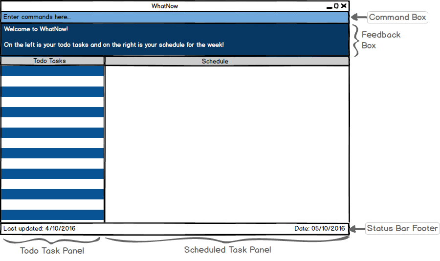 
   > Figure 1: How the GUI will look like when using WhatNow for the first time.  

5. Type a command in the command box and press <kbd>Enter</kbd> to execute it.  
   e.g. typing **`help`** then press <kbd>Enter</kbd> will open the help window. 
6. Some example commands you can try:
   * **`list`** : lists all tasks in WhatNow.
   * **`add`**` Buy groceries` : adds a task called `Buy groceries` to WhatNow.
   * **`delete`**` 3` : deletes the 3rd task shown in the current list.
   * **`exit`** : exits WhatNow.
7. Refer to the [Features](#features) section below for details of each command. 

## Features

> **Command Format**
> * Words in `UPPER_CASE` are the parameters.
> * Items in `SQUARE_BRACKETS` are optional.
> * Items with `...` after them can have multiple instances.
> * The order of parameters is fixed.

#### Changing storage location : `change`
Changes the data file storage location. This action is reversible. 
Format: `change location to PATH` 
Result: `The data storage location has been successfully changed to PATH` message will be shown in the feedback box.  

Examples:
* `change location to C:\Users\Verbena\Dropbox\WhatNow` 
Changes the data file storage location to C:\Users\Verbena\Dropbox\WhatNow 
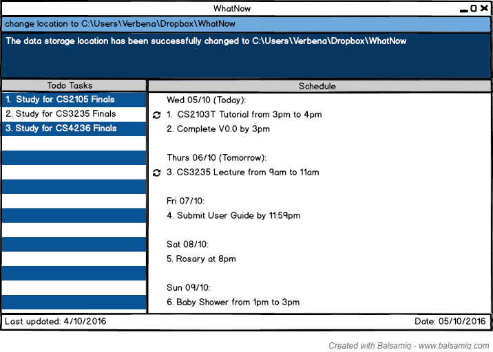 
 Figure 2: How the GUI will look like when the storage location is changed. 

#### Adding a task: `add`
Adds a task to WhatNow. This action is reversible. 
Format: `add "DESCRIPTION" [on/by] [today/tomorrow/DAY/DATE] [from/at] [START_TIME] [to/till] [END_TIME] [every] [day/week/month/year/DAY] [low/medium/high]`   
Result:`Task has been successfully added: <Task added> ` message will be shown and added task will be highlighted in the list for 3 seconds.   

> * All task description should be written within double quotation marks. 
Eg Add “buy eggs”.  
> * The format for date must be *day month year* where year is optional or dd/mm/yyyy. If no year is specified, it is assumed to be the current year. 
Eg: 10 Oct, 4 November, 11 August 2017, 12/12/2016, 2/12/2016, 12/4/2016. Not 12/12/16.  
> *  If no date is specified, it is assumed to be today. 
> * The date cannot be a date in the past.
> * Time should be in the *12 hour format*. 
Eg: 10am, 6pm, 7.30pm, 7:30pm. Not 2359.

Examples:
* `add "Buy chocolate milk"` 
Adds a Todo task “Buy chocolate milk”.
* `add "Go NTUC" every Saturday medium` 
Adds a Scheduled task “Go NTUC” of medium priority on every Saturday.
* `add "CS2103 Project" by 20/11/2016 high` 
Adds a Scheduled task “CS2103 Project” of high priority on 20 November 2016. 
* `add "Buy pizza" at 7.30pm` 
Adds a Scheduled task “Buy pizza” today at 7.30pm. 
* `add "Study CS2105" from 2pm to 6pm` 
Adds a Scheduled task “Study CS2105” today from 2pm to 6pm. 
* `add "Study CS2106" tomorrow from 2pm to 6pm` 
Adds a Scheduled task “Study CS2105” tomorrow from 2pm to 6pm. 
* `add "Charlie Puth concert” on 15 Oct 6pm"` 
Adds a Scheduled task “Charlie Puth concert” on 15 October at 6pm.
* `add "Watch Storks movie" on 10/10 from 1pm to 3pm` 
Adds a Scheduled task “Watch Storks movie” on 10 October 2016 from 1pm to 3pm. 
* `add "Do CS2103T tutorial" on 4 Oct 2016 from 10am to 11am every week` 
Adds a recurring Scheduled task “CS2103T tutorial” on the 4 October 2016 from 10am to 11am every week. 
* `add “CS2105 Tutorial” on Thursday at 11am till 12pm every week` 
Adds a recurring Scheduled task “CS2105 Tutorial” on Thursday from 11am to 12pm.

>Tasks without date and time specified will be added to WhatNow as a Todo task and will  be displayed under the heading "Todo Tasks".
> 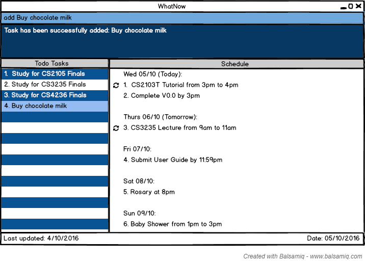 
> Figure 3: How the GUI will look like when a task without date and time specified is added under Todo tasks.    

>Tasks with date and time specified will be added to WhatNow as a Scheduled task and will  be displayed under the heading "Schedule".  
> 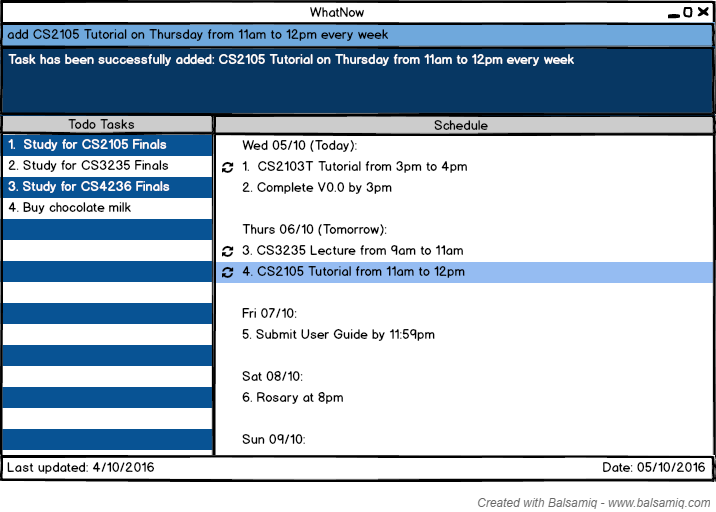 
> Figure 4: How the GUI will look like when a task with date and time specified is added under Scheduled tasks.    

#### Listing all tasks: `list`
Shows a list of all tasks that match task type, date, time and priority requested by you. 
Format: `list [todo/schedule/done/all] [on/at/with] [DATE/TIME/PRIORITY]` 
Result: `Listing all <todo/schedule/completed> tasks on/at/with <DATE/TIME/PRIORITY>` message will be shown in the feedback box.  

> * If no task type(todo/schedule/done) is stated, then all tasks that are not done will be displayed. 
> * The format for date must be *day month year* where year is optional or dd/mm/yyyy. If no year is specified, it is assumed to be the current year. 
Eg: 10 Oct, 4 November, 11 August 2017, 12/12/2016, 2/12/2016, 12/4/2016. Not 12/12/16.  
> *  If no date is specified, it is assumed to be today. 
> * The date cannot be a date in the past.
> * Time should be in the *12 hour format*. 
Eg: 10am, 6pm, 7.30pm, 7:30pm. Not 2359.
> * The format for priority should have the word `priority` after low/medium/high 
> *A task type must be stated if you want to filter by date/time/priority. 

Examples: 
* `list` 
Returns a list of all tasks that are not done.  
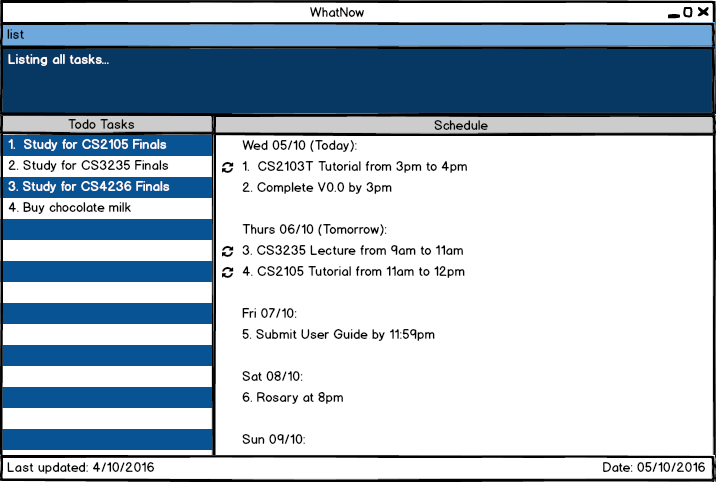 
Figure 5: How the GUI will look like when all tasks that are not done are listed. 
* `list all` 
 Returns a list of all incomplete and completed tasks.  
* `list done` 
 Returns a list of all Completed tasks.  
* `list todo` 
Returns a list of all Todo tasks.  
* `list todo with medium priority` 
Returns a list of all Todo tasks that have a medium priority.  
* `list all at 6pm` 
Returns a list of all tasks scheduled at 6pm.  
* `list schedule on 3 Nov` 
Returns a list of all Scheduled tasks scheduled for 3 November of the current year.  
* `list done` 
Returns a list of all tasks previously marked done.  
* `list all` 
Returns a list of all tasks.  

>If you want to view any of the Todo tasks, Scheduled tasks or Completed tasks only, then you only  need to type in “todo”, “schedule” or “done” as the keyword after the command list.  
> 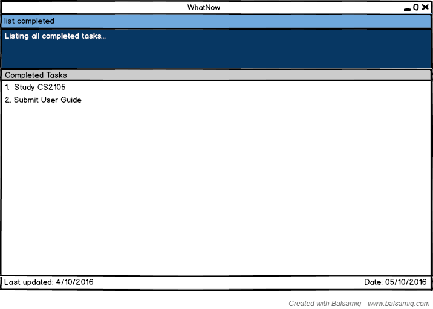 
> Figure 6: How the GUI will look like when all Completed tasks are listed. 

#### Marking a task as completed: `done`
Marks a task from WhatNow as completed. 
Format: `done todo/schedule INDEX` 
Results: `Todo/Scheduled Task INDEX has been successfully marked as done: <Task marked>` message will be shown in the feedback box. 

> * Marks the task at the specified `INDEX` from Todo task, Scheduled or Completed tasks as specified.  
> * The index refers to the index number shown in the current listing. 
> * The index **must be a positive integer** 1, 2, 3, ...

Examples:
* `done todo 1` 
  Marks the 1st Todo task from the displayed list in WhatNow as completed. 
* `done schedule 2` 
  Marks the 2nd Schedule task from the displayed list in WhatNow as completed. 
  
  

#### Deleting a task : `delete`
Deletes a task from WhatNow. This action is reversible. 
Format: `delete todo/schedule/done INDEX` 
Result: `Todo/Scheduled/Completed Task INDEX has been successfully deleted: <Task deleted>` message will be shown in the feedback box.  

> * Deletes the task at the specified `INDEX` from Todo tasks, Scheduled or Completed tasks as specified.  
> * The index refers to the index number shown in the current listing. 
> * The index **must be a positive integer** 1, 2, 3, ...

Examples: 
* `delete todo 4` 
  Deletes the 4th Todo task from the displayed list in WhatNow.  
  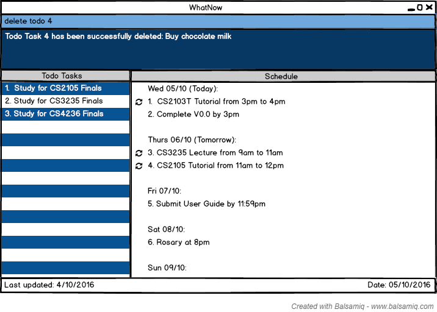 
Figure 7: How the GUI will look like after a Todo Task is deleted. 
* `delete schedule 2` 
  Deletes the 2nd Schedule task from the displayed list in WhatNow.  
  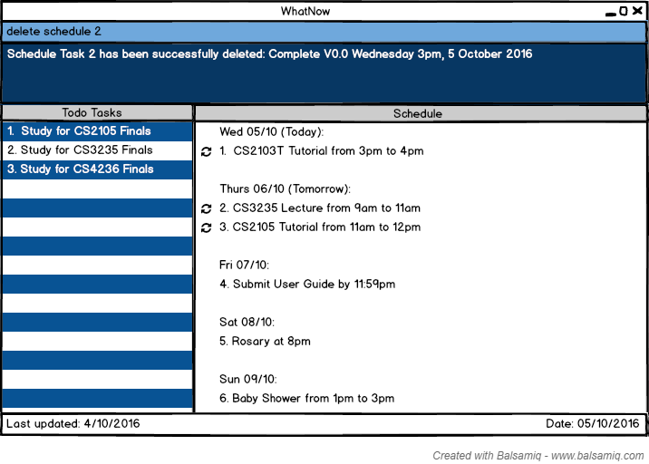 
Figure 8: How the GUI will look like after a Scheduled Task is deleted. 

#### Updating a task : `update`
Updates a task from the list displayed. This action is reversible. 
Format: `update todo/schedule INDEX description/date/start/end/priority/tag  NEW_VALUE`  
Result: ` Todo/Schedule Task INDEX has been successfully updated. 
     From: <old task>  
     To: <new task>` message will be shown in the feedback box and the updated task will be highlighted in the list for 3 seconds.   

> * Updates the description/date/start/end/status/priority/tag of the task at the specified `INDEX`  from todo tasks or schedule as specified.  
> * The index refers to the index number shown in the current listing. 
> * The index **must be a positive integer** 1, 2, 3, ...

Examples: 
* `update todo 3 description Avengers` 
   Selects the 3rd todo task from the displayed list and changes the task description to ‘Avengers’
* `update todo 4 date 11 Nov` 
   Selects the 4th todo task from the displayed list and changes the date and the type of task from todo to scheduled. 
* `update todo 4 date none` 
   Selects the 4th todo task from the displayed list and changes the date and the type of task from scheduled to todo.
* `update schedule 5 time 8:30pm` 
   Selects the 5th schedule task from the displayed list and changes the time to 8:30pm.  
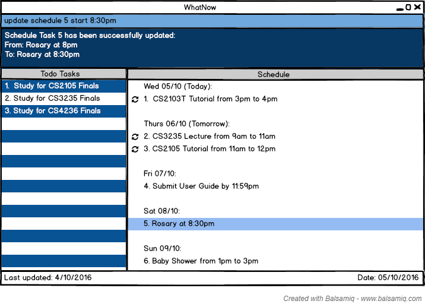  
Figure 9: How the GUI will look like after a Scheduled Task is updated. 

#### Marking a task as completed : `done`
Marks a task from WhatNow as completed. This action is reversible. 
Format: `done todo/schedule INDEX` 
Result: `Todo/Scheduled Task INDEX has been successfully marked as completed: <Task marked>` message will be shown in the feedback box.  

> * Marks the task at the specified `INDEX` from Todo tasks, or Scheduled tasks as specified.  
> * The index refers to the index number shown in the current listing. 
> * The index **must be a positive integer** 1, 2, 3, ...

Examples: 
* `done todo 4` 
  Marks the 4th Todo task from the displayed list in WhatNow as completed.  
  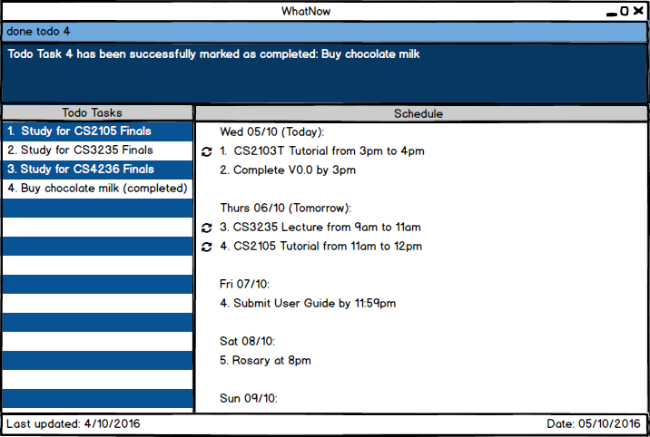 
Figure 10: How the GUI will look like after a todo task has been marked as completed. 
* `done schedule 2` 
  Marks the 2nd Schedule task from the displayed list in WhatNow as completed.  
  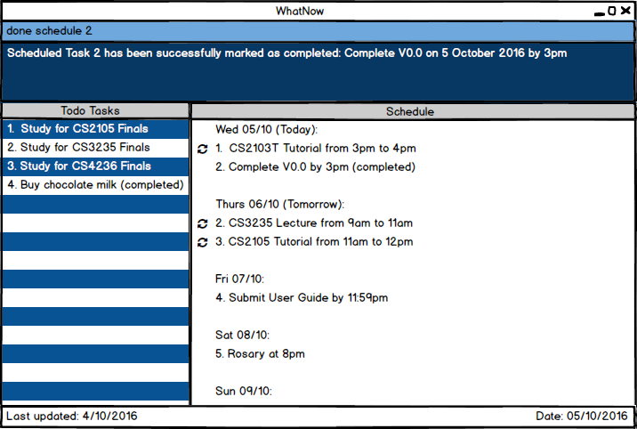 
Figure 11: How the GUI will look like after a scheduled task has been marked as completed. 

#### Undoing the previous action : `undo`
There can be multiple undos to revert to the previous state. This action is reversible. 
Format: `undo`   
Result: `Previous action has been successfully undone: <previous action> ` message will be shown in the feedback box and if the previous action was delete or update, then the task will be highlighted in the list for 3 seconds. 

Examples: 
* `undo` 
   Undo the previous action  
 
Figure 12: How the GUI will look like after an update action is undone. 

#### Redoing the previous action : `redo`
There can be multiple redos to revert to the previous state. This action is reversible. 
Format: `redo`  
Result: `Previous action has been successfully redone: <previous action> ` message will be shown in the feedback box and if the previous action was add or update, then the task will be highlighted in the list for 3 seconds. 

Examples: 
* `redo` 
   Redo the previous action  
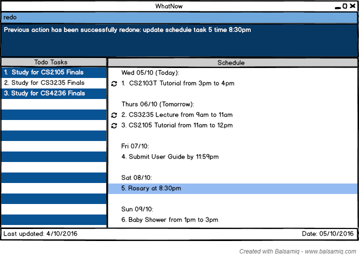  
Figure 13: How the GUI will look like after an update action is redone. 

#### Finding tasks containing any keyword in their description: `find`
Search for all tasks whose description contains any of the given keywords. 
Format: `find KEYWORD [MORE_KEYWORDS]` 
Result: `Results for `KEYWORD`: <number of matches> ` message will be shown in feedback box and the matches will be highlighted. 

> * Press <kbd>Enter</kbd> to move to the next match.
> * The search is case sensitive. e.g `Read` will not match `read`
> * The order of the keywords does not matter. e.g. `Read books` will match `books Read`
> * Only the task description is searched.
> * All task description containing the keyword will be matched .e.g. `Book` will match `Books`
> * Tasks matching at least one keyword will be returned (i.e. `OR` search).
    e.g. `Read Study` will match `Read books`

Examples: 
* `find Read` 
  Returns `Read books` but not `read`
* `find Read books lecture notes` 
  Returns any tasks having the description `Read`, `books`, `lecture` or `notes`.
* `find CS3235` 
  Returns any tasks having the description `CS3235`.  
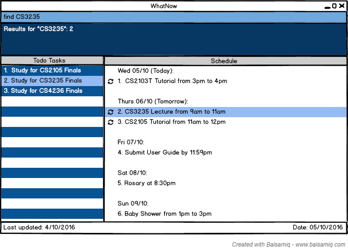 
Figure 14: How the GUI will look like after a find for the keyword. 

#### Viewing help : `help`
Displays a list of all commands.
Format: `help` 
Result: `Displaying the help page` message will be shown in the feedback box.

> Help is also shown if you enter an incorrect command e.g. `abcd`  
> 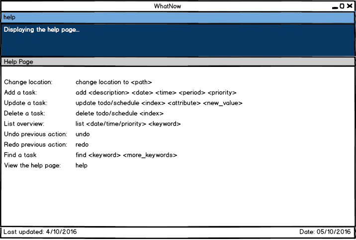 
> Figure 15: How the GUI will look like when the help page is displayed.  

#### Saving the data 
WhatNow data are saved in the hard disk automatically after any command that changes the data. 
There is no need to save manually after you make any changes or additions.

#### Clearing all tasks : `clear`
Clears all tasks from WhatNow. This action is reversible. 
Format: `clear`   
Result :`All tasks are cleared.` message will be shown in the feedback box. 

#### Exiting the program : `exit`
Exits the program. 
Format: `exit`   
Result: WhatNow will be exited.  

## FAQ

**Q**: How do I transfer my data to another Computer? 
**A**: Install the app in the other computer and overwrite the empty data file it creates with 
       the file that contains the data of your previous WhatNow folder.
       

## Command Summary

Command | Format  
-------- | :-------- 
Add | `add "DESCRIPTION" [on/by] [today/tomorrow/DAY/DATE] [from/at] [START_TIME] [to/till] [END_TIME] [every] [day/week/month/year/DAY] [low/medium/high]`
Change | `change location to PATH`
Clear | `clear`
Delete | `delete todo/schedule/done INDEX`
Done | `done todo/schedule INDEX`
Exit | `exit`
Find | `find KEYWORD [MORE_KEYWORDS]`
Help | `help`
List | `list [todo/schedule/done/all] [on/at/with] [DATE/TIME/PRIORITY]`
Redo | `redo`
Update | `update todo/schedule INDEX description/date/start/end/priority/tag NEW_VALUE`
Undo | `undo`