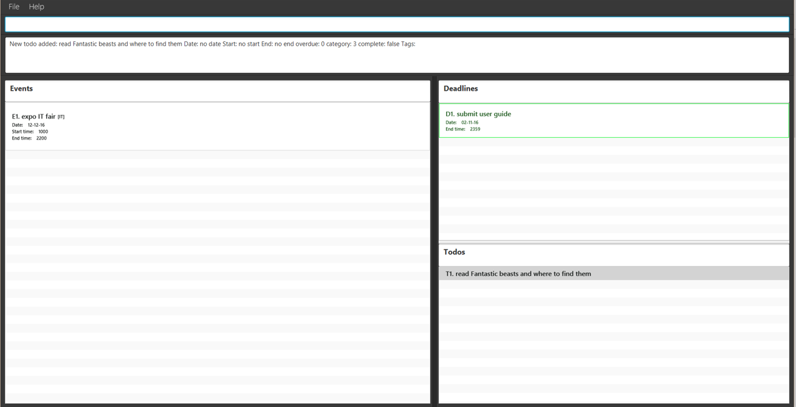

# User Guide

* [Getting Started](#getting-started)
* [Features](#features)
* [FAQ](#faq)
* [Command Summary](#command-summary)

## Introduction

Frustrated with the repetitive number of mouse clicks when using task managers? Tired of cluttered windows? Need the ability to 
easily categorise tasks? 

Welcome to Simply.

Gone are the repetitive mouse clicks other task managers require of you. With a single line command entry, you can easily create a task and categorize it as you desire. With its simple interface, gone are the cluttered windows of other task managers and tasks can be easily found at a glance.

## Getting Started

1. Ensure you have Java version `1.8.0_60` or later installed in your Computer. 
   > Having any Java 8 version is not enough.  
   This app will not work with earlier versions of Java 8.
   
2. You can download the latest `simply.jar` from the [releases](../../../releases) tab.  
3. Copy the file to the folder you want to use as the home folder for Simply.
4. Double-click the file to start the app. The GUI should appear as below in a few seconds. 
  
 

5. Type the command in the command box and press <kbd>Enter</kbd> to execute it.  
   e.g. typing **`help`** and pressing <kbd>Enter</kbd> will open the help window. 

6. Refer to the [Features](#features) section below for details of each command. 

## Features

###1 Add Command
There are three variations to the add command. You are able to choose a task to be categorized under events, deadlines or to-dos. To differentiate the formatting for these commands, refer to the secStion below.
  
####1.1 Add a to-do

To start things off, let us add a simple task with no date or time, just a simple task to be done sometime and someday.

>Format: **add** &lt;to-do description&gt; &lt;#tag&gt;

Example: add go swimming #fitness

>Note: tags are optional and multiple tags can be added to all tasks.

 
####1.2 Add a deadline

Perhaps after adding a todo, now you want to add a task with a deadline. Let's say you have to do a report by next Monday, 7pm.

>Format: **add** &lt;deadline description&gt;; &lt;date(DDMMYY)&gt;; &lt;end time&gt; &lt;#tag&gt;

Example: add complete report; 120916; 1900 #YOLO 

>Important: The date is compulsory when adding an deadline. If end time is not specified, a default of 11.59pm on the entered date is set.

 
####1.3 Add an event

Let's say you have to attend a friend's birthday party on the weekend. You know the date, the time it starts, as well as the time it ends.

>Format : **add** [&lt;event description&gt;; &lt;date(DDMMYY)&gt;; &lt;start time&gt;; &lt;end time&gt;] &lt;#tag&gt;

Example: add [Sam's birthday party; 20/12/16 ; 9pm] #birthday #rememberToBuyPresent

>Note: The start time and end time is optional when adding an event.
>Note: Time format accepted: 9pm, 9.45pm, 13:59
>Note: Date format accepted: 20/12/2016, 20/12/16, 201216

>Important: The square brackets are compulsory when adding an event.

 
####1.4 Add a tag / multiple tags to existing tasks

Now, that report due on Monday has become a very important task that you absolutely have to do. Simply type add followed by the index of the report and the tags to be added.

>Format: **add** &lt;index&gt; #tag1 #tag2

Example: Add D1 #VeryImportant #omg  

 

###2 Edit a task

When you accidentally enter the wrong details on any of your tasks, worry not. The multiple edit task functions listed below allow you to update specific task details.

>Note: Adding a start time and end time to a to-do will automatically convert your to-do into and event.

>Note: Adding a end time to a to-do will automatically convert your to-do into a deadline.

>Note: Adding a start time to a deadline will automatically convert a deadline to an event.

>Note: Add a date to a to-do will automatically convert your to-do into a deadline with a default end time of 2359 on that date.

>Note: Removing date from events and deadlines will automatically convert them into a to-do with no date or time.

>Note: Removing start time from events will automatically convert them into deadlines.

>Note: Removing end time from deadlines will automatically set the end time of the deadline to 2359. 

 
####2.1 Edit task description

Remember that birthday party previously entered? Perhaps now instead of entering Sam's birthday party, you want to change the description to Samantha's birthdday party. To do so, simply follow the command format below.

>Format: **edit** &lt;index&gt; **des** &lt;description&gt;

Example: edit E1 des Sam's birthday party

 
####2.2 Edit task date

Now, maybe the date of the birthday party you previously entered is also wrong and should be one day later instead. 

>Format: **edit** &lt;index&gt; **date** &lt;date&gt;

Example: Edit E1 date 21/12/16

>Note: If you add a date to a to-do, this will automatically convert your to-do into a deadline with a default end time of 2359 on that date.

 
####2.3 Edit task start time 

Samantha's birthday party is tomorrow and she has called to inform you that her party is starting two hours earlier at 5pm instead. To change the start time, simply type the following command.

>Format: **edit** &lt;index&gt; **start** &lt;start time&gt;

Example: edit E1 start 5pm

>Note: Adding a start time to a to-do will automatically convert your to-do into an event with a default day of today and start time as entered. 

 
####2.4 Edit task end time 

Samantha has also informed her friends that the party is scheduled to end at 11pm, so that they know when to get their parents to pick them up. To update the end time, type the following.

>Format: **edit** &lt;index&gt; **end** &lt;end time&gt;

Example: edit E1 end 2300

>Note: Adding a end time to a to-do will automatically convert your to-do into a deadline with a default date of today and end time as entered. 

 
####2.5 Edit a specific tag

You have been very busy and forgot to buy Samantha's present so you want to remind yourself that you absolutely have to buy that present tomorrow for her. 

You can do so by changing the existing rememberToBuyPresent tag to AbsolutelyRememberToBuyPresent tag.

>Format: **Edit** &lt;index&gt; **tag** &lt;old_tag&gt; ***>*** &lt;new_tag&gt;

Example: edit E1 #rememberToBuyPresent > #AbsolutelyRememberToBuyPresent
  
 
###3 Find Task by Keyword

The find by keyword command enables you to search for any events, deadlines, to-dos that have been added to Simply by partial keyword. If the searched task is not found, an error message will be shown.

> Format: **Find** &lt;keyword&gt;

Example: Find report

Only the tasks with the keyword are displayed. Keywords are NOT case sensitive.

 
###4 Marking tasks as done 

Remember that report that we added at the start? Once you have done it, simply type the command following the format below and you will never have to see it again. Unless of course you want to, then we will show you how in the later part of this user guide. 

> Format: Done &lt;index&gt;

Example: Done D1

This will hide that report that you have completed from the main screen.

You can also complete multiple tasks at once by following the format below.

> Format: Done &lt;index&gt;-&lt;index&gt;

Example : Done T1-T3

This marks the range of tasks between the first index and the second index as done while this,

> Format: Done &lt;index&gt;, &lt;index&gt;

Example: Done T1, E2, D4

marks the specified indexes as done.

 
###5 Display tasks

####5.1 Display completed tasks

Remember how we have hidden away your completed report? If you want to see it again, the following display command will display all completed tasks in their respective categories.

> Format: list done

From here, you can choose to delete these tasks. Deleting will be covered in the section after this. 

####5.2 Display all tasks

Now that you have seen, all the tasks that you have done, to return to the main default screen, simply type the following command.

> Format: list

 
###6 Delete task

####6.1 Deleting a task

The delete command enables you to delete the tasks that you no longer need.

> Format: Delete &lt;index&gt;

> Format: Delete &lt;index&gt;-&lt;index&gt;

> Format: Delete &lt;index&gt;, &lt;index&gt; 

Example: 

Delete T3

Delete T1-T3

Delete T1, T3

>Note: The delete command is flexible and allows you to delete more than 1 task at a time. If the indexes entered are separated by a hyphen (-), Simply will delete all tasks between the numbers including the numbers enter. If the indexes are separated by a comma (,) Simply will delete the tasks entered individually. 

####6.2 Deleting a tag / multiple tags

>Format: **Delete** &lt;index&gt; #tag1 #tag2

Example: Delete E1 #win #victor #finally

 
###7 Undo the Most Recent Commands

The undo command enables you to undo the most recent executed command.

> Format: Undo &lt;number of operations&gt;

Example: 

Undo

Undo 2

>Note: If no number is entered, the default number of times the command will undo is 1.

###8 Redo the Most Recent Commands

The redo command enables you to redo the most recent undone command.

> Format: Redo &lt;number of operations&gt;

Example: 

Redo

Redo 2

>Note: If no number is entered, the default number of times the command will redo is 1.

###9 Exiting the program

When you are done and wish to exit the program, simply type exit and press enter. This saves all your data and exits the program.

> Format: **Exit**

Example: Exit

 
###10 Help

Should you forget how to do any of the commands, you can simply type help in the command box and press enter.
This opens a window to the user guide where you can read more in depth into each command or just refer to the command summary for quick use.

> Format: **Help**

Example : Help

 
###11 Setting Storage Folder

If for any reason, you wish to change where your data file is being stored. Maybe so that you can synchronise that folder with online cloud storage services, you can change the folder by typing the following command.

>Format: **storage** &lt;valid file path&gt;

Example: storage C:\Users\Ronald\Documents\DummyFolder

The task manager shifts your file from the current storage folder to the newly specified one on exit.

 
## FAQ

**Q**: How do I transfer my data to another Computer? 
**A**: Install the app in the other computer and overwrite the empty data file it creates with 
       the file that contains the data of your previous Address Book folder.

 
###Command Summary

 No. | Command | Format 
 -------- | :-------- | :--------- | :-----------
1| Add event| add [event_description; date; start_time; end_time] 
2| Add deadline | add deadline_description; date; end_time  
3| Add to-do | add to-do_description 
4| Add with tags | add [event_description, date, start_time, end_time] #tag 
5| Edit | edit &lt;index&gt; &lt;new_event_description&gt; 
6| Find | find &lt;keywords&gt; 
7| Done | done &lt;index&gt;, &lt;index&gt;
8| Undo | undo &lt;number of times to undo, up to 5&gt;
9| Redo | redo &lt;number of times to redo, up to 5&gt;
10| Delete | delete &lt;index&gt;, &lt;index&gt; 
11| Exit | exit 
12| help | help 
13| list | list
14| list done| list done
15| storage| storage &lt;valid file path&gt; 
