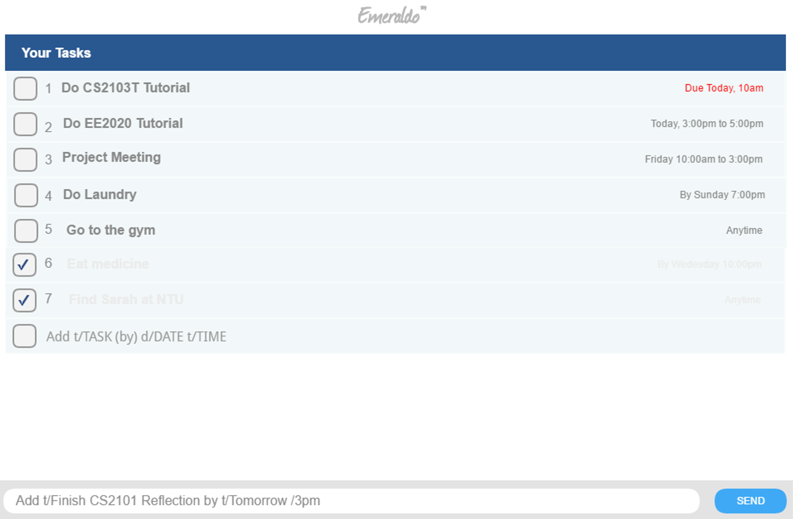
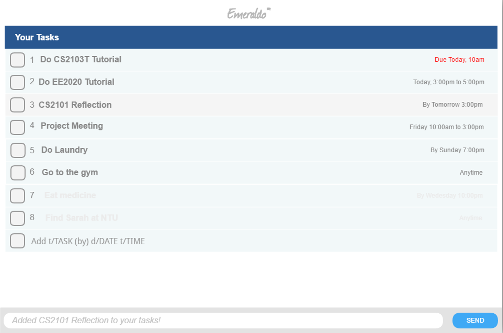

# User Guide

* [Quick Start](#quick-start)
* [Features](#features)
* [FAQ](#faq)
* [Command Summary](#command-summary)

 
## Quick Start

0. Ensure you have Java version `1.8.0_60` or later installed in your Computer. 
   > Having any Java 8 version is not enough.  
   This app will not work with earlier versions of Java 8.
   
1. Download the latest version `.jar` file from the [releases](../../../releases) tab.
2. Copy the file to the folder you want to use as the home folder for your Emeraldo
3. Double-click the file to start the app. The GUI should appear in a few seconds. 
   >  

4. Type the command in the command box and press <kbd>Enter</kbd> to execute it.  
   e.g. typing **`help`** and pressing <kbd>Enter</kbd> will open the help window. 
   
5. Refer to the [Features](#features) section below for details of each command. 

 
## Features

> **Command Format**
> * Words in `UPPER_CASE` are the parameters.
> * Items in `SQUARE_BRACKETS` are optional.
> * Items with `...` after them can have multiple instances.
> * The order of parameters is fixed.

 
#### Viewing help: `help`
Format: `help`

> Help is also shown if you enter an incorrect command e.g. `abcd`
 
 
<@@author A0139749L>
#### Adding a task: `add`
Adds a task to the Emeraldo  
Format: `add "TASK_DESCRIPTION" [on DATE] [by DEADLINE_DATE_AND_TIME] [from [START_DATE] START_TIME] [to [END_DATE] AND_TIME] [#TAGS]...`

 

Type of task to be added | Examples
-------------------------|----------
For a task with no date or time specified, only the task description is required to be specified.|`add "Do tutorial"`
For a task with a deadline, the date and time must be specified.|`add "Do tutorial" by 23 May, 2pm`
For a task with date but no time specified, it would be taken be as an all day event.|`add "Do tutorial" on 23 May`
For a scheduled task within the same day, the date, start and end time must be specified.|`add "Do tutorial" on 23 May from 2pm to 4pm`
For a scheduled task longer than a day, the date, start and end time must be specified.|`add "Do tutorial" from 23 May, 2pm to 25 May, 4pm`
For any tasks with tags, specify the tags as the last parameter.|`add "CS2103T Lecture" on 7 Oct 2016 from 2pm to 4pm #Important`

 

>Tasks can have any number of tags (including 0)

 

 
First, type a command.
 
Command will be added.

 
<@@author A0139342H>
#### Listing all tasks: `list`
Shows a list of all tasks in the Emeraldo. 
Format: `list`

 
#### Listing all tasks by categories: `list`
Shows a list of all tasks in the Emeraldo according to a stated category
Format: `list [CATEGORIES]`

> By default, tasks will be sorted in order of task, floating, event, and then by index
> Alternatively, list will be sorted by the category requested on top first, then by index.
>
> Categories can be either **Pre-defined categories** or **User-defined tags**: 
> Pre-defined categories include: today, tomorrow, priority, completed
> User-defined tags

Examples:
* `list today`
* `list tomorrow`
* `list priority`
* `list completed`
* `list USER-DEFINED TAGS`

 
<@@author A0139196U>
#### Finding all tasks containing any keyword in their title: `find`
Finds tasks whose titles contain any of the given keywords.
Format: `find KEYWORD [MORE_KEYWORDS]`

> * Finds all tasks that has the keyword in the task title, and shows in the list sorted in the one of the following order:
> * By default it will be sorted by the most keyword matches first, but the sorting can be changed
> * 1. Show the task with the most keyword matches first
> * 2. Sorted in index order
>
> * The search is not case sensitive. e.g `homework` will match `Homework`
> * The order of the keywords does not matter. e.g. `to do homework` will match `homework to do`

Examples: 
* `find homework` 
  Returns `homework/Homework/HomeWoRk`
* `find dinner meeting project` 
  Returns any task having names `dinner`, `meeting`, or `project`

 
<@@author A0142290N>
#### Editing a task: `edit`
Edits the specified task from Emeraldo. 
Format: `edit INDEX ["TASK_DESCRIPTION"] [on DATE] [by DEADLINE_DATE_AND_TIME] [from [START_DATE] START_TIME] [to [END_DATE] AND_TIME] [#TAGS]...`

> Task will be edited given the new parameter(s), and updated instantly 
> Requires at least 1 type of parameter to be passed in

Examples:
* `list` 
  `edit 3 "Order pizza, netflix & chill"` 
  Edits task description with index 3 in the list
* `find KEYWORDS` 
  `edit 1 by 10/11/2016`  
  Edits task dateline with index 1 in the list

 
<@@author A0139749L>
#### Deleting a task: `delete`
Deletes the specified task from Emeraldo. 
Format: `delete INDEX`

> Task will be removed from the list

Examples: 
* `list` 
  `delete 2` 
  Deletes task with index 2 in the list
* `find KEYWORDS` 
  `delete 459` 
  Delete task with index 459 in the list

 
<@@author A0139342H>
#### Undo a command: `undo`
Undo the previous action
Format: `undo`

> Emeraldo will revert the last action done

Examples: 
* `delete 2` 
  `undo` 
  Restores task which had an index of 2 back to the list
* `add do housework` 
  `undo` 
  Deletes task of "add do housework"

 
<@@author A0139196U>
#### Mark task as complete: `completed`
Marks a task as completed as a normal tag
Format: `completed INDEX`

> Emeraldo will mark task as completed with a predefined tag "completed" 

 
<@@author A0142290N>
#### Clearing all entries: `clear`
Clears all entries from the Emeraldo in the save data. 
Format: `clear`  

 
#### Exiting the program: `exit`
Exits the program. 
Format: `exit`
<>
<@@author>

 
#### Saving the data 
Emeraldo data are saved in the hard disk automatically after any command that changes the data. 
There is no need to save manually.

> The file name must end in `.txt` for it to be acceptable to the program.
>
> When running the program inside Eclipse, you can set command line parameters before running the program.

 
## FAQ

**Q**: How do I transfer my data to another Computer? 
**A**: Install the app in the other computer and overwrite the empty data file it creates with 
       the file that contains the data of your previous Task Manager folder.

 
<@@author A0139196U>      
## Command Summary (listed in alphabetical order)

Command | Format  
-------- | :-------- 
Add | `add "TASK_DESCRIPTION" [on DATE] [by DEADLINE_DATE_AND_TIME] [from [START_DATE] START_TIME] [to [END_DATE] AND_TIME] [#TAGS]...`
Clear | `clear`
Completed | `completed INDEX`
Delete | `delete INDEX`
Edit | `edit INDEX ["TASK_DESCRIPTION"] [on DATE] [by DEADLINE_DATE_AND_TIME] [from [START_DATE] START_TIME] [to [END_DATE] AND_TIME] [#TAGS]...`
Exit | `exit`
Find | `find KEYWORD [MORE_KEYWORDS]`
Help | `help`
List | `list [CATEGORIES]`
Undo | `undo`

