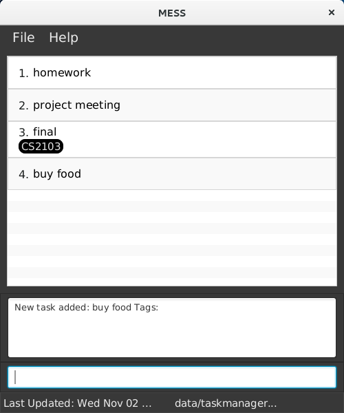
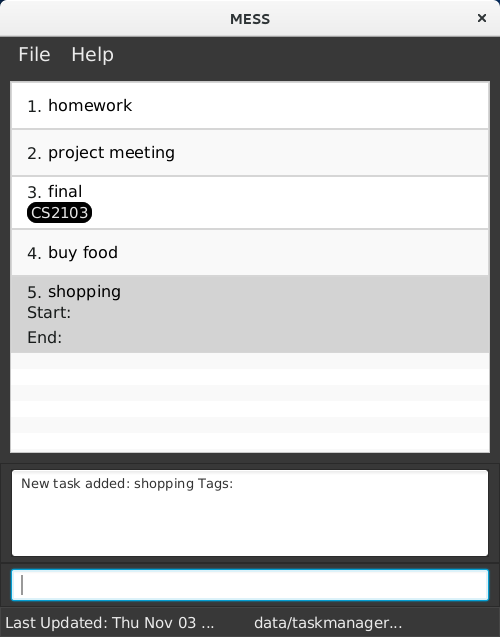

# User Guide

* [Quick Start](#quick-start)
* [Features](#features)
* [FAQ](#FAQ)
* [Command Summary](#command-summary)

## Quick Start

0. Ensure you have Java version `1.8.0_60` or later installed in your Computer. 
   > Having any Java 8 version is not enough.  
   This app will not work with earlier versions of Java 8.
   
1. Download the latest `MESS.jar` from the [releases](../../../releases) tab.
2. Copy the file to the folder you want to use as the home folder for your to-do list.
3. Double-click the file to start the app. The GUI should appear in a few seconds.
    

4. Type the command in the command box and press <kbd>Enter</kbd> to execute it.  
   e.g. typing **`help`** and pressing <kbd>Enter</kbd> will open the help window.
5. Some example commands you can try:
   * **`list`** : lists all tasks
   * **`add`**`meeting`: adds a task named CS2103 Tutorial
   * **`find`**`meeting `: searches the task named tutorial   
   * **`delete`**`presentation`: delete a task named Quiz
   * **`update`**`presentation ddate/10/10/2016:1200` : updates presentation to have a deadline on 10/10/2016 on 12:00
   * **`undo`** : undo previous action
   * **`exit`** :exit the program
6. Refer to the [Features](#features) section below for details of each command. 

## Features

**Command Format**
* The command is case insensitive.
* The order of parameters is fixed.
* Words in `UPPER_CASE` are the parameters.
* Words in `SQUARE_BRACKET` are optional.
 
#### Adding a task or event: `add`
Adds a task to the to-do list 
Format: `add TASK_NAME [sdate/START_DATE:START_TIME ddate/DEADLINE_DATE:DEADLINE_TIME]`

> Date format of START_DATE and DEADLINE_DATE is DD-MM-YYYY:HHMM e.g. 01/10/2016:2100

* `TASK_NAME` must be unique.
* If there is no argument, the task will become floating.
* `START_DATE` refer to the starting date and time of an event. For a task, the timestamp will be automatically saved as start date and time when the task is created. User can input start date and time for events.
* 

Examples:
* `add proposal ddate/10-10-2016:2100`   Adds a proposal task with a deadline on 10-10-2016 at 21:00
* `add meeting sdate/01-10-2016:1300 ddate/01-10-2016:2200`  Adds a meeting event which start on 1-10-2016 at 1 p.m. and ends at 10 p.m.
* `add shopping`   Adds a floating task named revision test which has not specify the start and end date

#### Deleting a task : `delete`
Deletes a specific task with the same input task name or index from the to-do list. 
Format: `delete TASK_NAME` or `delete INDEX`

Examples:
* `delete meeting` 
  Deletes `meeting` task.
* `delete 1`
  Deletes the first task in the to-do list.

#### Listing all persons : `list`
Shows a list of tasks and events in the todo list. 
Format: `list`

#### Finding all tasks and events containing keyword in their name: `find`
Finds tasks which have names containing any of the given keywords. 
Format: `find KEYWORD`

> * The search is case insensitive. e.g `meeting` will match `Meeting`
> * The order of the keywords does not matter. e.g. `Hans Bo` will match `Bo Hans`
> * Only task name is searched.
> * Only full words will be matched e.g. `Han` will not match `Hans`
> * Tasks matching at least one keyword will be returned (i.e. `OR` search).
	e.g. `Hans` will match `Hans Bo`

Examples:
* `find meeting` 
  Returns tasks having name `meeting`

#### Update entries : `update`
Update a specific task. 
Format: `update TASK_NAME [sdate/START_DATE:START_TIME ddate/DEADLINE_DATE:DEADLINE_TIME]`

#### Undo action : `undo`
Undo the previous action. 
Format: `undo`

#### Viewing help : `help`
Show the help menu. Format: `help`
> Help is also shown if you enter an incorrect command e.g. `123abc`

#### Exiting the program : `exit`
Exits the program. 
Format: `exit`  

#### Saving the data
To-do list data are saved in the hard disk automatically after any command that changes the data. 
There is no need to save manually.

## FAQ
**Q**: Can I add event which have a start date and time to my to-do list ? 

**A**: Yes, you can create an event by typing command with a start and end date.
       For example, you have a trip from 10-10-2016 8:00 to 13-10-2016 21:00. You can type command like this: `add trip            sdate/10-10-2016:0800 ddate/13-10-2016 ddtime/21:00`.
       
**Q**: If I don't know the deadline of my task yet, can I still add my task? 

**A**: Yes, you can still add your task. You can create a floating task by only type in command `add TASK_NAME` if you don't know the deadline of your task.

>  
In this example, you can see shopping is a floating task without a start time and deadline. 
  	
## Command Summary

Command | Format  
-------- | :--------
Add | `add TASK_NAME [sdate/START_DATE:START_TIME ddate/DEADLINE_DATE:DEADLINE_TIME]`
Delete | `delete TASK_NAME`
List | `list`
Find | `find KEYWORD`
Update | `update TASK_NAME [sdate/START_DATE:START_TIME ddate/DEADLINE_DATE:DEADLINE_TIME]`
Undo | `undo`
Help | `help`
Exit | `exit`
