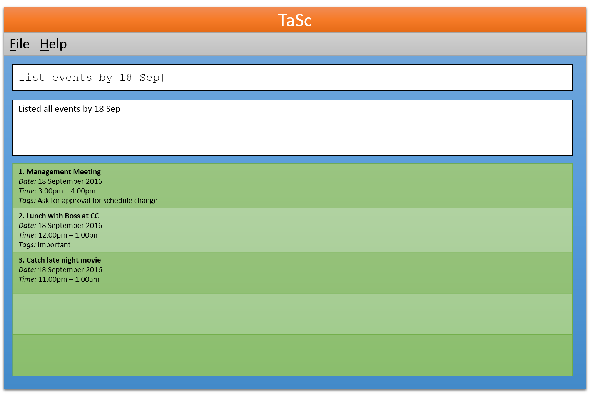
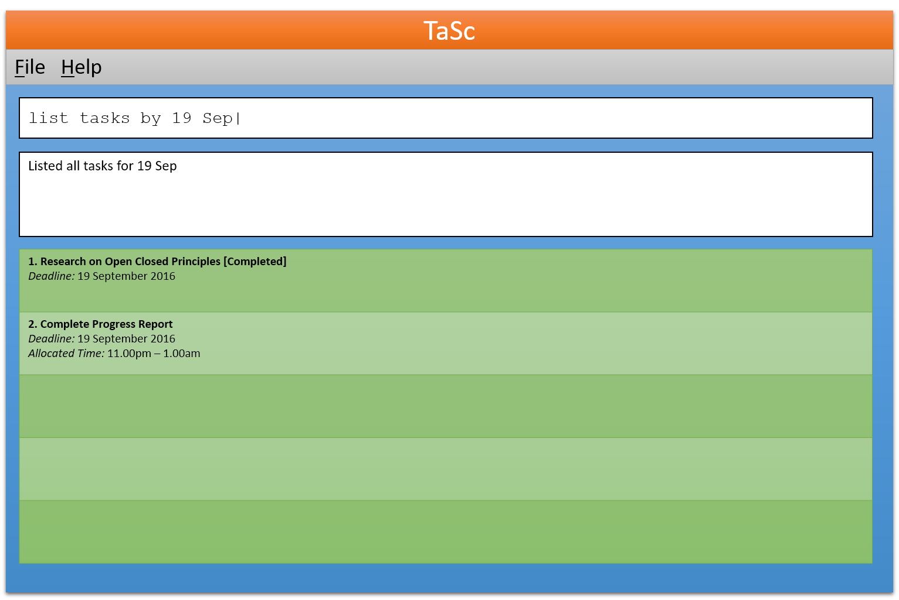
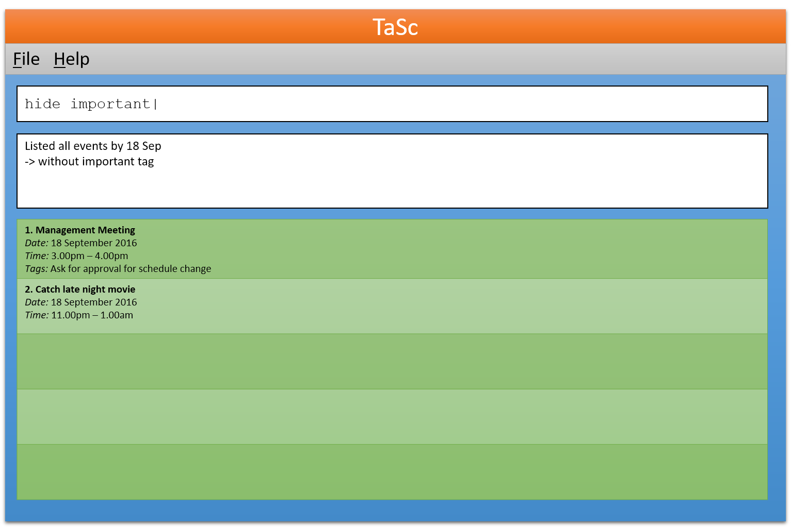
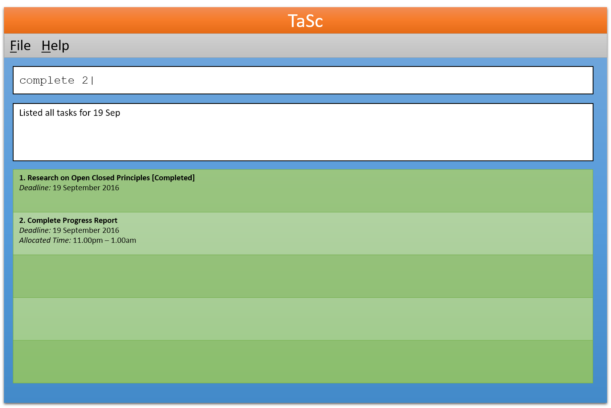

# User Guide

## Table of Contents

* [Quick Start](#quick-start)
* [Features](#features)
    * [Viewing help: `help`](#viewing-help--help)
    * [Create a new task/event: add](#create-a-new-taskevent-add)
    * [List all tasks/events with specified conditions: `list`](#list-all-tasksevents-with-specified-conditions-list)
    * [Finding tasks/events which match keywords: `find`](#finding-tasksevents-which-match-keywords-find)
    * [Show only listing results with specified tag(s) and date: `show`](#show-only-listing-results-with-specified-tags-and-date-show)
    * [Hide listing results with specified tag(s) and date: `hide`](#hide-listing-results-with-specified-tags-and-date-hide)
    * [Change the details of a task/event: `update`](#change-the-details-of-a-taskevent-update)
    * [Delete a task/event: `delete`](#delete-a-taskevent-delete)
    * [Mark a task as complete: `complete`](#mark-a-task-as-complete-complete)
    * [Undo the last action: `undo`](#undo-the-last-action-undo)
    * [Clearing all entries: `clear`](#clearing-all-entries-clear)
    * [Relocate the data storage location: `relocate`](#relocate-the-data-storage-location-relocate)
    * [Autocomplete and suggestions](#autocomplete-and-suggestions)
    * [Saving the Data](#saving-the-data)
    * [Multiple Storage Files](#multiple-storage-files)
* [FAQ](#faq)
* [Command Summary](#command-summary)

## Quick Start

0. Ensure you have Java version `1.8.0_60` or later installed in your Computer. 
   > Having any Java 8 version is not enough.  
   This app will not work with earlier versions of Java 8.
   
1. Download the latest `tasc.jar` from the [releases](../../../releases) tab.
2. Copy the file to the folder you want to use as the home folder for your TaSc.
3. Double-click the file to start the app. The GUI should appear in a few seconds. 
   > 

4. Type the command in the command box and press <kbd>Enter</kbd> to execute it.  
   e.g. typing **`help`** and pressing <kbd>Enter</kbd> will open the help window. 
5. Some example commands you can try:
   * **`list`** : lists all uncompleted tasks and upcoming events
   * **`new`**` "Do Research" by 21 Sep 5pm` : 
     adds a new task named "Do Research" with the deadline on 21 September, 5pm
   * **`complete`**` 3` : marks the 3rd task shown in the current list as complete
   * **`exit`** : exits the app
6. Refer to the [Features](#features) section below for details of each command. 

## Features

> **Command Format**
> * Words in `UPPER_CASE` are the parameters.
> * The order of parameters does not matter.
> * Items enclosed within `[ ]` are optional.
> * Items with `...` after them can have multiple instances.
> * The use of commas `,` and full stops `.` is optional and will not affect the command.
> * Words not enclosed within `" "` are not case-sensitive.
> * For parameters relating to days, they are context-sensitive. For example, specifying "Fri" sets the date parameter as the next Friday from *today*.

> **Tasks** 
> A task will have a name, and may be categorized as follows:
> * **Floating Task** has no additional details
> * **Normal Task** has a deadline
> * **Task with Allocated Timeslot** has a deadline, starting time and ending time

> **Events** 
> Tasks may act as events in our program. Simply enter the starting and ending time
> and omit the deadline.

> **Recurring tasks and events**
> Tasks and events may be set to repeat daily/weekly/monthly,
> recurring after its deadline or end time.

>> Tasks or events which are exact duplicates are combined into one.

#### Viewing help : `help`
Format: `help`

> If you enter an invalid command (e.g `abcd`), or enter invalid parameters
> for commands, mini-help messages would be shown on the output box in the
> program instead.

#### Create a new task/event: `add`
Adds a new task or event to the task list. 
Format: `add "NAME" [by DEADLINE] [from START_TIME to END_TIME] [repeatdeadline FREQUENCY COUNT] [repeattime FREQUENCY COUNT] [tag "TAG"...]`

> Creates a new task with the name given. The particulars of the task may vary:
>	* If it is a normal task, a deadline should be set.
>	* If it is a task with allocated timeslot, a deadline, start time and end time should be set.
>	* If it is an event, the start time and end time should be set.
> The repeat frequency can be `daily`, `weekly`, or `monthly`. 
> The repeat count will represent how many times the recurrence will occur. 
> You can assign tags to it to classify them by category or by priority 
> (up to your own discretion)

Examples:
* `add "Hello World!"`
* `add "Meeting" from 21 Sep 3pm to 5pm`
* `add "Check sufficient toilet rolls" by 21 Sep 5pm, tag "Important"`
* `add "Lecture" from 7 Oct 2pm to 4pm, repeattime weekly, tag "Important"`

#### List all tasks/events with specified conditions: `list`
Displays a list of all tasks/events. 

Format: `list [TYPE] [by DEADLINE] [from START_TIME [to END_TIME]] [tag "TAG"...] [sort SORTING_ORDER]`

> * Type can be `events`, `tasks`, `completed tasks`, `completed events`, or `free time`.
> * Sorting order includes `earliest first`, `latest first` for date and time, 
> and `a-z`, `z-a` for descriptions.
> * Defaults to earliest first for later dates, and latest first for past dates
>
> If no parameters are specified, the command will show a list of uncompleted tasks
> and upcoming events.

> 
> 

Examples:
* `list` 
  If no parameters are specified, the command will show a list of uncompleted tasks
  and upcoming events.
* `list events by 18 Sep`
* `list completed tasks, tag "Important", sort earliest first`
* `list free time from 20 Sep 10am to 8pm`

#### Finding tasks/events which match keywords: `find`
Lists related tasks/events when provided with vague descriptive keywords. 
Format: `find KEYWORD...`

> Keywords are used to match description, status, tags and dates in full 
> or part thereof. 
> If a keyword/phrase is enclosed in quotation marks `" "`, only exact match is used.
>	* All matches are always case-insensitive.
> Results are shown in "intelligent order", by factors such as closest match
> and its date and time.

Examples:
* `find completed meetings John`
* `find "V0.0 deliverables"`

#### Show only listing results with specified tag(s) and date: `show`
Shows only tasks/events with specified tag(s) and date from 
the current listing results. 

Format: `show [TYPE] [on DATE] [by DEADLINE] [from START_TIME [to END_TIME]] [tag "TAG"...]`

> Can only be used when the output window is showing a list of tasks/events. 
>	* Matching results will be kept on the output window at their respective
>     positions, while other tasks/events are hidden.
>	* If the type of task/event is not specified, all types are included.
>	* If tag is not specified, all tasks/events are included.

Examples:
* `list` 
  `show tag "CS2103" "Important"`

* `list` 
  `show events on 24 Sep, tag "Important"`

* `list` 
  `show completed tasks, tag "CS2103", from 18 Sep 8am`

* `list` 
  `show tag "Meeting" by 11pm`

#### Hide listing results with specified tag(s) and date: `hide`
Hides tasks/events with specified tag(s) and date from the current listing results. 

Format: `hide [TYPE] [on DATE] [by DEADLINE] [from START_TIME [to END_TIME]] [tag "TAG"...]`

> Can only be used when the output window is showing a list of tasks/events. 
>	* Matching tasks/events will be hidden from the previous results.

> 

Examples:
* `list` 
  `hide completed events from 24 Sep, tag "CS2010"`
  
* `list` 
  `hide tag "CS2103" "MA1521" "CS2010"`

#### Change the details of a task/event: `update`
Updates a task or event. 
Format: `update INDEX [name NAME] [by DEADLINE] [from START_TIME to END_TIME] [repeatdeadline FREQUENCY COUNT] [repeattime FREQUENCY COUNT] [tag "TAG"...]`

> Updates the specified task with the given information. 
> The index refers to the index number shown in the most recent listing. 
> The index **must be a positive integer** 1, 2, 3, ... 
> The repeat frequency can be `daily`, `weekly`, or `monthly`. 
> The repeat count will represent how many times the recurrence will occur. 
>
> To remove any details for the task, prefix the argument keyword with `remove`. 
> For example: `update 1 removeby` will remove the deadline.
>> `removetag` removes only the following tags enclosed in `" "`.
  
Examples: 
* `list` 
  `update 1 name "Submit Proposal" by 23 Sep 3pm.` 
  Update the details of the first task in the list. 
* `update 2 from 23 Sep 3pm to 5pm`
* `update 1 by 20 Sep 5pm, tag "Not that important"`
* `update 3 removetag "Important"`

#### Delete a task/event: `delete`
Deletes a task/event. 
Format: `delete INDEX`

> Delete a task/event. 
> The index refers to the index number shown in the most recent listing. 
> The index **must be a positive integer** 1, 2, 3, ... 

Examples:
* `list` 
  `delete 1` 
  Delete the first task in the list.

#### Mark a task as complete: `complete`
Marks a task as completed. 

Format: `complete INDEX`

> When you are done with the task, you can mark it as complete instead
> of deleting it. 
>> Marking a task as completed will also hide it from the current listing results. 
>
> The index refers to the index number shown in the most recent listing. 
> The index **must be a positive integer** 1, 2, 3, ... 

> 

Example:
* `list` 
  `complete 1` 
  Mark the first task in the list as complete.

#### Undo the last action: `undo`
To undo any last action that modifies the task database (e.g. deleting task). 
Format: `undo [last STEPS]`

> You can undo multiple steps by specifying the number of steps to undo.

Example:
* `undo` 
  Undo the most recent action.
* `undo last 5` 
  Undo the last 5 actions.

#### Clearing all entries: `clear`
Removes all tasks from the data storage file. 

Format: `clear`

> Since this is a potentially destructive action, a confirmation would be shown 
> before the tasks are removed.

#### Relocate the data storage location: `relocate`
Designates a new data storage location. 

Format: `relocate PATH`

#### Autocomplete and suggestions
Suggested command keywords, dates, sorting order, and tags are shown as you type.
Use the `tab` key to autocomplete using the suggestion.

#### Saving the Data
Changes are automatically saved after each command that changes the data.
No manual saving required.

#### Multiple Storage Files
Multiple storage files are allowed for you to store different schedules 
on different files. The file name must be passed into the program arguments 
when running the program.

## FAQ

**Q**: How do I transfer my data to another Computer? 
**A**: Install the app in the other computer and overwrite the empty data file it creates with 
       the file that contains the data of your previous TaSc folder.
       
## Command Summary

Command | Format  
-------- | :-------- 
Help | `help`
Add | `add NAME [by DEADLINE] [from START_TIME to END_TIME] [repeatdeadline FREQUENCY COUNT] [repeattime FREQUENCY COUNT] [tag "TAG"...]`
List | `list [TYPE] [by DEADLINE] [from START_TIME [to END_TIME]] [tag "TAG"...] [sort SORTING_ORDER]`
Find | `find KEYWORD...`
Show | `show [TYPE] [on DATE] [by DEADLINE] [from START_TIME [to END_TIME]]  [tag "TAG"...]`
Hide | `hide [TYPE] [on DATE] [by DEADLINE] [from START_TIME [to END_TIME]] [tag "TAG"...]`
Update | `update INDEX [name NAME] [by DEADLINE] [from START_TIME to END_TIME] [repeatdeadline FREQUENCY COUNT] [repeattime FREQUENCY COUNT] [tag "TAG"...]`
Delete | `delete INDEX`
Complete | `complete INDEX`
Undo | `undo [last STEPS]`
Clear | `clear`
Relocate | `relocate PATH`
