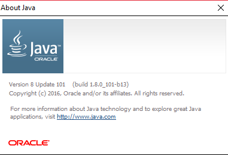

# User Guide

* [Introduction](#introduction)
* [Quick Start](#quick-start)
* [Features](#features)
* [FAQ](#faq)
* [Command Summary](#command-summary)

## INTRODUCTION

Do you feel bombarded with 'things to do' continuously? Do you keep forgetting stuff to do?  
Fear not, for you now have RubyTask!  
A Getting Things Done (GTD) Tool created by TeamRuby, to help YOU get things done!   
Benefits of RubyTask: Command Line Interface, One-shot Approach, Internet-independent!  

## QUICK START

0. Ensure you have Java version `1.8.0_60` or later installed in your computer. 
   > Having any Java 8 version is not enough.  
   This application will not work with earlier versions of Java 8.
   
1. Download the latest `RubyTask.jar` from the [releases](../../../releases) tab.
2. Copy the file to the folder you want to use as the home folder for your RubyTask application.
3. Double-click the file to start the application. The GUI should appear in a few seconds. 
   >  
*Figure 1. GUI Display*

4. Type the command in the command box and press <kbd>Enter</kbd> to execute it.  
   e.g. typing **`help`** and pressing <kbd>Enter</kbd> will open the help window. 
   > Some example commands you can try:
   > * **`list`** : lists all tasks to do
   > * **`add`** `Buy vegetables i/From the supermarket d/05102016 s/1400 e/1500 t/2 r/n` : 
     adds a task named `Buy vegetables` to RubyTask.
   > * **`delete`** `Buy vegetables` : deletes the 'Buy vegetables' task from the manager.
   > * **`exit`** : exits the application
   
5. Refer to the [Features](#features) section below for details of each command. 

## FEATURES

> **Command Format**
> * Words in `UPPER_CASE` are the parameters.
> * Items in `SQUARE_BRACKETS` are optional.
> * Items with `...` after them can have multiple instances.
> * The order of parameters is fixed.

#### Viewing help: `help`
Displays the available commands. 
Format: `help`

> Help is also shown if you enter an incorrect command e.g. `abcd`
 
#### Adding a task: `add`
Adds a task to the task manager. 
Format: `add TASK i/INFORMATION d/DATE s/START_TIME e/END_TIME t/LEVEL_OF_URGENCY_TAG r/RECUR_TAG` 

> Date format: YYYYMMDD 
> Time format: 24 hour 
> Level of Urgency tag ranges from 1 to 5 (1-Very Low Urgency, 2-Low Urgency, 3-Neutral, 4-High Urgency, 5-Very High Urgency) 
> Recur Tag takes in 'Y' for Yes, 'N' for no to recur weekly

Examples: 
* `add Buy vegetables i/From the supermarket d/05102016 s/1400 e/1500 t/2 r/n`
* `add CS2013T Tutorial i/Prepare for week 8 Tutorial d/04102016 s/2200 e/2359 t/5 r/y`

#### Listing all tasks: `list`
Shows a list of all tasks currently in the task manager. 
Format: `list`

#### Finding all tasks containing any keyword in the task name: `find`
Finds tasks which contain any of the given keywords. 
Format: `find KEYWORD [MORE_KEYWORDS]`

> * The order of the keywords does not matter. e.g. `CS2103T Tutorial` will match `Tutorial CS2103T`
> * Only the task name is searched.
> * Only full words will be matched e.g. `CS2103T` will not match `CS2103`
> * Tasks matching at least one keyword will be returned (i.e. `OR` search).
    e.g. `CS2103T` will match `CS2103T Tutorial`

Examples: 
* `find CS2130T` 
  Returns `CS2130T Tutorial` but not `CS2103 Tutorial`
* `find CS2103T CS2101 CS3235` 
  Returns any tasks having keywords `CS2103T`, `CS2101`, or `CS3235`

#### Deleting a task: `delete`
Deletes the specified task from the task manager. 
Format: `delete [TASK_NAME][TASK_ID]`

> Deletes the task at the specified `INDEX`. 
  The index refers to the index number shown in the most recent listing. 
  The index **must be a positive integer** 1, 2, 3, ...

Examples: 
* `list` 
  `delete 2` 
  Deletes the 2nd task in the address book.
* `find CS2103T`  
  `delete 1` 
  Deletes the 1st task in the results of the `find` command.

#### Updating a task: `update`
Updates the status of the task. 
Format: `update [TASK_NAME][TASK_ID] STATUS` 

> Updates task to be completed (marked done) or uncompleted after selecting a task.

Examples: 
* `list` 
  `update CS2103T Tutorial completed` 
  Updates task status of CS2103T Tutorial to 'completed'
* `find CS2103T` 
  `update 2 completed` 
  Updates task status of 2nd task in the results of CS2103T to 'completed'

#### Undoing a task: `undo`
Undoes the latest task added/deleted/updated. Irreversible. 
Format: `undo`

> Undoes ONLY the latest task added/deleted/updated.
	i.e You cannot undo tasks added 2 'adds' ago.

Examples: 
* `add Buy vegetables i/From the supermarket d/05102016 s/1400 e/1500 t/2 r/n` 
  `undo` 
  Undoes latest add command, removes 'Buy vegetables task'
* `find CS2103T`  
  `delete 1` 
  `undo` 
  Undoes latest delete command, re-instates task 1 from CS2103T.

#### Viewing all 'To Do' tasks: `todo`
Shows a list of tasks yet to be 'completed' in the task manager. 
Format: `todo`

#### Clearing all entries: `clear`
Clears all entries from the task manager. 
Format: `clear`  

#### Exiting the program: `exit`
Exits the program. 
Format: `exit`  

#### Saving the data 
Data is saved in the hard disk automatically after any command that changes it. 
There is no need to save manually.

## FAQ

**Q**: The application does not start even after double-clicking the JAR file? 
**A**: Please ensure that you have a Java version 1.8.0_60 or later installed in your system.

**Q**: Q: How do I check the current Java version installed on my PC? 
**A**: Press the windows (or start menu) button, and type ‘About Java’, hit enter. There will be a pop-up (as illustrated in Figure 2) indicating the current Java version on your PC. 
>  

*Figure 2. About Java pop-up*

**Q**: How do I transfer my data to another computer? 
**A**: Install the application in the other computer and overwrite the empty data file it creates with 
       the file that contains the data of your previous RubyTask folder.
	   
	   
## COMMAND SUMMARY

Command | Format  
-------- | :-------- 
Add | `add TASK i/INFORMATION d/DATE s/START_TIME e/END_TIME t/LEVEL_OF_URGENCY_TAG r/RECUR_TAG`
Clear | `clear`
Delete | `delete [TASK_NAME][TASK_ID]`
Find | `find KEYWORD [MORE_KEYWORDS]`
Help | `help`
List | `list`
ToDo | `todo`
Undo | `undo`
Update | `update [TASK_NAME][TASK_ID] STATUS`
