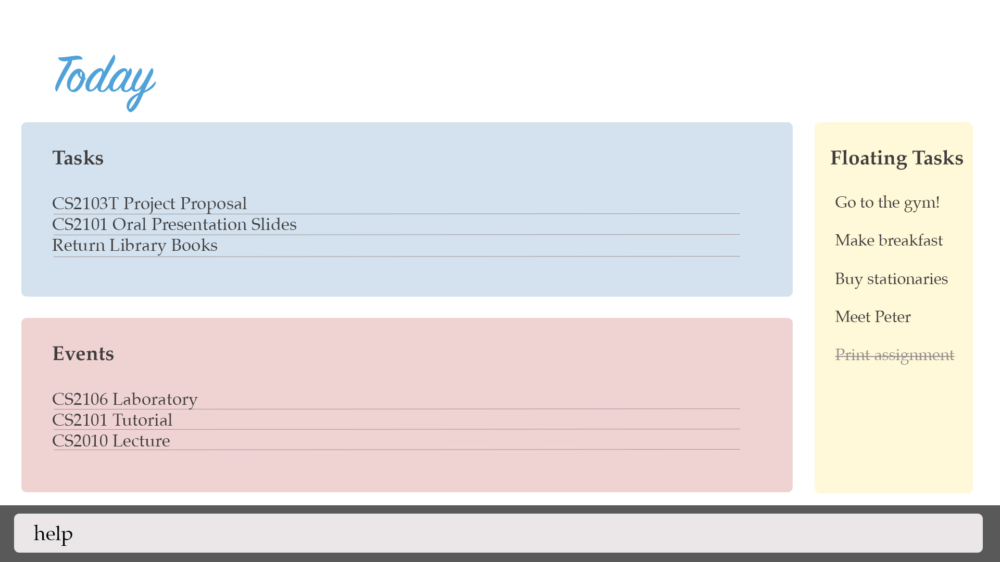

[//]: # (@@author A0146752B)

<h1>  Welcome to Menion </h1> 

# Table of Contents

* [Introduction](#introduction)
* [Quick Start](#quick-start)
* [Features](#features)
  * [Add Activity](#adding-an-activity)
  * [Delete Activities](#deleting-an-activity)
  * [List Activities](#listing-all-activities)
  * [Find Activities](#finding-all-activities-containing-any-keyword-in-their-name)
  * [Clear Activities](#clearing-all-entries)
  * [Edit Activities](#editing-an-activity)
  * [Complete Activities](#complete-an-activity)
  * [Uncomplete Activities](#uncomplete-an-activity)
  * [Undo Command](#undo)
  * [Redo Command](#redo)
  * [Modify Storage Path](#modifying-the-storage-path)
  * [Help](#viewing-help)
  * [Exit](#exiting-the-program)
* [FAQ](#faq)
* [Command Summary](#command-summary)

## Introduction
Ever felt overwhelmed from the multitude of tasks you have to complete and have no idea where to start? Are you looking for an easy to work with application to help you track all your activities? Well look no further! Your very own Menion is here to assist you!

Menion is your personal assistant that tracks all your activities and displays them in a simple to read display. It saves you the hassle of remembering what needs to be done and is able to help you prioritise your tasks.

Unlike other complicated task managers, Menion is simple and intuitive. It relies completely on the keyboard and only requires a single line of command, removing the inconvenience of clicking and navigating through multiple interfaces. It also has a flexible command interface, accepting many variations of the same command, removing the need to memorise a certain format for every command. Let's get started!
## Quick Start

1. Ensure you have Java version `1.8.0_60` or later installed in your Computer. 
   > Having any Java 8 version is not enough.  
   This app will not work with earlier versions of Java 8.
   
2. Download Menion: You can download Menion.jar from the latest release here: 
   **COMING SOON**
3. Copy the file to the folder you want to use as the home folder for  Menion.
4. Double-click the file to start the app. The GUI should appear in a few seconds. 
   > 

5. Type the command in the command box and press <kbd>Enter</kbd> to execute it.  
   e.g. typing **`help`** and pressing <kbd>Enter</kbd> will open the help window. 
6. Some example commands you can try:
   * **`list`** : lists all contacts
   * **`add`**` Assignment 2 by: TASK_DEADLINE_DATE TASK_DEADLINE_TIME n: NOTES` : 
     adds a task named `Assignment 2` to Menion.
   * **`delete`**`event 3` : deletes the 3rd event shown in the current list
   * **`exit`** : exits the app
7. Refer to the [Features](#features) section below for details of each command. 

##Features

> **Command Format** 
> Words in `UPPER_CASE` are the parameters. 
> Items in `[SQUARE_BRACKETS]` are optional. 
> Items with `...` after them can have multiple instances. 
> The order of parameters is fixed.

> **Important** (change to diagram)   
> Menion supports 3 types of Activities. Tasks, Events and Floating Tasks. 
> <li style="padding-top:1px">Task has a deadline.
> <li>Event has a starting date/time and an ending date/time.
> <li> Floating Task does not have any dates attached to it.

[//]: # (@@author A0139277U)

#### Adding an activity
Adds an activity to Menion 

Format :  
`add TASK_NAME by TASK_DEADLINE_DATE TASK_DEADLINE_TIME n:NOTES...`  
`add EVENT_NAME from EVENT_START_DATE EVENT_START_TIME to EVENT_END_DATE EVENT_END_TIME n:NOTES...` 
`add FLOATING_TASK_NAME n:NOTES...`  

> Task and event are differentiated by the input of time tag. Each activity can have any number of notes (including 0). Each note is limited to 140 characters.

Examples: 

* `add Upload CS3230 Programming Assignment 2 by: 19-08-2016 1900 n: important!`
* `add Dinner With Family from 19-08-2016 1900 to 19-08-2016 2000 n: bring flowers`
*  `add Buy lunch n: hawker food`

#### Deleting an activity
Deletes the specified activity from Menion. 
Format : `delete ACTIVITY_TYPE INDEX`

>Deletes the Activity at the specified `INDEX`. The index refers to the index number shown beside it.

The index must be a positive integer 1,2,3,...

Examples:

* `delete event 2`
* `delete task 2`

#### Listing all activities
Shows a list of all activities in Menion. 
Format : `list`

#### Listing all activities of the specified time period
Shows a list of all activities in the Menion for the specified time period: day, week, month, date. 

Format :  
`list DAY`  
`list WEEK`  
`list MONTH`  
`list DATE`  

Examples:

* `list MONDAY`
* `list WEEK`
* `list JANUARY`
* `list 12/3/2016`

#### Finding all activities containing any keyword in their name
Finds any activities whose names contain any of the given keywords. 

Format : `find KEYWORD [MORE_KEYWORDS]`
>* The search is not case sensitive. e.g. `sleep` will match `Sleep`
>* Only the name of activity is searched.
>* Only full words will be matched e.g. `sleep` will not match `sleeping`
>* Activity name matching at least one keyword will be returned (i.e `OR` search). e.g. `sleep` will match `sleep for 8 hours`

Examples:

* find `Sleep`
> Displays : [sleep n: for 8 hours]

* find `go to gym`
> Displays: [any activity having the keywords go, to, gym]

#### Clearing all entries
Clear all entries from Menion. 

Format : `clear`

[//]: # (@@author A0139164A)

#### Editing an activity
Updates a specified activity from Menion.

Format : `edit ACTIVITY_TYPE INDEX PARAMETERS`
> Edits the activity at the specified `INDEX`. The index refers to the index number shown beside the activity.  
> The input field is the same as Add command.  
> The index must be a positive integer 1,2,3, ...

Examples :

* `edit event 3 by 08-19-2016 1900`
* `edit task 4 note buy extra stuff`
* `edit task 1 name Hello World`

#### Complete an activity
Marks an activity as completed.

Format : `completed ACTIVITY_TYPE ACTIVITY_INDEX`

Example : 

* `completed event 3`

> Event 3 labeled as completed.

#### Uncomplete an activity
Marks an activity as uncompleted.

Format : `uncompleted ACTIVITY_TYPE ACTIVITY_INDEX`

Example : 

* `uncompleted event 3`

> Event 3 labeled as uncompleted.

[//]: # (@@author A0139515A)

#### Undo
Undo the most previous command.

Format : `undo`

#### Redo
Redo the most previous command.

Format : `redo`

#### Modifying the storage path
Modify the storage path that stores all the data. 

Format : `modify STORAGE_LOCATION`

Examples:

* modify storage path user/Desktop

#### Viewing help
Format : `help`

> A list of available commands and how to use them will be shown on a new window.

#### Exiting the program
Exits the program.
Format : `exit`

#### Saving the data
Menion data are saved in the hard disk automatically after any command that changes the data.
There is no need to save manually. 

## FAQ

**Q**: How do I transfer my data to another Computer? 
**A**: Install the app in the other computer and overwrite the empty data file it creates with 
       the file that contains the data of your previous Menion folder.
       
## Command Summary

Command | Format  
-------- | :-------- 
Add | `add FLOATING_TASK_NAME n:NOTES...` `add TASK_NAME by: TASK_DEADLINE_DATE TASK_DEADLINE_TIME n:NOTES...` `add EVENT_NAME from: EVENT_START_DATE EVENT_START_TIME to: EVENT_END_DATE EVENT_END_TIME n:NOTES...`
Delete | `delete ACTIVITY_TYPE INDEX`
List | `list`   `list DATE`   `list MONTH`
Clear | `clear`
Edit | `edit ACTIVITY_TYPE ACTIVITY_INDEX ACTIVITY_PARAMETER_TO_CHANGE ACTIVITY_PARAMETER_CHANGES`
Complete | `complete ACTIVITY_TYPE INDEX`
Uncomplete | `uncomplete ACTIVITY_TYPE INDEX`
Undo| `undo`
Redo | `redo`
Modify Storage Path | `modify STORAGE_LOCATION`
Help | `help`
Exit | `exit`

## GLOSSARY

* Storage Path

 - This is the directory where your data will be saved.

