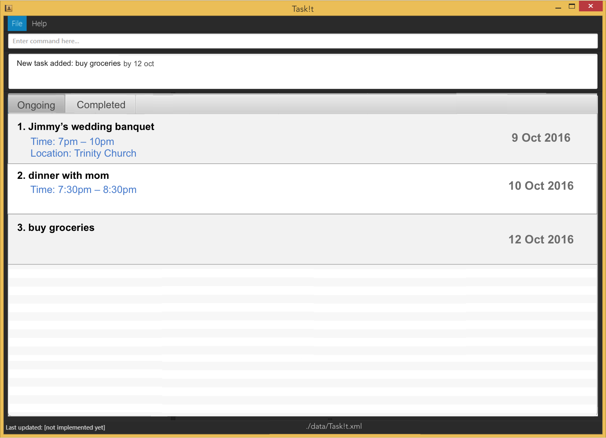

# User Guide

* [Quick Start](#quick-start)
* [Features](#features)
* [FAQ](#faq)
* [Command Summary](#command-summary)

## Quick Start

0. Ensure you have Java version `1.8.0_60` or later installed in your Computer. 
   > Having any Java 8 version is not enough.  
   This app will not work with earlier versions of Java 8.
   
1. Download the latest `Task!t.jar` from the 'releases' tab.
2. Copy the file to the folder you want to use as the home folder for your Task!t.
3. Double-click the file to start the app. The GUI should appear in a few seconds. 
   > 

4. Type the command in the command box and press <kbd>Enter</kbd> to execute it.  
   e.g. typing **`help`** and pressing <kbd>Enter</kbd> will open the help window. 
5. Some example commands you can try:
   * **`list`**` today` : lists all tasks for today
   * **`add`**` Buy milk `**`at`**` Fairprice` : 
     adds a task named `Buy milk` to the Task!t.
   * **`delete`**` 3` : deletes the 3rd task shown in the current list
   * **`exit`** : exits the app
6. Refer to the [Features](#features) section below for details of each command. 

## Features

### Viewing help : `help`
Format: **`help`**
> Help is also shown if you enter an incorrect command e.g. `abcd`
 
### Adding a task : `add`
Add a task to Task!t. 
Format: **`add`**` [task_name]` 
 
> ##### Optional parameters
> The following parameters can be appended to the add command.  
> A task can only have one of each parameter. 
> A task can only have either start/end time or deadline parameter. 

> ###### Specifying start/end time : `from ... to ...`
> This parameter is used to indicate the starting and ending datetime of a task. 
> Format: **`from`**` [datetime] `**`to`**` [datetime]` 

> > The date for **`from`** can be omitted if it is on the same ending date.  
> > [datetime] must be in the format: hh:mm dd mmm yyyy (e.g. 19:30 12 oct 2016)

> Examples:
> * **`add`**` dinner with mom `**`from`**` 19:30 02 oct 2016 `**`to`**` 20:30 02 oct 2016`
> * **`add`**` dinner with mom `**`from`**` 19:30 `**`to`**` 20:30 02 oct 2016`

> ###### Specifying deadline : `by`
> This parameter is used to indicate the deadline of a task. 
> Format: **`by`**` [datetime]` 

> > [datetime] must be in the format: hh:mm dd mmm yyyy (e.g. 19:30 12 oct 2016)

> Examples:
> * **`add`**` submit proposal `**`by`**` 23:59 02 oct 2016`

> ###### Specifying location : `at`
> This parameter is used to indicate the venue of a task. 
> Format: **`at`**` [location]` 

> Examples:
> * **`add`**` dinner with mom `**`at`**` home`

> ###### Specifying remarks : `remarks`
> This parameter is used to add remarks for the task. 
> Format: **`remarks`**` [remarks]` 

> Examples:
> * **`add`**` dinner with mom `**`remarks`**` buy flowers`

Examples:
* **`add`**` Bake cookies`
* **`add`**` Prepare meeting agenda `**`by`**` 11:00 7 oct 2016`
* **`add`**` Jimmy's wedding banquet `**`at`**` Trinity Church `**`from`**` 19:00 `**`to`**` 22:00 11 nov 2016 `

### Listing all tasks : `list`
Shows a list of all tasks in the to-do list. 
Format: **`list`**` [filter]` 
> [filters] available:  
> * today - shows the list of tasks for today's date
> * week - shows the list of tasks for this week
> * month - shows the list of tasks for the current month
> * date (e.g. 12 Oct 2016) - shows the list of tasks for the specified date

Examples:
* **`list`**` today`
* **`list`**` 12 Oct 2016`

### Finding all tasks containing any keyword in the name: `find`
Finds tasks whose names contain any of the given keywords. 
Format: **`find`**` [keywords]`

> The search is case sensitive, the order of the keywords does not matter, only the name is searched, 
and tasks matching at least one keyword will be returned (i.e. `OR` search).

Examples: 
* `find mom` 
  Returns `dinner with mom` but not `dinner with Mom`
* `find mom dad sister` 
  Returns Any task having names `mom`, `dad`, or `sister`

### Deleting a task : `delete`
Delete the specified tasks from the to-do list. 
Format: **`delete`**` [index 1,index 2,...]`

> This command is capable to deleting single and multiple tasks. For multiple tasks, the indexes are separated by a comma.  
> Deletes the task at the specified index. 
  The index refers to the index number shown in the most recent listing. 
  The index **must be a positive integer** 1, 2, 3, ...

Examples: 
* **`list`**` today` 
  **`delete`**` 2` 
  Deletes the 2nd task in the results of the **`list`** command.
* **`find`**` mom`  
  **`delete`**` 1,4` 
  Deletes the 1st and 4th tasks in the results of the **`find`** command.

### Marking task as done : `done`
Mark the tasks identified by the index numbers used in the last task listing. 
Format: **`done`**` [index 1,index 2,...]`

> This command is capable of marking single and multiple tasks. For multiple tasks, the indexes are separated by a comma.  
> Marks the tasks at the specified index. 
  The index refers to the index number shown in the most recent listing. 
  The index **must be a positive integer** 1, 2, 3, ...
  
 Examples: 
* **`list`**` today` 
  **`done`**` 2` 
  Marks the 2nd task in the results of the **`list`** command.
* **`find`**` mom`  
  **`done`**` 1,2` 
  Marks the 1st and 2nd tasks in the results of the **`find`** command.

### Editing a task : `edit`
Edits the task identified by the index number used in the last task listing. 
Format: **`edit`**` [index] [details]`

> Edits the tasks specified based on the details given. 
> [details] follows the format in **`add`** command.  
> The index refers to the index number shown in the most recent listing. 
> The index **must be a positive integer** 1, 2, 3, ...

Examples: 
* **`list`** 
  **`edit`**` 2 dinner with dad` 
  Edits the name of the the 2nd task in the results of the **`list`** command.
* **`find`**` dinner`   
  **`edit`**` 1 `**`from`**` 1830 `**`to`**` 2000 25 oct 2016 `**`at`**` popeyes` 
  Edits the time and location parameter of the 1st task in the results of the **`find`** command.

### Undoing last action performed : `undo`
Undo the last action performed in Task!t. Irreversible. 
Format: **`undo`**

### Setting the storage location : `setstorage`
Sets the location of the storage file.  
Format: **`setstorage`**` [filepath]`

> The [filepath] provided can be both absolute or relative. Data file in current storage will be moved.

Examples: 
* **`setstorage`**` ../documents/todolist`. 
* **`setstorage`**` C://user/documents/todolist`. 

### Clearing all entries : `clear`
Clears all entries from Task!t. 
Format: `clear`  

### Exiting the program : `exit`
Exits the program. 
Format: `exit`  

### Saving the data 
Task!t data are saved in the hard disk automatically after any command that changes the data. 
There is no need to save manually.

## FAQ

**Q**: How do I transfer my data to another Computer? 
**A**: Install the app in the other computer and overwrite the empty data file it creates with 
       the file that contains the data of your previous Task!t.
       
## Command Summary

Command | Format  
-------- | :-------- 
Add | **`add`**` [task_name] <optional parameters>`
Clear | **`clear`**
Delete | **`delete`**` [index 1,index 2,...]`
Done | **`done`**` [index 1,index 2,...]`
Edit | **`edit`**` [index] [details]`
Exit | **`exit`**
Find | **`find`**` [keywords]`
List | **`list`**` [filter]`
Help | **`help`**
Set storage | **`setstorage`**` [filepath]`
Undo | **`undo`**
