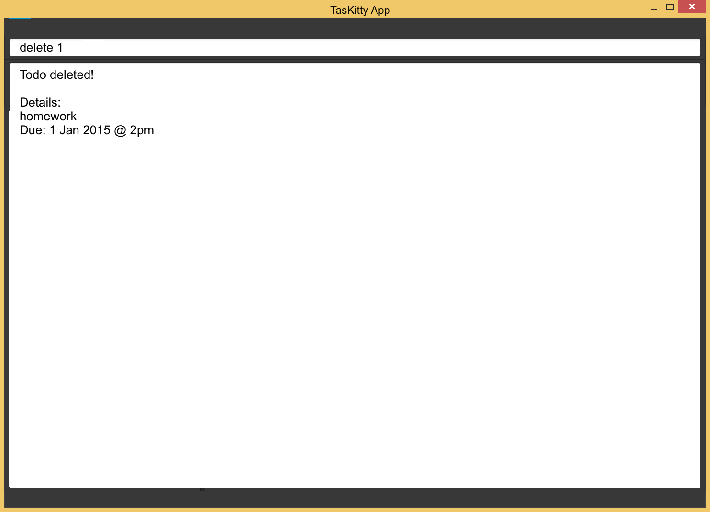
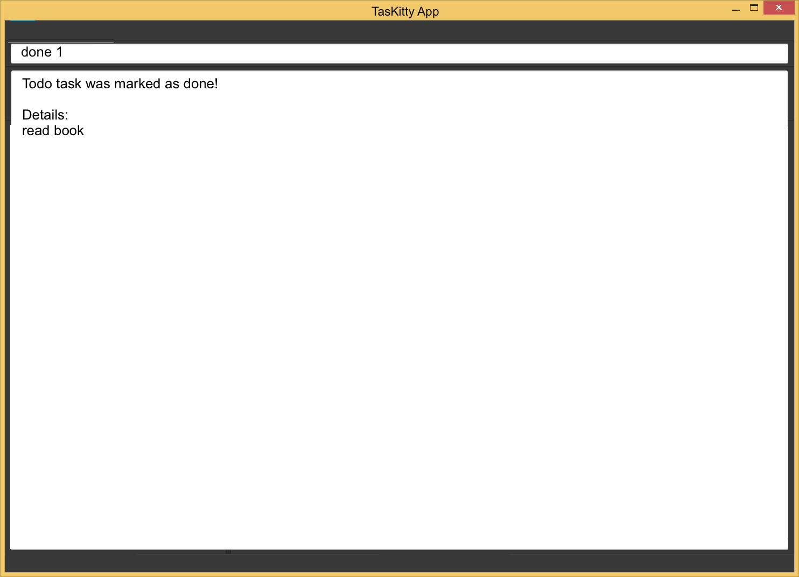
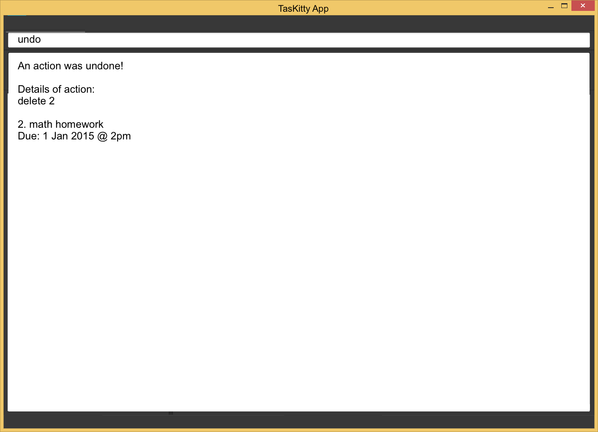

# User Guide

* [Introduction](#introduction)
* [Quick Start](#quick-start)
* [Features](#features)
* [FAQ](#faq)
* [Command Summary](#command-summary)

## Introduction

Welcome user! This user guide will provide you with all essential information required for you to make full use of our task manager, TasKitty.

TasKitty is a task manager that can help you manage events, deadlines that you have to meet, or simply tasks that you want to get done whenever you have free time.

If you are a keyboard lover and dislike clicking, then TasKitty is the right task manager for you! It boasts an intuitive command line interface with minimal clicking required, and the commands you have to type in are short and sweet. 

To get started, proceed to the Quick Start section below.

## Quick Start

0. Ensure you have Java version `1.8.0_60` or later installed in your Computer. 
   > Having any Java 8 version is not enough.  
   This app will not work with earlier versions of Java 8.
   
1. Download the latest `TasKitty.jar` from the [releases](../../../releases) tab.
2. Copy the file to the folder you want to use as the home folder for your TasKitty.
3. Double-click the file to start the app. The GUI should appear in a few seconds. 
   > 

4. Type the command in the command box and press <kbd>Enter</kbd> to execute it.  
   e.g. typing **`help`** and pressing <kbd>Enter</kbd> will open the help window. 
5. Some example commands you can try:
   * **`todo`**` read book` : adds a new task named `read book`. 
   * **`deadline`**` math homework 1 Jan 2015 2pm` : adds a new task that has the deadline `1 Jan 2015 2pm`.
   * **`view`** : lists all tasks for today.
   * **`view`**` 1 Jan 2015` : lists all tasks for specific date.
   * **`delete`**` 1` : deletes the 1st task shown in the current list of tasks.
   * **`exit`** : exits the program.
6. Refer to the [Features](#features) section below for details of each command. 

## Features

> **Command Format**
> * Words in `UPPER_CASE` are the parameters.
> * Items in `SQUARE_BRACKETS` are optional.
> * Items with `...` after them can have multiple instances.
> * The order of parameters is not fixed.

#### Viewing help : `help`
Format: `help`

> Help is also shown if you enter an incorrect command e.g. `abcd` 
> 

#### Create a new task: `todo`, `deadline` or `event`
Adds a new task to the tasks list or a new event to the event calendar. 
Todo format: `todo NAME` 
Deadline format: `deadline NAME DATE END_TIME` 
Event format: `event NAME DATE START_TIME END_TIME`

> Tasks are split into 3 categories: todo, deadline, event 
> todo: Tasks that have no specific date/time to be completed by 
> deadline: Tasks that have a specific date/time they must be completed by 
> event: Tasks that have specific start and end date/time

> DATE can accept different formats. 1 Jan 2015, 010115, 01/01/2015 are all acceptable to represent 1 Jan 2015.

> START_TIME and END_TIME can accept different formats. 3pm, 15:00, 1500 are all acceptable to represent 3pm.

Examples:
* `todo read book` 
  Adds a todo task with NAME as `read book`
  > 

* `deadline math homework 1 Jan 2015 2pm` 
  Adds a deadline task with NAME as `math homework`, DATE as `1 Jan 2015`, END_TIME as `1500`
  > 

* `event meeting 1 Jan 2015 21:00 00:00` 
  Adds an event task with NAME as `meeting`, DATE as `1 Jan 2015`, START_TIME as `2100`, END_TIME as `0000`
  > 

#### View all tasks: `view`
View all tasks for the specified date. 
Format: `view [DATE]`

> All tasks for the specified DATE will be displayed. If no date is specified, all tasks for today will be displayed.

Examples: 
* `view`
> 

* `view 1 Jan 2015`
> 

#### Find tasks: `find`
Find tasks based on keywords. 
Format: `find KEYWORDS`

>Tasks that partly or completely match the keywords entered will be displayed.

Examples:
* `find homework`
> 

#### Edit task details: `edit`
Edit a task or event already inside the task manager/ event calendar using the index of the task. 
Format: `edit INDEX [NEW_NAME] [NEW_DATE] [NEW_START_TIME] [NEW_END_TIME]`

> Format depends on the type of task being edited. When only 1 TIME is provided, it is treated as END_TIME for both deadline and event.

Examples:
* `view` 
  `edit 3 Do math homework 3pm` 
  Edit the 3rd task today. Changes the NAME to `Do math homework` and END_TIME to `1500` 
  > 

  `edit 2 22:00 00:00` 
  Edit the 2nd task today. Changes the START_TIME to `2200` and END_TIME to `0000`

#### Delete task: `delete`
Delete a task inside the task list or an event inside the calendar. 
Format: `delete INDEX`

> Delete a task at the specified INDEX. The INDEX refers to the index number shown in the most recent listing

Examples:
* `view` 
  `delete 1` 
  Delete the 1st task today as shown by the `view` command
  > 

* `view 1 Jan 2015` 
  `delete 2` 
  Delete the 2nd task on 1 Jan 2015 as shown by the `view` command

#### Mark task as done: `done`
Mark a task in the task list as done. 
Format: `done INDEX`

> Marks a task at the specified INDEX as completed. The INDEX refers to the index number shown in the most recent listing

Examples:
* `view` 
  `done 1` 
  Marks the 1st task today as shown by the `view` command as completed
  > 

#### Undo previous action: `undo`
Undo the last completed action. 
Format: `undo`

> The previous version will be restored 
> User can keep retyping undo to undo multiple actions 
> 

#### Clearing all entries : `clear`
Clears all tasks from the task manager. 
Format: `clear`  
> 

#### Exiting the program : `exit`
Exits the program. 
Format: `exit`  

#### Saving the data 
Task manager data are saved in the hard disk automatically after any command that changes the data. 
There is no need to save manually.

## FAQ

**Q**: How do I transfer my data to another Computer? 
**A**: Install the app in the other computer and overwrite the empty data file it creates with 
       the file that contains the data of your previous Address Book folder.
       
## Command Summary

Command | Format  
-------- | :-------- 
Add todo | `todo NAME`
Add deadline | `deadline NAME DATE END_TIME`
Add event | `event NAME DATE START_TIME END_TIME`
View | `view [DATE]`
Find | `find KEYWORDS`
Edit | `edit INDEX [NEW_NAME] [NEW_DATE] [NEW_START_TIME] [NEW_END_TIME]`
Delete | `delete INDEX`
Done | `done INDEX`
Undo | `undo`
Help | `help`
Clear | `clear`
Exit | `exit`
