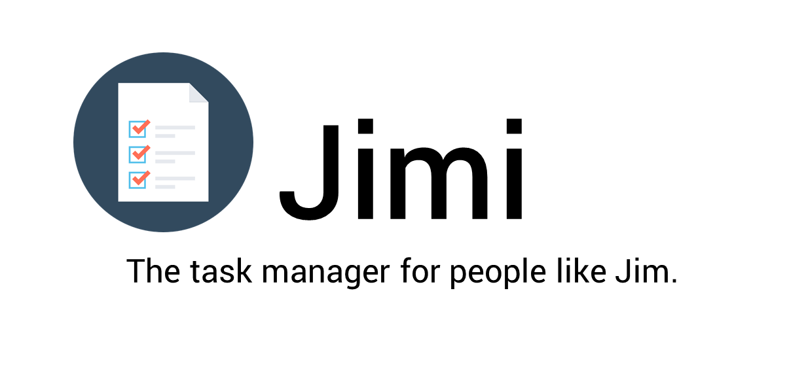
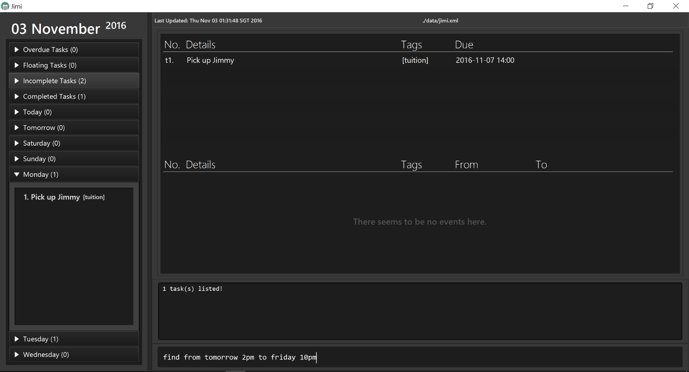

 

# User Guide

At this point, we know you are just as excited as we are [about Jimi](https://github.com/CS2103AUG2016-T09-C2/main/blob/master/README.md). But before you start throwing your money at us (even though Jimi is entirely free), you should first learn **how to use Jimi properly**. What follows should guide you on how to setup, install and use Jimi easily. 

 

## Guide Map

* [Quick Start](#quick-start)
* [Command Summary](#command-summary)
* [Features](#features)
* [FAQ](#faq)

 

## Quick Start

1. Ensure you have Java version `1.8.0_60` or later installed in your Computer. 
   > Having any Java 8 version is not enough.  
   This app will not work with earlier versions of Java 8.
   
2. Download the latest `Jimi.<version>.jar` from the [releases](../../../releases) tab.
3. Copy the file to the folder you want to use as the home folder for Jimi.
4. Double-click the file to start the app. The window should appear in a few seconds. 
> 

5. Type any command in the command box below and press <kbd>Enter</kbd> to execute it.  
   e.g. typing **`help`** and pressing <kbd>Enter</kbd> will open this user guide in another window.
6. Some example commands you can try: 
   * **`add`**` "do laundry" `**`due`**` tomorrow` : 
     adds a task named `do laundry` due `tomorrow` to Jimi.
   * **`delete`**` t1` : deletes the 1st task shown in the current task list
   * **`exit`** : exits the app
7. Refer to the [Features](#features) section below for details of each command. 

<!--- @@author A0140133B -->
###Explaining the UI

> 

Jimi's UI is simple to use and compact, everything you need is right at your fingertips, literally.  
The UI comprises four main parts:  

1. A summary panel, containing important information at a glance. To expand the drop down lists, you can either click them, or use the [`show`](#show) command.  
2. Task/event tables, here is where you would find all your tasks/events. The top table is for tasks, and the bottom for events. Changes in the tasks/events will be updated in real time here too.  
3. A console box, essentially the voice of Jimi. It displays error messages, feedback from commands, tips and so on. This is basically your babysitter through your first usage, so pay attention to what it has to offer.
4. The command line, is where you would tell Jimi what to do. Enter your single line commands with the appropriate format and let Jimi do the dirty work.

<!--- @@author -->
 
 

<!--- @@author A0148040R -->
## Command Summary
Command | Format  
-------- | :-------- 
[Help](#help) | `help [COMMAND_WORD]`
[Add](#add) | `add "TASK_DETAILS" [t/TAG] [p/PRIORITY]`
&nbsp;| `add "TASK_DETAILS" due DATE_TIME [t/TAG] [p/PRIORITY]`
&nbsp;| `add "EVENT_DETAILS" on|from START_DATE_TIME [to END_DATE_TIME] [t/TAG] [p/PRIORITY]`
[Find](#find) | `find "KEYWORD [MORE_KEYWORDS]..."`
&nbsp;| `find ["KEYWORD [MORE_KEYWORDS]..."] on|from DATE_TIME [to DATE_TIME]`
[Complete](#com)| `complete INDEX`
[Delete](#del) | `delete INDEX`
[Edit](#edit) | `edit INDEX NEW_DETAILS`
[Show](#show) | `show SECTION`
[Undo](#undo) | `undo`
[Redo](#redo) | `redo`
[SaveAs](#saveas) | `saveas NEW_DIRECTORY`
[Clear](#clear) | `clear`
[Exit](#exit) | `exit`

 

<!--- @@author A0140133B -->
### General Information About Command Format

* Commands have to follow a certain format as shown in the table above.
* Replace words in `UPPER_CASE` with your input.
* Items in `[]` are optional.
* Items followed by ellipses, `...`, means you can have multiple instances of that item.
* Items seperated by `|` simply means any of the items will work. E.g. `on|from`, typing `on` instead of `from` and vice versa are fine.
* The order of your input text is fixed. For instance, `add DATE_TIME due "TASK_DETAILS"` is invalid. 
* Some commands allow shorter command words for advanced users. Some commands, due to their critical nature e.g. `exit` or `clear`, you are required to type the full command word.
* Command words are also all case-insensitive i.e. `add` works as well as `ADD`.
* Below are accepted shortcuts of all commands.

Command | Default Command Word | Shortcuts  
-------- | :-------- | :--------
[Help](#help) | `help` | `h`, `he`, `hel`
[Add](#add) | `add` | `a`, `ad`
[Find](#find) | `find` | `f`, `fi`, `fin`
[Complete](#com) | `complete` | `c`, `co`, `com`, ... , `complet`
[Delete](#del) | `delete` | `d`, `de`, `del`, ... , `delet`
[Edit](#edit) | `edit` | `e`, `ed`, `edi`
[Show](#show) | `show` | `s`, `sh`, `sho`
[Undo](#undo)  | `undo` | `u`, `un`, `und`
[Redo](#redo) | `redo` | `r`, `re`, `red`
[SaveAs](#saveas) | `saveas` | None
[Clear](#clear) | `clear` | None
[Exit](#exit) | `exit` | None

 

**Input of Task/Event Name**
* You have to always surround task/event names with double quotation marks, `"`.
* Other than that, you can type anything within those double quotation marks.

 

**Input of Tags and Priorities**
* For tags, you can only type single words made up of numbers and letters. E.g. `t/IMPT`.
* For priorities, you can only type the following: `low`, `med`, `high`, `none`. E.g. `p/low`.
* Priorities are also case-insensitive i.e. `p/low` works just as well as `p/LOW` or `p/lOw`.
* A priority of `low` highlights your item in green; `med`, in yellow; and `high` in red.
* If you fail to specify a priority when adding an item, Jimi defaults it to `none`.
* For both, you cannot leave out the prefixes i.e. `t/` and `p/`. 

<!--- @@author -->
 
<!--- @@author A0148040R -->

**Input of Date and Time in Commands**
* The input of date and time is flexible.
* Eg:
   * Tomorrow 2pm
   * Next Monday
   * 7/11/2016
   * 1 day from now
   * tmr
   * tdy
   * next week
* You can either input date, time or both.
    * If no time is given, the current time will be used instead.
    * If no date is given, the current date will be used instead.
* However, you cannot input none of them.
* The start-date & time of the events cannot be earlier prior to the end-date & time.

<!--- @@author A0140133B -->

> * Given the nature of natural language processing, Jimi can't gurantee that it will interpret your specified date/time with 100% certainty. If it ever happens that Jimi misinterprets your dates/times, you can either [`undo`](#undo) or [`edit`](#edit) to make changes. 
> * A failsafe option, however, is to simply type proper calender dates i.e. `27 oct` or `1 feb 2pm`.

 

**Input of Index**
* In order to differentiate the indexes of the tasks and events in the command inputs:
    * Indices are case-insensitive.
    * The index of tasks should be preceded by the letter 't'.
    * The index of events should be preceded by the letter 'e'.
    * Eg:
        * complete **t1**
        * delete **e3**
    * You can't go wrong if you follow the index that's written under the `No.` column of the tables.

 
 

## Features

####  Viewing help : `help`
Teaches you how to use Jimi.  
Format: `help [COMMAND_WORD]`

Typing `help` will open this user guide in an offline version.

> 

Typing `help COMMAND_WORD` e.g. `help add`, will show help for that specific command in the console box.

> You can also type `help a`, equivalent of `help add` as all shortcuts mentioned above applies too.

<!--- @@author -->

  
<!---  @@author A0143471L -->
####  Adding a task: `add`

Adding a floating task to Jimi. 
Format: `add "TASK_DETAILS" [t/TAG] [p/PRIORITY]` 

> * Floating tasks are tasks without any deadlines.

Examples: 
* `add "Buy groceries" t/NTUC`
* `add "Visit parents" p/HIGH`

> 

 

Adds a task with a deadline to Jimi. 
Format: `add "TASK_DETAILS" due DATE_TIME [t/TAG] [p/PRIORITY]`

Examples:
* `add "Get a haircut" due Tuesday p/LOW`
* `add "Pick up Jimmy" due Monday 2pm t/tuition`

> 

 

Adds an event to Jimi. 
Format: `add "EVENT_DETAILS" on START_DATE_TIME [to END_DATE_TIME] [t/TAG] [p/PRIORITY]` 

> * If the event is more than a day long, you may include the end date_time.  
> * You may define the end time of the event if you wish. If you do not, however, Jimi will assume your event lasts till midnight of the start day.

Examples:
* `add "Attend Timmy's orchestra" on 5th July t/Timmy`
* `add "Show up for dentist appointment" on 8-7-2016 5:00pm to 7:30pm p/MED`
* `add "Have school camp" on 10 October 10am to 18 October 5pm`

> 

  

#### Finding all tasks relevant to keywords you input: `find`
Finds and lists all tasks in Jimi whose name contains any of the argument keywords. 
Format: `find "KEYWORD [MORE_KEYWORDS]"`

> * The keywords must be specified in quotes.
> * The order of the keywords you type in does not matter. e.g. `Essay writing` will match `Writing essay`
> * Task details, tags and priorities can be search. e.g. `find "high"` will cover high priority tasks too.
> * Searching takes into account typos too, to a certain extent. e.g. `find "apolet"` will match `apple`.
> * Tasks with details/tags/priorities matching at least one keyword will be returned.
    e.g. `Writing` will match `Writing essay`

Examples: 
* `find "Jimmy"`
* `find "buy attend do get"`

> 

<!-- @@author A0138915X -->
#### Finding all tasks according to the dates you specify: `find`
Finds and lists all tasks and events in Jimi whose dates matches the requirements specified. 
Format: `find ["KEYWORD [MORE_KEYWORDS]..."] on|from DATE_TIME [to DATE_TIME]`

> * You can also input just a single date to search for tasks and events relevant to that day.
> * You can search the tasks and events by dates along with keywords as well.
> * Simply append the dates to the keywords.

Examples:
* `find from tuesday to wednesday`
* `find "attend" from tomorrow to next month`

> 

  
<!-- @@author A0138915X -->

#### Marking a task as complete: `complete`
Marks an existing task as complete.  
Format: `complete TASK_INDEX`

> * Jimi will mark the task as completed at the specified `TASK_INDEX`.
> * Jimi will then move the completed task to a completed task list.
> * If you want to revert the task back as incomplete, use the [`undo`](#undo) command.

Example:
* `complete t1`

> 

  

#### Deleting a task/event: `delete`
Deletes the specified task/ event from Jimi. 
Format: `delete INDEX`

> * Jimi will delete the task specified by `INDEX`. 
> * If you need to recover your deleted task/event, use the [`undo`](#undo) command.
> * You can also delete a range of tasks/events by specifying the `to` keyword as well.

Examples: 
* `delete e2`
  Deletes the 2nd event in Jimi.
* `delete t1`
  Deletes the 1st task in the Jimi.
* `delete t1 to t5`
  Deletes the 1st task to 5th task in Jimi.

> 

  

<!--- @@author A0140133B -->
#### Editing a detail: `edit`
Edits the specified detail of any task or event.  
Format: `edit INDEX NEW_DETAILS` 

* Jimi edits the task/event specified by `INDEX`, `NEW_DETAILS` are simply the edits you want to make.  
* You can edit everything from the items name to its priority. You can leave out fields that you do not wish to edit too.  
* Although all fields are optional, they can't all be empty!
* The format of `NEW_DETAILS` that Jimi recognizes when editting:   
    * ["NEW_TASK_DETAILS"] [due NEW_DATETIME] \| [[on NEW_START_DATETIME][to NEW_END_DATETIME]] [t/NEW_TAG] [p/NEW_PRIORITY]  
* Here are some examples:

If you type | Jimi will 
:-------- | :--------
edit t1 "finish this user guide" | edit just the name of task t1.
edit t4 t/bobz | edit just the tag of task t4.
edit e2 "go to concert" to monday p/LOW | edit name, end date and priority of event e2.
edit e1 on sunday | edit the start date of event e1.
edit e6 to tmr | edit the end date of event e6.
edit t2 due 8pm | edit the deadline of task t2.
edit e9 on tmr to next monday | edit the start date and end date of event e9.

> When editting an event, you can either edit just the start date alone or the end date alone or both.
> But if you wish to convert to an event from a task, `on|from NEW_START_DATETIME` is no longer optional, as will be shown below. 

 

* Using edit, you may also convert between item types. That is, you may freely convert between floating tasks (dateless tasks), events, and deadline tasks.  
* Below is the format of `NEW_DETAILS` that Jimi recognizes when converting:  

Converting to | What to type for `NEW_DETAILS`| Examples
:-------- | :-------- | :--------
Dateless Task | dateless | `edit e1 dateless`
Tagless item | tagless | `edit t1 tagless`
No priority item | p/none | `edit t4 p/none`
Deadline Task | ["NEW_TASK_DETAILS"] due NEW_DATETIME [t/NEW_TAG] [p/NEW_PRIORITY] | `edit e3 due tomorrow p/HIGH`
Event | ["NEW_TASK_DETAILS"] on\|from NEW_START_DATETIME [to NEW_END_DATETIME] [t/NEW_TAG] [p/NEW_PRIORITY] | `edit t1 "skip CS2103 lecture" on 29 oct t/IMPT`

> * If you ever make a mistake, don't be afraid to use the [`undo`](#undo) command.  

> 

<!--- @@author -->
  
<!---  @@author A0143471L -->

#### Showing section: `show`
Expands and lists sections from the left summary panel, or displays all tasks and events.  
Format: `show SECTION`

> * `SECTION` is case-insensitive.
> * For the sections with two words, you can type just the first word of the two. <!--- @@author A0138915X-->
> * To display all tasks and events, please input `show all` as the command.

Examples:
* `show monday`
* `show completed`
* `show all`

> 
<!--- @@author -->

<!--- @@author A0143471L -->
   

#### Undoing previous action: `undo`
Undoes the previous action done in Jimi.  
Format: `undo`  
Only actions that make changes to the data of Jimi are undo-able. i.e. [`add`](#add), [`delete`](#del), [`edit`](#edit), [`clear`](#clear), [`complete`](#com) You can only undo actions done in the current session, if you exit from Jimi you cannot undo any actions done in the previous session when a new session is started.

  

#### Redoing previously undone action: `redo`
Redoes the previously undone action done in the task manager.  
Format: `redo`  
Only actions that make changes to the data of Jimi are redo-able. i.e. [`add`](#add), [`delete`](#del), [`edit`](#edit), [`clear`](#clear), [`complete`](#com)

  

<!--- @@author A0143471L -->
#### Setting save directory : `saveas`
Saves a copy of the existing storage file to a new directiory, also all future saves save to this new directory.  
Format: `saveas NEW_DIRECTORY`

> * `NEW_DIRECTORY` should be in the format: `FILE_PATH/FILE_NAME.xml`
> * **WARNING**: this command overwrites the specified .xml file in the new save directory. It does **NOT** load files from the new directory, if you wish to load files from a new directory, you would have to manually transfer the content of the .xml files over.
> * If you want to reset the save directory back to default of `<home_folder_of_installation>/data/jimi.xml`, type `saveas reset`

Example:
* `saveas Jimi_tasks.xml`

> 

  

#### Clearing all entries : `clear`
Clears all entries of tasks and events from Jimi. 
Format: `clear`  

> 

> If you want to undo your clear, use the [`undo`](#undo) command.

  

#### Exiting the program : `exit`
Exits the program. 
Format: `exit`  

> Before exiting the program, ensure you have no unwanted actions that need to be reverted.

  

#### Saving the data 
The tasks and events in Jimi are saved in your hard disk automatically if you made any changes or added any new items. 
You do not need to worry about saving the data manually.

  

<!-- @@author A0138915X -->
## FAQ

###How do I transfer my data to another Computer? 
Simply copy the data file specified by the save location to the other computer. Install the app in the other computer and then specify the location of the data file you want to load using the `saveas` command, or just overwrite the default data file with the old file.
  
###Is there a way to be notified of upcoming tasks or events that are due soon? 
Jimi will display all overdue tasks at the top Agenda box, so you will always be notified of the most important details first. To display upcoming tasks or events, do use the find command to list them.
  
###What happens if I enter a wrong command? 
Jimi will display an error message that tells you that the command you entered is incorrect.
  
###What happens if I enter an invalid format? 
Jimi will display an error message that tells you that the format for the command you entered is incorrect and will also display the correct command format required for that command.
  
###Can I still use the mouse to use Jimi's functionalities? 
As Jimi is specifically catered to use the command-line interface, support for mouse-input is limited. You can display certain sections of the summary panel by clicking on the headers with the mouse although that is pretty much what Jimi can allow you to do with the mouse.
  
###How do I see all of my completed tasks? 
You can do so by using the `show completed` command which will [`show`](#show) all of your completed tasks in the main window.
  
###Can I use this with Google Cloud or my favourite cloud service? 
As of now, Jimi does not support any online functionality. However, there are plans for the development of online cloud services integration so users can easilly access their data from multiple devices with ease.
  
###How can I delete multiple tasks/events at once? 
You can do so by using the [`delete`](#del) command follow by the range of indices of tasks or events you want to remove.
  
###Jimi misinterpreted my dates/times! Why is it so dumb?  
We apologise for the mishap. Please submit an issue to us at our [issue tracker](https://github.com/CS2103AUG2016-T09-C2/main/issues) if you would like Jimi to accept particular dates/times.  
 
Regarding your question, given the nature of natural language processing, it is physically impossible for Jimi to interpret your dates/times with a 100% certainty. Much like how Apple's Siri and Google's Google Assistant fail to recognize accents from time to time, Jimi is similar in that regard. If it ever happens that Jimi misinterprets your dates/times, you can either [`undo`](#undo) or [`edit`](#edit) to make changes.  
 
A failsafe option, however, is to simply type proper calender dates i.e. `27 oct` or `1 feb 2pm`, Jimi will never get that wrong!
  
###Why is the find command so slow sometimes?  
We are experimenting with a near-match search agorithm to help better your experience. Please bear with us as it is a non-functional requirement for now. Improving the run-time of the [`find`](#find) command is definitely an important focus of ours.
