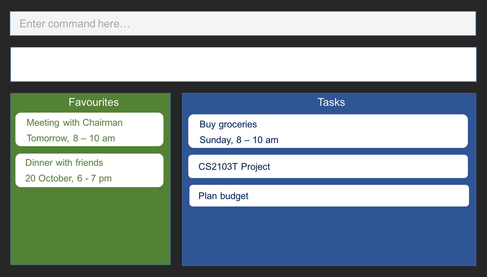

# User Guide

* [Introduction](#introduction)
* [Quick Start](#quick-start)
* [Features](#features)
* [Commands Autocomplete](#commands-autocomplete)
* [Google Integration](#google-integration)
* [FAQ](#faq)
* [Command Summary](#command-summary)

 
## Introduction
With many deadlines and tasks streaming in, you can be easily overwhelmed if you are not able to keep track of them effectively. While traditional task managers require you to interact through a graphical user interface, our task manager allows you to manage your tasks quickly through keyboard commands.

With our task manager, you can add, delete and edit tasks without a fuss. Through the usage of shortcuts, you will be able to enter your desired commands quickly. Best of all, it works with Google Calendar so any changes that you have made on either platform will be synchronized. Managing tasks has never been such a breeze.

 
## Quick Start

0. Ensure you have Java version `1.8.0_60` or later installed in your Computer. 
   > Having any Java 8 version is not enough.  
   This app will not work with earlier versions of Java 8.

1. Download the latest `taskmanager.jar` from the [releases](../../../releases) tab.
2. Copy the file to the folder you want to use as the home folder for your Task Manager.
3. Double-click the file to start the app. The GUI should appear in a few seconds.

 >  

4. Type the command in the command box and press <kbd>Enter</kbd> to execute it.  
   e.g. typing **`help`** and pressing <kbd>Enter</kbd> will open the help window.
5. Some example commands you can try:
   * **`help`** : lists all commands
   * **`add`**` Meeting, July 10, 5pm-6pm` :
     adds a `Meeting` task on `July 10, 5pm-6pm` to the Task Manager
   * **`alias`**` am add Meeting` : `am` is now a shortcut for `add Meeting`
   * **`exit`** : exits the app
6. Refer to the [Features](#features) section below for details of each command. 

 
## Features

> **Command Format**
> * Words in `UPPER_CASE` are the parameters.
> * Items with `/` imply that only one of them is chosen.
> * Items surrounded by open(`[`) and closed(`]`) square brackets are optional.
> * Items surrounded by open(`(`) and closed(`)`) brackets are grouped together.
> * The order of parameters is fixed.

#### Viewing help : `help`
Format: `help`

> Help is also shown if you enter an incorrect command e.g. `abcd`

 
#### Adding a task: `add`
Adds a task to the task manager.  
The task can be a floating task with only a description, or  
it can be a deadline task with a description and a deadline, or  
it can be an event task with a description, a start date and an end date. 
Format (floating): `add TASK`  
Format (deadline): `add TASK by DATE`  
Format (event): `add TASK from START_DATE to/- END_DATE`

> **Date Format**
> * Note that `DATE` and all other dates follow the following format:
> * 1) `DAY MONTH` or `MONTH DAY`
> * 2) `DAY MONTH YEAR` or `MONTH DAY YEAR`
> * `MONTH` should be in alphabets instead of numbers.
> * `MONTH` can either be in the long-form ('October') or the short-form ('Oct'), and it is case-insensitive.
> * Any deviations from the above format may not be interpreted correctly.

Examples (floating):
* `add Project meeting`

Examples (deadline):
* `add Project meeting by Oct 10`
* `add Project meeting by 10 October 2016`
* `add Project meeting by OcToBeR 10 2017`

Examples (event):
* `add Project meeting from Oct1-Oct2`
* `add Project meeting from Oct 1 to Oct 2`
* `add Overseas work from 1 Aug 2016 to 31 Aug 2017`
* `add Overseas work from 1 August 2016 - 31 August 2017`
  For event tasks, make sure that `START_DATE` is earlier than `END_DATE` or it will be rejected.

 
#### Adding a recurring task: `add daily/weekly/monthly/yearly`
Adds a recurring task to the task manager. 
Format (daily): `add daily, TASK`  
Format (weekly): `add weekly [on] DAY_OF_WEEK[s], TASK`  
Format (monthly): `add monthly [on] DAY_OF_MONTH[st/nd/rd/th], TASK`  
Format (yearly): `add yearly [on] DATE, TASK`  

> Note that a comma `,` is needed after every `add daily/weekly/monthly/yearly`  
> For `add monthly`, if the `DAY_OF_MONTH` is too large for certain months (E.g. 31 is too large for February), it will be ignored on those months.

Examples:
* `add daily, Morning exercise`
* `add weekly on Monday, dance lesson Wednesday from Oct 1 - Oct 2`
* `add weekly on Mondays, dance lesson Wednesday from Oct 1 - Oct 2`
* `add monthly 20, Project review with colleagues`
* `add monthly on 20, Project review with colleagues`
* `add monthly on 21st, Project review with colleagues`
* `add monthly on 22nd, Project review with colleagues`
* `add monthly on 23rd, Project review with colleagues`
* `add monthly on 24th, Project review with colleagues`
* `add yearly 21 Oct, Mom's birthday`
* `add yearly on 21 Oct, Mom's birthday`

 
#### Listing all tasks : `list`
Shows a list of all the tasks. 
Format: `list`

 
#### Searching for tasks using keywords: `find`
Finds tasks that contain any of the given keywords. 
Format: `find KEYWORD [MORE_KEYWORDS]`

> Finds all the tasks with the keywords.  
> Only full words will be matched e.g. meeting will not match meetings
> Tasks matching at least one keyword will be returned (i.e. OR search).

Examples:
* `find meeting`  
  Returns all tasks with the keyword meeting.
* `find lunch dinner`  
  Returns any task with lunch or dinner.

 
#### Updating a task: `update`
Updates the entire task, the description of the task or the date of the task. 
Format (task): `update INDEX task UPDATED_VALUE`  
Format (description): `update INDEX description UPDATED_VALUE`  
Format (date): `update INDEX date UPDATED_VALUE`

> Updates the task at the specific index. The index refers to the index shown in the most recent listing. The index must be a positive integer 1, 2, 3…  
> `task`: Updates the entire task as if `add UPDATED_VALUE` has been executed  
> `description`: Updates the description of the task with `UPDATED_VALUE`  
> `date`: Updates the date of the task with `UPDATED_VALUE` if it is already has a date

Examples:
* `list`
* `update 1 task overseas from oct 31 to nov 1`  
  Updates the entire task as though so that the description is `overseas`, the start date is `oct 31` and the end date is `nov 1`
* `list`
* `update 2 description project discussion` or
* `update 2 description project discussion`  
  Updates the description of the 2nd task on the list with `project discussion`
* `list`
* `update 1 date 31 October 2016`  
  Updates the date of the 1st task on the list to `31 October 2016`
* `find dinner`
* `update 1 date 6pm-7pm`  
  Updates the 1st task in the results of the `find` command with the new start time and end time if the task has a start date and an end date (event task)

 
#### Deleting a task: `delete`
Deletes the specified task. 
Format: `delete INDEX`

> Deletes the task at the specific index. The index refers to the index shown in the most recent listing.  
> The index must be a positive integer 1, 2, 3… If the task selected is a recurring task, user will be prompted to delete all instances of the task or only the next instance of the task.

Examples:
* `list`
* `delete 2`  
  Deletes the 2nd task on the list
* `find dinner`
* `delete 1`  
  Deletes the 1st task in the results of the `find` command

 
#### Favoriting a task: `favorite`
Favorites the task at the specified INDEX. The index refers to the index number shown in the most recent listing. 
The favorited task will appear at the top of any lists that include it.  
Format: `favorite INDEX`

Examples:
* `list`
* `favorite 2`  
  Favorites the 2nd task in the task list.
* `find Dinner`
* `favorite 1`  
  Favorites the 1st task in the results of the `find` command

 
#### Unfavoriting a task: `unfavorite`
Unfavorites the task at the specified INDEX. The index refers to the index number shown in the most recent listing.  
Format: `unfavorite INDEX`

Examples:
* `list`
* `unfavorite 2`  
  Unfavorites the 2nd task in the task list.

 
#### Listing favorites: `list favorite[s]`
List all the tasks that you have favorited.  
Format: `list favorite[s]`

> You can type either `favorite` or its plural form, `favorites`

Examples:
* `list favorite`
* `list favorites`  

 
#### Setting an alias: `alias`
Sets a one-word alias for any sentence to be used as a command. 
Format: `alias SHORTCUT [ANY_SENTENCE]`

> `ANY_SENTENCE` is tagged to `SHORTCUT` so that if `SHORTCUT` is used as the first command, `ANY_SENTENCE` will be inserted in it's place instead.  
> `SHORTCUT` can only consist of one word.

Examples:
* `alias am add Meeting`
* `am`  
  Typing `am, July 10, 5-6` is the same as `add Meeting, July 10, 5-6`
* `alias s search Dinner`
* `s`  
  Typing `s` is the same as `search Dinner`

 
#### Deleting an alias: `unalias`
Deletes the alias that you have created previously. 
Format: `unalias SHORTCUT`

> If you have created `SHORTCUT` as an alias previously, it will be removed.  
> `SHORTCUT` must be an aliased command.

Examples:
* `alias am add Meeting`  
  Typing `am, July 10, 5-6` is the same as `add Meeting, July 10, 5-6`
* `unalias am`  
  Typing `am` no longer translates into `add Meeting`

 
#### Listing aliases: `list alias[es]`
List all the aliases that you have created.  
Format: `list alias[es]`

> You can type either `alias` or its plural form, `aliases`

Examples:
* `list alias`
* `list aliases`  

 
#### Undoing an action: `undo`
Undoes the previous command. 
Format: `undo`

Examples:
* `list`
* `delete 1`
* `undo`  
  Undoes your latest `delete` command

> Only 1 consecutive `undo` command is allowed. Therefore, typing `undo` twice will only undo the previous command and not the one before.

 
#### Clearing all entries : `clear`
Clears all entries from the Task Manager. 
Format: `clear`

 
#### Exiting the program : `exit`
Exits the program. 
Format: `exit`

 
#### Saving the data
Task data are saved in the hard disk automatically after any command that changes the data. 
There is no need to save manually.

 
## Commands Autocomplete
Pressing <kbd>TAB</kbd> will autocomplete the first word by looking up all possible commands.  
If there is only one possible command, the command will be autocompleted.  
However, if there are multiple commands, they will be displayed.  

Examples:
* `al`<kbd>TAB</kbd> 
  `alias` completed for you.
* `cl`<kbd>TAB</kbd> 
  `clear` completed for you.
* `un`<kbd>TAB</kbd> 
  `unfavorite`, `unalias` and `undo` displayed on the screen as possible commands.
* `unf`<kbd>TAB</kbd> 
  `unfavorite` completed for you.

 
## Google Integration

At any time, you can enter `sync` as a command and follow the on-screen instructions to begin automatically synchronizing your in-app tasks with Google Calendar.

Any of your present and future tasks will be synchronized bidirectionally and automatically. If the same task is edited locally and on Google Calendar, changes made on Google Calendar will be prioritized during synchronization.

 
## FAQ

**Q**: How do I transfer my data to another Computer? 
**A**: Install the app in the other computer and overwrite the empty data file it creates with
       the file that contains the data of your previous Task Manager folder.

 
## Command Summary

Command | Format
-------- | :--------
Help | `help`
Add floating tasks | `add TASK`
Add deadline tasks | `add TASK by DATE`
Add event tasks | `add TASK from START_DATE to/- END_DATE`
Add daily | `add daily, TASK`
Add weekly | `add weekly [on] DAY_OF_WEEK[s], TASK`
Add monthly | `add monthly [on] DAY_OF_MONTH[st/nd/rd/th], TASK`
Add yearly | `add yearly [on] DATE, TASK`
List | `list`
Find | `find KEYWORD [MORE_KEYWORDS]`
Update task | `update INDEX task UPDATED_VALUE`
Update description | `update INDEX description UPDATED_VALUE`
Update date | `update INDEX date UPDATED_VALUE`
Delete | `delete INDEX`
Favorite | `favorite INDEX`
Unfavorite | `unfavorite INDEX`
List favorites | `list favorite[s]`
Alias | `alias SHORTCUT ANY_SENTENCE`
Unalias | `unalias SHORTCUT`
List aliases | `list alias[es]`
Undo | `undo`
Clear | `clear`
Sync | `sync`

