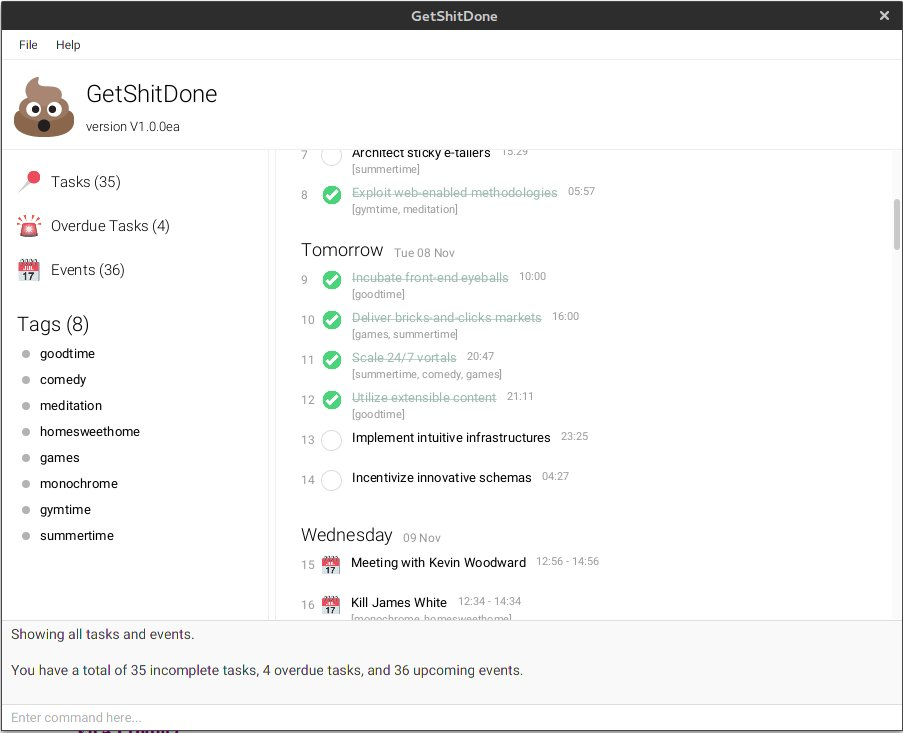

# User Guide

This product is not meant for end-users and therefore there is no user-friendly installer. 
Please refer to the [Setting up](DeveloperGuide.md#setting-up) section to learn how to set up the project.

## Contents

* [Starting the Program](#starting-the-program)
* [Features](#features)
* [FAQ](#faq)
* [Command Summary](#command-summary)

## Starting the Program

1. Find the project in the `Project Explorer` or `Package Explorer` (usually located at the left side)
2. Right click on the project
3. Click `Run As` > `Java Application` and choose the `Main` class.
4. The GUI should appear in a few seconds.

## Features

> **Command Format**
> * Words in `UPPER_CASE` are the parameters.
> * Items in `SQUARE_BRACKETS` are optional.
> * Items with `...` after them can have multiple instances.
> * The order of optional parameters are flexible.

#### Viewing help : `help`

Shows a list of all commands in GetShitDone.

Format: `help`

Examples:

* `help`  
  Shows all available commands and examples 

> Help is also shown if you enter an incorrect command e.g. `abcd`
 
#### Adding a task: `add` or `add task`

Adds a task to GetShitDone

Format: `add [task] NAME [(by|on|at) DEADLINE] [t/TAG]...` 

> * Tasks can have a deadline, or can do without one as well.
>   * Tasks added without specifying a deadline will be displayed under "No Deadline".
>   * Date formats can be flexible. The application is able to parse commonly-used human-readable date formats.
>     * e.g. `1 Oct`, `Monday`, `next wed`, `tomorrow`, `5 days ago`, etc.
> * Dates can include time as well.
>   * If only time is specified, it will default to today's date.
>   * If time is not specified, it will default to 00:00 of the particular date.
>   * Time formats are flexible as well. The application supports 24 hour format and AM/PM format.
>     * e.g. `Monday 3pm`, `today 1930`, `5:30pm`, `10.00 am`
> * Tasks can have any number of tags (including 0).
>   * To add multiple tags, use `t/TAG` successively. e.g. `t/Tag 1 t/Tag 2`
> * Using the `add` command without specifying `task` will interpret the command as `add task`.

Examples: 

 * `add CS2103 Project`
 * `add CS2103 V0.3 by next Friday`
 * `add task Buy milk by tmr`
 
#### Adding an event: `add event`

Adds an event to GetShitDone

Format: `add event NAME from STARTDATETIME to ENDDATETIME [t/TAG]...` 

> * Events must have both start and end date/time specified.
>   * If there is no start or end date, you have to recitify your command, since it wasn't clear what should be added.
>   * If only time is given, the date is interpreted as today's date.
>   * If only date is given, the start time defaults to 00:00 and end time defaults to 23:59.
>   * If only one date is given amongst start and end date/times, the start date and end date are treated as the same. 
>   * Conversely, if only one time is given amongst start and end date/times, the start time and end time are treated as the same.

Examples: 

 * `add event Orientation Camp from Monday 8am to Friday 9pm`
 * `add event CS2103 Workshop from Sat 10am to 4pm`

#### Listing all tasks and events : `list`

Shows a list of all tasks in GetShitDone. Able to filter by type of task (task/event), or based on completed or not.  

Format: `list [TYPE]`

> Valid parameters: 
> * `events` / `event`
> * `tasks` / `task`
> * `complete` / `completed`
> * `incomplete` / `incompleted` / `uncomplete`
> * `by DATE`
> * `from STARTDATE to ENDDATE`

Examples:

* `list`  
 Lists all tasks and events.
  
* `list events`  
 Lists all events.

* `list completed tasks`
 Lists all completed tasks

* `list by today`  
 Lists all tasks due by today + events today

* `list from monday to friday`  
 Lists all tasks due within Monday-Friday + events occuring within the time period

#### Finding all tasks containing any keyword in their name & tag: `find`

Finds tasks whose name and tags contain any of the given keywords.  

Format: `find [type] KEYWORD [MORE_KEYWORDS]...`

> Valid parameters: 
> * `name`
> * `tag`
> * `events` / `event`
> * `tasks` / `task`
> * `complete` / `completed`
> * `incomplete` / `incompleted` / `uncomplete`
> * `by DATE`
> * `from STARTDATE to ENDDATE`

> The search is not case sensitive, the order of the keywords does not matter, only the item name is searched, and tasks/events matching at least one keyword will be returned (i.e. `OR` search).
> Searching follows wildcard search, i.e. a search term of `pr` will return both `Print notes` and `Make PR to GitHub`.

Examples: 

* `find assignment2 task` 
Returns all task having the name or tag containing `Assignment2` & `assignment2`

* `find task name assignment2`
Returns all task with the name containing `Assignment2` & `assignment2`

* `find task tag assignment2`
Returns all task with the tag containing `Assignment2` & `assignment2`
  
* `find assginment2 project`  
Returns any tasks having names or tag containing `assignment2`, `Assignment2`,  `project`, `Project`

#### Editing a task : `update`

Edits the specified task from GetShitDone.

Format: `update INDEX [NAME] ([(by|on|at) DATE] | [from STARTDATE to ENDDATE])` (*TBC*)

> Edits the task at the specified `INDEX`. The index refers to the index number shown in the most recent listing.

Examples: 

* `update 1 CS2107 Project by saturday`  
  Update the 1st task's name to CS2107 Project and change the deadline to Saturday

#### Deleting a task : `delete`

Deletes the specified task from GetShitDone.

Format: `delete INDEX`

> Deletes the task at the specified `INDEX`. 
  The index refers to the index number shown in the most recent listing.

Examples: 

* `delete 3`
  Deletes the 3rd task in GetShitDone.

* `find assignment2`  
  `delete 1`  
  Deletes the 1st task in the results of the `find` command.

#### Clearing the Database : `clear`

Clear tasks/events by specific instruction from GetShitDone.

Format: `clear [event/task] [date]`

> Clear the task or events at the specified `date`. 

Examples: 

* `clear task`
  Clear all  tasks in GetShitDone.

* `clear event to yesterday`  
  Clear all events up to yesterday [inclusive].

#### Tagging an item : `tag`

Adds a tag to the task.

Format: `tag INDEX TAG_NAME`

> Adds the tag for the task at the specified `INDEX`.  
  The index refers to the index number shown in the most recent listing.

#### Untagging an item : `untag`

Removes the specified tag of the task. 

Format: `untag INDEX TAG_NAME`

> Removes the tag for the task at the specified `INDEX`. 
  The index refers to the index number shown in the most recent listing.

Examples: 

* `untag 2 CS2103`  
  Untag the tag of `CS2103` of the 2nd task in GetShitDone.

* `untag 1 CS2103`  
  Untag the tag of `CS2103` of the 1st task in GetShitDone.

#### Completing a task : `complete`

Completes the specified task from GetShitDone.

Format: `complete INDEX`

> completes the task at the specified `INDEX`. 
  The index refers to the index number shown in the most recent listing.

Examples: 

* `complete 2`  
  Completes the 2nd task in GetShitDone.

* `complete 1`  
  Completes the 1st task in GetShitDone.

#### Uncompleting a task : `uncomplete`

Uncompletes the specified task from GetShitDone.

Format: `uncomplete INDEX`

> uncompletes the task at the specified `INDEX`. 
  The index refers to the index number shown in the most recent listing.

Examples: 

* `uncomplete 2`  
  Uncomplete the 2nd task in GetShitDone.

* `uncomplete 1`  
  Uncomplete the 1st task in GetShitDone.

#### Aliasing: `alias`

Adds aliases for existing commands. *For advanced users.*  

Format: `alias [EXISTING_COMMAND NEW_ALIAS]`

Examples:
* `alias`  
  Lists all current aliases.

* `alias find f`  
  `f Irvin`
  Aliases `find` to `f`, and subsequently `f` can be used to `find` tasks.

#### Unaliasing: `unalias`

Removes existing aliases. *For advanced users.*  

Format: `unalias ALIAS`

Examples:
* `unalias f`
  Removes the alias for `f`.

#### Undo tasks : `undo`

Undo commands in GetShitDone.  

Format: `undo [COUNT]`

> Performs undo repeatedly based on the specified `COUNT`. If COUNT is not specified, it defaults to 1.
  
Examples: 

* `undo`  
  Performs undo.
  
* `undo 2`  
  Performs undo twice.

#### Redo tasks : `redo`
Redo commands in GetShitDone.  

Format: `redo [COUNT]`

> Performs redos based on the specified `COUNT`. If COUNT is not specified, it defaults to 1.
  
Examples: 

* `redo`  
  Performs redo.
  
* `redo 2`  
  Performs redo twice.

#### Exiting the program : `exit`

Exits the program.

Format: `exit`  

#### Saving of data
The application data are saved in the hard disk automatically after any command that changes the data. There is no need to save manually.

#### Changing the save location (TBU)
The application data are saved in a file called `addressbook.json` in the project root folder.
You can change the location by specifying the file path as a program argument. 

> The file name must end in `.json` for it to be acceptable to the program.
>
> When running the program inside Eclipse, you can [set command line parameters before running the program](http://stackoverflow.com/questions/7574543/how-to-pass-console-arguments-to-application-in-eclipse).

## FAQ

**Q**: How do I transfer my data to another computer? 
**A**: Install the app in the other computer, and replace `database.json` from the root of the application directory.

## Command Summary

**Standard Actions** 

Command | Format  
-------- | :-------- 
Add | `add NAME [s/START_DATE [e/END_DATE]] [d/DEADLINE] [t/TAG]...`
Complete | `complete INDEX`
Uncomplete | `uncomplete INDEX`
Help | `help`

**Viewing** 

Command | Format  
-------- | :-------- 
List | `list [TYPE]`
Find | `find KEYWORD [MORE_KEYWORDS]...`

**Editing** 

Command | Format  
-------- | :-------- 
Update | `update INDEX [s/START_DATE] [e/END_DATE] [d/DEADLINE] [t/TAG]...`
Delete | `delete INDEX`
Add Tag | `tag INDEX TAG_NAME`
Untag | `untag INDEX TAG_NAME`
Undo | `undo [COUNT]`
Redo | `redo [COUNT]`

**Advanced Actions** 

Command | Format  
-------- | :-------- 
Add alias | `alias`
Remove alias | `unalias`
